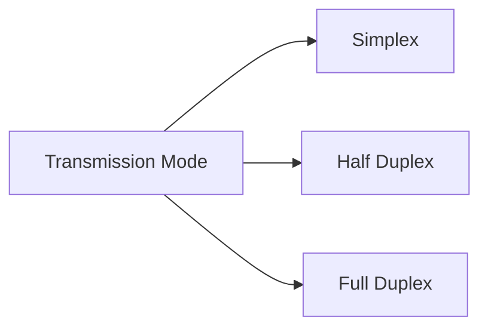

# CN — Data Communication & Network Basics

> 🎯 Target: Name all 5 DC components + 3 data flow types in 20s.
> ⏱️ Read time: 8 minutes

---

## What Is Data Communication?

Exchange of data between devices (local or remote) using a **transmission medium**.

> **Mnemonic (Hinglish):** "**Data ki baat karna** = Data Communication"

### 5 Components of Data Communication

> **Mnemonic:** "**M**ere **S**aath **R**aho **T**um **P**yaar se" → **M S R T P**
> **M**essage, **S**ender, **R**eceiver, **T**ransmission Medium, **P**rotocol

| Component | What it is | Examples |
|---|---|---|
| **Message** | The actual data/info being sent | Text, number, picture, audio, video |
| **Sender** | Device that sends the data | Computer, phone, laptop, camera |
| **Receiver** | Device that receives the data | Workstation, phone, TV |
| **Transmission Medium** | Physical path data travels on | Twisted pair cable, coaxial, fiber optic, radio waves |
| **Protocol** | Set of rules governing data communication | Without it: can connect, **cannot communicate** |

> **Key line about Protocol:** *"Without protocol you can connect but not communicate."*

---

## Data Flow — 3 Transmission Modes

> **Mnemonic (Hinglish):**
> - **Simplex** = "**Sirf ek taraf**" (only one direction, like a radio)
> - **Half Duplex** = "**Baari baari baat karo**" (walkie-talkie, not simultaneously)
> - **Full Duplex** = "**Dono ek saath baat kar sakte hain**" (phone call)

| Mode | Direction | Simultaneous? | Real Example |
|---|---|---|---|
| **Simplex** | One-way only | ❌ No | Keyboard→Computer, Radio, Traditional monitor |
| **Half Duplex** | Two-way, but one at a time | ❌ No | Walkie-Talkie |
| **Full Duplex** | Two-way | ✅ Yes | Telephone call, Modern network |

**Full Duplex detail:** Uses **two physically separate transmission paths** to avoid collision.

---

## Networks

A **computer network** = group of computers connected to each other → enables sharing of **resources, applications, and data**.

### Network Criteria — 3 Things That Define a Good Network

| Criteria | Meaning | Key metric |
|---|---|---|
| **Performance** | How fast and efficiently data moves | Transit time (travel time) + Response time (inquiry to response) |
| **Reliability** | How often the network fails | Frequency of failure + Recovery time |
| **Security** | How protected the data is | Protection from unauthorized access, data loss, policies |

---

## Physical Structure — Types of Connection

### (a) Point-to-Point
- **Dedicated link** between two specific devices
- Example: TV and remote control, Computer connected by telephone line

### (b) Multipoint (Multi-drop)
- **More than 2 devices share a single link**
- Two types:
  - **Spatial sharing** — several computers share the link **simultaneously**
  - **Time sharing** — users must **take turns** (one at a time)

---

## Your 20-Second Script — Data Communication

> *"Data communication is the exchange of data between devices using a transmission medium.
> It has 5 components — Message, Sender, Receiver, Transmission Medium, and Protocol.
> Data can flow in 3 modes: Simplex is one-way like a radio, Half-duplex is two-way but
> one at a time like a walkie-talkie, and Full-duplex is two-way simultaneously like a
> phone call."*

---

## Follow-Up Questions

**Q: What is the difference between transit time and response time?**
> Transit time = time for a message to travel from sender to receiver (physical travel). Response time = elapsed time between sending a request and receiving the reply (includes processing).

**Q: Why is protocol important?**
> Without protocol, two devices have no agreed-upon rules — they can physically connect but can't interpret each other's data. Protocol standardizes message format, timing, error handling, and sequencing.
