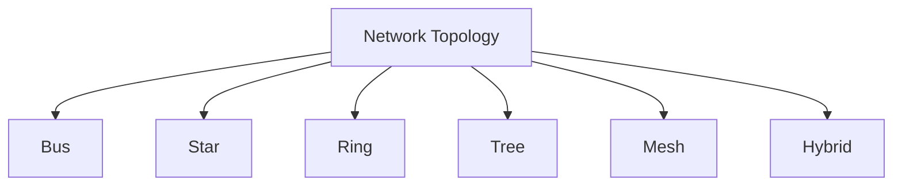

# CN — Network Topology

> 🎯 Target: Name all 6 topologies + their single biggest advantage/disadvantage in 30s.
> ⏱️ Read time: 12 minutes

---

## What Is Network Topology?

A network is formed by **physically connecting two or more devices with two or more links**.
**Topology** = the arrangement/layout of these devices and connections.

> **Mnemonic (Hinglish):** "**Bahut Star Ring Tree Mesh Hybrid hai**" → **B S R T M H**
> **B**us, **S**tar, **R**ing, **T**ree, **M**esh, **H**ybrid

---

## 6 Types of Network Topology



---

## 1. Bus Topology

**Architecture:** All nodes connected to a **single backbone cable (the "bus")**

```
[PC1]--[PC2]--[PC3]--[PC4]--[PC5]
  |__________________________|
         (single bus)
```

| Feature | Detail |
|---|---|
| **Key advantage** | Less cabling; one computer failure **doesn't affect** others |
| **Key disadvantage** | Backbone cable fails = **entire network crashes** |
| **Congestion** | One computer at a time; information goes along cable |
| **Reliability** | **Single point of failure** — common cable fails = all down |
| **Security** | Any computer can see ALL data on the bus ❌ |
| **Complexity** | Easy to add/remove nodes |
| **Cable** | Coaxial, twisted pair, fiber |

> **Memory (Hinglish):** "Bus mein ek hi sadak hai — sadak toot gayi toh sab ruk gaye"
> (Bus has one road — if the road breaks, everyone stops)

---

## 2. Star Topology

**Architecture:** All peripheral nodes connected to a **central node (hub/switch/router)**

```
    [PC1]
      |
[PC2]-HUB-[PC3]
      |
    [PC4]
```

| Feature | Detail |
|---|---|
| **Key advantage** | Easy error detection; easy to install; one failure doesn't affect others |
| **Key disadvantage** | **Hub/switch failure = entire network crashes** |
| **Congestion** | Better than bus; signals go only to intended recipient |
| **Reliability** | Hub failure = all down (single point of failure at center) |
| **Security** | Depends on central device security |
| **Complexity** | Average |
| **Cable** | Coaxial, twisted pair, fiber; max **100 meters** from hub |

> **Memory (Hinglish):** "Star mein sab ke upar ek raja hai — raja gaya toh sab gaye"
> (In star, everyone has one king — king falls, all fall)

---

## 3. Ring Topology

**Architecture:** Each node connected to **exactly 2 other nodes**, forming a ring. Data travels in **one direction (unidirectional)**.

```
[PC1] → [PC2] → [PC3] → [PC4] → [back to PC1]
```

| Feature | Detail |
|---|---|
| **Key advantage** | Equal access for all nodes; adding nodes doesn't degrade performance |
| **Key disadvantage** | **One node failure can shut down entire network** |
| **Congestion** | Data goes one direction, passes each node until correct one found |
| **Reliability** | Cable or node failure = whole system down |
| **Security** | Data passes from one device to next (each node sees all data) |
| **Complexity** | Simple data flow |
| **Cable** | Twisted pair; requires more cables than bus |

> **Memory (Hinglish):** "Ring mein ek kadi tooti toh poora haar toot gaya"
> (In a ring, one link breaks and the whole necklace breaks)

---

## 4. Tree Topology

**Architecture:** **Variation of Star** — hierarchical structure, branches like a tree. Root node at top, branches spread out.

```
           [Root]
           /    \
       [Hub1]  [Hub2]
       /  \      /  \
    [PC1][PC2][PC3][PC4]
```

| Feature | Detail |
|---|---|
| **Key advantage** | Supported by most hardware/software; scalable |
| **Key disadvantage** | **Root node failure = entire network crashes** |
| **Congestion** | Transmission from any station propagates to all nodes |
| **Reliability** | Individual node failure doesn't affect hierarchy; root failure = all down |
| **Security** | Data passes over more than one node |
| **Complexity** | Complex (combination of star + bus) |
| **Cable** | Coaxial, Twisted pair, Fiber |

---

## 5. Mesh Topology

**Architecture:** **Every device connected to every other device**. For n nodes = **n(n-1)/2 communication links**.

```
[PC1]—————[PC2]
 |  \     / |
 |   \   /  |
 |    \ /   |
[PC4]—[PC3]
```

For 4 nodes: 4(4-1)/2 = **6 links**

| Feature | Detail |
|---|---|
| **Key advantage** | **Most reliable** — one device failure doesn't break network |
| **Key disadvantage** | **Very expensive** + very difficult to configure |
| **Congestion** | Minimum — direct point-to-point links |
| **Reliability** | ✅ Best — failure of one device doesn't affect others |
| **Security** | Data passes over more than one node |
| **Complexity** | **Most complex** |
| **Cable** | All types (LAN + WAN) |

> **Memory (Hinglish):** "Mesh mein sab se sab jude hain — ek gira toh koi fark nahi"
> (In mesh, everyone connected to everyone — one falls, doesn't matter)

---

## 6. Hybrid Topology

**Architecture:** **Combination of two or more different topologies** used together.

| Feature | Detail |
|---|---|
| **Key advantage** | Most effective; best features of multiple topologies combined |
| **Key disadvantage** | **Most complex** to design, install, and configure |
| **Congestion** | Depends on which topologies are combined |
| **Reliability** | Extremely rare complete failure |
| **Security** | **Worst** (most exposed due to complexity) |
| **Complexity** | The most complicated |

---

## Topology Comparison — Master Table

| Feature | Bus | Star | Ring | Tree | Mesh | Hybrid |
|---|---|---|---|---|---|---|
| **Structure** | Single cable | Central hub | Circle | Hierarchical | Full connections | Mixed |
| **Failure impact** | Whole network | Whole network | Whole network | Only branch (root = all) | Only that device | Varies |
| **Single point of failure** | Bus cable | Hub/Switch | Any node | Root node | None | Varies |
| **Cost** | Cheap | Moderate | Expensive | Moderate | Most expensive | Varies |
| **Reliability** | Low | Medium | Low | Medium | **Highest** | Varies |
| **Complexity** | Easiest | Easy | Moderate | Complex | Very complex | **Most complex** |
| **Security** | Worst | Moderate | Low | Low | Low | **Worst** |
| **Links for n nodes** | n-1 | n-1 | n | n-1 | **n(n-1)/2** | — |

---

## Which Topology to Use? (Quick Guide)

```
Small home network        → Star (easy, hub-based)
Large enterprise          → Hybrid
Max reliability needed    → Mesh
Cost-sensitive            → Bus (but outdated)
Hierarchical organization → Tree
```

---

## Your 30-Second Script — Topologies

> *"There are 6 topologies. Bus uses a single backbone cable — cheap but whole network
> fails if bus breaks. Star connects all to a central hub — easy to manage but hub failure
> brings everything down. Ring connects each node to two others — one node failure crashes
> all. Tree is hierarchical star — root failure is catastrophic. Mesh connects every device
> to every other — most reliable but most expensive. Hybrid combines multiple topologies."*

---

## Follow-Up Questions

**Q: Which topology is most reliable and why?**
> Mesh — because every device has a direct connection to every other device. If one device or link fails, data can still be routed through alternative paths. No single point of failure.

**Q: Why is Star topology most commonly used in office networks?**
> Easy to add/remove devices, easy to troubleshoot (isolate one node without affecting others), and failure of one node doesn't bring down the network. Hub/switch failure is the only risk.

**Q: How many links does Mesh topology need for 5 nodes?**
> n(n-1)/2 = 5×4/2 = **10 links**. This is why mesh is expensive for large networks.

**Q: What is the difference between physical and logical topology?**
> Physical topology = how devices are physically wired/connected. Logical topology = how data actually flows through the network. Example: A ring physical topology can have a bus logical topology.
