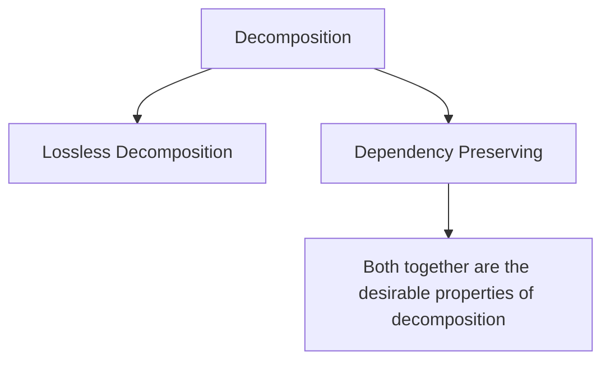

# DBMS — Normalization (1NF → 3NF)

> Target: Explain 3NF in 40s. Identify partial and transitive dependencies on sight.

---

## Why Normalize?

Normalization = **non-loss decomposition + functional dependency preservation** that brings a relation into 1NF, 2NF, 3NF (and BCNF) while **removing anomalies**.

---

### The 3 Anomalies (What We're Removing)

If data items are scattered and not properly linked, it leads to **anomalies** — data corruption bugs that are hard to detect.

#### Update Anomaly
If data is duplicated across rows, updating one copy but missing another creates **inconsistency**.

**Example:** Teacher phone stored in every enrollment row. Change the phone in row 1 but forget row 3 → two different phone numbers for the same teacher now exist.

#### Deletion Anomaly
Deleting a record **accidentally removes other data** that was stored alongside it.

**Example:** Delete the last student enrolled in Math → the teacher's information is also lost because it was only stored in that row.

#### Insert Anomaly
You **cannot add data** without also adding unrelated data you don't have yet.

**Example:** Can't record a new teacher until at least one student enrolls in their course — because the table requires a student to exist.

| Anomaly | What triggers it | What gets corrupted |
|---|---|---|
| **Update** | Changing one copy of duplicated data | Inconsistent values across rows |
| **Delete** | Removing a row | Unintended loss of other facts |
| **Insert** | Adding partial data | Forced to enter NULL or dummy values |

> **Normalization removes all 3** by ensuring each fact is stored in exactly one place.

---

### Decomposition

**Decomposition** = breaking a single relation into two or more smaller sub-relations.



| Property | Meaning | Why it matters |
|---|---|---|
| **Lossless Decomposition** | Joining the sub-tables back gives the **exact original table** (no extra or missing rows) | Prevents data corruption from splitting |
| **Dependency Preserving** | All original functional dependencies can still be **checked within the sub-tables** | Ensures constraints aren't lost after splitting |

> **Goal of normalization:** Always aim for decomposition that is both **lossless AND dependency-preserving**.
> BCNF sometimes forces you to give up dependency preservation. 3NF always achieves both.

---

## The Golden Rule of 3NF

> *"Every non-key column must depend on **the key**, the **whole key**, and **nothing but the key**."*

---

## Start: Unnormalized Table

| StudentID | StudentName | Courses | TeacherName | TeacherPhone |
|---|---|---|---|---|
| 101 | Avanish | Math, Physics | Mr. Roy | 9999 |
| 102 | Rahul | Math | Mr. Roy | 9999 |

**Problems:** Multi-value cell in `Courses`, repeated teacher info.

---

## 1NF — First Normal Form

**Rule:** Every cell must hold one atomic (indivisible) value. No lists, no repeating groups.

**Violation:** `Courses = "Math, Physics"` — two values in one cell.

**Fix:** One row per value.

| StudentID | StudentName | Course |
|---|---|---|
| 101 | Avanish | Math |
| 101 | Avanish | Physics |
| 102 | Rahul | Math |

**Checklist for 1NF:**
- [x] No multi-value cells
- [x] No repeating column groups (e.g., `Phone1`, `Phone2`, `Phone3`)
- [x] Each row is uniquely identifiable

> **Quick test:** "Can every cell fit into a single spreadsheet cell without comma-separated values?" → Yes = 1NF.

---

## 2NF — Second Normal Form

**Rule:** Must be 1NF + **no partial dependency**.

> **Partial Dependency** = a non-key column depends on only *part* of a composite primary key (not the full key).

> ⚠️ 2NF only matters when your Primary Key is **composite**.

**After 1NF, our PK = `{StudentID, Course}`**

| Column | Depends on full PK? | Verdict |
|---|---|---|
| StudentName | Only `StudentID` — not `Course` | ❌ Partial dependency |
| TeacherName | Only `Course` — not `StudentID` | ❌ Partial dependency |
| TeacherPhone | Only `TeacherName` (not PK at all) | Will fix in 3NF |

**Fix:** Split into separate tables so each non-key column depends on the full PK.

**Students table** (PK = StudentID):

| StudentID | StudentName |
|---|---|
| 101 | Avanish |
| 102 | Rahul |

**Enrollments table** (PK = `{StudentID, Course}`):

| StudentID | Course | TeacherName |
|---|---|---|
| 101 | Math | Mr. Roy |
| 101 | Physics | Mr. Sen |
| 102 | Math | Mr. Roy |

---

## 3NF — Third Normal Form

**Rule:** Must be 2NF + **no transitive dependency**.

> **Transitive Dependency** = a non-key column depends on *another non-key column* (not directly on the PK).

**In Enrollments table:**
```
StudentID, Course → TeacherName → TeacherPhone
```
`TeacherPhone` depends on `TeacherName`, not on `{StudentID, Course}` directly. ❌

**Fix:** Move `TeacherPhone` to its own table.

**Teachers table** (PK = TeacherName):

| TeacherName | TeacherPhone |
|---|---|
| Mr. Roy | 9999 |
| Mr. Sen | 8888 |

**Enrollments table** (now clean):

| StudentID | Course | TeacherName (FK) |
|---|---|---|
| 101 | Math | Mr. Roy |
| 101 | Physics | Mr. Sen |
| 102 | Math | Mr. Roy |

---

## Normalization Summary — The Ladder

```
Unnormalized
     ↓
   1NF → Atomic values, no repeating groups
     ↓
   2NF → Remove Partial Dependencies  (only if composite PK exists)
     ↓
   3NF → Remove Transitive Dependencies
     ↓
  BCNF → Every determinant must be a Candidate Key (stricter 3NF)
```

---

## BCNF (Bonus — For Follow-ups)

**Rule:** For every functional dependency `X → Y`, X must be a **candidate key**.

3NF allows a non-candidate-key to determine a non-key column in some edge cases. BCNF closes that gap.

> Most interviewers are satisfied at 3NF. Mention BCNF only if they ask "anything beyond 3NF?".

---

## Your 40-Second Script

> *"1NF means every cell has one atomic value — no comma-separated lists or repeating columns.
> 2NF applies when you have a composite primary key — every non-key column must depend on the
> full key, not just part of it. 3NF goes further — no non-key column should depend on another
> non-key column. The easy way to remember: every column must depend on the key, the whole key,
> and nothing but the key."*

---

## Dependency Cheat Sheet

| Normal Form | What you remove | Keyword |
|---|---|---|
| 1NF | Multi-value cells, repeating groups | **Atomic** |
| 2NF | Partial dependency (non-key → part of composite PK) | **Full PK** |
| 3NF | Transitive dependency (non-key → non-key) | **Direct** |
| BCNF | Any determinant that's not a candidate key | **Candidate Key** |

---

## Follow-Up Questions (Expect These)

**Q: Can a table be in 3NF but not BCNF?**
> Yes. When a non-candidate-key attribute determines another attribute, it violates BCNF but may still be in 3NF. This is rare and usually only in tables with overlapping candidate keys.

**Q: Does 2NF matter for a table with a single-column PK?**
> No. Partial dependency only exists with composite keys. A single-column PK table automatically satisfies 2NF if it's in 1NF.

**Q: What's denormalization and when do you use it?**
> Intentionally introducing redundancy to improve read performance. Used in data warehouses and reporting tables where JOIN cost is too high.
