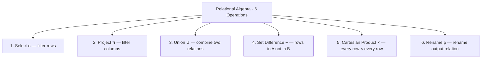
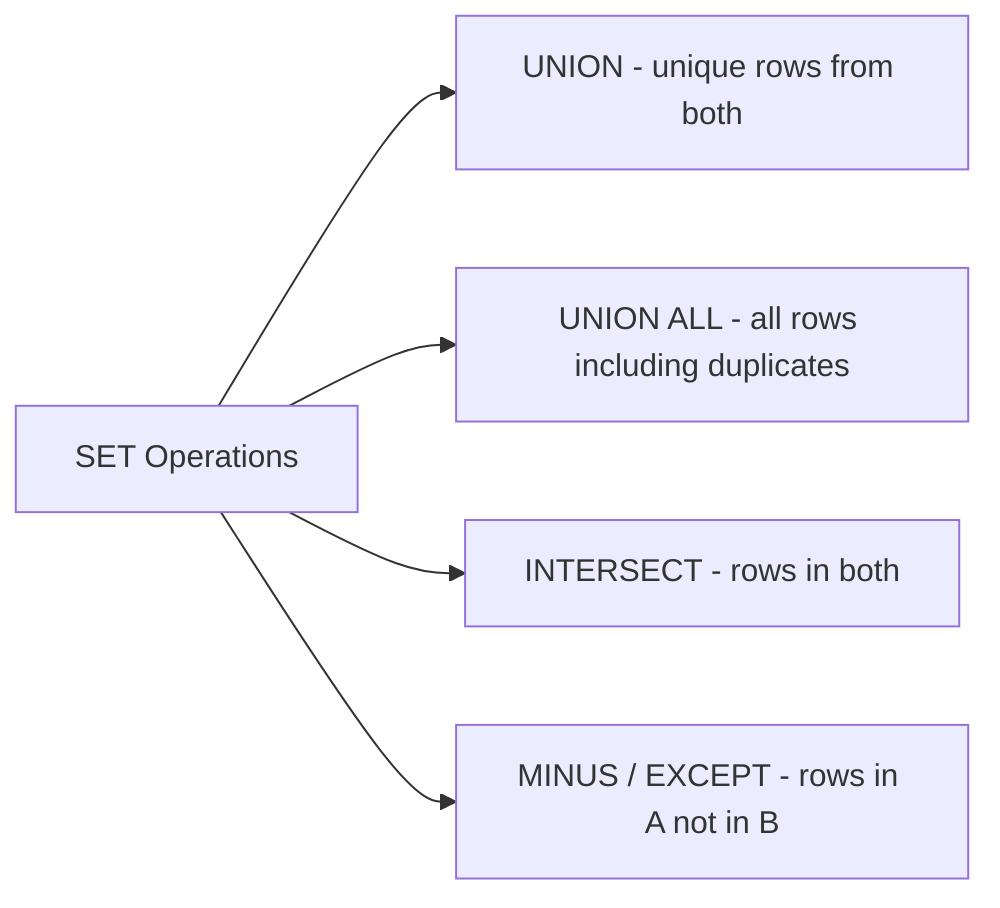

# DBMS — Relational Algebra, SQL Structure & SET Operations

> Target: Name all 6 RA operations + their symbols in 20s. Use σ and π in a sentence confidently.

---

## What Is Relational Algebra?

- A **procedural query language** — you specify *how* to get the data step by step
- Takes **one or two relations (tables) as input** → produces a **relation as output**
- Works on the **whole table at once** — no loops needed
- Forms the **theoretical foundation** of SQL

> SQL is *declarative* (what you want). Relational Algebra is *procedural* (how to get it).
> SQL is built on top of RA concepts.

---

## The 6 Basic / Fundamental Operations



| # | Operation | Symbol | SQL Equivalent | What it does |
|---|---|---|---|---|
| 1 | Select | **σ** (sigma) | `WHERE` | Filter rows by condition |
| 2 | Project | **π** (pi) | `SELECT col` | Keep only certain columns |
| 3 | Union | **∪** | `UNION` | All rows from both relations |
| 4 | Set Difference | **−** | `EXCEPT / MINUS` | Rows in A but not in B |
| 5 | Cartesian Product | **×** | `CROSS JOIN` | Every row paired with every row |
| 6 | Rename | **ρ** (rho) | `AS` alias | Rename the output relation |

---

## 1. Select Operation — σ (Sigma)

**Purpose:** Filter **rows (tuples)** from a relation that satisfy a given condition.
Think of it as the `WHERE` clause in SQL.

**Syntax:**
```
σ_p(r)

where:
  σ = select operator
  p = predicate (condition)
  r = relation (table name)
```

**Example 1 — Simple condition:**
```
σ_age>17(student)
→ Returns all rows from student table where age > 17
```

**Example 2 — Compound condition (AND):**
```
σ_age>17 AND gender='Male'(student)
→ Returns rows of male students whose age > 17
```

**Example 3 — From ebook (LOAN table):**

Input — LOAN table:

| BRANCH_NAME | LOAN_NO | AMOUNT |
|---|---|---|
| Downtown | L-17 | 1000 |
| Redwood | L-23 | 2000 |
| Perryride | L-15 | 1500 |
| Downtown | L-14 | 1500 |
| Mianus | L-13 | 500 |
| Roundhill | L-11 | 900 |
| Perryride | L-16 | 1300 |

```
σ_BRANCH_NAME="Perryride"(LOAN)
```

Output:

| BRANCH_NAME | LOAN_NO | AMOUNT |
|---|---|---|
| Perryride | L-15 | 1500 |
| Perryride | L-16 | 1300 |

**SQL equivalent:**
```sql
SELECT * FROM LOAN WHERE BRANCH_NAME = 'Perryride';
```

---

## 2. Project Operation — π (Pi)

**Purpose:** Select only **certain columns (attributes)** from a relation.
Think of it as `SELECT col1, col2` in SQL — it shows only what you ask for.
Duplicate rows are automatically removed (since output is a set).

**Syntax:**
```
π_col1, col2, ..., colN(table_name)
```

**Example:**
```
π_Name,Age(student)
→ Returns only the Name and Age columns for all rows in student table
```

Input — student table:

| ID | Name | Age |
|---|---|---|
| 1 | Akon | 17 |
| 2 | Bkon | 19 |
| 3 | Ckon | 15 |
| 4 | Dkon | 13 |

```
Select Name where age < 17:
  → First: σ_age<17(student) → gives Ckon(15) and Dkon(13)
  → Then:  π_Name(σ_age<17(student)) → gives Name column only
```

Output:

| Name |
|---|
| Ckon |
| Dkon |

**SQL equivalent:**
```sql
SELECT Name FROM student WHERE age < 17;
```

---

## 3. Union Operation — ∪

**Purpose:** Combine all rows from **two relations** (removes duplicates — like SQL `UNION`).

**Conditions for Union to be valid:**
- Both relations must have the **same number of attributes**
- Corresponding attributes must have **compatible domains**

**Syntax:**
```
A ∪ B
```

**Example:**
```
πstudent(Regular class) ∪ πstudent(extraclass)
→ Returns all students who are in regular class OR extra class (or both)
```

**SQL equivalent:**
```sql
SELECT student FROM regular_class
UNION
SELECT student FROM extraclass;
```

---

## 4. Set Difference — − (Minus)

**Purpose:** Find rows that are **in relation A but NOT in relation B**.

**Syntax:**
```
A − B
```

**Example:**
```
πstudent(Regular class) − πstudent(Extra class)
→ Returns students who attend Regular class but NOT extra class
```

**SQL equivalent:**
```sql
-- Standard SQL
SELECT student FROM regular_class
EXCEPT
SELECT student FROM extraclass;

-- Oracle SQL
SELECT student FROM regular_class
MINUS
SELECT student FROM extraclass;
```

---

## 5. Cartesian Product — × (Cross Product)

**Purpose:** Combine **every row of A with every row of B**.
If A has m rows and B has n rows → result has **m × n rows**.

**Syntax:**
```
A × B
```

**Example:**
```
If Student has 3 rows and Course has 4 rows:
Student × Course → 3 × 4 = 12 rows
```

**SQL equivalent:**
```sql
SELECT * FROM Student CROSS JOIN Course;
-- or old syntax:
SELECT * FROM Student, Course;
```

> Used as the base for JOIN operations. A JOIN = Cartesian Product + Select condition.

---

## 6. Rename Operation — ρ (Rho)

**Purpose:** Rename the output relation (used when you want to give a meaningful name to a derived relation or avoid naming conflicts).

**Syntax:**
```
ρ(Relation_New, Relation_old)
or
ρ(new_name)(expression)
```

**SQL equivalent:**
```sql
SELECT * FROM employees AS e;    -- AS = rename
```

> Mostly used in complex RA expressions to avoid confusion when the same table appears twice (like SELF JOIN).

---

## Combining Operations — Example

**"Get names of all students who are in regular class but not extra class, and are older than 15"**

```
Step 1: σ_age>15(student)              → filter rows
Step 2: πName(Step 1)                  → keep only Name column
Step 3: Result_A − πName(extraclass)   → remove extra class students
```

Chained in one expression:
```
πName(σ_age>15(student)) − πName(extraclass)
```

---

## RA Cheat Sheet — Symbols + SQL Mapping

```
σ (sigma)  → WHERE          → filters rows
π (pi)     → SELECT cols    → filters columns
∪           → UNION          → all rows from both (deduped)
−           → EXCEPT/MINUS   → rows in A not in B
×           → CROSS JOIN     → cartesian product (all combinations)
ρ (rho)    → AS alias       → rename output relation
```

---

## SQL Basic Structure

Every SQL query follows this basic structure:

```sql
SELECT column1, column2
FROM   table_name
WHERE  condition;
```

**Mapping to Relational Algebra:**
- `FROM` → Cartesian product of listed relations
- `WHERE` → Selection predicate (σ)
- `SELECT` → Projection (π)

**Example from ebook (CUSTOMERS table):**

| ID | NAME | AGE | ADDRESS | SALARY |
|---|---|---|---|---|
| 1 | Ramesh | 32 | Ahmadabad | 2000 |
| 2 | Khilan | 25 | Delhi | 500 |
| 3 | Kaushik | 23 | Kota | 2000 |
| 4 | Chaitali | 25 | Mumbai | 6500 |
| 5 | Hardik | 21 | Bhopal | 8500 |
| 6 | Komal | 22 | MP | 4500 |
| 7 | Mufty | 24 | Indore | 1000 |

```sql
SELECT ID, NAME, SALARY
FROM CUSTOMERS
WHERE SALARY > 2000;
```

Output:

| ID | NAME | SALARY |
|---|---|---|
| 4 | Chaitali | 6500.00 |
| 5 | Hardik | 8500.00 |
| 6 | Komal | 4500.00 |
| 7 | Mufty | 1000.00 |

---

## WHERE Clause

`WHERE` is used to apply conditions when **retrieving, updating, or deleting** data.
Used with `SELECT`, `UPDATE`, and `DELETE`.

```sql
-- General syntax
SELECT column1, column2, columnN
FROM table_name
WHERE condition;
```

**Works with:** `=`, `!=`, `>`, `<`, `>=`, `<=`, `AND`, `OR`, `NOT`, `IN`, `BETWEEN`, `LIKE`, `IS NULL`

---

## FROM Clause — Subqueries

The `FROM` clause can contain a **subquery** (inline view):

```sql
SELECT column1, column2
FROM (
  SELECT column_x AS c1, column_y FROM table
  WHERE PREDICATE_x
) AS table2
WHERE PREDICATE;
```

> Subqueries in `FROM` are treated as temporary tables — also called **derived tables** or **inline views**.

---

## SET Operations

SQL SET operations combine results of **two SELECT queries**.



| Operation | What it returns | Duplicates |
|---|---|---|
| `UNION` | All rows from both queries | Removed |
| `UNION ALL` | All rows from both queries | Kept |
| `INTERSECT` | Only rows common to both | Removed |
| `MINUS` / `EXCEPT` | Rows in first query but not second | Removed |

**Rules for all SET operations:**
- Both queries must return the **same number of columns**
- Corresponding columns must have **compatible data types**

**Examples:**
```sql
-- UNION: all students (unique)
SELECT name FROM regular_students
UNION
SELECT name FROM extra_students;

-- UNION ALL: all students including those in both classes
SELECT name FROM regular_students
UNION ALL
SELECT name FROM extra_students;

-- INTERSECT: students in BOTH classes
SELECT name FROM regular_students
INTERSECT
SELECT name FROM extra_students;

-- MINUS/EXCEPT: students in regular but NOT extra
SELECT name FROM regular_students
MINUS
SELECT name FROM extra_students;       -- Oracle
-- or EXCEPT in PostgreSQL / SQL Server
```

---

## RA vs SQL — Final Mapping Summary

```
RA Operation        RA Symbol   SQL Keyword
─────────────────────────────────────────────
Select (rows)         σ         WHERE
Project (columns)     π         SELECT col1, col2
Union                 ∪         UNION
Set Difference        −         EXCEPT / MINUS
Cartesian Product     ×         CROSS JOIN
Rename                ρ         AS (alias)
```

---

## Your 40-Second Script — Relational Algebra

> *"Relational Algebra is the procedural foundation of SQL — it defines 6 basic operations.
> Select (sigma) filters rows — like SQL WHERE. Project (pi) filters columns — like SELECT.
> Union combines rows from two relations. Set Difference returns rows in A but not B.
> Cartesian Product pairs every row of A with every row of B — basis for JOINs.
> Rename (rho) names the output relation. Together these 6 operations can express
> any SQL query."*

---

## Follow-Up Questions (Expect These)

**Q: Is Relational Algebra the same as SQL?**
> No. RA is procedural — you specify how step by step. SQL is declarative — you say what you want and the query planner decides how. SQL is built on RA concepts but they are not the same language.

**Q: What is the difference between Select (σ) and Project (π)?**
> Select filters **rows** (like WHERE). Project filters **columns** (like SELECT col). You often chain them: π_col(σ_condition(table)).

**Q: What is the difference between UNION and INTERSECT?**
> UNION returns all rows from both queries (deduped). INTERSECT returns only rows that appear in **both** queries.

**Q: What is the difference between MINUS and INTERSECT?**
> MINUS returns rows in query A that are **not** in query B. INTERSECT returns rows that are in **both**. They are opposites in what they include.
