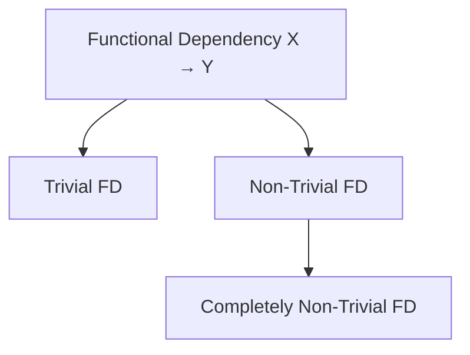

# DBMS — Functional Dependency

> Target: Explain trivial vs non-trivial FD in 20s. State all 3 Armstrong's rules by name.

---

## What Is Functional Dependency?

A **Functional Dependency (FD)** is a constraint between two sets of attributes in a relation.

> If two tuples (rows) have the **same values for attributes A1, A2, …** then they must also have the **same values for attributes B1, B2, …**

**Notation:** `X → Y` (read as: "X functionally determines Y")

**Meaning:** Knowing the value of X is enough to determine the value of Y.

**Example:**
```
StudentID → StudentName

If two rows have the same StudentID,
they MUST have the same StudentName.

StudentID → {Name, Age, Course}
Knowing StudentID alone tells you Name, Age, and Course.
```

---

## Types of Functional Dependency



---

### 1. Trivial FD

**Rule:** `X → Y` is trivial if **Y is a subset of X**.

> Y is already "inside" X — knowing X obviously tells you Y. Always holds. Not useful for normalization.

**Examples:**
```
{StudentID, Name} → {StudentID}   ← trivial (StudentID is already in the left side)
{StudentID, Name} → {Name}        ← trivial
{A, B} → {A}                      ← trivial
{A} → {A}                         ← trivial
```

> Trivial FDs **always hold** in every relation — they don't tell you anything new.

---

### 2. Non-Trivial FD

**Rule:** `X → Y` is non-trivial if **Y is NOT a subset of X**.

> Y contains something that X doesn't. This is the useful kind for normalization.

**Examples:**
```
StudentID → StudentName      ← non-trivial (Name is not part of StudentID)
StudentID → {Name, Age}      ← non-trivial
{EmpID} → {DeptName}         ← non-trivial
```

---

### 3. Completely Non-Trivial FD

**Rule:** `X → Y` is completely non-trivial if **X ∩ Y = ∅** (X and Y share no attributes at all).

> The most "pure" kind of FD — the left and right sides have nothing in common.

**Examples:**
```
StudentID → StudentName        ← completely non-trivial (no overlap)
{EmpID} → {DeptID, Salary}    ← completely non-trivial
```

**Contrast:**
```
{StudentID, Name} → {Name, Age}
  X ∩ Y = {Name}  → NOT completely non-trivial (Name appears on both sides)
  But IS non-trivial (Age is not in X)
```

---

## Summary Table

| Type | Condition | Always holds? | Useful? |
|---|---|---|---|
| **Trivial** | Y ⊆ X | ✅ Always | ❌ No new info |
| **Non-Trivial** | Y ⊄ X | Depends on data | ✅ Yes |
| **Completely Non-Trivial** | X ∩ Y = ∅ | Depends | ✅ Most useful |

---

## Armstrong's Axioms (Inference Rules)

Armstrong's Axioms are a **complete and sound set of rules** for deriving all functional dependencies from a given set.

> "If F is a set of functional dependencies, then the closure of F (written F⁺) is the set of all FDs logically implied by F."

There are **3 rules (axioms):**

---

### Rule 1 — Reflexivity Rule

**If Y ⊆ X, then X → Y**

If Y is a subset of X, then X functionally determines Y.
(This generates all trivial FDs.)

**Examples:**
```
{StudentID, Name} → {StudentID}   ← reflexivity
{A, B, C} → {B, C}               ← reflexivity
{A} → {A}                         ← reflexivity
```

---

### Rule 2 — Augmentation Rule

**If X → Y, then XZ → YZ** (for any set of attributes Z)

If X determines Y, then adding the same attribute Z to both sides still holds.

**Examples:**
```
StudentID → Name
∴ {StudentID, Age} → {Name, Age}     ← augmented with Age

EmpID → Salary
∴ {EmpID, DeptID} → {Salary, DeptID} ← augmented with DeptID
```

> Think of it as: "Adding the same thing to both sides doesn't break the dependency."

---

### Rule 3 — Transitivity Rule

**If X → Y and Y → Z, then X → Z**

If X determines Y, and Y determines Z, then X determines Z.
(Just like transitivity in math: if a=b and b=c then a=c.)

**Examples:**
```
StudentID → DeptID
DeptID → DeptName
∴ StudentID → DeptName    ← transitivity

EmpID → ManagerID
ManagerID → ManagerName
∴ EmpID → ManagerName     ← transitivity
```

> This is the basis of **transitive dependency** — which is exactly what 3NF aims to remove!

---

## Armstrong's Rules — Quick Reference

| Rule | Statement | Short form |
|---|---|---|
| **Reflexivity** | If Y ⊆ X, then X → Y | Subsets are always determined |
| **Augmentation** | If X → Y, then XZ → YZ | Adding same attrs to both sides is valid |
| **Transitivity** | If X → Y and Y → Z, then X → Z | FDs chain like equations |

> These 3 rules are **sound** (only generate valid FDs) and **complete** (can generate ALL valid FDs).

---

## FD and Normalization — The Connection

```
Trivial FD       → always present, not a problem
Non-Trivial FD   → the ones we care about in normalization

Partial dependency   → non-key attribute depends on PART of composite PK  → violates 2NF
Transitive dependency → non-key A → non-key B → violates 3NF
                        (discovered via Armstrong's Transitivity rule)
```

---

## Your 40-Second Script — Functional Dependency

> *"A functional dependency X → Y means knowing X uniquely determines Y. If Y is a
> subset of X it's trivial — always holds, not useful. If Y is not a subset of X it's
> non-trivial — these are the meaningful ones for normalization. Armstrong's three axioms
> let us derive all FDs: Reflexivity says subsets are always determined, Augmentation says
> you can add the same attributes to both sides, and Transitivity says if X→Y and Y→Z
> then X→Z — which is exactly what causes transitive dependencies in 3NF violations."*

---

## Follow-Up Questions (Expect These)

**Q: What is the closure of a set of attributes?**
> The closure of X (written X⁺) is the set of all attributes that X can functionally determine using the given FDs. Used to check if X is a candidate key (if X⁺ = all attributes, X is a superkey).

**Q: How does transitive dependency relate to Armstrong's Transitivity rule?**
> Transitive dependency IS Armstrong's Transitivity applied to non-key attributes. If PK → A and A → B (where A is not a key), then PK → B via transitivity — that B column should be moved out (3NF fix).

**Q: What is the difference between trivial and non-trivial FD in one line?**
> Trivial: Y is already inside X (adds no info). Non-Trivial: Y contains something new that X doesn't have.
