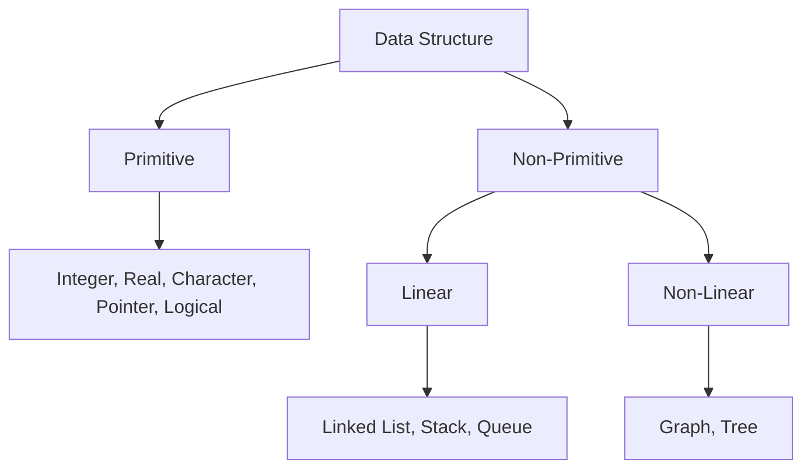

# DSA — Data Structure Basics & Arrays

> Target: Name DS classification in 20s. Solve address formula numerically in 30s.

---

## Data vs Information

| Term | Meaning | Example |
|---|---|---|
| **Data** | Raw, unorganized facts — no meaning on its own | `100, 104, 108` |
| **Information** | Processed, organized data — has meaning | "Memory addresses of array elements" |

---

## What Is a Data Structure?

> A **data structure** is a collection of data, organized so that items can be **stored and retrieved by fixed techniques**.

---

## Classification of Data Structures



| Type | Stored in contiguous memory? | Examples |
|---|---|---|
| **Primitive** | Yes (basic types) | int, float, char, pointer |
| **Linear** | Elements in sequence | Array, Linked List, Stack, Queue |
| **Non-Linear** | Elements NOT in sequence | Tree, Graph |

---

## 6 Operations on Data Structures

| Operation | What it does |
|---|---|
| **Insertion** | Add a new data element |
| **Deletion** | Remove a data element |
| **Sorting** | Arrange in increasing or decreasing order |
| **Searching** | Find the location of a data element |
| **Merging** | Combine two sorted sequences into one sorted sequence |
| **Traversing** | Access each element exactly once |

---

## Arrays

An **array** is a **fixed-size**, **sequenced** collection of data items of the **same type**, stored in **contiguous memory locations**.

```
Int a[5]:
Index:    0    1    2    3    4
Value:    6    2    4    3    0
Address: 100  104  108  112  116   (each int = 4 bytes)
```

- `a[0] = 6`, `a[1] = 2`, `a[2] = 4`, `a[3] = 3`, `a[4] = 0`
- Access any element in **O(1)** — Random Access (constant time)

---

## Array Address Formula — 1D

```
Address of a[i] = Base + i × (size of data type)
```

**Example:** Base = 100, int size = 4 bytes, find address of a[2]:
```
Address of a[2] = 100 + 2 × 4 = 100 + 8 = 108  ✅
```

**Array size formula:**
```
Size of array = UB − LB + 1
where UB = Upper Bound, LB = Lower Bound

Example: A[6:18]
Size = 18 − 6 + 1 = 13 elements
```

---

## Array Types

```
Array
  ├── 1-D Array         → a[5]
  ├── 2-D Array         → a[3][4]  (matrix)
  └── Multi-dimensional → a[2][3][4]
```

---

## 2D Array — Address Formula

**Notation:** `array_name[row][column]`

### Row Major Order (rows stored first)

**If index starts at (0,0):**
```
A[i][j] = Base + ((i × n) + j) × size
where n = number of columns
```

**If index starts at (1,1):**
```
A[i][j] = Base + [(i−1) × n + (j−1)] × size
```

### Column Major Order (columns stored first)

```
A[i][j] = Base + ((j × m) + i) × size
where m = number of rows
```

> **Interview tip:** Always confirm if row major or column major. C uses **row major**. Fortran uses column major.

---

## Searching Arrays

### Linear Search

- Check every element one by one from start
- Works on **unsorted** arrays

| Case | Time Complexity |
|---|---|
| Best | O(1) — found at first position |
| Average | O(n) |
| Worst | O(n) — not found or at last position |

### Binary Search

- Repeatedly halve the search space
- Works only on **sorted** arrays

| Case | Time Complexity |
|---|---|
| Best | O(1) — found at mid |
| Average | O(log n) |
| Worst | O(log n) |

---

## Linear vs Binary Search — One Line Each

```
Linear Search  → scan every element → O(n) → works on unsorted
Binary Search  → halve search space → O(log n) → only on sorted arrays
```

---

## Pointers (Quick Note)

- A pointer is a variable that stores the **address** of another variable
- `int b = 10;  int* P = &b;` → P holds the address of b
- Used in linked lists, dynamic memory allocation

---

## Your 30-Second Script — Arrays

> *"An array is a fixed-size collection of same-type elements stored in contiguous memory.
> Any element is accessible in O(1) using the formula: Base + index × data_type_size.
> Arrays support linear search in O(n) and binary search in O(log n) — but binary
> search needs a sorted array. Main limitation: fixed size and costly insertion/deletion."*

---

## Follow-Up Questions

**Q: Why is array access O(1)?**
> Because memory address of any element is directly computed using the formula. No traversal needed.

**Q: What is the difference between Array and Linked List?**
> Array: contiguous memory, fixed size, O(1) access, O(n) insertion. Linked List: non-contiguous, dynamic size, O(n) access, O(1) insertion at head.

**Q: What is row major vs column major?**
> How a 2D array is laid out in linear memory. Row major: all elements of row 0 first, then row 1, etc. Column major: all elements of column 0 first, etc. C uses row major.
