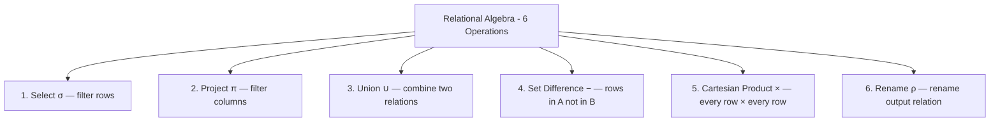
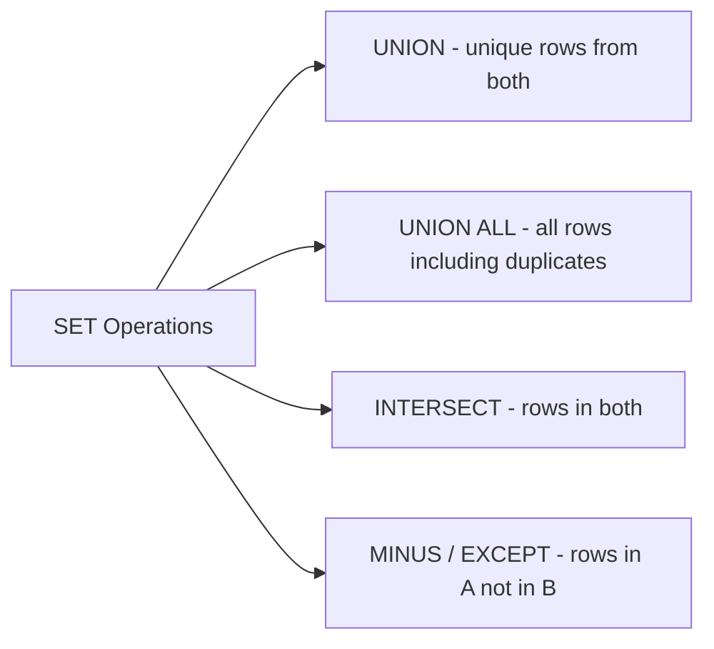
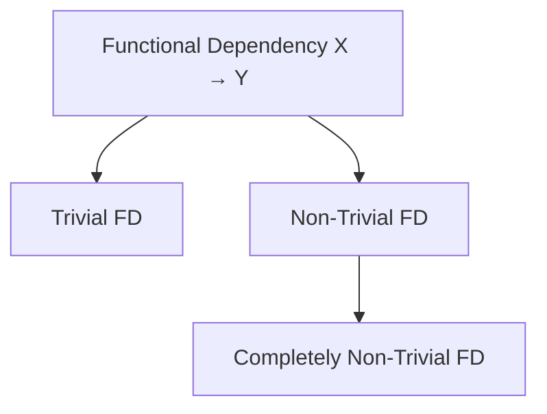
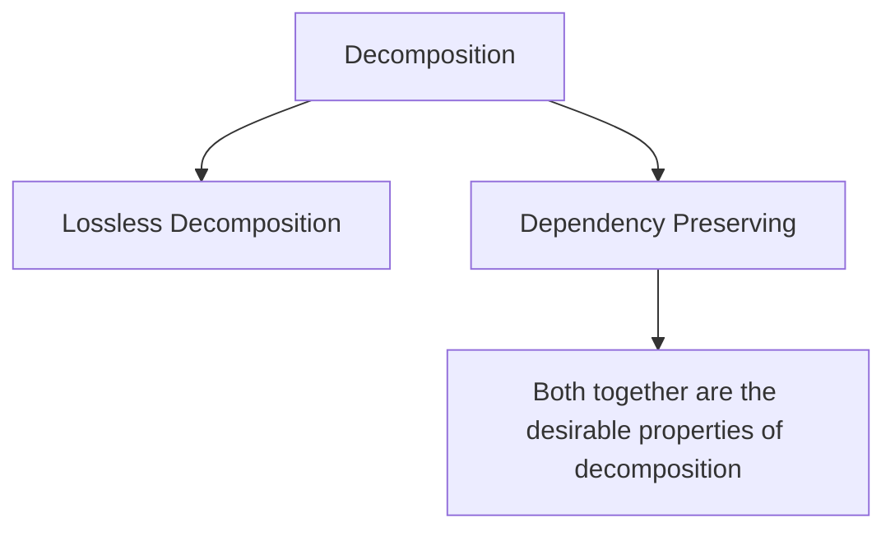
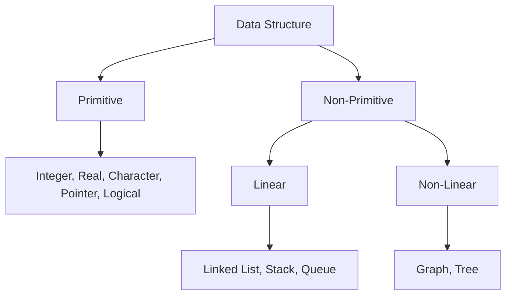
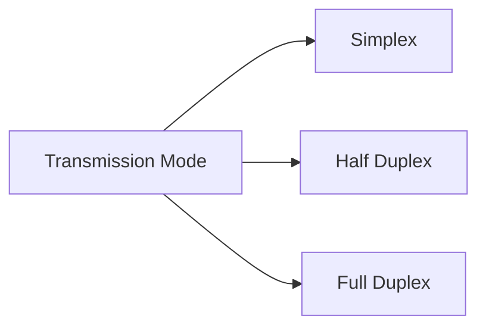
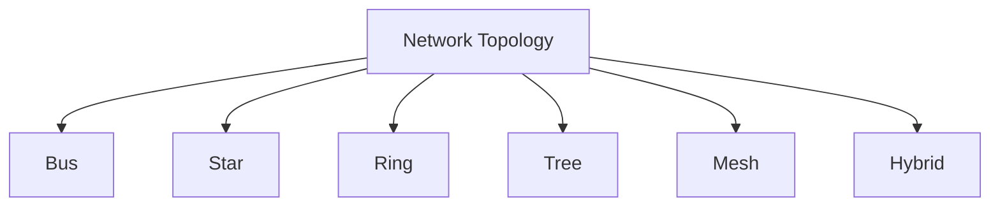

## User

\documentclass[letterpaper,10pt]{article}

\usepackage{latexsym}
\usepackage[empty]{fullpage}
\usepackage{titlesec}
\usepackage{marvosym}
\usepackage[usenames,dvipsnames]{color}
\usepackage{verbatim}
\usepackage{enumitem}
\usepackage{fancyhdr}
\usepackage[english]{babel}
\usepackage{tabularx}
\input{glyphtounicode}
\usepackage{fontawesome5}
\usepackage[hidelinks,pdfnewwindow=true]{hyperref}
\usepackage{multicol}
\setlength{\multicolsep}{-3.0pt}
\setlength{\columnsep}{-1pt}

\pagestyle{fancy}
\fancyhf{} % clear all header and footer fields
\fancyfoot{}
\renewcommand{\headrulewidth}{0pt}
\renewcommand{\footrulewidth}{0pt}

% Adjust margins
\addtolength{\oddsidemargin}{-0.6in}
\addtolength{\evensidemargin}{-0.5in}
\addtolength{\textwidth}{1.19in}
\addtolength{\topmargin}{-.8in}
\addtolength{\textheight}{1.6in}

\urlstyle{same}

\raggedbottom
\raggedright
\setlength{\tabcolsep}{0in}

% Sections formatting
\titleformat{\section}{
  \vspace{-6pt}\scshape\raggedright\large\bfseries
}{}{0em}{}[\color{black}\titlerule \vspace{-7pt}]

% Ensure that generate pdf is machine readable/ATS parsable
\pdfgentounicode=1

%-------------------------
% Custom commands
\newcommand{\resumeItem}[1]{
  \item\small{
    {#1 \vspace{-3pt}}
  }
}

\newcommand{\resumeSubheading}[4]{
  \vspace{-2pt}\item
    \begin{tabular*}{1.0\textwidth}[t]{l@{\extracolsep{\fill}}r}
      \textbf{#1} & \textbf{\small #2} \\
      \textit{\small#3} & \textit{\small #4} \\
    \end{tabular*}\vspace{-9pt}
}

\newcommand{\resumeProjectHeading}[2]{
    \item
    \begin{tabular*}{1.00\textwidth}[t]{l@{\extracolsep{\fill}}r}
      #1 & \textbf{\small #2}\\
    \end{tabular*}\vspace{-9pt}
}

\newcommand{\resumeSubItem}[1]{\resumeItem{#1}\vspace{-4pt}}

\renewcommand\labelitemi{$\vcenter{\hbox{\tiny$\bullet$}}$}
\renewcommand\labelitemii{$\vcenter{\hbox{\tiny$\bullet$}}$}

\newcommand{\resumeSubHeadingListStart}{\begin{itemize}[leftmargin=0.0in, label={}]}
\newcommand{\resumeSubHeadingListEnd}{\end{itemize}}
\newcommand{\resumeItemListStart}{\begin{itemize}}
\newcommand{\resumeItemListEnd}{\end{itemize}\vspace{-7pt}}

%-------------------------------------------
%%%%%%  RESUME STARTS HERE  %%%%%%%%%%%%%%%%%%%%%%%%%%%%

\begin{document}

\begin{center}
    {\LARGE \scshape {Avanish Gupta}} \\
    \vspace{0.1cm}
    \href{https://www.linkedin.com/in/avanish-gupta/}{\raisebox{-0.2\height}\faLinkedin\ LinkedIn} ~
    \href{https://github.com/Avanish-Gupta-CSE}{\raisebox{-0.2\height}\faGithub\ GitHub} ~
    \raisebox{-0.1\height}\faPhone\ +91 8107432468 ~ 
    \href{mailto:avanish.gupta.official1@gmail.com}{\raisebox{-0.2\height}\faEnvelope\ avanish.gupta.official1@gmail.com}
\end{center}

%-----------PROFESSIONAL SUMMARY-----------
\section{PROFESSIONAL SUMMARY}
\resumeItemListStart
    \resumeItem{Full Stack MERN Developer with \textbf{1.5+ Years} of experience building production-grade web applications using \textbf{React.js}, \textbf{Node.js}, \textbf{Express.js}, and \textbf{MongoDB}, with proficiency in cross-team development and cloud deployments.}
\resumeItemListEnd

%-----------TECHNICAL SKILLS-----------
\section{TECHNICAL SKILLS}
\resumeItemListStart
    \resumeItem{\textbf{MERN Stack}{: MongoDB, Express.js, React.js, Node.js.}}
    \resumeItem{\textbf{Languages}{: JavaScript, TypeScript.}}
    \resumeItem{\textbf{Libraries \& Frameworks}{: Redux Toolkit, React Router, PrimeReact, TailwindCSS, Vite, Axios.}}
    \resumeItem{\textbf{Databases \& Search}{: MongoDB, PostgreSQL, Elasticsearch, MySQL.}}
    \resumeItem{\textbf{Cloud \& DevOps}{: Azure DevOps, Docker, Kubernetes, CI/CD Pipelines, AWS}}
    \resumeItem{\textbf{Tools \& Testing}{: Git, Postman, Keycloak, Jest, Kibana.}}
\resumeItemListEnd

%-----------WORK EXPERIENCE-----------
\section{WORK EXPERIENCE}
\resumeSubHeadingListStart

    \resumeProjectHeading
        {\textbf{Berkadia} $|$ Bengaluru, IN}
        {\href{https://drive.google.com/file/d/1yrVaOmV1J4laQjglxUJJJVH6zrVVLhhf/view}{\textbf{Certificate} \faExternalLink*}}
    \resumeProjectHeading
        {\textbf{Associate Software Engineer}}{June 2024 -- Present}
        \resumeProjectHeading
            {\textit{ReservesAI -- AI-Powered Document Processing}}{}
        \resumeItemListStart
            \resumeItem{Developing an AI-powered document processing platform using \textbf{React}, \textbf{Node.js}, and \textbf{Express}, integrating \textbf{Azure Document Intelligence} and IDP services for automated data extraction from Reserve Request Letters.}
            \resumeItem{Implemented async job processing with \textbf{WebSocket}, built a test harness for bulk validation, and deployed via \textbf{CI/CD pipelines} using \textbf{Azure DevOps} with \textbf{Docker} and \textbf{Kubernetes (EKS)}.}
        \resumeItemListEnd

        \resumeProjectHeading
            {\textit{DMS -- Document Management System}}{}
        \resumeItemListStart
            \resumeItem{Built a Document Management System using \textbf{React}, \textbf{TypeScript}, \textbf{Redux Toolkit}, and \textbf{PrimeReact}, featuring document upload, advanced search, bulk operations, and recycle bin for loan servicing workflows.}
            \resumeItem{Designed \textbf{Node.js/Express} REST APIs with \textbf{PostgreSQL}, \textbf{Elasticsearch}, and \textbf{AWS S3} for document storage, integrating \textbf{Keycloak} SSO and \textbf{OpenFGA} for fine-grained role-based authorization across document classes.}
        \resumeItemListEnd

        \resumeProjectHeading
            {\textit{CMS -- Cash Management Service}}{}
        \resumeItemListStart
            \resumeItem{Utilized \textbf{Microservices} and implemented schema migrations using \textbf{Elasticsearch}, while designing \textbf{REST APIs} using \textbf{Node.js} and \textbf{TypeScript}, with email notifications via \textbf{Amazon SES}.}
            \resumeItem{Developed interactive dashboards using \textbf{React.js} with advanced filters, search, and sorting, utilizing \textbf{Redux} for state management, and achieved \textbf{85\%+} code coverage using \textbf{Jest}.}
        \resumeItemListEnd

    \resumeProjectHeading
        {\textbf{STMicroelectronics Pvt. Ltd.} $|$ Gr. Noida, IN}
        {\href{https://drive.google.com/file/d/1wfKMSeUOJrb3yKr8ekMJOihSBozopkU0/view}{\textbf{Certificate} \faExternalLink*}}
    \resumeProjectHeading
        {\textbf{Project Trainee / SDE Intern}}{August 2023 -- May 2024}
        \resumeItemListStart
            \resumeItem{Built the \textbf{eRFP-NPI} application from the ground up, managing Technical Gap Analysis (TGA) and a product portfolio of \textbf{500+} semiconductor quotations for \textbf{20+} external manufacturing partners, slashing manual processing time by \textbf{70\%}.}
            \resumeItem{Implemented low-level modules and relational schemas to support \textbf{1 million+} price-quote records, boosting complex-query performance by \textbf{45\%} and maintaining \textbf{99.8\%} data integrity.}
            \resumeItem{Developed scalable services in \textbf{NodeJS} and dynamic UI dashboard in \textbf{ReactJS} to serve \textbf{200+} concurrent users within \textbf{300 ms} average API response times.}
            \resumeItem{Resolved \textbf{30+} security findings using \textbf{BMC Helix} from the RMIS audit for FY 23–24—eliminating all critical and high-severity issues to achieve a \textbf{100\%} pass rate on follow-up penetration tests.}
            \resumeItem{Implemented delivery pipelines with \textbf{Jenkins CI/CD} (cutting deploy time by \textbf{50\%}), managed \textbf{100+} Git branches, scheduled \textbf{50+} batch jobs via TWS, and implemented BDD in ALM to raise automated test coverage to \textbf{90\%}.}
        \resumeItemListEnd

\resumeSubHeadingListEnd

%-----------PROJECTS-----------
\section{PROJECTS}
\resumeSubHeadingListStart
    \resumeProjectHeading
        {\textbf{Codeial - Social Media Portfolio}}
        {\href{https://codeial-social-app-avanish-gupta-cse.vercel.app/login}{\textbf{Live} \faExternalLink*} $|$ \href{https://github.com/Avanish-Gupta-CSE/Codeial-Social_App}{\textbf{GitHub} \faGithub}}
        \resumeItemListStart
            \resumeItem{Built Codeial, a Git-managed social platform for programmers, leveraging \textbf{ReactJS}, \textbf{Redux}, \textbf{Material-UI} and \textbf{OAuth} to deliver a secure, modular and visually consistent UI.}
            \resumeItem{Implemented a scalable backend using \textbf{Node.js}, \textbf{Express}, \textbf{MongoDB} (via Mongoose) and MockBee to simulate RESTful APIs for authentication, posts, bookmarks, likes, search, and profile management.}
        \resumeItemListEnd

    \resumeProjectHeading
        {\textbf{ShopKicks - E-commerce Platform}}
        {\href{https://super-kicks.netlify.app/}{\textbf{Live} \faExternalLink*} $|$ \href{https://github.com/Avanish-Gupta-CSE/E-commerce-website-Super-Kicks}{\textbf{GitHub} \faGithub}}
        \resumeItemListStart
            \resumeItem{Devised a dynamic storefront with \textbf{ReactJS}, \textbf{React Router}, \textbf{Redux Toolkit}, and \textbf{Tailwind CSS}, implementing \textbf{JWT} authentication, \textbf{Fuse.js} instant search, and user dashboards for cart and wishlist management.}
            \resumeItem{Engineered a robust API layer using \textbf{Node.js}, \textbf{Express}, and \textbf{MongoDB} (via Mongoose), integrating \textbf{Stripe} for secure payments and \textbf{Passport.js} for role-based access control across checkout, order history, and address management.}
        \resumeItemListEnd

\resumeSubHeadingListEnd

%-----------EDUCATION-----------
\section{EDUCATION}
\resumeSubHeadingListStart
    \resumeSubheading
        {KIIT Deemed to be University, Bhubaneswar}{CGPA: \textbf{9.60}}
        {B.Tech. - Computer Science Engineering}{2020 - 2024}
    \resumeSubheading
        {Bhagat Public Sr. Sec. School, Kota}{Percentage: \textbf{74.00\%}}
        {Intermediate}{}
\resumeSubHeadingListEnd

%-----------ACHIEVEMENTS-----------
\section{ACHIEVEMENTS}
\resumeItemListStart
    \resumeItem{Received \textbf{HI5 Award} for exceptional project contributions at Berkadia.}
\resumeItemListEnd

%-----------INTERESTS-----------
\section{INTERESTS}
\small{• Badminton, Fitness, Cycling.}

\end{document}

see this is my resume in latex format 
now i have to give/share my biodata with details like where i m working, where i worked, where i graduated and studied to share with HR mentor who will take my HR mock so i think he doesnot need all the technical details so accorindly can you give the Latex Code whihc i can use for biodata which i can sharw with my HR mentor

and in education you can also add, that I completed my High School from Kendriya Vidyalaya IFFCO in 2016 with 10.00 CGPA

## Assistant

<thinking>
**Providing LaTeX code for biodata**

I need to respond to the user requesting LaTeX code for biodata based on their resume, tailored for an HR mentor. I should focus on work, education, and high school details without technical jargon. It seems I should only provide the LaTeX code, using a path-based code block. I might suggest copying the code into a new file. I'll include an explanation and then the code block using the path /dev/null/biodata.tex. Optional tweaks could be a nice touch as well.

**Creating LaTeX code for biodata**

The user is asking for LaTeX code, so I'm thinking of crafting a clear, HR-friendly biodata format without technical jargon. I should include sections like Personal Details, focusing on their name, contact info, profile summary, current employment, work experience, education, and optional achievements. Adding details like "Current Organization: Berkadia" and "Present Role: Associate Software Engineer" seems appropriate, but I shouldn't overdo the technical specifics. I can also offer a shorter one-page version or a Hindi translation if needed. I'll remind the user to replace any details as necessary, ensuring accuracy.

**Finalizing biodata details**

The user has provided their work history, currently at Berkadia and previously at STMicroelectronics as a Project Trainee/SDE Intern. They've graduated from KIIT in 2024, attended Bhagat Public Sr. Sec. School for intermediate, and completed high school at Kendriya Vidyalaya IFFCO in 2016 with a perfect CGPA of 10.00. I'll gather their name and contact info from the resume and make sure the LaTeX compiles smoothly, using the article class and possibly the fullpage or geometry package for layout. The formatting needs to be straightforward, and I'll ensure to provide a self-contained LaTeX document with clear sections.

**Deciding on educational details**

I'm considering whether to include the year for Class XII, especially if it's unknown. It might be cleaner to use "Class XII (Intermediate)" and leave the year blank or as a dash “—.” It's important not to fabricate the year. If the user wants to add high school details for 2016, maybe we don't need to include the year column for Class XII after all? I could set up columns for Qualification, Institution, and Details instead.

**Considering biodata structure**

I'm thinking about what to include in my biodata. I could focus on my education without needing to list years, perhaps mentioning where I graduated and studied under an "Education" section with three entries like "Qualification, Institution, Academic Details." I wonder if I should include personal details like date of birth or address, but since those weren't requested, I'll omit them. Instead, I might add placeholders for those elements if needed later while keeping everything concise.

**Structuring biodata**

I'm considering how to format the biodata. I think it's fitting to keep it professional by omitting personal fields like date of birth and address, but I could offer to add placeholders if needed. Using sections like `\section*{Biodata}` or a centered title could work well. Maybe I should go with "Professional Profile" since that might suit my audience better. I'll keep the language straightforward and focus on responsibilities without mentioning specific technologies in my work summary.

**Finalizing internship description**

I’m working on how to describe my internship experience, mentioning my role in developing internal business applications and workflow automation solutions, which included tasks like data management and deployment support. It feels complete, though I wonder if I should add details like "Current Location" or "Preferred contact"—but that might not be necessary. I’m keeping the document simple, so I'll avoid additional packages. I also need to confirm that the code path for my biodata file is accurate.

**Clarifying code block requirements**

I need to focus on creating a path-based code block with a line range, probably any valid line range works. I want to ensure the line numbers correspond, so they make sense. The format should be just the path after backticks, without specifying a language. I might use `/dev/null/biodata.tex#L1-77`, and also suggest, “You can paste this into a new `biodata.tex` file and compile it.” It looks like one code block will suffice. I'll keep the technical details minimal.

**Drafting final answer**

I’m putting together the final answer! First, I want to acknowledge that for an HR mentor, a simpler biodata is definitely better than a technical resume. I’ll prepare a clean LaTeX version that focuses on the current role, past experience, education, and a short profile. I need to mention that I’ve omitted technical details and included high school information. I’ll provide a code block too. If needed, I can also offer a one-page biodata or one with a photo, date of birth, and address. Let's ensure the LaTeX code compiles perfectly!

**Considering contact details**

I’m mulling over whether to keep the "Additional Links" section for the HR mentor. It seems like it might not be necessary since they don’t need technical details. Perhaps just having LinkedIn is enough, maybe even omitting GitHub altogether to streamline contact info. But since there’s interest in where the user is working, I think it makes sense to include LinkedIn and maybe add a "Career Timeline" section instead of "Current Employment" and "Previous Experience." Omission of GitHub seems best aligned with their needs!

**Formatting code considerations**

I need to make sure the code is ready to share. I can mention it's intentionally HR-friendly and light on the technical aspects. I could also offer to create a formal biodata with placeholders or a one-page HR introduction sheet. It’s essential to follow markdown and formatting correctly, using backticks for filenames and creating path-based code blocks. I’m thinking of counting lines to keep it consistent, possibly around 1-63, and drafting code with those line numbers.

**Polishing content structure**

I’m thinking I should deliver a more polished version of the content. My sections would include Professional Profile, Employment Details, Education, and Achievements. For Employment Details, I might consider itemizing each job instead of using a table. However, a table can work well too. The `tabularx` format auto wraps rather than using fixed widths, which could be a good choice to prevent width issues. But since the code should be standalone, I might decide to keep things simple with fixed widths.

**Considering biodata structure**

I'm thinking about how to structure biodata effectively. I want to include a section for interests, maybe called `\section*{Interests}`, which adds completeness without revealing personal info. That seems like a good idea! However, I’m debating whether to add a section for location. It might not be necessary, so I’m leaning toward leaving it out. Keeping things simple while providing relevant information feels right!
</thinking>

Yes — for an HR mock, a simpler `bio-data` is better than a technical resume.

I made this version to focus on:
- where you are currently working
- where you previously worked
- where you graduated
- your school education
- one achievement
- interests for HR discussion

I also added your `High School (Class X)` entry from `Kendriya Vidyalaya IFFCO` with `10.00 CGPA` in `2016`.

You can copy this into a new file like `biodata.tex` and compile it:

```/dev/null/biodata.tex#L1-74
\documentclass[11pt,a4paper]{article}

\usepackage[margin=0.85in]{geometry}
\usepackage[hidelinks]{hyperref}
\usepackage{enumitem}
\usepackage{array}
\usepackage{tabularx}
\usepackage[T1]{fontenc}
\usepackage[utf8]{inputenc}

\setlength{\parindent}{0pt}
\renewcommand{\arraystretch}{1.2}
\setlist[itemize]{leftmargin=*, noitemsep, topsep=2pt}
\pagestyle{empty}

\begin{document}

\begin{center}
    {\LARGE \textbf{BIO-DATA}}\\[8pt]
    {\Large \textbf{Avanish Gupta}}\\[4pt]
    +91 8107432468 \quad | \quad
    \href{mailto:avanish.gupta.official1@gmail.com}{avanish.gupta.official1@gmail.com} \quad | \quad
    \href{https://www.linkedin.com/in/avanish-gupta/}{LinkedIn}
\end{center}

\vspace{6pt}
\hrule
\vspace{10pt}

\section*{Professional Summary}
Software professional with 1.5+ years of experience, currently working as an Associate Software Engineer at Berkadia. Experience includes contributing to business applications, collaborating with cross-functional teams, and supporting development, testing, and delivery activities. Previously worked as a Project Trainee / SDE Intern at STMicroelectronics.

\section*{Current Employment}
\begin{tabularx}{\textwidth}{>{\bfseries}p{4cm} X}
Organization & Berkadia, Bengaluru, India \\
Designation & Associate Software Engineer \\
Duration & June 2024 -- Present \\
Work Overview & Working on business applications related to document processing, document management, and cash management. Responsible for development support, team coordination, testing, and release activities. \\
\end{tabularx}

\vspace{8pt}

\section*{Previous Experience}
\begin{tabularx}{\textwidth}{>{\bfseries}p{4cm} X}
Organization & STMicroelectronics Pvt. Ltd., Greater Noida, India \\
Designation & Project Trainee / SDE Intern \\
Duration & August 2023 -- May 2024 \\
Work Overview & Worked on internal business applications, workflow automation, data handling, and deployment support during the internship. Gained corporate software development experience in a structured team environment. \\
\end{tabularx}

\vspace{8pt}

\section*{Education}
\begin{tabularx}{\textwidth}{|p{4cm}|X|p{4cm}|}
\hline
\textbf{Qualification} & \textbf{Institution} & \textbf{Academic Details} \\
\hline
B.Tech in Computer Science Engineering & KIIT Deemed to be University, Bhubaneswar & 2020 -- 2024, CGPA: 9.60 \\
\hline
Intermediate (Class XII) & Bhagat Public Sr. Sec. School, Kota & Percentage: 74.00\% \\
\hline
High School (Class X) & Kendriya Vidyalaya IFFCO & Completed in 2016, CGPA: 10.00 \\
\hline
\end{tabularx}

\vspace{8pt}

\section*{Achievement}
\begin{itemize}
    \item Received the \textbf{HI5 Award} for project contributions at Berkadia.
\end{itemize}

\section*{Interests}
Badminton, Fitness, Cycling.

\end{document}
```

### Small suggestion
For an HR mentor, this version is better because it removes heavy technical stack details like:
- frameworks
- databases
- DevOps tools
- project implementation specifics

and keeps the focus on your background and story.

If you want, I can also give you either:
1. a **more traditional Indian biodata format** with fields like `Father's Name`, `Date of Birth`, `Address`, etc., or  
2. a **very polished one-page HR profile** that looks even cleaner than this.

## User

i m confused and feels primary key, super, candidate , alternate keys are all same
in DBMS

## Assistant

<thinking>
The user is confused about the different types of keys in DBMS. Let me explain them clearly with a simple example so they can understand the differences between primary key, super key, candidate key, and alternate key.

Let me think about this carefully and explain it in a hierarchical/layered way.

**Super Key**: Any set of one or more attributes that can uniquely identify a row in a table. It can have extra/redundant attributes.

**Candidate Key**: A minimal super key - meaning no attribute can be removed from it and still have it uniquely identify rows. There can be multiple candidate keys in a table.

**Primary Key**: One candidate key that is chosen by the database designer to be the main identifier. There can only be one primary key per table.


**Alternate Key**: All candidate keys that were NOT chosen as the primary key.

Let me work through a Student table example with StudentID, Email, Phone, and Name. The super keys would be any combination that includes at least one unique identifier, candidate keys are the minimal unique sets like StudentID, Email, or Phone individually, and if I choose StudentID as the primary key, then Email and Phone become the alternate keys.
</thinking>

Great question — they feel the same because they are all related to each other. Think of them as a **hierarchy**, not separate concepts.

---

## The Simple Way to Think About It

Use this one example throughout:

**Student Table**

| StudentID | Email | Phone | Name |
|---|---|---|---|
| 101 | a@gmail.com | 9999 | Avanish |
| 102 | b@gmail.com | 8888 | Rahul |

---

## Super Key — "Anything that uniquely identifies a row"

It can have **extra, unnecessary columns**. It just needs to guarantee uniqueness.

All of these are super keys:
- `{StudentID}`
- `{Email}`
- `{Phone}`
- `{StudentID, Email}` ← unique but has *redundancy*
- `{StudentID, Name}` ← unique but has *redundancy*
- `{StudentID, Email, Phone, Name}` ← entire row, still a super key

> Super key = **no uniqueness rule broken**, but **can be bloated**

---

## Candidate Key — "A super key with no extra baggage"

Take a super key and **remove every unnecessary column** until removing one more would break uniqueness. What you're left with is a **Candidate Key**.

From the example:
- `{StudentID}` → remove anything? No. ✅ Candidate Key
- `{Email}` → remove anything? No. ✅ Candidate Key
- `{Phone}` → remove anything? No. ✅ Candidate Key
- `{StudentID, Email}` → can remove `Email` and still be unique? Yes. ❌ NOT a candidate key, just a super key

> Candidate Key = **Minimal Super Key**

---

## Primary Key — "The one candidate key you *choose*"

From all your candidate keys, you **pick one** as the official identifier. That's your Primary Key.

You pick: `StudentID`

Rules for choosing:
- Should be **non-null**
- Should be **stable** (won't change often)
- Usually **numeric** (faster lookups)

> Primary Key = **Chosen Candidate Key** (only one per table)

---

## Alternate Key — "The candidate keys you *didn't* choose"

All remaining candidate keys that were **not selected** as the primary key.

- Candidate Keys were: `{StudentID}`, `{Email}`, `{Phone}`
- You chose `{StudentID}` as Primary Key
- So `{Email}` and `{Phone}` become **Alternate Keys**

> Alternate Key = **Rejected Candidate Keys**

---

## The Full Hierarchy

```/dev/null/keys-hierarchy.txt#L1-12
Super Key  (broadest — just needs to be unique)
    |
    └── Candidate Key  (minimal super key — no redundancy)
              |
              ├── Primary Key   (one chosen candidate key)
              |
              └── Alternate Key (remaining candidate keys)
```

---

## One-Line Summary for Each

| Key | One Line |
|---|---|
| **Super Key** | Any column combo that gives uniqueness (can be redundant) |
| **Candidate Key** | Minimal super key — can't remove any column |
| **Primary Key** | The one candidate key you officially pick |
| **Alternate Key** | Candidate keys that were not picked as primary |

---

**The trick to remember:**
> Every Primary Key is a Candidate Key.
> Every Candidate Key is a Super Key.
> But **not** the other way around.

Does this clear it up? Want me to also cover **Foreign Key** and **Composite Key** in the same style?

## User

I wanted to learn the following in DBMS, help me prepare notes as you did before:
Keys, constraints, normalization (1NF→3NF), JOIN types, ER basics; write a 15-bullet cheat

so that I can "explain PK vs UK vs FK + 3NF in 40s"

## Assistant

<thinking>
The user wants to learn DBMS concepts: Keys, constraints, normalization (1NF→3NF), JOIN types, ER basics, and a 15-bullet cheat sheet. They want to be able to "explain PK vs UK vs FK + 3NF in 40s". Let me create comprehensive but digestible notes in the same style as my previous explanation.

Let me structure this well:
1. Keys (building on what we already discussed)
2. Constraints
3. Normalization (1NF → 3NF)
4. JOIN types
5. ER basics
6. 15-bullet cheat sheet


I'm thinking about whether to save these notes to the shared core area since they're reusable CS content, but the user hasn't explicitly asked for that—they just want help preparing notes. I'll provide a comprehensive response and offer to save it if they want.

Now I'm laying out the key database concepts: foreign keys enforce referential integrity between tables, unique keys allow one null value unlike primary keys, and composite keys combine multiple columns. Then covering the main constraints like NOT NULL, UNIQUE, PRIMARY KEY, FOREIGN KEY, CHECK, and DEFAULT. For normalization, I'm walking through the progression from 1NF (atomic values only) through 2NF (no partial dependencies on part of a composite key) to 3NF (no transitive dependencies between non-key attributes), with BCNF being the strictest requirement that every determinant must be a candidate key. I'm also starting to outline the different JOIN types, beginning with INNER JOIN.

Now I'm finishing the JOIN types—LEFT JOIN keeps all left table rows with nulls for unmatched right rows, RIGHT JOIN does the opposite, FULL OUTER JOIN includes everything from both tables, CROSS JOIN creates a Cartesian product, and SELF JOIN lets a table reference itself. Then moving into entity-relationship basics: entities are real-world objects, attributes describe their properties (which can be simple, composite, derived, or multi-valued), relationships show associations between entities, cardinality defines the connection ratios like 1:1 or M:N, participation indicates whether relationships are mandatory or optional, and weak entities depend on strong entities for existence using a discriminator. I'm about to compile all of this into a clean 15-bullet reference sheet.
</thinking>

Let me build this as a full structured note + cheat sheet.

---

# DBMS — Keys, Constraints, Normalization, JOINs, ER

---

## 1. KEYS (Full Picture)

We already covered Super → Candidate → Primary → Alternate. Here are the remaining ones:

---

### Foreign Key (FK)
- A column in **Table B** that references the **Primary Key of Table A**
- Enforces **Referential Integrity** — you can't reference a row that doesn't exist

**Example:**

| Orders Table | | Customers Table |
|---|---|---|
| OrderID | CustomerID (FK) → | CustomerID (PK) |

> You cannot insert `CustomerID = 999` in Orders if `999` doesn't exist in Customers.

---

### Unique Key (UK)
| Feature | Primary Key | Unique Key |
|---|---|---|
| Uniqueness | ✅ | ✅ |
| NULL allowed | ❌ Never | ✅ Once (one NULL per column) |
| Count per table | Only **one** | Can have **multiple** |
| Creates Index | Clustered | Non-clustered |

> Think of UK as a "backup PK" — same uniqueness guarantee, but more relaxed.

---

### Composite Key
- A key made of **two or more columns together**
- Neither column alone is unique, but **together** they are

**Example:** `{StudentID, CourseID}` in an Enrollment table

---

### Key Hierarchy — Complete Picture

```/dev/null/key-hierarchy-full.txt#L1-10
Super Key
    └── Candidate Key (minimal super key)
              ├── Primary Key     (chosen one, no null)
              ├── Alternate Key   (not chosen candidate keys)
              └── Unique Key      (like PK, allows one null)

Foreign Key  → links two tables (referential integrity)
Composite Key → two+ columns acting as one key
```

---

## 2. CONSTRAINTS

Constraints are **rules enforced on columns** to maintain data quality.

| Constraint | What it does | Example |
|---|---|---|
| `NOT NULL` | Column must have a value | `Name NOT NULL` |
| `UNIQUE` | No duplicate values | `Email UNIQUE` |
| `PRIMARY KEY` | NOT NULL + UNIQUE, one per table | `StudentID PK` |
| `FOREIGN KEY` | Must reference existing PK | `DeptID → Department.DeptID` |
| `CHECK` | Custom condition must be true | `Age > 18` |
| `DEFAULT` | Auto-fills value if none given | `Status DEFAULT 'Active'` |

> **Memory trick:** `N-U-P-F-C-D` → *"Never Use Primary Foreign Checks Directly"*

---

## 3. NORMALIZATION — 1NF → 3NF

**Goal:** Remove redundancy and avoid update/insert/delete anomalies.

---

### The Problem Table (Unnormalized)

| StudentID | StudentName | Courses | TeacherName | TeacherPhone |
|---|---|---|---|---|
| 101 | Avanish | Math, Physics | Mr. Roy | 9999 |
| 102 | Rahul | Math | Mr. Roy | 9999 |

Problems: Multi-values in one cell, redundant teacher info everywhere.

---

### 1NF — First Normal Form
**Rule:** Every cell must have **one atomic (indivisible) value**. No repeating groups.

**Fix:** Split `Courses` into separate rows.

| StudentID | StudentName | Course |
|---|---|---|
| 101 | Avanish | Math |
| 101 | Avanish | Physics |
| 102 | Rahul | Math |

> **Test:** "Can I store this in a spreadsheet without merging cells?" → If yes, it's 1NF.

---

### 2NF — Second Normal Form
**Rule:** Must be in 1NF + **No Partial Dependency**

> Partial Dependency = a non-key column depends on **only part** of a composite primary key

Here, PK = `{StudentID, Course}`

| Column | Depends on full PK? |
|---|---|
| StudentName | Only on StudentID ← ❌ Partial Dependency |
| Course | Part of PK |

**Fix:** Split into two tables.

**Students Table:**

| StudentID (PK) | StudentName |
|---|---|
| 101 | Avanish |

**Enrollment Table:**

| StudentID (PK) | Course (PK) |
|---|---|
| 101 | Math |

> **2NF only matters when you have a Composite Primary Key.**

---

### 3NF — Third Normal Form
**Rule:** Must be in 2NF + **No Transitive Dependency**

> Transitive Dependency = a non-key column depends on **another non-key column**

**Problem Table:**

| StudentID (PK) | TeacherName | TeacherPhone |
|---|---|---|
| 101 | Mr. Roy | 9999 |

Here: `StudentID → TeacherName → TeacherPhone`
`TeacherPhone` depends on `TeacherName`, not directly on `StudentID`. That's transitive. ❌

**Fix:** Split it out.

**Teacher Table:**

| TeacherName (PK) | TeacherPhone |
|---|---|
| Mr. Roy | 9999 |

**Student Table:**

| StudentID (PK) | TeacherName (FK) |
|---|---|
| 101 | Mr. Roy |

> **Test for 3NF:** Every non-key column must depend on **"the key, the whole key, and nothing but the key."**

---

### Normalization Summary

```/dev/null/normalization-summary.txt#L1-8
1NF → Atomic values only, no repeating groups
        ↓
2NF → Remove Partial Dependencies (non-key depends on FULL composite PK)
        ↓
3NF → Remove Transitive Dependencies (non-key depends on another non-key)
        ↓
BCNF → Every determinant must be a Candidate Key (stricter 3NF, rarely asked)
```

---

## 4. JOIN TYPES

Use this two-table example throughout:

**Employees:** E1-Alice(D1), E2-Bob(D2), E3-Carol(null)

**Departments:** D1-HR, D2-Finance, D3-IT

| JOIN Type | What you get | Result includes |
|---|---|---|
| **INNER JOIN** | Only matching rows from both | Alice-HR, Bob-Finance |
| **LEFT JOIN** | All from left + matches from right | Alice-HR, Bob-Finance, Carol-null |
| **RIGHT JOIN** | All from right + matches from left | Alice-HR, Bob-Finance, null-IT |
| **FULL OUTER JOIN** | All rows from both sides | Alice-HR, Bob-Finance, Carol-null, null-IT |
| **CROSS JOIN** | Every row × every row (cartesian product) | 3 employees × 3 depts = 9 rows |
| **SELF JOIN** | A table joined with itself | Used for hierarchy: employee-manager in same table |

> **Venn Diagram trick:**
> - INNER = only the overlapping middle
> - LEFT = full left circle
> - RIGHT = full right circle
> - FULL OUTER = both full circles

---

## 5. ER BASICS

### Core Components

| Component | What it is | Symbol in diagram |
|---|---|---|
| **Entity** | A real-world object | Rectangle |
| **Attribute** | Property of an entity | Oval |
| **Relationship** | Association between entities | Diamond |
| **Weak Entity** | Can't exist without another entity | Double Rectangle |

---

### Types of Attributes

| Type | Example | Symbol |
|---|---|---|
| Simple | Age | Plain oval |
| Composite | Name = {FirstName + LastName} | Oval with sub-ovals |
| Derived | Age (derived from DOB) | Dashed oval |
| Multi-valued | Phone numbers | Double oval |

---

### Cardinality (How entities relate)

| Type | Meaning | Example |
|---|---|---|
| **1 : 1** | One-to-One | Person ↔ Passport |
| **1 : N** | One-to-Many | Department → Employees |
| **M : N** | Many-to-Many | Students ↔ Courses |

---

### Participation Constraint

| Type | Meaning | Notation |
|---|---|---|
| **Total (Mandatory)** | Every entity MUST participate | Double line |
| **Partial (Optional)** | Entity MAY participate | Single line |

> Example: Every Employee **must** belong to a Department (total), but not every Department **must** have a Manager assigned (partial).

---

## 6. THE 15-BULLET CHEAT SHEET

For quick revision before your HR mock or any interview:

```/dev/null/dbms-cheatsheet.txt#L1-35
1.  Super Key    → any combo that gives uniqueness (can be bloated)
2.  Candidate Key → minimal super key (no column can be removed)
3.  Primary Key  → chosen candidate key; NOT NULL, one per table
4.  Alternate Key → candidate keys NOT chosen as primary key
5.  Unique Key   → like PK but allows ONE null; multiple per table
6.  Foreign Key  → links to another table's PK; enforces referential integrity
7.  Composite Key → two+ columns together form the key

8.  Constraints  → NOT NULL, UNIQUE, PK, FK, CHECK, DEFAULT
9.  CHECK constraint → custom rule e.g. Age > 18
10. DEFAULT constraint → fills value automatically if not provided

11. 1NF → atomic values only; no repeating groups or multi-value cells
12. 2NF → 1NF + no partial dependency (only matters with composite PK)
13. 3NF → 2NF + no transitive dependency (non-key → non-key not allowed)
    Memory: "Depends on the key, WHOLE key, NOTHING BUT the key"

14. JOINs → INNER(match only), LEFT(all left), RIGHT(all right),
            FULL OUTER(all both), CROSS(cartesian), SELF(same table)

15. ER Model → Entity(rectangle), Attribute(oval), Relationship(diamond),
               Weak Entity(double rectangle), Cardinality: 1:1, 1:N, M:N
```

---

## Your 40-Second Script: PK vs UK vs FK + 3NF

> *"PK uniquely identifies a row — no nulls, one per table. UK also enforces uniqueness but allows one null and you can have multiple. FK links to another table's PK to maintain referential integrity — you can't reference a row that doesn't exist.*
>
> *3NF means your table is in 1NF — atomic values only, 2NF — no non-key column depends on just part of the composite key, and 3NF — no non-key column depends on another non-key column. Simple rule: every column must depend on the key, the whole key, and nothing but the key."*

---

Want me to also cover **BCNF**, **indexes**, **ACID properties**, or **transactions** in the same style? Those are common follow-up questions in HR + technical rounds.

## User

Help me with notes for "DBMS — SQL traps"
[Context:DBMS — SQL traps


JOIN types + ON vs WHERE filtering, NULL traps (COUNT(*) vs COUNT(col), NULL = NULL), GROUP BY/HAVING


You can explain WHERE vs HAVING in 20s + 1 example]

```
DBMS — SQL traps (do this now, 25–30 minutes)
Yes—this block is in MSTC/DAILY-PLAN-2026-05-13.md. Here’s exactly how to study SQL traps so they stick and you can answer in interview style (40s + 1–2 follow‑ups).

What you produce (so it’s measurable)
1-page “SQL Traps” sheet: each trap has Rule + Wrong + Correct
1 voice note: 8 rapid-fire Qs (40s each)
Method (loop for each trap)
For each trap, do:

Say the rule in 1 line
Write a wrong query
Fix it (correct query)
Add 1 follow-up question you expect
The 8 must-know SQL traps (copy this structure)
1) COUNT(*) vs COUNT(col)
Rule: COUNT(*) counts rows; COUNT(col) counts non-NULL values.
Wrong mental model: “Both are same”
Fix line: “Use COUNT(*) for rows; COUNT(col) when NULLs should be ignored.”
2) LEFT JOIN becomes INNER JOIN because of WHERE on right table
Wrong:
SELECT u.id, d.name
FROM users u
LEFT JOIN dept d ON d.id = u.dept_id
WHERE d.name = 'HR';
Correct:
SELECT u.id, d.name
FROM users u
LEFT JOIN dept d
  ON d.id = u.dept_id AND d.name = 'HR';
One-liner: “Filter the right table in ON if you want to keep unmatched left rows.”
3) NOT IN + NULL trap
Rule: NOT IN (…NULL…) can return no rows (3-valued logic).
Wrong:
SELECT *
FROM users u
WHERE u.id NOT IN (SELECT manager_id FROM users);
Correct (safe):
SELECT *
FROM users u
WHERE NOT EXISTS (
  SELECT 1 FROM users m WHERE m.manager_id = u.id
);
4) WHERE vs HAVING
Rule: WHERE filters rows before grouping; HAVING filters groups after aggregation.
Correct pattern:
SELECT dept_id, COUNT(*) AS c
FROM users
WHERE active = true
GROUP BY dept_id
HAVING COUNT(*) >= 5;
5) NULL comparisons are not normal comparisons
Rule: NULL = NULL is not TRUE; use IS NULL.
Correct:
WHERE col IS NULL
-- not: WHERE col = NULL
6) Double-counting due to join “multiplication”
Rule: joining a 1-to-many table multiplies rows and can inflate SUM/COUNT.
Fix: aggregate at the right grain first (pre-aggregate) or use distinct carefully.
7) UNION vs UNION ALL
Rule: UNION removes duplicates (extra work); UNION ALL keeps duplicates (faster).
Interview line: “Default to UNION ALL unless you explicitly need dedup.”
8) AND / OR precedence (missing parentheses)
Rule: AND binds tighter than OR; always parenthesize.
Bad: A OR B AND C (usually misunderstood)
Good: (A OR B) AND C or A OR (B AND C) (explicit)
Mini-mock (8 questions, 40s each — record)
Difference between COUNT(*) and COUNT(col)?
Why can LEFT JOIN + WHERE right.col = ... be wrong? Fix it.
Why is NOT IN dangerous with NULL? What’s the safe replacement?
WHERE vs HAVING — give a 1-sentence difference + example.
Why is col = NULL wrong? What do you write instead?
Give an example of join double-counting and how to fix the query.
UNION vs UNION ALL — when to use which?
Show why parentheses matter in A OR B AND C.
If you do the 8 traps + mini-mock recording, you’ve “completed SQL traps” for today and you can move straight to Indexing next.
```

## Assistant

<thinking>
The user wants notes for "DBMS — SQL traps" based on the context provided. They want a structured notes document with:
1. Each trap having Rule + Wrong + Correct
2. Voice note questions (8 rapid-fire Qs)
3. They want to be able to explain WHERE vs HAVING in 20s + 1 example

Let me create comprehensive, well-structured notes based on the 8 SQL traps mentioned in the context. I should also save this to the appropriate location in the project (likely `Shared-Core/` or `MSTC/` based on the project structure).

Let me first check the project structure to understand where to save this.
</thinking>

Let me first check the project structure so I save this in the right place.

**Tool Call: List the `psu-prep-brain` directory's contents**
Status: Completed

# Folders:
psu-prep-brain\.brain
psu-prep-brain\.cursor
psu-prep-brain\.github
psu-prep-brain\.kiro
psu-prep-brain\HPCL
psu-prep-brain\IFFCO
psu-prep-brain\MSTC
psu-prep-brain\Shared-Core

# Files:
psu-prep-brain\.gitignore
psu-prep-brain\AGENTS.md
psu-prep-brain\IMPLEMENTATION-PLAN.md
psu-prep-brain\Resume-Berkadia.tex


**Tool Call: List the `psu-prep-brain/Shared-Core` directory's contents**
Status: Completed


# Files:
psu-prep-brain\Shared-Core\APTITUDE.md
psu-prep-brain\Shared-Core\COMPUTER-NETWORKS.md
psu-prep-brain\Shared-Core\COMPUTER-ORGANIZATION.md
psu-prep-brain\Shared-Core\DATA-STRUCTURES-ALGORITHMS.md
psu-prep-brain\Shared-Core\DBMS.md
psu-prep-brain\Shared-Core\DIGITAL-LOGIC.md
psu-prep-brain\Shared-Core\EMERGING-TECH.md
psu-prep-brain\Shared-Core\OPERATING-SYSTEMS.md
psu-prep-brain\Shared-Core\OVERLAP-MATRIX.md
psu-prep-brain\Shared-Core\PROGRAMMING-CONCEPTS.md
psu-prep-brain\Shared-Core\README.md
psu-prep-brain\Shared-Core\SECURITY-CYBER-LAWS.md


**Tool Call: List the `psu-prep-brain/MSTC` directory's contents**
Status: Completed

# Folders:
psu-prep-brain\MSTC\Company-MSTC-Research
psu-prep-brain\MSTC\Quick Revision Ebook

# Files:
psu-prep-brain\MSTC\BEHAVIORAL-QUESTION-BANK.md
psu-prep-brain\MSTC\CAREER-STORY-BANK.md
psu-prep-brain\MSTC\DAILY-PLAN-2026-05-13.md
psu-prep-brain\MSTC\FinalwebsiteAdvertisement25112025.pdf
psu-prep-brain\MSTC\HR-QUESTION-BANK.md
psu-prep-brain\MSTC\INTERVIEW-PLAN.md
psu-prep-brain\MSTC\ImportantInstructionforInterview.pdf
psu-prep-brain\MSTC\LIST OF SHORTLISTED CANDIDATES.pdf
psu-prep-brain\MSTC\LISTOFCANDIDATES_For_interviews.pdf
psu-prep-brain\MSTC\MISSION-VISION.md
psu-prep-brain\MSTC\MOCK-INTERVIEW-TRACKER.md
psu-prep-brain\MSTC\MSTC.pdf
psu-prep-brain\MSTC\OFFICIAL-INTERVIEW-UPDATE.md
psu-prep-brain\MSTC\PROJECT-DEEP-DIVE.md
psu-prep-brain\MSTC\README.md
psu-prep-brain\MSTC\TECHNICAL-QUESTION-BANK.md


**Tool Call: Read file `Shared-Core\DBMS.md`**
Status: Completed

```json
{
  "Text": "# DBMS\n\n## Why This Matters Now\n\n- DBMS is high-value for HPCL and directly transferable to IFFCO.\n- SQL was already exposed as a weakness in BARC, so this is a high-return revision area.\n\n## High-Yield Topics\n\n- ER model and relational model\n- Relational algebra\n- Normalization up to BCNF\n- SQL joins, subqueries, grouping, HAVING, NULL traps\n- Transactions, ACID, serializability\n- Concurrency control and locking\n- Indexing, file organization, backup and recovery\n\n## IFFCO Carry-Over\n\n- Shared base: SQL logic, transactions, indexing\n- Extra gap for IFFCO: Oracle syntax habits, PL/SQL stored objects, DBA awareness\n\n## Common Traps\n\n- Partial vs transitive dependency confusion\n- COUNT(*) vs COUNT(column)\n- WHERE vs HAVING misuse\n- Weak conflict-serializability graph handling\n\n## Done For Now Means\n\n- one normalization rules sheet\n- one SQL traps sheet\n- 15 SQL/output or transaction questions"
}
```

## Assistant

<thinking>
Now I have a clear picture of the project structure. The `Shared-Core/DBMS.md` already exists and has a section about SQL traps. I should:
1. Create comprehensive notes in the response (as markdown)
2. Append the SQL Traps section to the existing `Shared-Core/DBMS.md` file

Let me create the comprehensive SQL Traps notes and add them to the DBMS.md file.
</thinking>

Good — `Shared-Core/DBMS.md` already exists. I'll write the full SQL Traps notes here and then append them directly to that file.

**Tool Call: Shared\-Core\\DBMS.md**
Status: Completed

Diff: psu-prep-brain/Shared-Core/DBMS.md
```
# DBMS

## Why This Matters Now

- DBMS is high-value for HPCL and directly transferable to IFFCO.
- SQL was already exposed as a weakness in BARC, so this is a high-return revision area.

## High-Yield Topics

- ER model and relational model
- Relational algebra
- Normalization up to BCNF
- SQL joins, subqueries, grouping, HAVING, NULL traps
- Transactions, ACID, serializability
- Concurrency control and locking
- Indexing, file organization, backup and recovery

## IFFCO Carry-Over

- Shared base: SQL logic, transactions, indexing
- Extra gap for IFFCO: Oracle syntax habits, PL/SQL stored objects, DBA awareness

## Common Traps

- Partial vs transitive dependency confusion
- COUNT(*) vs COUNT(column)
- WHERE vs HAVING misuse
- Weak conflict-serializability graph handling

## Done For Now Means

- one normalization rules sheet
- one SQL traps sheet
- 15 SQL/output or transaction questions

---

# SQL TRAPS — Study Sheet

> Goal: Each trap has **Rule + Wrong + Correct + Follow-up**.
> Target: Explain any trap in 40s with 1 example.

---

## TRAP 1 — COUNT(*) vs COUNT(col)

**Rule:** `COUNT(*)` counts all rows including NULLs. `COUNT(col)` counts only non-NULL values in that column.

| Function | Counts | NULLs |
|---|---|---|
| `COUNT(*)` | Every row | Included |
| `COUNT(col)` | Non-NULL values only | Skipped |

**Table: users**

| id | manager_id |
|---|---|
| 1 | 5 |
| 2 | NULL |
| 3 | 5 |

```sql
-- Wrong mental model: "both give same result"
SELECT COUNT(*) FROM users;          -- returns 3
SELECT COUNT(manager_id) FROM users; -- returns 2  (NULL row skipped)
```

**Fix line:** Use `COUNT(*)` when you want total rows. Use `COUNT(col)` when NULLs should not be counted.

**Follow-up:** *"What does `COUNT(DISTINCT col)` do?"*
> Counts unique non-NULL values only.

---

## TRAP 2 — LEFT JOIN becomes INNER JOIN because of WHERE on right table

**Rule:** Filtering the right table in `WHERE` eliminates unmatched rows — converting your LEFT JOIN silently into an INNER JOIN.

**Wrong:**
```sql
SELECT u.id, d.name
FROM users u
LEFT JOIN dept d ON d.id = u.dept_id
WHERE d.name = 'HR';       -- ← kills LEFT JOIN, unmatched users disappear
```

**Why it breaks:** If a user has no department, `d.name` is NULL. `NULL = 'HR'` is FALSE → row dropped.

**Correct:**
```sql
SELECT u.id, d.name
FROM users u
LEFT JOIN dept d
  ON d.id = u.dept_id
  AND d.name = 'HR';        -- ← filter is part of JOIN condition, not WHERE
```

**One-liner:** *"Filter the right table in ON if you want to keep unmatched left rows."*

**Follow-up:** *"When is WHERE on a right-table column intentional?"*
> When you actually want an INNER JOIN — i.e., you only want matched rows.

---

## TRAP 3 — NOT IN + NULL trap (3-valued logic)

**Rule:** If the subquery returns even one NULL, `NOT IN` returns no rows — because `x NOT IN (..., NULL)` evaluates to UNKNOWN, not TRUE.

**Wrong:**
```sql
-- manager_id has NULLs → entire result set disappears
SELECT * FROM users
WHERE id NOT IN (SELECT manager_id FROM users);
```

**Why it breaks:**
```
SQL uses 3-valued logic: TRUE / FALSE / UNKNOWN
id = 1 NOT IN (5, NULL) →
  1 ≠ 5 → TRUE
  1 ≠ NULL → UNKNOWN   ← poisons the entire check → UNKNOWN → row dropped
```

**Correct (safe):**
```sql
SELECT * FROM users u
WHERE NOT EXISTS (
  SELECT 1 FROM users m WHERE m.manager_id = u.id
);
```

**One-liner:** *"Never use NOT IN when the subquery column can have NULLs. Use NOT EXISTS instead."*

**Follow-up:** *"What is 3-valued logic in SQL?"*
> SQL comparisons with NULL return UNKNOWN (not TRUE/FALSE). Only rows evaluating to TRUE pass WHERE filters.

---

## TRAP 4 — WHERE vs HAVING

**Rule:**
- `WHERE` → filters **rows** BEFORE grouping (cannot use aggregate functions)
- `HAVING` → filters **groups** AFTER aggregation (can use aggregate functions)

**Execution order:**
```
FROM → JOIN → WHERE → GROUP BY → HAVING → SELECT → ORDER BY
```

**Wrong:**
```sql
-- Cannot use aggregate in WHERE
SELECT dept_id, COUNT(*)
FROM users
WHERE COUNT(*) >= 5          -- ← ERROR
GROUP BY dept_id;
```

**Correct:**
```sql
SELECT dept_id, COUNT(*) AS headcount
FROM users
WHERE active = true          -- ← row-level filter BEFORE grouping
GROUP BY dept_id
HAVING COUNT(*) >= 5;        -- ← group-level filter AFTER aggregation
```

**Your 20-second script:**
> *"WHERE runs before GROUP BY and filters individual rows — you can't use aggregates there. HAVING runs after GROUP BY and filters the grouped results — that's where COUNT, SUM etc. go. Example: WHERE active = true removes inactive users first, then HAVING COUNT >= 5 keeps only large departments."*

**Follow-up:** *"Can you use column aliases in HAVING?"*
> Depends on DB. MySQL allows it; PostgreSQL/SQL standard does not — repeat the expression.

---

## TRAP 5 — NULL comparisons are not normal comparisons

**Rule:** `NULL = NULL` is NOT TRUE — it returns UNKNOWN. You must use `IS NULL` or `IS NOT NULL`.

**Wrong:**
```sql
SELECT * FROM users WHERE manager_id = NULL;    -- returns 0 rows always
SELECT * FROM users WHERE manager_id != NULL;   -- returns 0 rows always
```

**Correct:**
```sql
SELECT * FROM users WHERE manager_id IS NULL;
SELECT * FROM users WHERE manager_id IS NOT NULL;
```

**NULL arithmetic traps:**
```sql
SELECT NULL + 5;       -- NULL  (any arithmetic with NULL = NULL)
SELECT NULL OR TRUE;   -- TRUE  (exception in some DBs)
SELECT NULL AND FALSE; -- FALSE (exception in some DBs)
```

**Follow-up:** *"What is COALESCE and when do you use it?"*
> `COALESCE(col, default)` returns the first non-NULL value. Use it to replace NULLs in output or calculations.

---

## TRAP 6 — Double-counting due to JOIN multiplication

**Rule:** Joining a 1-to-many table multiplies rows. SUM/COUNT on the "one" side gets inflated.

**Example:**
- 1 Order has 3 line items → after JOIN, order amount appears 3 times

**Wrong:**
```sql
-- Order 101 amount gets added 3 times (once per line item)
SELECT o.customer_id, SUM(o.amount)
FROM orders o
JOIN order_items oi ON oi.order_id = o.id
GROUP BY o.customer_id;
```

**Correct — pre-aggregate first:**
```sql
-- Aggregate order_items first, then join
SELECT o.customer_id, SUM(o.amount)
FROM orders o
WHERE o.id IN (
  SELECT DISTINCT order_id FROM order_items
)
GROUP BY o.customer_id;

-- OR: aggregate order_items in a subquery, then join
SELECT o.customer_id, SUM(o.amount)
FROM orders o
JOIN (SELECT DISTINCT order_id FROM order_items) oi
  ON oi.order_id = o.id
GROUP BY o.customer_id;
```

**One-liner:** *"When joining one-to-many, always ask: will this multiply my rows and inflate my aggregates?"*

**Follow-up:** *"When is COUNT(DISTINCT col) a quick fix here?"*
> When you just need a count — `COUNT(DISTINCT o.id)` prevents counting the same order multiple times.

---

## TRAP 7 — UNION vs UNION ALL

**Rule:**
- `UNION` → removes duplicates (sorts internally → slower)
- `UNION ALL` → keeps all rows including duplicates (faster, no dedup overhead)

**Wrong assumption:** *"UNION is always safer so always use it."*

```sql
-- UNION: deduplicates, extra sort step
SELECT id FROM active_users
UNION
SELECT id FROM premium_users;

-- UNION ALL: keeps duplicates, no sort — faster
SELECT id FROM active_users
UNION ALL
SELECT id FROM premium_users;
```

**When to use which:**

| Scenario | Use |
|---|---|
| Data from different non-overlapping sources | `UNION ALL` |
| Sources may have same rows, need distinct results | `UNION` |
| Building audit logs / history tables | `UNION ALL` |
| Showing combined unique user list | `UNION` |

**Interview line:** *"Default to UNION ALL. Only switch to UNION when you explicitly need deduplication — UNION does a hidden sort which costs performance."*

**Follow-up:** *"What must both queries in UNION have in common?"*
> Same number of columns and compatible data types in each position.

---

## TRAP 8 — AND/OR operator precedence (missing parentheses)

**Rule:** `AND` binds tighter than `OR`. Without parentheses, SQL reads `A OR B AND C` as `A OR (B AND C)` — almost never what you intended.

**Wrong (ambiguous):**
```sql
SELECT * FROM users
WHERE role = 'admin' OR status = 'active' AND city = 'Delhi';
-- SQL reads as: role = 'admin' OR (status = 'active' AND city = 'Delhi')
-- Admins from ALL cities slip through!
```

**Correct (explicit):**
```sql
-- If you want both conditions to narrow down:
SELECT * FROM users
WHERE (role = 'admin' OR status = 'active') AND city = 'Delhi';

-- If you truly want admin OR (active+Delhi):
SELECT * FROM users
WHERE role = 'admin' OR (status = 'active' AND city = 'Delhi');
```

**One-liner:** *"Always parenthesize when mixing AND and OR. Never trust implicit precedence in SQL."*

**Follow-up:** *"Does NOT have higher precedence than AND?"*
> Yes. Precedence order: `NOT` > `AND` > `OR`.

---

# QUICK-REFERENCE CHEAT SHEET — SQL Traps

```
TRAP 1  COUNT(*)=rows, COUNT(col)=non-NULLs only
TRAP 2  WHERE on right table kills LEFT JOIN → move filter to ON clause
TRAP 3  NOT IN + NULL subquery → always returns empty; use NOT EXISTS
TRAP 4  WHERE=before GROUP BY (no aggregates); HAVING=after (aggregates ok)
TRAP 5  NULL=NULL is UNKNOWN not TRUE; always use IS NULL / IS NOT NULL
TRAP 6  1-to-many JOIN inflates SUM/COUNT; pre-aggregate or use DISTINCT
TRAP 7  UNION deduplicates (slow); UNION ALL keeps dupes (fast); default ALL
TRAP 8  AND > OR precedence; always parenthesize mixed conditions
```

---

# MINI-MOCK — 8 Rapid-Fire Questions (40s each)

1. *"What is the difference between COUNT(*) and COUNT(col)? Give an example where they return different values."*
2. *"Why can LEFT JOIN + WHERE right_table.col = value be wrong? How do you fix it?"*
3. *"Why is NOT IN dangerous when the subquery column has NULLs? What is the safe replacement?"*
4. *"WHERE vs HAVING — one-sentence difference + one example query."*
5. *"Why does WHERE col = NULL return zero rows? What do you write instead?"*
6. *"Give an example of JOIN double-counting inflating a SUM. How do you fix the query?"*
7. *"UNION vs UNION ALL — when do you use each? Which is faster and why?"*
8. *"What does A OR B AND C evaluate to in SQL? How do you make your intent explicit?"*

> Attempt each out loud. Target: rule in 1 line + example in 30s + follow-up handled in 10s.
```


## Assistant

Notes are saved to `Shared-Core/DBMS.md`. Here's the full content:

---

# DBMS — SQL Traps (8 Must-Know)

> Format for every trap: **Rule → Wrong → Correct → Follow-up**

---

## TRAP 1 — COUNT(*) vs COUNT(col)

**Rule:** `COUNT(*)` counts every row. `COUNT(col)` skips NULLs.

| Function | NULLs |
|---|---|
| `COUNT(*)` | Included |
| `COUNT(col)` | Skipped |

```psu-prep-brain/Shared-Core/DBMS.md#L52-54
SELECT COUNT(*) FROM users;          -- returns 3
SELECT COUNT(manager_id) FROM users; -- returns 2  (NULL row skipped)
```

**Follow-up:** `COUNT(DISTINCT col)` → unique non-NULL values only.

---

## TRAP 2 — LEFT JOIN silently becomes INNER JOIN

**Rule:** A `WHERE` filter on the right table eliminates unmatched rows — killing your LEFT JOIN silently.

**Wrong:**
```psu-prep-brain/Shared-Core/DBMS.md#L71-75
SELECT u.id, d.name
FROM users u
LEFT JOIN dept d ON d.id = u.dept_id
WHERE d.name = 'HR';       -- ← kills LEFT JOIN
```

**Correct** — move the filter into `ON`:
```psu-prep-brain/Shared-Core/DBMS.md#L78-82
SELECT u.id, d.name
FROM users u
LEFT JOIN dept d
  ON d.id = u.dept_id
  AND d.name = 'HR';
```

**One-liner:** *"Filter the right table in ON if you want to keep unmatched left rows."*

---

## TRAP 3 — NOT IN + NULL (3-valued logic)

**Rule:** If the subquery returns even **one NULL**, `NOT IN` returns zero rows — always.

**Why it breaks:**
```psu-prep-brain/Shared-Core/DBMS.md#L104-108
SQL uses 3-valued logic: TRUE / FALSE / UNKNOWN
id = 1 NOT IN (5, NULL) →
  1 ≠ 5 → TRUE
  1 ≠ NULL → UNKNOWN   ← poisons the check → row dropped
```

**Wrong:**
```psu-prep-brain/Shared-Core/DBMS.md#L96-98
SELECT * FROM users
WHERE id NOT IN (SELECT manager_id FROM users);
```

**Correct:**
```psu-prep-brain/Shared-Core/DBMS.md#L111-114
SELECT * FROM users u
WHERE NOT EXISTS (
  SELECT 1 FROM users m WHERE m.manager_id = u.id
);
```

---

## TRAP 4 — WHERE vs HAVING

**Rule:**
- `WHERE` → filters rows **before** `GROUP BY` (no aggregates allowed)
- `HAVING` → filters groups **after** aggregation (aggregates allowed)

**Execution order to memorize:**
```psu-prep-brain/Shared-Core/DBMS.md#L124-124
FROM → JOIN → WHERE → GROUP BY → HAVING → SELECT → ORDER BY
```

**Correct pattern:**
```psu-prep-brain/Shared-Core/DBMS.md#L135-139
SELECT dept_id, COUNT(*) AS headcount
FROM users
WHERE active = true          -- row-level, before grouping
GROUP BY dept_id
HAVING COUNT(*) >= 5;        -- group-level, after aggregation
```

**Your 20-second script:**
> *"WHERE runs before GROUP BY and filters rows — no aggregates allowed. HAVING runs after GROUP BY and filters groups — that's where COUNT and SUM go. Example: WHERE active = true removes inactive users first, then HAVING COUNT >= 5 keeps only large departments."*

---

## TRAP 5 — NULL = NULL is not TRUE

**Rule:** Any comparison with NULL returns UNKNOWN, not TRUE. Use `IS NULL`.

```psu-prep-brain/Shared-Core/DBMS.md#L156-157
SELECT * FROM users WHERE manager_id = NULL;  -- 0 rows always
SELECT * FROM users WHERE manager_id != NULL; -- 0 rows always
```

```psu-prep-brain/Shared-Core/DBMS.md#L161-162
SELECT * FROM users WHERE manager_id IS NULL;      -- correct
SELECT * FROM users WHERE manager_id IS NOT NULL;  -- correct
```

**Bonus — NULL arithmetic:**
```psu-prep-brain/Shared-Core/DBMS.md#L165-167
SELECT NULL + 5;   -- NULL (arithmetic with NULL = NULL)
SELECT NULL OR TRUE;   -- TRUE
SELECT NULL AND FALSE; -- FALSE
```

**Follow-up:** `COALESCE(col, default)` → returns first non-NULL. Use it to replace NULLs in output.

---

## TRAP 6 — JOIN multiplication inflates SUM/COUNT

**Rule:** A 1-to-many JOIN duplicates the "one" side's rows — SUM/COUNT gets inflated.

- 1 order with 3 line items → order amount counted **3 times** after JOIN

**Wrong:**
```psu-prep-brain/Shared-Core/DBMS.md#L185-189
SELECT o.customer_id, SUM(o.amount)
FROM orders o
JOIN order_items oi ON oi.order_id = o.id
GROUP BY o.customer_id;
```

**Correct** — pre-aggregate:
```psu-prep-brain/Shared-Core/DBMS.md#L194-199
SELECT o.customer_id, SUM(o.amount)
FROM orders o
JOIN (SELECT DISTINCT order_id FROM order_items) oi
  ON oi.order_id = o.id
GROUP BY o.customer_id;
```

**Follow-up:** Quick fix for counts: `COUNT(DISTINCT o.id)`.

---

## TRAP 7 — UNION vs UNION ALL

| | `UNION` | `UNION ALL` |
|---|---|---|
| Duplicates | Removed | Kept |
| Speed | Slower (hidden sort) | Faster |
| Use when | Need unique results | Sources don't overlap |

**Interview line:** *"Default to UNION ALL. Only switch to UNION when you explicitly need deduplication."*

**Follow-up:** Both queries must have the **same column count** and **compatible data types**.

---

## TRAP 8 — AND/OR Precedence

**Rule:** `AND` binds tighter than `OR`. SQL sees `A OR B AND C` as `A OR (B AND C)` — almost never what you meant.

```psu-prep-brain/Shared-Core/DBMS.md#L234-237
WHERE role = 'admin' OR status = 'active' AND city = 'Delhi';
-- SQL reads: role='admin' OR (status='active' AND city='Delhi')
-- Admins from ALL cities slip through!
```

```psu-prep-brain/Shared-Core/DBMS.md#L241-242
WHERE (role = 'admin' OR status = 'active') AND city = 'Delhi'; -- explicit
```

**Precedence order:** `NOT` > `AND` > `OR`

---

## Quick-Reference Cheat Sheet

```psu-prep-brain/Shared-Core/DBMS.md#L272-280
TRAP 1  COUNT(*)=rows, COUNT(col)=non-NULLs only
TRAP 2  WHERE on right table kills LEFT JOIN → move filter to ON clause
TRAP 3  NOT IN + NULL subquery → always empty; use NOT EXISTS
TRAP 4  WHERE=before GROUP BY (no aggregates); HAVING=after (aggregates ok)
TRAP 5  NULL=NULL is UNKNOWN; always use IS NULL / IS NOT NULL
TRAP 6  1-to-many JOIN inflates SUM/COUNT; pre-aggregate or use DISTINCT
TRAP 7  UNION deduplicates (slow); UNION ALL keeps dupes (fast); default ALL
TRAP 8  AND > OR precedence; always parenthesize mixed AND/OR conditions
```

---

**What's saved:** All 8 traps with Rule + Wrong + Correct + Follow-up, your 20-second WHERE vs HAVING script, and the 8 mini-mock questions — all appended to `Shared-Core/DBMS.md`.

**Next up** per your daily plan: **Indexing** (B-tree vs Hash, clustered vs non-clustered, when indexes hurt). Want me to build those notes in the same format?

## User

1. Can you use this folder [@DBMS](file:///C:/Users/agupt1/Projects/Personal/psu-prep-brain/DBMS/) and create notes for whatever we have discussed so far in *.md file

2. then going forward whatever doubts I ask please maintain the notes in this file we made in [@DBMS](file:///C:/Users/agupt1/Projects/Personal/psu-prep-brain/DBMS/) 

3. my next doubt " Explain about types of DBMS system, I read there are 4 types: Hierarchial, network, relational, ER Model; but their explanation is not good to explain in interview so help me here with this "

## Assistant

<thinking>
The user wants me to:
1. Create a DBMS folder and create notes in *.md format for everything we've discussed so far (Keys, Constraints, Normalization, JOIN types, ER basics, SQL Traps)
2. Maintain notes in this folder going forward
3. Add notes about types of DBMS systems (Hierarchical, Network, Relational, ER Model)

Let me first check if the DBMS folder exists, then create it if not, and create comprehensive notes files.
</thinking>

Let me first check if the `DBMS` folder already exists and what's in it.

**Tool Call: 1 match**
Status: Completed

file://C:\Users\agupt1\Projects\Personal\psu-prep-brain\DBMS

## Assistant

<thinking>
The DBMS folder exists but is empty. I need to create markdown files in it for all the topics we've discussed. Let me create:
1. `01-KEYS-AND-CONSTRAINTS.md` - covering keys (super, candidate, primary, alternate, foreign, unique, composite) and constraints
2. `02-NORMALIZATION.md` - covering 1NF, 2NF, 3NF
3. `03-JOIN-TYPES.md` - covering all JOIN types
4. `04-ER-BASICS.md` - covering ER model basics


5. `05-SQL-TRAPS.md` - covering all 8 SQL traps
6. `06-DBMS-TYPES.md` - covering Hierarchical, Network, Relational, and Object-Oriented DBMS types

I should clarify that ER Model is a design methodology rather than a DBMS type itself—the four main DBMS types are Hierarchical, Network, Relational, and Object-Oriented.

Now I'll start creating the markdown files, beginning with the keys and constraints document.
</thinking>

Good — the folder exists but is empty. I'll now create all the notes files in parallel — one per topic we've covered, plus the new DBMS types topic, and a `README.md` as a master index.

**Tool Call: DBMS\\README.md**
Status: Completed

Diff: DBMS\README.md
```
# DBMS — Study Notes Index

> Personal interview-prep notes. Format: Rule + Example + 40s script + Follow-ups.
> All topics are interview-answer ready. Update this file when new notes are added.

---

## Files in This Folder

| File | Topics Covered | Status |
|---|---|---|
| `01-KEYS-AND-CONSTRAINTS.md` | Super, Candidate, Primary, Alternate, FK, UK, Composite + 6 Constraints | ✅ Done |
| `02-NORMALIZATION.md` | 1NF, 2NF, 3NF, BCNF — with examples and 40s scripts | ✅ Done |
| `03-JOINS-AND-ER.md` | All JOIN types, ON vs WHERE, ER model basics | ✅ Done |
| `04-SQL-TRAPS.md` | 8 must-know SQL traps with Wrong/Correct/Follow-up | ✅ Done |
| `05-DBMS-TYPES.md` | Hierarchical, Network, Relational, Object-Oriented + ER Model clarification | ✅ Done |

---

## Quick Cheat — One Line Per Topic

```
Keys        → Super ⊃ Candidate ⊃ {Primary, Alternate}; FK links tables; UK allows one NULL
Constraints → NOT NULL, UNIQUE, PK, FK, CHECK, DEFAULT
1NF         → atomic values, no repeating groups
2NF         → no partial dependency (non-key depends on FULL composite PK)
3NF         → no transitive dependency (non-key depends on non-key)
JOINs       → INNER=match, LEFT=all left, RIGHT=all right, FULL=all both, CROSS=cartesian
ER Model    → Entity(rect), Attribute(oval), Relationship(diamond); Cardinality 1:1/1:N/M:N
SQL Trap 1  → COUNT(*) counts NULLs; COUNT(col) skips NULLs
SQL Trap 2  → WHERE on right table kills LEFT JOIN → move to ON clause
SQL Trap 3  → NOT IN + NULL subquery = empty result; use NOT EXISTS
SQL Trap 4  → WHERE before GROUP BY; HAVING after aggregation
SQL Trap 5  → NULL = NULL is UNKNOWN; use IS NULL
SQL Trap 6  → 1-to-many JOIN inflates SUM/COUNT; pre-aggregate first
SQL Trap 7  → UNION deduplicates (slow); UNION ALL keeps dupes (fast)
SQL Trap 8  → AND > OR precedence; always parenthesize mixed conditions
DBMS Types  → Hierarchical(tree), Network(graph), Relational(tables), OO(objects)
```

---

## Topics To Add Next

- [ ] Indexing — B-tree vs Hash, clustered vs non-clustered
- [ ] Transactions — ACID properties
- [ ] Concurrency control — locks, deadlock
- [ ] Relational Algebra — SELECT, PROJECT, JOIN operations

```


**Tool Call: DBMS\\01\-KEYS\-AND\-CONSTRAINTS.md**
Status: Completed

Diff: DBMS\01-KEYS-AND-CONSTRAINTS.md
```
# DBMS — Keys & Constraints

> Target: Explain PK vs UK vs FK in 40s. Know the full key hierarchy cold.

---

## The Key Hierarchy

```
Super Key  (broadest — any combo that gives uniqueness, can be redundant)
    └── Candidate Key  (minimal super key — no column can be removed)
              ├── Primary Key    (chosen candidate key; NOT NULL, one per table)
              ├── Alternate Key  (remaining candidate keys not chosen)
              └── Unique Key     (like PK but allows one NULL; multiple per table)

Foreign Key   → links to another table's PK (referential integrity)
Composite Key → two or more columns together form the key
```

---

## One Table, All Keys Explained

**Table: students**

| StudentID | Email | Phone | Name |
|---|---|---|---|
| 101 | a@gmail.com | 9999 | Avanish |
| 102 | b@gmail.com | 8888 | Rahul |

| Key Type | Example | Why |
|---|---|---|
| Super Key | `{StudentID}`, `{Email}`, `{StudentID, Email}` | All uniquely identify a row |
| Candidate Key | `{StudentID}`, `{Email}`, `{Phone}` | Minimal — can't drop any column |
| Primary Key | `{StudentID}` | Chosen; no NULL allowed |
| Alternate Key | `{Email}`, `{Phone}` | Candidate keys not chosen |
| Unique Key | `{Email}` | Enforces uniqueness, allows one NULL |

---

## PK vs UK vs FK — Your 40-Second Script

> *"PK uniquely identifies every row — no NULLs allowed, and there can only be one per table.
> UK also enforces uniqueness but allows one NULL, and you can have multiple UKs in a table.
> FK is a column in one table that points to the PK of another table — it enforces referential
> integrity, meaning you can't reference a row that doesn't exist."*

---

## Primary Key vs Unique Key — Side by Side

| Feature | Primary Key | Unique Key |
|---|---|---|
| Uniqueness | ✅ | ✅ |
| NULL allowed | ❌ Never | ✅ One NULL per column |
| Count per table | Only **one** | **Multiple** allowed |
| Index created | Clustered index | Non-clustered index |
| Can be FK target | ✅ Yes | ✅ Yes (in most DBs) |

---

## Foreign Key — Referential Integrity

```sql
-- Parent table
CREATE TABLE departments (
  dept_id INT PRIMARY KEY,
  dept_name VARCHAR(50)
);

-- Child table — dept_id references parent
CREATE TABLE employees (
  emp_id   INT PRIMARY KEY,
  name     VARCHAR(50),
  dept_id  INT,
  FOREIGN KEY (dept_id) REFERENCES departments(dept_id)
);

-- This INSERT will FAIL — dept_id 999 doesn't exist in departments
INSERT INTO employees VALUES (1, 'Avanish', 999);
```

**FK behaviors on DELETE/UPDATE of parent row:**

| Action | What happens to child rows |
|---|---|
| `CASCADE` | Child rows deleted/updated automatically |
| `SET NULL` | Child FK column set to NULL |
| `RESTRICT` | Delete blocked if child rows exist |
| `NO ACTION` | Same as RESTRICT (default in most DBs) |

---

## Composite Key

- Two or more columns that **together** form a unique key
- Neither column alone is unique

```sql
-- Neither student_id nor course_id alone is unique
-- But (student_id, course_id) together is unique per enrollment
CREATE TABLE enrollments (
  student_id INT,
  course_id  INT,
  enrolled_on DATE,
  PRIMARY KEY (student_id, course_id)   -- composite PK
);
```

---

## The 6 Constraints — Quick Reference

| Constraint | Rule | Example |
|---|---|---|
| `NOT NULL` | Column must always have a value | `name VARCHAR(50) NOT NULL` |
| `UNIQUE` | No duplicate values in column | `email VARCHAR(100) UNIQUE` |
| `PRIMARY KEY` | NOT NULL + UNIQUE; one per table | `id INT PRIMARY KEY` |
| `FOREIGN KEY` | Value must exist in referenced table | `FOREIGN KEY (dept_id) REFERENCES dept(id)` |
| `CHECK` | Custom condition must be true | `CHECK (age >= 18)` |
| `DEFAULT` | Auto-fills value when none provided | `status VARCHAR(10) DEFAULT 'active'` |

> **Memory trick:** `N-U-P-F-C-D` → *"Never Use Primary Foreign Checks Defaultly"*

---

## Follow-Up Questions (Expect These)

**Q: Can a table have no primary key?**
> Yes, technically. But it's bad practice — duplicates become possible and joins become unreliable.

**Q: Can a FK reference a Unique Key instead of a PK?**
> Yes, in most RDBMS (PostgreSQL, SQL Server). The referenced column just needs to be unique.

**Q: What is a surrogate key?**
> An artificial key added purely for identification (e.g., auto-increment `id`). Not derived from business data. Preferred when natural keys are long or composite.

**Q: What is a natural key?**
> A key that comes from real-world data (e.g., Aadhaar number, PAN). Risky if the data can change.

```


**Tool Call: DBMS\\02\-NORMALIZATION.md**
Status: Completed

Diff: DBMS\02-NORMALIZATION.md
```
# DBMS — Normalization (1NF → 3NF)

> Target: Explain 3NF in 40s. Identify partial and transitive dependencies on sight.

---

## Why Normalize?

Without normalization a table has **anomalies**:

| Anomaly | Problem |
|---|---|
| **Insert** | Can't add a teacher without enrolling a student |
| **Update** | Change teacher phone in one row → other rows go stale |
| **Delete** | Delete last student → lose the teacher's data too |

---

## The Golden Rule of 3NF

> *"Every non-key column must depend on **the key**, the **whole key**, and **nothing but the key**."*

---

## Start: Unnormalized Table

| StudentID | StudentName | Courses | TeacherName | TeacherPhone |
|---|---|---|---|---|
| 101 | Avanish | Math, Physics | Mr. Roy | 9999 |
| 102 | Rahul | Math | Mr. Roy | 9999 |

**Problems:** Multi-value cell in `Courses`, repeated teacher info.

---

## 1NF — First Normal Form

**Rule:** Every cell must hold one atomic (indivisible) value. No lists, no repeating groups.

**Violation:** `Courses = "Math, Physics"` — two values in one cell.

**Fix:** One row per value.

| StudentID | StudentName | Course |
|---|---|---|
| 101 | Avanish | Math |
| 101 | Avanish | Physics |
| 102 | Rahul | Math |

**Checklist for 1NF:**
- [ ] No multi-value cells
- [ ] No repeating column groups (e.g., `Phone1`, `Phone2`, `Phone3`)
- [ ] Each row is uniquely identifiable

> **Quick test:** "Can every cell fit into a single spreadsheet cell without comma-separated values?" → Yes = 1NF.

---

## 2NF — Second Normal Form

**Rule:** Must be 1NF + **no partial dependency**.

> **Partial Dependency** = a non-key column depends on only *part* of a composite primary key (not the full key).

> ⚠️ 2NF only matters when your Primary Key is **composite**.

**After 1NF, our PK = `{StudentID, Course}`**

| Column | Depends on full PK? | Verdict |
|---|---|---|
| StudentName | Only `StudentID` — not `Course` | ❌ Partial dependency |
| TeacherName | Only `Course` — not `StudentID` | ❌ Partial dependency |
| TeacherPhone | Only `TeacherName` (not PK at all) | Will fix in 3NF |

**Fix:** Split into separate tables so each non-key column depends on the full PK.

**Students table** (PK = StudentID):

| StudentID | StudentName |
|---|---|
| 101 | Avanish |
| 102 | Rahul |

**Enrollments table** (PK = `{StudentID, Course}`):

| StudentID | Course | TeacherName |
|---|---|---|
| 101 | Math | Mr. Roy |
| 101 | Physics | Mr. Sen |
| 102 | Math | Mr. Roy |

---

## 3NF — Third Normal Form

**Rule:** Must be 2NF + **no transitive dependency**.

> **Transitive Dependency** = a non-key column depends on *another non-key column* (not directly on the PK).

**In Enrollments table:**
```
StudentID, Course → TeacherName → TeacherPhone
```
`TeacherPhone` depends on `TeacherName`, not on `{StudentID, Course}` directly. ❌

**Fix:** Move `TeacherPhone` to its own table.

**Teachers table** (PK = TeacherName):

| TeacherName | TeacherPhone |
|---|---|
| Mr. Roy | 9999 |
| Mr. Sen | 8888 |

**Enrollments table** (now clean):

| StudentID | Course | TeacherName (FK) |
|---|---|---|
| 101 | Math | Mr. Roy |
| 101 | Physics | Mr. Sen |
| 102 | Math | Mr. Roy |

---

## Normalization Summary — The Ladder

```
Unnormalized
     ↓
   1NF → Atomic values, no repeating groups
     ↓
   2NF → Remove Partial Dependencies  (only if composite PK exists)
     ↓
   3NF → Remove Transitive Dependencies
     ↓
  BCNF → Every determinant must be a Candidate Key (stricter 3NF)
```

---

## BCNF (Bonus — For Follow-ups)

**Rule:** For every functional dependency `X → Y`, X must be a **candidate key**.

3NF allows a non-candidate-key to determine a non-key column in some edge cases. BCNF closes that gap.

> Most interviewers are satisfied at 3NF. Mention BCNF only if they ask "anything beyond 3NF?".

---

## Your 40-Second Script

> *"1NF means every cell has one atomic value — no comma-separated lists or repeating columns.
> 2NF applies when you have a composite primary key — every non-key column must depend on the
> full key, not just part of it. 3NF goes further — no non-key column should depend on another
> non-key column. The easy way to remember: every column must depend on the key, the whole key,
> and nothing but the key."*

---

## Dependency Cheat Sheet

| Normal Form | What you remove | Keyword |
|---|---|---|
| 1NF | Multi-value cells, repeating groups | **Atomic** |
| 2NF | Partial dependency (non-key → part of composite PK) | **Full PK** |
| 3NF | Transitive dependency (non-key → non-key) | **Direct** |
| BCNF | Any determinant that's not a candidate key | **Candidate Key** |

---

## Follow-Up Questions (Expect These)

**Q: Can a table be in 3NF but not BCNF?**
> Yes. When a non-candidate-key attribute determines another attribute, it violates BCNF but may still be in 3NF. This is rare and usually only in tables with overlapping candidate keys.

**Q: Does 2NF matter for a table with a single-column PK?**
> No. Partial dependency only exists with composite keys. A single-column PK table automatically satisfies 2NF if it's in 1NF.

**Q: What's denormalization and when do you use it?**
> Intentionally introducing redundancy to improve read performance. Used in data warehouses and reporting tables where JOIN cost is too high.

```


**Tool Call: DBMS\\03\-JOINS\-AND\-ER.md**
Status: Completed

Diff: DBMS\03-JOINS-AND-ER.md
```
# DBMS — JOINs & ER Model

> Target: Name all JOIN types with one-line difference. Draw a basic ER diagram verbally.

---

## JOIN Types — All Six

**Reference tables used throughout:**

**Employees:** E1-Alice(D1), E2-Bob(D2), E3-Carol(no dept)
**Departments:** D1-HR, D2-Finance, D3-IT(no employees)

| JOIN Type | Returns | Result from example |
|---|---|---|
| `INNER JOIN` | Only rows that match in **both** tables | Alice-HR, Bob-Finance |
| `LEFT JOIN` | **All** rows from left + matched from right (NULL if no match) | Alice-HR, Bob-Finance, Carol-NULL |
| `RIGHT JOIN` | **All** rows from right + matched from left (NULL if no match) | Alice-HR, Bob-Finance, NULL-IT |
| `FULL OUTER JOIN` | **All** rows from both, NULLs where no match | Alice-HR, Bob-Finance, Carol-NULL, NULL-IT |
| `CROSS JOIN` | Every row × every row (cartesian product) | 3 employees × 3 depts = 9 rows |
| `SELF JOIN` | Table joined with itself | Employee-Manager in the same table |

---

## JOIN Queries — Side by Side

```sql
-- Sample tables
-- employees: emp_id, name, dept_id
-- departments: dept_id, dept_name

-- INNER JOIN — only matched rows
SELECT e.name, d.dept_name
FROM employees e
INNER JOIN departments d ON e.dept_id = d.dept_id;

-- LEFT JOIN — all employees, even without a department
SELECT e.name, d.dept_name
FROM employees e
LEFT JOIN departments d ON e.dept_id = d.dept_id;

-- RIGHT JOIN — all departments, even empty ones
SELECT e.name, d.dept_name
FROM employees e
RIGHT JOIN departments d ON e.dept_id = d.dept_id;

-- FULL OUTER JOIN — everything from both sides
SELECT e.name, d.dept_name
FROM employees e
FULL OUTER JOIN departments d ON e.dept_id = d.dept_id;

-- CROSS JOIN — every combination
SELECT e.name, d.dept_name
FROM employees e
CROSS JOIN departments d;

-- SELF JOIN — find each employee's manager (manager_id is in same table)
SELECT e.name AS employee, m.name AS manager
FROM employees e
LEFT JOIN employees m ON e.manager_id = m.emp_id;
```

---

## Venn Diagram Mental Model

```
Left table (L)        Right table (R)
   ┌──────┐               ┌──────┐
   │  L   │  ┌────────┐   │  R   │
   │ only │  │ INNER  │   │ only │
   │      │  │(match) │   │      │
   └──────┘  └────────┘   └──────┘

LEFT  JOIN = L only + INNER
RIGHT JOIN = INNER + R only
FULL  JOIN = L only + INNER + R only
```

---

## ON vs WHERE — The Critical Difference

> This is a common trap. See `04-SQL-TRAPS.md` Trap 2 for full detail.

**Short rule:**
- `ON` → defines the **join condition** (evaluated during JOIN)
- `WHERE` → filters **after** the join is complete

**The trap:**
```sql
-- WRONG: WHERE on right table kills LEFT JOIN silently
SELECT e.name, d.dept_name
FROM employees e
LEFT JOIN departments d ON e.dept_id = d.dept_id
WHERE d.dept_name = 'HR';       -- Carol (no dept) disappears!

-- CORRECT: filter in ON clause to keep unmatched left rows
SELECT e.name, d.dept_name
FROM employees e
LEFT JOIN departments d
  ON e.dept_id = d.dept_id
  AND d.dept_name = 'HR';       -- Carol stays, with NULL dept_name
```

---

## ER Model — Entity Relationship Basics

### Core Components

| Component | Represents | Symbol |
|---|---|---|
| **Entity** | A real-world object (Student, Employee) | Rectangle |
| **Weak Entity** | Exists only with a parent entity (OrderItem needs Order) | Double rectangle |
| **Attribute** | Property of an entity (Name, Age) | Oval |
| **Relationship** | Association between entities | Diamond |
| **Weak Relationship** | Relationship involving a weak entity | Double diamond |

### Types of Attributes

| Type | Example | Symbol |
|---|---|---|
| Simple | `Age`, `Salary` | Plain oval |
| Composite | `Name = FirstName + LastName` | Oval with sub-ovals |
| Derived | `Age` (from `DateOfBirth`) | Dashed oval |
| Multi-valued | `PhoneNumbers` (can have many) | Double oval |
| Key attribute | `StudentID` (uniquely identifies entity) | Underlined in oval |

### Cardinality — How Entities Relate

| Type | Meaning | Real Example |
|---|---|---|
| **1 : 1** | One entity maps to exactly one other | Person ↔ Passport |
| **1 : N** | One entity maps to many others | Department → Employees |
| **M : N** | Many entities map to many others | Students ↔ Courses |

### Participation Constraint

| Type | Meaning | Notation | Example |
|---|---|---|---|
| **Total (Mandatory)** | Every entity MUST be in the relationship | Double line `‖` | Every Employee MUST belong to a Department |
| **Partial (Optional)** | Entity MAY or may not be in the relationship | Single line `—` | A Department MAY or may not have a Manager |

---

## Weak Entity — Explained Simply

A **weak entity** cannot be uniquely identified on its own. It depends on a **strong (owner) entity**.

**Example:** `OrderItem` depends on `Order`
- `OrderItem` alone has no unique ID
- But `{OrderID, ItemNumber}` together identifies it uniquely
- `ItemNumber` here is called a **partial key (discriminator)**

```
Order (strong) ════◇════ OrderItem (weak)
  OrderID (PK)            OrderID (FK) + ItemNumber (discriminator) = composite PK
```

---

## Your 40-Second Script — JOINs

> *"INNER JOIN returns only matching rows from both tables. LEFT JOIN returns all rows from the
> left table plus matches from the right — NULLs where there's no match. RIGHT JOIN is the
> mirror. FULL OUTER JOIN returns everything from both sides. CROSS JOIN is the cartesian
> product — every row paired with every row. SELF JOIN joins a table with itself, useful for
> hierarchical data like employee-manager relationships."*

---

## Follow-Up Questions (Expect These)

**Q: What's the difference between JOIN and subquery — when to prefer which?**
> JOINs are generally faster and more readable for combining tables. Subqueries are cleaner when the inner result is independent or used for filtering.

**Q: Can you JOIN on multiple columns?**
> Yes: `ON a.col1 = b.col1 AND a.col2 = b.col2`

**Q: What is a natural join?**
> Automatically joins on all columns with the same name. Avoided in practice — fragile if schema changes.

**Q: What is an equi-join vs non-equi-join?**
> Equi-join uses `=` in the ON clause. Non-equi-join uses `<`, `>`, `BETWEEN`, etc.

```


**Tool Call: DBMS\\04\-SQL\-TRAPS.md**
Status: Completed

Diff: DBMS\04-SQL-TRAPS.md
```
# DBMS — SQL Traps (8 Must-Know)

> Format: Rule + Wrong query + Correct query + Follow-up.
> Target: Explain any trap in 40s with 1 example cold.

---

## TRAP 1 — COUNT(*) vs COUNT(col)

**Rule:** `COUNT(*)` counts every row including NULLs. `COUNT(col)` counts only non-NULL values.

| Function | NULLs | Returns |
|---|---|---|
| `COUNT(*)` | Included | Total row count |
| `COUNT(col)` | Skipped | Non-NULL value count |
| `COUNT(DISTINCT col)` | Skipped | Unique non-NULL count |

**Table: users**

| id | manager_id |
|---|---|
| 1 | 5 |
| 2 | NULL |
| 3 | 5 |

```sql
SELECT COUNT(*)          FROM users;  -- 3  (all rows)
SELECT COUNT(manager_id) FROM users;  -- 2  (NULL skipped)
SELECT COUNT(DISTINCT manager_id) FROM users; -- 1  (only unique: 5)
```

**Fix line:** Use `COUNT(*)` for total rows. Use `COUNT(col)` when NULLs should not count.

**Follow-up:** *"What does COUNT(DISTINCT col) do?"*
> Counts unique non-NULL values only.

---

## TRAP 2 — LEFT JOIN becomes INNER JOIN because of WHERE on right table

**Rule:** A `WHERE` filter on the right-table column drops unmatched rows — turning LEFT JOIN into INNER JOIN silently.

**Wrong:**
```sql
SELECT u.id, d.name
FROM users u
LEFT JOIN dept d ON d.id = u.dept_id
WHERE d.name = 'HR';
-- Users with no dept have d.name = NULL
-- NULL = 'HR' is FALSE → those rows dropped
-- Result: behaves like INNER JOIN
```

**Correct:**
```sql
SELECT u.id, d.name
FROM users u
LEFT JOIN dept d
  ON d.id = u.dept_id
  AND d.name = 'HR';
-- Filter is part of JOIN condition
-- Unmatched users still appear with NULL dept
```

**One-liner:** *"Filter the right table in ON — not WHERE — if you want to keep unmatched left rows."*

**Follow-up:** *"When is WHERE on right-table column intentional?"*
> When you actually want INNER JOIN behaviour — i.e., only want matched rows.

---

## TRAP 3 — NOT IN + NULL (3-valued logic)

**Rule:** If the subquery returns even **one NULL**, `NOT IN` returns zero rows — always.

**Wrong:**
```sql
-- manager_id has NULLs → entire result disappears
SELECT * FROM users
WHERE id NOT IN (SELECT manager_id FROM users);
```

**Why it breaks:**
```
SQL uses 3-valued logic: TRUE / FALSE / UNKNOWN
1 NOT IN (5, NULL):
  1 ≠ 5      → TRUE
  1 ≠ NULL   → UNKNOWN  ← one UNKNOWN poisons the whole check → row dropped
```

**Correct:**
```sql
SELECT * FROM users u
WHERE NOT EXISTS (
  SELECT 1 FROM users m WHERE m.manager_id = u.id
);
```

**One-liner:** *"Never use NOT IN when the subquery column can have NULLs. Use NOT EXISTS."*

**Follow-up:** *"What is 3-valued logic in SQL?"*
> SQL has TRUE / FALSE / UNKNOWN. Any comparison with NULL gives UNKNOWN. Only TRUE passes a WHERE filter.

---

## TRAP 4 — WHERE vs HAVING

**Rule:**
- `WHERE` → filters **rows** BEFORE `GROUP BY` — no aggregate functions allowed here
- `HAVING` → filters **groups** AFTER aggregation — aggregate functions allowed

**SQL Execution Order:**
```
FROM → JOIN → WHERE → GROUP BY → HAVING → SELECT → ORDER BY
```

**Wrong:**
```sql
SELECT dept_id, COUNT(*)
FROM users
WHERE COUNT(*) >= 5    -- ERROR: aggregate not allowed in WHERE
GROUP BY dept_id;
```

**Correct:**
```sql
SELECT dept_id, COUNT(*) AS headcount
FROM users
WHERE active = true          -- row-level filter BEFORE grouping
GROUP BY dept_id
HAVING COUNT(*) >= 5;        -- group-level filter AFTER aggregation
```

**Your 20-second script:**
> *"WHERE runs before GROUP BY — filters rows, no aggregates allowed. HAVING runs after GROUP BY — filters groups, aggregates allowed. Example: WHERE removes inactive rows first, then HAVING COUNT >= 5 keeps only large departments."*

**Follow-up:** *"Can you use column aliases in HAVING?"*
> Depends on DB. MySQL allows it; PostgreSQL does not — you must repeat the full expression.

---

## TRAP 5 — NULL comparisons are not normal

**Rule:** `NULL = NULL` is NOT TRUE — it returns UNKNOWN. Always use `IS NULL` / `IS NOT NULL`.

**Wrong:**
```sql
SELECT * FROM users WHERE manager_id = NULL;   -- 0 rows always
SELECT * FROM users WHERE manager_id != NULL;  -- 0 rows always
```

**Correct:**
```sql
SELECT * FROM users WHERE manager_id IS NULL;
SELECT * FROM users WHERE manager_id IS NOT NULL;
```

**NULL arithmetic traps:**
```sql
SELECT NULL + 5;       -- NULL  (any math with NULL = NULL)
SELECT NULL OR TRUE;   -- TRUE  (OR exception)
SELECT NULL AND FALSE; -- FALSE (AND exception)
```

**Follow-up:** *"What is COALESCE?"*
> `COALESCE(col, default)` returns the first non-NULL value. Use to safely replace NULLs in output.

---

## TRAP 6 — Double-counting due to JOIN multiplication

**Rule:** A 1-to-many JOIN duplicates the "one" side's rows. SUM/COUNT on that side gets inflated.

**Scenario:** 1 Order has 3 line items → after JOIN, order amount counted 3 times.

**Wrong:**
```sql
SELECT o.customer_id, SUM(o.amount)
FROM orders o
JOIN order_items oi ON oi.order_id = o.id
GROUP BY o.customer_id;
-- Order 101 with amount=1000 and 3 items → SUM = 3000 (wrong!)
```

**Correct — pre-aggregate:**
```sql
-- Option 1: deduplicate before aggregating
SELECT o.customer_id, SUM(o.amount)
FROM orders o
JOIN (SELECT DISTINCT order_id FROM order_items) oi
  ON oi.order_id = o.id
GROUP BY o.customer_id;

-- Option 2: filter without joining
SELECT customer_id, SUM(amount)
FROM orders
WHERE id IN (SELECT DISTINCT order_id FROM order_items)
GROUP BY customer_id;
```

**One-liner:** *"When joining one-to-many, ask: will this inflate my aggregates? Pre-aggregate the many side first."*

**Follow-up:** *"Quick fix using DISTINCT?"*
> `COUNT(DISTINCT o.id)` prevents counting the same order multiple times.

---

## TRAP 7 — UNION vs UNION ALL

**Rule:**
- `UNION` → deduplicates results (hidden sort internally → slower)
- `UNION ALL` → keeps all rows including duplicates (no sort → faster)

```sql
-- UNION: deduplicates, costs a sort
SELECT id FROM active_users
UNION
SELECT id FROM premium_users;

-- UNION ALL: no dedup, faster
SELECT id FROM active_users
UNION ALL
SELECT id FROM premium_users;
```

**When to use which:**

| Scenario | Use |
|---|---|
| Sources have no overlapping rows | `UNION ALL` |
| Need unique combined results | `UNION` |
| Building logs / history (duplicates valid) | `UNION ALL` |
| Showing combined unique user list | `UNION` |

**Interview line:** *"Default to UNION ALL. Only use UNION when you explicitly need deduplication — UNION does a hidden sort that costs performance."*

**Follow-up:** *"What must both queries in a UNION share?"*
> Same number of columns and compatible data types in each position.

---

## TRAP 8 — AND/OR Precedence (missing parentheses)

**Rule:** `AND` binds tighter than `OR`. SQL evaluates `A OR B AND C` as `A OR (B AND C)` — almost never what you intended.

**Precedence order:** `NOT` > `AND` > `OR`

**Wrong (ambiguous):**
```sql
SELECT * FROM users
WHERE role = 'admin' OR status = 'active' AND city = 'Delhi';
-- SQL reads: role='admin' OR (status='active' AND city='Delhi')
-- All admins from any city slip through!
```

**Correct (explicit):**
```sql
-- If intent is: (admin or active) AND must be in Delhi
SELECT * FROM users
WHERE (role = 'admin' OR status = 'active') AND city = 'Delhi';

-- If intent is: admin from anywhere OR active person from Delhi
SELECT * FROM users
WHERE role = 'admin' OR (status = 'active' AND city = 'Delhi');
```

**One-liner:** *"Always parenthesize mixed AND/OR conditions. Never trust implicit precedence."*

**Follow-up:** *"Does NOT have higher precedence than AND?"*
> Yes. Full order: `NOT` > `AND` > `OR`.

---

## Quick-Reference Cheat Sheet

```
TRAP 1  COUNT(*) = rows; COUNT(col) = non-NULLs only
TRAP 2  WHERE on right table kills LEFT JOIN → move filter to ON
TRAP 3  NOT IN + NULL subquery → always empty; use NOT EXISTS
TRAP 4  WHERE = before GROUP BY (no aggregates); HAVING = after (aggregates ok)
TRAP 5  NULL = NULL is UNKNOWN; always use IS NULL / IS NOT NULL
TRAP 6  1-to-many JOIN inflates SUM/COUNT; pre-aggregate or use DISTINCT
TRAP 7  UNION deduplicates (slow); UNION ALL keeps dupes (fast); default ALL
TRAP 8  AND > OR precedence; always parenthesize mixed conditions
```

---

## Mini-Mock — 8 Rapid-Fire Questions (40s each)

1. *"Difference between COUNT(*) and COUNT(col)? Give an example where they return different values."*
2. *"Why can LEFT JOIN + WHERE right_table.col = value be wrong? How do you fix it?"*
3. *"Why is NOT IN dangerous when the subquery column has NULLs? What is the safe alternative?"*
4. *"WHERE vs HAVING — one-sentence difference + one example query."*
5. *"Why does WHERE col = NULL return zero rows? What do you write instead?"*
6. *"Give an example of JOIN double-counting inflating a SUM. How do you fix it?"*
7. *"UNION vs UNION ALL — when to use each? Which is faster and why?"*
8. *"What does A OR B AND C evaluate to in SQL? How do you make intent explicit?"*

> Say each answer out loud. Target: rule in 1 line + example in 30s + follow-up handled in 10s.

```


## Assistant

Now the new topic — DBMS Types with the ER Model clarification:

**Tool Call: DBMS\\05\-DBMS\-TYPES.md**
Status: Completed

Diff: DBMS\05-DBMS-TYPES.md
```
# DBMS — Types of Database Systems

> Target: Explain all 4 DBMS types in 40s. Clarify why ER Model is NOT a DBMS type.

---

## First — A Quick Correction

You mentioned reading **"Hierarchical, Network, Relational, ER Model"** as the 4 types.

> ⚠️ **ER Model is NOT a type of DBMS.**
> It is a **data modeling / design tool** — a way to draw and plan your database before building it.
> The 4th actual type of DBMS is **Object-Oriented DBMS (OODBMS)**.

Correct list:
1. Hierarchical DBMS
2. Network DBMS
3. Relational DBMS (RDBMS) ← most used today
4. Object-Oriented DBMS (OODBMS)

We'll cover ER Model separately at the end so you can explain both correctly.

---

## The 4 Types — Side-by-Side

| Type | Structure | Navigation | Real Examples |
|---|---|---|---|
| Hierarchical | Tree (parent → children) | Top-down only | IBM IMS, Windows Registry |
| Network | Graph (records + sets, many-to-many) | Any direction via pointers | IDS, IDMS |
| Relational | Tables (rows + columns) | SQL queries | MySQL, PostgreSQL, Oracle |
| Object-Oriented | Objects with attributes + methods | OQL / object traversal | db4o, ObjectDB |

---

## TYPE 1 — Hierarchical DBMS

### What it is
Data is organized as a **tree**. One parent can have many children, but each child has **exactly one parent**.

```
           Company
          /       \
      Dept-A      Dept-B
      /    \         \
   Emp1   Emp2      Emp3
```

### Key Characteristics
- Relationship: **One-to-Many (1:N) only**
- Navigation: Must start from the **root** and go down
- Data is stored as **physical pointers** between records
- Very fast for **predictable, top-down queries** (e.g., "get all employees in Dept-A")

### The Big Problem
- **No Many-to-Many support** — an employee can't belong to two departments
- Rigid structure — changing the hierarchy requires restructuring all data
- Redundancy: if two parents share a child, the child must be **duplicated**

### Real-World Analogy
> Think of a **company org chart** — you start at the CEO and drill down. You can't jump sideways or skip levels.

### Where it's still used
- IBM IMS (mainframe banking systems)
- Windows Registry (keys have parents, values are children)
- DNS (domain name hierarchy: `.com` → `google.com` → `mail.google.com`)

---

## TYPE 2 — Network DBMS

### What it is
Data is organized as a **graph**. Records are called **nodes**, relationships are called **sets**. A child can have **multiple parents**.

```
    Student-A ──────────────────── Student-B
        \                              /
         ──── Course-Math ────────────
                    |
              Course-Physics
```

### Key Characteristics
- Relationship: **Many-to-Many (M:N) supported** — unlike hierarchical
- Navigation: Via **pointers in any direction**
- Defined by the **CODASYL standard** (1969)
- More flexible than hierarchical

### The Big Problem
- **Complex navigation** — programmer must know the exact physical path to the data
- No declarative query language (no SQL equivalent) — you write navigational code
- Schema changes are very hard — pointers must be manually updated

### Real-World Analogy
> Think of a **road map** — you can go from any city to any other city via multiple routes. But you have to know and code the exact routes yourself.

### Where it's still used
- Mostly **legacy mainframe systems** (IDMS)
- Conceptually similar to modern **graph databases** (Neo4j) — though those are a separate modern category

---

## TYPE 3 — Relational DBMS (RDBMS)

### What it is
Data is organized into **tables (relations)**. Tables are linked via **keys**, not physical pointers. You query using **SQL** — a declarative language.

```
employees table          departments table
┌──────┬────────┬───────┐  ┌─────────┬───────────┐
│emp_id│  name  │dept_id│  │ dept_id │ dept_name │
├──────┼────────┼───────┤  ├─────────┼───────────┤
│  1   │ Avanish│  10   │  │   10    │    HR     │
│  2   │  Rahul │  20   │  │   20    │  Finance  │
└──────┴────────┴───────┘  └─────────┴───────────┘
            FK ──────────────── PK
```

### Key Characteristics
- Based on **Codd's 12 Rules** (E.F. Codd, 1970)
- Uses **SQL** — declarative (you say *what*, not *how*)
- Supports all relationship types: 1:1, 1:N, M:N (via junction tables)
- **ACID** transactions: Atomicity, Consistency, Isolation, Durability
- Strong normalization support

### Why it won
- No need to know physical storage paths — SQL handles it
- Flexible: any query without restructuring data
- Mature ecosystem, strong tooling, wide adoption

### Real-World Examples
- MySQL, PostgreSQL, Oracle, MS SQL Server, SQLite

### Real-World Analogy
> Think of an **Excel workbook with multiple sheets** — each sheet is a table, and you can link them by column values. But unlike Excel, SQL lets you ask complex questions across all sheets in one line.

---

## TYPE 4 — Object-Oriented DBMS (OODBMS)

### What it is
Data is stored as **objects** — just like in OOP languages (Java, C++). Each object has **attributes** (data) and **methods** (behaviour).

```
Object: Employee
  - empID: 101
  - name: "Avanish"
  - department: Department object  ← object reference, not FK
  - getSalary() method
  - getReports() method
```

### Key Characteristics
- Supports **inheritance, encapsulation, polymorphism** at DB level
- No impedance mismatch — objects in code map directly to objects in DB
- Supports **complex data types** (audio, video, spatial data) natively
- Uses **OQL** (Object Query Language) instead of SQL

### The Tradeoffs
- Less mature than RDBMS
- Smaller ecosystem, fewer tools
- Not ideal for simple tabular reporting

### Where it's used
- CAD/CAM systems (engineering designs)
- Multimedia databases
- Scientific research data (genome databases)
- Some modern variants: **Object-Relational DBMS** (PostgreSQL partially supports this)

### Real-World Analogy
> Think of **saving a Java object directly to disk** — the database stores the exact object with its methods, not just flat columns.

---

## Comparison Table — All 4 Types

| Feature | Hierarchical | Network | Relational | Object-Oriented |
|---|---|---|---|---|
| Data structure | Tree | Graph | Tables | Objects |
| Relationship | 1:N only | M:N via pointers | Any via SQL | Object references |
| Query language | Navigational | Navigational | SQL (declarative) | OQL |
| M:N support | ❌ No | ✅ Yes | ✅ Yes (junction table) | ✅ Yes |
| Schema flexibility | Rigid | Rigid | High | High |
| Redundancy risk | High | Medium | Low (normalization) | Low |
| Performance | Fast for known paths | Fast with right pointers | Optimized by query planner | Fast for complex objects |
| Still used | Legacy/mainframe | Legacy/mainframe | ✅ Dominant | Niche/specialized |

---

## The ER Model — Design Tool, Not a DBMS Type

The **Entity-Relationship (ER) Model** is a **conceptual modeling tool** used to design a database before you build it.

**Think of it this way:**
- ER Model = the **blueprint** (architecture diagram)
- DBMS = the **building** (actual database software)

You draw an ER diagram → then implement it in a Relational DBMS (or any other type).

```
DESIGN PHASE                    IMPLEMENTATION PHASE
─────────────                   ────────────────────
ER Diagram               →      Relational Tables
(entities, attributes,          (CREATE TABLE, FK,
 relationships, cardinality)     normalization)
```

### ER Model Quick Recap

| Component | Symbol | Represents |
|---|---|---|
| Entity | Rectangle | Real-world object (Student) |
| Attribute | Oval | Property of entity (Name, Age) |
| Relationship | Diamond | Association between entities |
| Weak Entity | Double rectangle | Entity that needs parent to exist |
| Cardinality | 1:1, 1:N, M:N | How many of each side |

> If an interviewer asks about ER Model as a "type", you can gently correct:
> *"ER Model is actually a conceptual design technique, not a DBMS type itself. The 4 main types are Hierarchical, Network, Relational, and Object-Oriented."*

---

## Your 40-Second Script — DBMS Types

> *"There are 4 main types. Hierarchical organizes data as a tree — fast but only supports
> one-to-many relationships and can't handle many-to-many. Network improves on that by using
> a graph structure — supports many-to-many but requires navigational coding to query.
> Relational is the dominant type today — data in tables, linked by keys, queried using SQL,
> with full ACID support. Object-Oriented stores data as objects with attributes and methods,
> useful for complex data types like CAD or multimedia. Relational DBMS is what we use in
> production — MySQL, PostgreSQL, Oracle."*

---

## Follow-Up Questions (Expect These)

**Q: Why did Relational DBMS replace Hierarchical and Network?**
> SQL is declarative — you say what you want, not how to find it. No need to know physical data paths. Far more flexible for ad-hoc queries and schema changes.

**Q: What is the impedance mismatch problem?**
> The mismatch between OOP code (objects) and RDBMS storage (tables). You use ORMs (like Hibernate, Mongoose) to bridge this gap. OODBMS eliminates it entirely.

**Q: What is a NoSQL database — is that a 5th type?**
> NoSQL is a broad modern category: document stores (MongoDB), key-value (Redis), column-family (Cassandra), graph (Neo4j). They sacrifice some ACID guarantees for scale and flexibility.

**Q: What is an Object-Relational DBMS (ORDBMS)?**
> A hybrid — relational tables with OOP extensions like custom types, inheritance, and methods. PostgreSQL is the best example.

```


## Assistant

All 5 files are created. Let me verify the folder structure looks clean:

**Tool Call: List the `psu-prep-brain/DBMS` directory's contents**
Status: Completed


# Files:
psu-prep-brain\DBMS\01-KEYS-AND-CONSTRAINTS.md
psu-prep-brain\DBMS\02-NORMALIZATION.md
psu-prep-brain\DBMS\03-JOINS-AND-ER.md
psu-prep-brain\DBMS\04-SQL-TRAPS.md
psu-prep-brain\DBMS\05-DBMS-TYPES.md
psu-prep-brain\DBMS\README.md


## Assistant

All clean. Here's a summary of everything that was done:

---

## What's Set Up

**Folder:** `DBMS/` with 6 files, all numbered for easy navigation:

| File | What's in it |
|---|---|
| `README.md` | Master index + one-line cheat for every topic |
| `01-KEYS-AND-CONSTRAINTS.md` | All key types, hierarchy, FK behaviors, 6 constraints |
| `02-NORMALIZATION.md` | 1NF → 3NF with the same student example, anomalies, BCNF |
| `03-JOINS-AND-ER.md` | All 6 JOIN types, ON vs WHERE trap, full ER model |
| `04-SQL-TRAPS.md` | All 8 traps with Wrong + Correct + Follow-up + mini-mock |
| `05-DBMS-TYPES.md` | All 4 DBMS types (new) + ER Model clarification |

---

## On Your DBMS Types Doubt

Two things to remember for the interview:

1. **ER Model is NOT a DBMS type** — it's a design blueprint tool. The 4th type is **Object-Oriented DBMS**. You can gently correct the interviewer if asked.

2. **The evolution story** is the best way to answer it: Hierarchical (tree, rigid) → Network (graph, M:N but complex) → **Relational (tables + SQL, dominant today)** → Object-Oriented (objects, niche/specialized). Each solved the previous one's problem.

Going forward, just drop your doubts here and I'll add new notes directly into the right file in `DBMS/`.

## User

Okay so I read the notes in [@05-DBMS-TYPES.md](file:///C:/Users/agupt1/Projects/Personal/psu-prep-brain/DBMS/05-DBMS-TYPES.md) 
So for context I m preparing for technical part of a PSU(MSTC) interview
where from recent interview people told they were asked on DBMS, OS, CN, DSA,
so I m going one by one that's reason I started with DBMS
so questions are very basic hence, i preparing considering that from a quick revision ebook
- so i will do for each 1 or 2 page I will attach the image and 
- you job would be to provide me correct notes, if you feel the content is not explanable enough help then help me by completing that gap in notes which we are preparing for.
Currently I have attached 3 pages and see in this it was mentioned ER model as a type of DBMS thats why i asked, please help me for this as I know but need good revision`Image` `Image` `Image` prepare notes before `ER Model`

## Assistant

<thinking>
The user wants me to:
1. Look at the 3 pages from the quick revision ebook (images)
2. Create notes for the topics covered BEFORE the ER Model section in those pages
3. Save those notes to the DBMS folder

From the images, I can see the following topics covered before the ER Model section:
1. **3-Tier Architecture** (Page 52)
2. **Data Models / DBMS Types** (Page 52) - already covered in 05-DBMS-TYPES.md
3. **DBMS Languages** - DDL, DML, DCL, TCL (Pages 52-54)


4. **DDL Commands in detail** (Pages 52-53): CREATE DATABASE, CREATE TABLE, DROP, TRUNCATE, DROP vs TRUNCATE, and ALTER with its variations (ADD, DROP, MODIFY)
5. **DML Commands in detail** (Pages 53-54): SELECT, INSERT INTO, UPDATE, DELETE
6. **DCL and TCL** (Page 54): GRANT and REVOKE for access control, plus COMMIT, ROLLBACK, and SAVEPOINT for transaction management
7. **ACID Properties** (Page 54): The four fundamental guarantees—Atomicity, Consistency, Isolation, and Durability
8. **Relational Model Concepts** (Page 54): Key structural elements including Attributes, Tables/Relations, Tuples, Relation schema, Degree, Cardinality, and Relation keys

I'm organizing this into two focused markdown files—one for 3-tier architecture and another for SQL languages and relational concepts—to have everything prepared before diving into the ER Model section. with all commands, ACID properties, and relational model concepts. I'll organize this into two files: one covering the 3-tier architecture and SQL language classifications, and another with all the command syntax and examples for DDL, DML, DCL, and TCL operations.

I want to make sure these notes are concise enough to explain in an interview setting—around 40 seconds per concept—while still capturing the essential details from the ebook. The key is filling in gaps and making the explanations clearer and more practical than just listing definitions.

For the 3-tier architecture, I'll break down each layer's role: the presentation layer handles the user interface, the application layer contains the business logic, and the data layer manages the database. For DBMS languages, I need to clearly distinguish DDL for schema operations, DML for data manipulation, DCL for access control, and TCL for transaction management.

The critical distinctions to emphasize are that DDL auto-commits and can't be rolled back, while DML operations can be rolled back, and the differences between DROP (removes structure and data), TRUNCATE (removes data only, faster), and DELETE (removes rows, slower, can be rolled back). For ACID, I'll explain each property in practical terms: atomicity ensures transactions complete fully or not at all, consistency maintains valid database states, isolation prevents concurrent transaction conflicts, and durability guarantees committed data survives failures. The relational model section needs clear mappings between database terminology and actual table structures—attributes are columns, tuples are rows, relations are tables, with degree and cardinality measuring dimensions and row count respectively.

Now I'll start writing these files with interview-ready explanations.
</thinking>

From the 3 pages I can see the topics before ER Model are:
1. **3-Tier Architecture**
2. **DBMS Languages** — DDL, DML, DCL, TCL (with all commands)
3. **ACID Properties**
4. **Relational Model Concepts**

I'll create 3 new files for these in parallel, then update the `README.md` index.

**Tool Call: DBMS\\06\-3\-TIER\-ARCHITECTURE.md**
Status: Completed

Diff: DBMS\06-3-TIER-ARCHITECTURE.md
```
# DBMS — 3-Tier Architecture

> Target: Explain 3-tier architecture in 30s + name each layer's job clearly.

---

## What Is 3-Tier Architecture?

A way of organizing a web application into **3 separate layers**, each with a single responsibility.
All web applications are essentially 3-tier in nature.

```
         USER (Browser / Mobile App)
               |
               | HTTP Request
               ↓
     ┌─────────────────────┐
     │   PRESENTATION LAYER │  ← Client Layer (UI)
     │   (Client 1, 2, 3)  │
     └─────────────────────┘
               |
               | Business logic call
               ↓
     ┌─────────────────────┐
     │  APPLICATION LAYER  │  ← Business Layer (App Server)
     │  (Application Server│
     │  / Business Server) │
     └─────────────────────┘
               |
               | DB query
               ↓
     ┌─────────────────────┐
     │     DATA LAYER      │  ← Database Layer
     │   (Database Server) │
     └─────────────────────┘
```

---

## The 3 Layers — What Each Does

| Layer | Also Called | Responsibility | Examples |
|---|---|---|---|
| **Presentation Layer** | Client Layer | What the user sees and interacts with | Browser, Mobile App, React UI |
| **Application Layer** | Business Layer | Processes requests, applies business logic, acts as middleman | Node.js, Express, Spring Boot |
| **Data Layer** | Database Layer | Stores and retrieves actual data | MySQL, PostgreSQL, MongoDB |

---

## Key Rules from the Ebook

- **No direct communication between Client and Database** — the Application layer always sits in between
- **Application Server** = the middle layer; exchanges partially processed data between client and DB
- **Schema** = a logical representation of the database. One database can have multiple schemas.

---

## Why 3-Tier? (Interview Explanation)

| Problem with 1-tier / 2-tier | How 3-tier solves it |
|---|---|
| Client talks directly to DB — security risk | App layer acts as a gatekeeper |
| Business logic mixed with UI — hard to maintain | Separation of concerns |
| Scaling is hard if everything is together | Each layer can scale independently |
| One change breaks everything | Changes in one layer don't affect others |

---

## Real-World Example (Your Work at Berkadia)

```
Browser (React UI)
      ↓
Node.js / Express API Server   ← middle layer, applies auth (Keycloak), business logic
      ↓
PostgreSQL / Elasticsearch     ← stores documents, search indexes
```

---

## Your 30-Second Script

> *"3-tier architecture splits an application into three layers. The presentation layer is what
> the user sees — the browser or mobile app. The application layer, also called the business
> layer, sits in the middle — it processes requests, applies business logic, and talks to both
> sides. The data layer is the database — it stores and retrieves data. The key rule is that
> the client never talks directly to the database — all communication goes through the
> application server."*

---

## Follow-Up Questions (Expect These)

**Q: What is the difference between 2-tier and 3-tier architecture?**
> In 2-tier, the client talks directly to the database — no application server. Faster but less secure and harder to scale. 3-tier adds the middle application layer for security, logic separation, and scalability.

**Q: What is a schema in DBMS?**
> A schema is a logical representation of the database — it defines the tables, columns, relationships, and constraints. One database server can host multiple schemas.

**Q: Can there be more than 3 tiers?**
> Yes — n-tier architecture. Microservices is an example where the application layer is split into many independent services. But the classic interview answer is 3-tier.

```


**Tool Call: DBMS\\07\-SQL\-COMMANDS.md**
Status: Completed

Diff: DBMS\07-SQL-COMMANDS.md
```
# DBMS — SQL Commands (DDL, DML, DCL, TCL)

> Target: Name all 4 language types + their commands in 20s. Explain DROP vs TRUNCATE vs DELETE clearly.

---

## The 4 SQL Language Types — Overview

```
                     DBMS Language
                    /    |    \    \
                 DDL    DML   DCL   TCL
```

| Type | Full Form | Purpose | Commands | Rollback? |
|---|---|---|---|---|
| **DDL** | Data Definition Language | Define/modify DB structure (schema) | CREATE, ALTER, DROP, TRUNCATE, RENAME | ❌ Auto-committed |
| **DML** | Data Manipulation Language | Manipulate data inside tables | SELECT, INSERT, UPDATE, DELETE | ✅ Can rollback |
| **DCL** | Data Control Language | Control access/permissions | GRANT, REVOKE | ❌ Auto-committed |
| **TCL** | Transaction Control Language | Manage transactions | COMMIT, ROLLBACK, SAVEPOINT | — (controls others) |

> **Key distinction to remember:** DDL changes the structure. DML changes the data.

---

## DDL — Data Definition Language

DDL commands define or modify the **schema** (structure) of the database.
They are **auto-committed** — you cannot rollback a DDL command.

---

### CREATE

Used to create a new database or table.

```sql
-- Create a database
CREATE DATABASE Employee;

-- Show all databases
SHOW DATABASES;

-- Create a table
CREATE TABLE students (
  RoLL_No  INT(3),
  NAME     VARCHAR(20),
  SUBJECT  VARCHAR(20)
);
```

---

### DROP

Used to **permanently delete** a database or table — including all its data and structure.
**Cannot be rolled back.**

```sql
-- Drop a table
DROP TABLE table_name;

-- Drop an entire database
DROP DATABASE student_data;
```

> ⚠️ DROP removes everything — structure + data. No going back.

---

### TRUNCATE

Used to **remove all rows** from a table but **keep the table structure** intact.
Faster than DELETE because it doesn't log individual row deletions.

```sql
TRUNCATE TABLE table_name;

-- Example: remove all rows from student_details
TRUNCATE TABLE student_details;
```

---

### DROP vs TRUNCATE vs DELETE — The Most Asked Comparison

| Feature | DROP | TRUNCATE | DELETE |
|---|---|---|---|
| **What it removes** | Table structure + all data | All rows (keeps structure) | Selected rows (or all, with WHERE) |
| **WHERE clause** | ❌ No | ❌ No | ✅ Yes |
| **Rollback possible** | ❌ No (DDL) | ❌ No (DDL) | ✅ Yes (DML) |
| **Speed** | Fast | Very fast (no row-level log) | Slow (logs each row) |
| **Resets AUTO_INCREMENT** | ✅ Yes (table gone) | ✅ Yes | ❌ No |
| **Triggers fired** | ❌ No | ❌ No | ✅ Yes |
| **Category** | DDL | DDL | DML |

**Interview one-liner:**
> *"DELETE removes specific rows and can be rolled back. TRUNCATE removes all rows fast but can't be rolled back — it's DDL. DROP removes the entire table including structure — also DDL, no rollback."*

---

### ALTER

Used to **modify an existing table** — add, drop, or modify columns, or add constraints.

```sql
-- ADD a new column
ALTER TABLE table_name
ADD (column_name datatype);

-- Example: Add AGE and COURSE columns to student table
ALTER TABLE student
ADD (AGE NUMBER(3), COURSE VARCHAR(40));

-- DROP a column
ALTER TABLE table_name
DROP COLUMN column_name;

-- MODIFY an existing column's datatype
ALTER TABLE table_name
MODIFY column_name new_datatype;
```

---

## DML — Data Manipulation Language

DML commands **read or modify the data** inside tables.
They are **not auto-committed** — you can rollback them using TCL commands.

---

### SELECT

Fetch data from one or more tables.

```sql
-- Fetch specific column
SELECT column_name FROM table_name;

-- Fetch all columns
SELECT * FROM table_name;

-- Real examples
SELECT EMP_NAME FROM EMPLOYEES;
SELECT * FROM EMPLOYEES;

-- With condition
SELECT * FROM EMPLOYEES WHERE EMP_AGE > 25;
```

---

### INSERT INTO

Add a new row into a table.

```sql
-- Method 1: Insert values for all columns (in order)
INSERT INTO table_name VALUES (value1, value2, value3);

-- Example
INSERT INTO student VALUES ('5', 'HARSH', 'WEST BENGAL', 19);

-- Method 2: Insert into specific columns only
INSERT INTO student (Roll_NO, Name, Age)
VALUES ('5', 'PRATIK', '19');
```

---

### UPDATE

Modify existing data in a table.

```sql
-- Basic syntax
UPDATE table_name
SET column1 = value1, column2 = value2
WHERE condition;

-- Example 1: Set salary to 10000 for employees older than 25
UPDATE EMPLOYEES
SET EMP_SALARY = 10000
WHERE EMP_AGE > 25;

-- Example 2: Set specific employee salary
UPDATE EMPLOYEES
SET EMP_SALARY = 120000
WHERE EMP_NAME = 'APOORV';
```

> ⚠️ Always use WHERE with UPDATE — without it, every row gets updated.

---

### DELETE

Remove specific rows from a table.

```sql
-- Delete with condition
DELETE FROM table_name WHERE condition;

-- Example: delete all employees in HR dept
DELETE FROM EMPLOYEES WHERE DEPT = 'HR';

-- Delete ALL rows (can be rolled back — unlike TRUNCATE)
DELETE FROM table_name;
```

---

## DCL — Data Control Language

Controls **who can do what** in the database.

### GRANT
Give a user access/privileges to a database object.

```sql
GRANT SELECT, INSERT ON students TO user_name;
GRANT ALL PRIVILEGES ON database_name TO user_name;
```

### REVOKE
Take back privileges previously given via GRANT.

```sql
REVOKE SELECT ON students FROM user_name;
```

---

## TCL — Transaction Control Language

Controls the outcome of **DML transactions** (groups of SQL operations).

### COMMIT
Permanently save all changes made in the current transaction.

```sql
COMMIT;
-- After COMMIT, changes cannot be rolled back
```

### ROLLBACK
Undo all changes made since the last COMMIT or SAVEPOINT.

```sql
ROLLBACK;
-- Reverts all uncommitted DML changes
```

### SAVEPOINT
Set a checkpoint within a transaction. You can rollback to a specific savepoint instead of rolling back everything.

```sql
SAVEPOINT savepoint_name;

-- Example
INSERT INTO students VALUES (1, 'Avanish');
SAVEPOINT sp1;

INSERT INTO students VALUES (2, 'Rahul');
ROLLBACK TO sp1;   -- undoes Rahul's insert; Avanish's insert is safe

COMMIT;            -- saves Avanish permanently
```

---

## TCL Transaction Flow — Visual

```
BEGIN (transaction starts automatically with first DML)
  │
  ├── INSERT / UPDATE / DELETE  (DML operations)
  │
  ├── SAVEPOINT sp1             (optional checkpoint)
  │
  ├── more DML...
  │
  ├── ROLLBACK TO sp1           (undo back to checkpoint)
  │     OR
  └── COMMIT                   (save everything permanently)
        OR
      ROLLBACK                  (undo everything since last COMMIT)
```

---

## Quick Cheat Sheet

```
DDL → CREATE, ALTER, DROP, TRUNCATE, RENAME  → changes structure → auto-committed
DML → SELECT, INSERT, UPDATE, DELETE          → changes data     → can rollback
DCL → GRANT, REVOKE                           → controls access  → auto-committed
TCL → COMMIT, ROLLBACK, SAVEPOINT             → controls txn     → wraps DML

DROP    = delete table + structure (no rollback)
TRUNCATE = delete all rows, keep structure (no rollback, very fast)
DELETE  = delete specific rows (can rollback, fires triggers)
```

---

## Your 40-Second Script — SQL Languages

> *"SQL is divided into 4 categories. DDL — Data Definition Language — defines the structure:
> CREATE, ALTER, DROP, TRUNCATE. It's auto-committed so you can't rollback DDL.
> DML — Data Manipulation Language — handles data: SELECT, INSERT, UPDATE, DELETE.
> DML can be rolled back. DCL controls permissions — GRANT and REVOKE.
> TCL manages transactions — COMMIT saves permanently, ROLLBACK undoes changes,
> SAVEPOINT sets a checkpoint mid-transaction."*

---

## Follow-Up Questions (Expect These)

**Q: Can you rollback a DROP statement?**
> No. DROP is DDL and is auto-committed. Once dropped, the table is gone unless you have a backup.

**Q: What happens if you UPDATE without a WHERE clause?**
> Every row in the table gets updated. Always double-check your WHERE clause before running UPDATE or DELETE.

**Q: What is the difference between GRANT and REVOKE?**
> GRANT gives privileges to a user. REVOKE takes them back. Both are DCL commands and auto-committed.

**Q: Can you ROLLBACK after a COMMIT?**
> No. COMMIT makes the changes permanent and durable. You cannot undo it with ROLLBACK — only a new DML operation can reverse it.

```


**Tool Call: DBMS\\08\-ACID\-AND\-RELATIONAL\-MODEL.md**
Status: Completed

Diff: DBMS\08-ACID-AND-RELATIONAL-MODEL.md
```
# DBMS — ACID Properties & Relational Model Concepts

> Target: Explain all 4 ACID properties in 40s with one real example each.
> Also explain Degree vs Cardinality — commonly confused.

---

## ACID Properties

ACID = the 4 guarantees a reliable database must give during **transaction processing**.

> A **transaction** = a single unit of work (e.g., bank transfer: debit one account, credit another).
> Both must succeed together — or neither should happen.

---

### A — Atomicity

**"All or Nothing."**

A transaction is treated as a single unit. Either **all operations succeed** or **none of them are applied**.

**Example:**
```
Transfer ₹5000 from Account A to Account B:
  Step 1: Debit  ₹5000 from A   ✅
  Step 2: Credit ₹5000 to B     ❌ (system crash)

Without Atomicity → A loses ₹5000, B gets nothing. Data is corrupted.
With Atomicity    → Both steps rollback. Neither change is saved.
```

**Key point:** If any step in a transaction fails, the entire transaction is rolled back.

---

### C — Consistency

**"Valid state to valid state."**

After a transaction completes (success or failure), the database must remain in a **consistent, valid state** — all rules, constraints, and integrity checks must still hold.

**Example:**
```
Rule: Account balance cannot go below ₹0.

Transaction: Withdraw ₹10,000 from account with ₹2,000 balance.

Without Consistency → Balance goes to -₹8,000. Rule violated.
With Consistency    → Transaction is rejected. Balance stays at ₹2,000.
```

**Key point:** Constraints (PK, FK, CHECK) + business rules must hold before AND after every transaction.

---

### I — Isolation

**"Concurrent transactions don't interfere with each other."**

Even if multiple transactions run at the same time, each transaction executes as if it's **running alone**. Intermediate states are not visible to other transactions.

**Example:**
```
Transaction T1: Read balance (₹5000) → Deduct ₹1000 → Write ₹4000
Transaction T2: Read balance (₹5000) → Deduct ₹2000 → Write ₹3000

Without Isolation → T2 reads stale data; final balance = ₹3000 (T1's change lost)
With Isolation    → Transactions are serialized; final balance = ₹2000 (both applied correctly)
```

**Isolation levels** (lowest to strictest):
| Level | Dirty Read | Non-Repeatable Read | Phantom Read |
|---|---|---|---|
| Read Uncommitted | ✅ Possible | ✅ Possible | ✅ Possible |
| Read Committed | ❌ Prevented | ✅ Possible | ✅ Possible |
| Repeatable Read | ❌ Prevented | ❌ Prevented | ✅ Possible |
| Serializable | ❌ Prevented | ❌ Prevented | ❌ Prevented |

> For PSU interview: just know the 4 levels exist; Serializable is strictest.

---

### D — Durability

**"Once committed, always committed."**

After a transaction is successfully committed, its changes **persist permanently** — even if the system crashes, power goes out, or the server restarts.

**Example:**
```
You book a train ticket → payment confirmed → COMMIT issued.
Server crashes 1 second later.

Without Durability → Ticket booking is lost. Money debited but no ticket.
With Durability    → Booking is recovered from disk on restart. Ticket exists.
```

**How it's achieved:** Write-ahead logs (WAL), journaling, disk flushes after COMMIT.

---

## ACID — Summary Table

| Property | Guarantee | Failure Scenario Prevented |
|---|---|---|
| **Atomicity** | All or nothing | Partial transaction leaving data in broken state |
| **Consistency** | Valid state → valid state | Constraint violations after transaction |
| **Isolation** | No interference between concurrent txns | Dirty reads, lost updates, race conditions |
| **Durability** | Committed data survives crashes | Data loss after system failure post-commit |

---

## Your 40-Second Script — ACID

> *"ACID stands for Atomicity, Consistency, Isolation, and Durability.
> Atomicity means a transaction is all-or-nothing — if any step fails, everything rolls back.
> Consistency means the database moves from one valid state to another — all constraints hold.
> Isolation means concurrent transactions don't interfere — each runs as if it's alone.
> Durability means once committed, the data persists even through system crashes.
> Classic example: a bank transfer — debit and credit must both succeed, or neither should."*

---

---

## Relational Model Concepts

The relational model organizes data into **tables (relations)**. Here are the key terms you must know.

---

### 1. Attribute

An **attribute** is a column in a table — it represents a **property** of an entity.

```
students table:  Roll_No | Name | Age | Subject
                    ↑       ↑     ↑      ↑
               These are all ATTRIBUTES (columns)
```

---

### 2. Tuple

A **tuple** is a single **row** in a table — it represents one record.

```
students table:
| Roll_No | Name    | Age |
|---------|---------|-----|
|   1     | Avanish | 22  |  ← This entire row = one TUPLE
|   2     | Rahul   | 21  |  ← Another TUPLE
```

---

### 3. Relation (Table)

A **relation** is the table itself — a set of tuples that share the same attributes.

> In the Relational Model, the formal word for "table" is **relation**.

---

### 4. Relation Schema

The **relation schema** = the table's **name + list of attributes** (the structure, without the data).

```
students (Roll_No, Name, Age, Subject)
    ↑
 Relation name + attribute list = RELATION SCHEMA
```

Think of it as the blueprint — like a class definition in programming before you create objects.

---

### 5. Degree

The **degree** of a relation = the **number of attributes (columns)** in the table.

```
students (Roll_No, Name, Age, Subject)
                                      → Degree = 4  (4 columns)
```

> Memory trick: **Degree = Dimensions** (how wide the table is)

---

### 6. Cardinality

The **cardinality** of a relation = the **total number of tuples (rows)** in the table.

```
students table with 50 students enrolled → Cardinality = 50
```

> Memory trick: **Cardinality = Count of rows** (how tall the table is)

---

### 7. Relation Key

Every row in a relation has one, two, or multiple attributes that can **uniquely identify** it — this is the **relation key** (what we call PK/CK in practice).

---

## Degree vs Cardinality — The Confusion Cleared

| Term | What it counts | Analogy |
|---|---|---|
| **Degree** | Number of **columns** (attributes) | Width of the table |
| **Cardinality** | Number of **rows** (tuples) | Height of the table |

```
           Col1  Col2  Col3  Col4
           ─────────────────────   ← Degree = 4 (4 columns)
Row 1  →  │  A  │  B  │  C  │ D │
Row 2  →  │  E  │  F  │  G  │ H │
Row 3  →  │  I  │  J  │  K  │ L │
           ─────────────────────
                              ↑ Cardinality = 3 (3 rows)
```

> ⚠️ Don't confuse with cardinality in **ER Model** (1:1, 1:N, M:N) — that's a different use of the same word. ER cardinality = "how many entities participate in a relationship." Relational cardinality = "number of rows in a table."

---

## All Relational Model Terms — Quick Reference

```
Relation     = Table
Tuple        = Row (single record)
Attribute    = Column (property)
Relation Schema = Table name + column list (the structure)
Degree       = Number of columns
Cardinality  = Number of rows
Relation Key = Attribute(s) that uniquely identify a tuple (PK/CK)
Domain       = Set of allowed values for an attribute (e.g., Age: 0–150)
```

---

## Follow-Up Questions (Expect These)

**Q: What is a domain in the relational model?**
> The set of all permitted values for an attribute. For example, the domain of `Age` might be integers from 0 to 150. The domain of `Gender` might be {Male, Female, Other}.

**Q: What is the difference between a relation schema and a relation instance?**
> Schema = the structure (column names and types) — fixed and rarely changes.
> Instance = the actual data in the table at a given point in time — changes with every INSERT/UPDATE/DELETE.

**Q: What is a dirty read?**
> Reading data from a transaction that hasn't been committed yet. If that transaction rolls back, you read data that never officially existed.

```


## Assistant

Now update the `README.md` index with the 3 new files:

**Tool Call: DBMS\\README.md**
Status: Completed

Diff: DBMS\README.md
```
# DBMS — Study Notes Index

> Personal interview-prep notes. Format: Rule + Example + 40s script + Follow-ups.
> All topics are interview-answer ready. Update this file when new notes are added.

---

## Files in This Folder

| File | Topics Covered | Status |
|---|---|---|
| `01-KEYS-AND-CONSTRAINTS.md` | Super, Candidate, Primary, Alternate, FK, UK, Composite + 6 Constraints | ✅ Done |
| `02-NORMALIZATION.md` | 1NF, 2NF, 3NF, BCNF — with examples and 40s scripts | ✅ Done |
| `03-JOINS-AND-ER.md` | All JOIN types, ON vs WHERE, ER model basics | ✅ Done |
| `04-SQL-TRAPS.md` | 8 must-know SQL traps with Wrong/Correct/Follow-up | ✅ Done |
| `05-DBMS-TYPES.md` | Hierarchical, Network, Relational, Object-Oriented + ER Model clarification | ✅ Done |
| `06-3-TIER-ARCHITECTURE.md` | 3-tier architecture, layers, schema, 2-tier vs 3-tier | ✅ Done |
| `07-SQL-COMMANDS.md` | DDL/DML/DCL/TCL — all commands, DROP vs TRUNCATE vs DELETE | ✅ Done |
| `08-ACID-AND-RELATIONAL-MODEL.md` | ACID properties (with bank examples), Relational model terms, Degree vs Cardinality | ✅ Done |

---

## Quick Cheat — One Line Per Topic

```
Keys        → Super ⊃ Candidate ⊃ {Primary, Alternate}; FK links tables; UK allows one NULL
Constraints → NOT NULL, UNIQUE, PK, FK, CHECK, DEFAULT
1NF         → atomic values, no repeating groups
2NF         → no partial dependency (non-key depends on FULL composite PK)
3NF         → no transitive dependency (non-key depends on non-key)
JOINs       → INNER=match, LEFT=all left, RIGHT=all right, FULL=all both, CROSS=cartesian
ER Model    → Entity(rect), Attribute(oval), Relationship(diamond); Cardinality 1:1/1:N/M:N
SQL Trap 1  → COUNT(*) counts NULLs; COUNT(col) skips NULLs
SQL Trap 2  → WHERE on right table kills LEFT JOIN → move to ON clause
SQL Trap 3  → NOT IN + NULL subquery = empty result; use NOT EXISTS
SQL Trap 4  → WHERE before GROUP BY; HAVING after aggregation
SQL Trap 5  → NULL = NULL is UNKNOWN; use IS NULL
SQL Trap 6  → 1-to-many JOIN inflates SUM/COUNT; pre-aggregate first
SQL Trap 7  → UNION deduplicates (slow); UNION ALL keeps dupes (fast)
SQL Trap 8  → AND > OR precedence; always parenthesize mixed conditions
DBMS Types  → Hierarchical(tree), Network(graph), Relational(tables), OO(objects)
3-Tier      → Client(UI) → App Server(logic) → DB; no direct client-DB communication
DDL         → CREATE, ALTER, DROP, TRUNCATE → changes structure → auto-committed
DML         → SELECT, INSERT, UPDATE, DELETE → changes data → can rollback
DCL         → GRANT, REVOKE → controls access
TCL         → COMMIT, ROLLBACK, SAVEPOINT → controls transactions
DROP        → removes table+structure (DDL, no rollback)
TRUNCATE    → removes all rows, keeps structure (DDL, no rollback, fast)
DELETE      → removes specific rows (DML, can rollback, fires triggers)
ACID        → Atomicity(all-or-nothing), Consistency(valid→valid), Isolation(no interference), Durability(survives crash)
Degree      → number of columns in a table
Cardinality → number of rows in a table (different from ER cardinality!)
```

---

## Topics To Add Next

- [ ] ER Model — entities, attributes, relationships, weak entity, cardinality (from ebook page 54+)
- [ ] Indexing — B-tree vs Hash, clustered vs non-clustered
- [ ] Concurrency control — locks, deadlock
- [ ] Relational Algebra — SELECT, PROJECT, JOIN operations

```


## Assistant

All done. Here's what was created:

---

## What Was Built

**3 new files** added to `DBMS/`, covering everything in the 3 ebook pages **before** the ER Model section:

---

### `06-3-TIER-ARCHITECTURE.md`
- What each layer does (Client / App Server / Database)
- Why no direct client-DB communication
- 2-tier vs 3-tier comparison
- **Tied to your own work at Berkadia** as a real-world example
- 30-second script ready

### `07-SQL-COMMANDS.md`
- All 4 language types with the rollback column (the most important distinction)
- Every command with syntax + examples from the ebook
- **DROP vs TRUNCATE vs DELETE** — the comparison table that gets asked every time
  - DROP = structure gone (DDL, no rollback)
  - TRUNCATE = rows gone, structure stays (DDL, no rollback, fast)
  - DELETE = rows gone selectively (DML, **can rollback**, fires triggers)
- SAVEPOINT example with step-by-step flow

### `08-ACID-AND-RELATIONAL-MODEL.md`
- Each ACID property with a **bank transfer / train ticket** real example (makes it stick)
- Isolation levels table (4 levels — just name them for PSU)
- **Degree vs Cardinality** confusion cleared with a visual grid
- Warning: Relational cardinality ≠ ER cardinality (two different uses of same word)

---

**Next:** Whenever you share the next ebook page (ER Model onwards), just paste the image and I'll build the notes directly into the right file.

## User

OKay so completed till 08 notes
1. I had one confusion so used Gemini to clear the doubt as follows(maybe you can add this in notes):
```
Prompt:  I m not able to understand Isolation levels
please help me understand this 
(with photo of our notes)
Response:
Database transactions often happen at the exact same time (concurrently). When you are building backend systems—like APIs in a MERN stack—multiple users might try to access or change the same piece of data simultaneously.

Isolation levels are essentially the rules the database follows to keep these concurrent transactions from corrupting the data. They represent a trade-off: **Data Accuracy vs. System Performance.** ### The Core Problems (Read Anomalies)
To understand the isolation levels in your table, you first need to understand the three main problems (anomalies) they are designed to prevent:

1. **Dirty Read:** Transaction A updates a row but hasn't "committed" (saved) the change yet. Transaction B reads that uncommitted data. If Transaction A hits an error and rolls back, Transaction B is now working with data that technically never existed.
2. **Non-Repeatable Read:** Transaction A reads a row. Before A finishes, Transaction B updates that *exact same row* and commits. If Transaction A reads the row a second time, the data has suddenly changed mid-transaction.
3. **Phantom Read:** Transaction A runs a query to find a set of rows (e.g., "Find all transactions over ₹1000"). Before A finishes, Transaction B inserts a *new* row that matches that condition and commits. If A runs the same query again, a "phantom" row magically appears in the results.

---

### The Isolation Levels

As you move down this list from lowest to strictest, the database applies heavier "locks" on the data. Stricter levels prevent more anomalies, but they slow down the database because transactions are forced to wait in line.

* **Read Uncommitted (Lowest):** The database does almost no locking. Transactions can read uncommitted, draft changes from other transactions. It's very fast but highly unsafe. *(Dirty Reads are possible).*
* **Read Committed:** A transaction can only read data that has been fully committed and saved. This fixes the Dirty Read problem. However, another transaction can still update the row while you are looking at it. *(Dirty Reads prevented; Non-Repeatable reads possible).*
* **Repeatable Read:** When you read a row, the database locks it. No other transaction can update or delete that specific row until you are completely done with your transaction. If you read it again, it is guaranteed to be the same. *(Non-Repeatable reads prevented; Phantom reads possible).*
* **Serializable (Strictest):** The database locks everything required for your transaction—even locking ranges of tables to prevent new rows from being inserted. It forces concurrent transactions to execute *exactly* as if they were running one after the other in sequence. *(All anomalies prevented).*

As the note in your image wisely points out for PSU interviews: knowing that these four exist and that **Serializable is the strictest** is usually the exact key detail examiners look for.

Let's visualize how these anomalies happen and how isolation levels block them using this interactive simulator.

```

2. Let's prepare notes for next 3 images attached from ER Model`Image` `Image` `Image` `Image`

## Assistant

<thinking>
The user wants me to:
1. Add the Gemini explanation of Isolation Levels to the existing notes (in `08-ACID-AND-RELATIONAL-MODEL.md`)
2. Create notes for the ER Model content from the 3 images (pages 54-56)

Let me analyze the content from the images:

**From Image 1 (Page 54 - ER Model beginning):**
- ER Model = Entity-Relationship model, high-level data model
- ER Diagram example with Student (Name, Address, id, age)
- Components: Entity, Attribute, Relation
- Entity types: Weak entity


- Attribute types: Key attribute, Composite, Multivalued, Derived
- Relation types: One to one, One to many, Many to one, Many to many
- Entity definition: any object, class, person or place

**From Image 2 (Page 55):**
- Weak entity: depends on another entity (Loan → Installment example)
- Key attributes are underlined and represent primary keys, while composite attributes combine multiple fields like name (first_name + middle_name + last_name), and multivalued attributes can hold multiple values such as phone numbers shown with double ellipses
- Derived attributes use dashed ellipses and are calculated from other attributes, like age derived from birth date
- Relationships are represented as diamonds, with cardinality showing how entities connect: one-to-one (Female married to Male), one-to-many (Scientist invents Invention), many-to-one (Student enrolls Course), and many-to-many (Employee is assigned Project)
- ER diagram notation includes symbols for one-to-one, one-to-many, many, one or more, zero or one, and zero or many relationships
- Integrity constraints cover domain constraints, entity integrity, referential integrity, and key constraints

**From Image 3 (Page 56):**
Now looking at domain constraints and how they're defined...

Domain constraints specify the valid values an attribute can hold, like AGE must be an integer rather than a letter. Entity integrity ensures primary keys are never null, as shown in the EMPLOYEE table example. Referential integrity requires foreign keys to match existing primary keys, demonstrated with EMP_ID and DEPT_ID relationships. Key constraints enforce uniqueness across entity sets with no duplicate rows.

The KEY IN DBMS section covers different key types: Super Keys, Primary Keys, Candidate Keys, Alternate Keys, Foreign Keys, Compound Keys combining multiple attributes, and Surrogate Keys which are artificially generated. I'm seeing SQL examples for creating and altering tables with PRIMARY KEY and FOREIGN KEY constraints.

**From Image 4 (Page 56 continued):**
More SQL syntax examples for adding PRIMARY KEY through ALTER TABLE and defining FOREIGN KEY constraints when creating the ORDERS table.

Now I need to organize this into documentation. I should update the isolation levels section in the ACID file with the Gemini explanation covering the three anomalies and their corresponding levels, then create a comprehensive ER Model document pulling together the entity-relationship concepts and integrity constraints from these pages. The Keys section largely overlaps with what's already documented, though I'll want to add the Compound and Surrogate Key details along with the SQL examples.
</thinking>

Let me plan what needs to happen across files:
1. **Update `08-ACID...`** — add the Gemini isolation levels explanation (anomalies + levels)
2. **Create `09-ER-MODEL.md`** — full ER Model + Integrity Constraints from the 3 images
3. **Update `01-KEYS-AND-CONSTRAINTS.md`** — add Compound Key + Surrogate Key + SQL examples (new content from page 56)
4. **Update `README.md`**

**Tool Call: DBMS\\08\-ACID\-AND\-RELATIONAL\-MODEL.md**
Status: Completed

Diff: DBMS\08-ACID-AND-RELATIONAL-MODEL.md
```
# DBMS — ACID Properties & Relational Model Concepts

> Target: Explain all 4 ACID properties in 40s with one real example each.
> Also explain Degree vs Cardinality — commonly confused.

---

## ACID Properties

ACID = the 4 guarantees a reliable database must give during **transaction processing**.

> A **transaction** = a single unit of work (e.g., bank transfer: debit one account, credit another).
> Both must succeed together — or neither should happen.

---

### A — Atomicity

**"All or Nothing."**

A transaction is treated as a single unit. Either **all operations succeed** or **none of them are applied**.

**Example:**
```
Transfer ₹5000 from Account A to Account B:
  Step 1: Debit  ₹5000 from A   ✅
  Step 2: Credit ₹5000 to B     ❌ (system crash)

Without Atomicity → A loses ₹5000, B gets nothing. Data is corrupted.
With Atomicity    → Both steps rollback. Neither change is saved.
```

**Key point:** If any step in a transaction fails, the entire transaction is rolled back.

---

### C — Consistency

**"Valid state to valid state."**

After a transaction completes (success or failure), the database must remain in a **consistent, valid state** — all rules, constraints, and integrity checks must still hold.

**Example:**
```
Rule: Account balance cannot go below ₹0.

Transaction: Withdraw ₹10,000 from account with ₹2,000 balance.

Without Consistency → Balance goes to -₹8,000. Rule violated.
With Consistency    → Transaction is rejected. Balance stays at ₹2,000.
```

**Key point:** Constraints (PK, FK, CHECK) + business rules must hold before AND after every transaction.

---

### I — Isolation

**"Concurrent transactions don't interfere with each other."**

Even if multiple transactions run at the same time, each transaction executes as if it's **running alone**. Intermediate states are not visible to other transactions.

**Example:**
```
Transaction T1: Read balance (₹5000) → Deduct ₹1000 → Write ₹4000
Transaction T2: Read balance (₹5000) → Deduct ₹2000 → Write ₹3000

Without Isolation → T2 reads stale data; final balance = ₹3000 (T1's change lost)
With Isolation    → Transactions are serialized; final balance = ₹2000 (both applied correctly)
```

**Isolation levels** (lowest to strictest):
| Level | Dirty Read | Non-Repeatable Read | Phantom Read |
|---|---|---|---|
| Read Uncommitted | ✅ Possible | ✅ Possible | ✅ Possible |
| Read Committed | ❌ Prevented | ✅ Possible | ✅ Possible |
| Repeatable Read | ❌ Prevented | ❌ Prevented | ✅ Possible |
| Serializable | ❌ Prevented | ❌ Prevented | ❌ Prevented |

> For PSU interview: just know the 4 levels exist; Serializable is strictest.

---

### Isolation Levels — Deep Dive (The 3 Anomalies)

> Context: In backend systems like MERN APIs, multiple users hit the DB simultaneously.
> Isolation levels = **rules the DB follows to prevent concurrent transactions from corrupting data**.
> The trade-off is always: **Data Accuracy vs System Performance**.

---

#### The 3 Read Anomalies (Problems Isolation Solves)

**1. Dirty Read**
> T1 updates a row but hasn't committed yet. T2 reads that **uncommitted** data.
> If T1 rolls back — T2 worked with data that technically never existed.

```
T1: UPDATE balance = 4000   (not committed yet)
T2: READ balance → sees 4000   ← DIRTY READ
T1: ROLLBACK → balance goes back to 5000
T2 made decisions based on 4000 that never officially existed
```

**2. Non-Repeatable Read**
> T1 reads a row. Before T1 finishes, T2 **updates that same row** and commits.
> T1 reads the row again — the data has **changed mid-transaction**.

```
T1: READ balance → 5000
T2: UPDATE balance = 3000, COMMIT
T1: READ balance again → 3000   ← value changed! Non-Repeatable Read
```

**3. Phantom Read**
> T1 runs a query to find a set of rows (e.g., "all transactions > ₹1000").
> Before T1 finishes, T2 **inserts a new row** matching that condition and commits.
> T1 runs the same query again — a "phantom" row magically appears.

```
T1: SELECT * WHERE amount > 1000 → returns 5 rows
T2: INSERT a new row with amount = 2000, COMMIT
T1: SELECT * WHERE amount > 1000 → returns 6 rows   ← phantom row appeared!
```

---

#### What Each Isolation Level Does

**Read Uncommitted (Lowest)**
- Almost no locking. Transactions can read uncommitted draft changes.
- Very fast, highly unsafe.
- Dirty Reads are possible.

**Read Committed**
- A transaction can only read **fully committed** data.
- Fixes Dirty Reads. But another transaction can still update the row while you're mid-transaction.
- Default level in most DBs (PostgreSQL, Oracle, SQL Server).

**Repeatable Read**
- When you read a row, the DB **locks it**. No other transaction can update/delete that row until you finish.
- If you read it again, guaranteed same value.
- Prevents Dirty + Non-Repeatable Reads. Phantom Reads still possible.
- Default in MySQL/InnoDB.

**Serializable (Strictest)**
- Locks everything needed — including ranges of tables to prevent new row insertions.
- Forces concurrent transactions to run **as if sequential** (one after another).
- Prevents all 3 anomalies. Slowest — transactions queue up.

---

#### Isolation Level Summary — One Line Each

```
Read Uncommitted → reads draft data     → fastest, most dangerous
Read Committed   → reads committed only → fixes dirty read
Repeatable Read  → locks rows you read  → fixes dirty + non-repeatable
Serializable     → locks everything     → fixes all anomalies, slowest

PSU Interview key point: Serializable is the STRICTEST isolation level.
```

---

### D — Durability

**"Once committed, always committed."**

After a transaction is successfully committed, its changes **persist permanently** — even if the system crashes, power goes out, or the server restarts.

**Example:**
```
You book a train ticket → payment confirmed → COMMIT issued.
Server crashes 1 second later.

Without Durability → Ticket booking is lost. Money debited but no ticket.
With Durability    → Booking is recovered from disk on restart. Ticket exists.
```

**How it's achieved:** Write-ahead logs (WAL), journaling, disk flushes after COMMIT.

---

## ACID — Summary Table

| Property | Guarantee | Failure Scenario Prevented |
|---|---|---|
| **Atomicity** | All or nothing | Partial transaction leaving data in broken state |
| **Consistency** | Valid state → valid state | Constraint violations after transaction |
| **Isolation** | No interference between concurrent txns | Dirty reads, lost updates, race conditions |
| **Durability** | Committed data survives crashes | Data loss after system failure post-commit |

---

## Your 40-Second Script — ACID

> *"ACID stands for Atomicity, Consistency, Isolation, and Durability.
> Atomicity means a transaction is all-or-nothing — if any step fails, everything rolls back.
> Consistency means the database moves from one valid state to another — all constraints hold.
> Isolation means concurrent transactions don't interfere — each runs as if it's alone.
> Durability means once committed, the data persists even through system crashes.
> Classic example: a bank transfer — debit and credit must both succeed, or neither should."*

---

---

## Relational Model Concepts

The relational model organizes data into **tables (relations)**. Here are the key terms you must know.

---

### 1. Attribute

An **attribute** is a column in a table — it represents a **property** of an entity.

```
students table:  Roll_No | Name | Age | Subject
                    ↑       ↑     ↑      ↑
               These are all ATTRIBUTES (columns)
```

---

### 2. Tuple

A **tuple** is a single **row** in a table — it represents one record.

```
students table:
| Roll_No | Name    | Age |
|---------|---------|-----|
|   1     | Avanish | 22  |  ← This entire row = one TUPLE
|   2     | Rahul   | 21  |  ← Another TUPLE
```

---

### 3. Relation (Table)

A **relation** is the table itself — a set of tuples that share the same attributes.

> In the Relational Model, the formal word for "table" is **relation**.

---

### 4. Relation Schema

The **relation schema** = the table's **name + list of attributes** (the structure, without the data).

```
students (Roll_No, Name, Age, Subject)
    ↑
 Relation name + attribute list = RELATION SCHEMA
```

Think of it as the blueprint — like a class definition in programming before you create objects.

---

### 5. Degree

The **degree** of a relation = the **number of attributes (columns)** in the table.

```
students (Roll_No, Name, Age, Subject)
                                      → Degree = 4  (4 columns)
```

> Memory trick: **Degree = Dimensions** (how wide the table is)

---

### 6. Cardinality

The **cardinality** of a relation = the **total number of tuples (rows)** in the table.

```
students table with 50 students enrolled → Cardinality = 50
```

> Memory trick: **Cardinality = Count of rows** (how tall the table is)

---

### 7. Relation Key

Every row in a relation has one, two, or multiple attributes that can **uniquely identify** it — this is the **relation key** (what we call PK/CK in practice).

---

## Degree vs Cardinality — The Confusion Cleared

| Term | What it counts | Analogy |
|---|---|---|
| **Degree** | Number of **columns** (attributes) | Width of the table |
| **Cardinality** | Number of **rows** (tuples) | Height of the table |

```
           Col1  Col2  Col3  Col4
           ─────────────────────   ← Degree = 4 (4 columns)
Row 1  →  │  A  │  B  │  C  │ D │
Row 2  →  │  E  │  F  │  G  │ H │
Row 3  →  │  I  │  J  │  K  │ L │
           ─────────────────────
                              ↑ Cardinality = 3 (3 rows)
```

> ⚠️ Don't confuse with cardinality in **ER Model** (1:1, 1:N, M:N) — that's a different use of the same word. ER cardinality = "how many entities participate in a relationship." Relational cardinality = "number of rows in a table."

---

## All Relational Model Terms — Quick Reference

```
Relation     = Table
Tuple        = Row (single record)
Attribute    = Column (property)
Relation Schema = Table name + column list (the structure)
Degree       = Number of columns
Cardinality  = Number of rows
Relation Key = Attribute(s) that uniquely identify a tuple (PK/CK)
Domain       = Set of allowed values for an attribute (e.g., Age: 0–150)
```

---

## Follow-Up Questions (Expect These)

**Q: What is a domain in the relational model?**
> The set of all permitted values for an attribute. For example, the domain of `Age` might be integers from 0 to 150. The domain of `Gender` might be {Male, Female, Other}.

**Q: What is the difference between a relation schema and a relation instance?**
> Schema = the structure (column names and types) — fixed and rarely changes.
> Instance = the actual data in the table at a given point in time — changes with every INSERT/UPDATE/DELETE.

**Q: What is a dirty read?**
> Reading data from a transaction that hasn't been committed yet. If that transaction rolls back, you read data that never officially existed.

```


**Tool Call: DBMS\\09\-ER\-MODEL.md**
Status: Completed

Diff: DBMS\09-ER-MODEL.md
```
# DBMS — ER Model (Entity-Relationship Model)

> Target: Explain ER Model components verbally in 40s. Know all 4 attribute types + 4 cardinalities cold.

---

## What Is the ER Model?

- **ER = Entity-Relationship**
- It is a **high-level conceptual data model** — used to **design** a database before building it
- Invented by Peter Chen (1976)
- Think of it as the **blueprint** of a database — drawn as an **ER Diagram**

**Example:** Designing a school database → you draw Students, Courses, Teachers as entities, then connect them with relationships before writing a single line of SQL.

---

## ER Model — 3 Main Components

```
              ER Model
             /    |    \
         Entity  Attribute  Relation(ship)
           |        |
       Weak       Key / Composite /
       Entity     Multivalued / Derived
```

---

## 1. ENTITY

An **entity** is any real-world object, class, person, or place that has data stored about it.

**Examples:** Manager, Product, Employee, Student, Department

**Notation:** Rectangle in ER diagram

```
┌──────────┐       ┌────────────┐
│ Employee │       │ Department │
└──────────┘       └────────────┘
```

### Weak Entity

A **weak entity** is one that **cannot exist independently** — it depends on a parent (strong) entity.

- It has no primary key of its own
- It uses a **partial key (discriminator)** combined with the parent's PK
- Notation: **Double rectangle**

**Example:** `Installment` depends on `Loan` — an installment can't exist without a loan.

```
┌──────┐════════◇════════╔════════════╗
│ Loan │   (relationship) ║ Installment║  ← weak entity (double border)
└──────┘                 ╚════════════╝
```

**Another example:** `OrderItem` depends on `Order`. `{OrderID + ItemNo}` = composite key.

---

## 2. ATTRIBUTE

An **attribute** describes a **property of an entity**.

**Examples:** id, age, name, contact_number, phone_no

**Notation:** Oval in ER diagram

There are **4 types of attributes:**

---

### (a) Key Attribute

- Used to **uniquely identify** each entity instance
- Represents the **Primary Key**
- Notation: **Underlined text inside oval**

```
    (__id__)      ← underlined = key attribute
   /
Student
```

---

### (b) Composite Attribute

- An attribute **made up of multiple sub-attributes**
- Notation: **Oval with child ovals branching from it**

**Example:** `name` is composed of `first_name`, `middle_name`, `last_name`

```
          name
         / | \
  first  mid  last
  _name  _name _name
```

> Interview one-liner: *"Composite attribute = one attribute split into smaller meaningful parts."*

---

### (c) Multivalued Attribute

- An attribute that can hold **more than one value** for a single entity
- Notation: **Double oval**

**Example:** A student can have multiple phone numbers → `phone_no` is multivalued

```
  ((phone_no))   ← double oval = multivalued
```

> In relational implementation: multivalued attributes are stored in a **separate table**.

---

### (d) Derived Attribute

- An attribute whose value **can be calculated from another attribute**
- Notation: **Dashed oval**

**Example:** `age` can be derived from `Birth_Date` (calculated at runtime)

```
  (- - age - -)   ← dashed oval = derived
```

> In relational implementation: derived attributes are often **not stored** — computed by query.

---

## Attribute Types — Summary Table

| Type | Meaning | ER Symbol | Example |
|---|---|---|---|
| Simple | Single, indivisible value | Plain oval | `age`, `salary` |
| Key | Uniquely identifies entity | Underlined oval | `student_id` |
| Composite | Made of sub-attributes | Oval + sub-ovals | `name = first + last` |
| Multivalued | Holds multiple values | Double oval | `phone_no` |
| Derived | Calculated from another attr | Dashed oval | `age` from `DOB` |

---

## 3. RELATIONSHIP

A **relationship** describes the **association between two or more entities**.

- Notation: **Diamond (rhombus)** in ER diagram
- Named with a verb

```
┌─────────┐    ◇─────────◇    ┌────────────┐
│ Teacher │    Teaches        │ Department │
└─────────┘                   └────────────┘
```

---

## Cardinality — 4 Types of Relationships

Cardinality = **how many instances** of one entity relate to how many of another.

---

### (a) One-to-One (1:1)

One instance of Entity A relates to **exactly one** instance of Entity B.

**Example:** A female can marry one male; a male can marry one female.

```
Female ─────1──── married to ────1───── Male
```

**Other examples:** Person ↔ Passport, Employee ↔ Company Car

---

### (b) One-to-Many (1:M)

One instance of Entity A relates to **many** instances of Entity B.

**Example:** A scientist can invent many inventions, but each invention is by only one specific scientist.

```
Scientist ───1──── invents ────M───── Invention
```

**Other examples:** Department → Employees, Author → Books

---

### (c) Many-to-One (M:1)

Many instances of Entity A relate to **one** instance of Entity B.
(This is the reverse of 1:M — depends on which direction you read it.)

**Example:** Many students enroll in one course, but a student enrolls in only one course.

```
Student ────M──── enroll ────1───── Course
```

---

### (d) Many-to-Many (M:M)

Many instances of Entity A relate to **many** instances of Entity B.

**Example:** An employee can work on many projects; a project can have many employees.

```
Employee ───M──── is assigned ────M───── Project
```

**In relational DB:** M:M relationships are implemented using a **junction/bridge table**.

```sql
-- Junction table for Employee-Project
CREATE TABLE emp_project (
  emp_id     INT REFERENCES employees(emp_id),
  project_id INT REFERENCES projects(project_id),
  PRIMARY KEY (emp_id, project_id)
);
```

---

## ER Diagram Notation — Line Symbols

| Symbol | Meaning |
|---|---|
| `───1───` | Exactly one |
| `────M───` / `───<` | Many |
| `───1+──` | One or more |
| `───0/1──` | Zero or one |
| `───0+──` | Zero or many |

**Example from ebook — Company ER:**
```
Company ──────────── Employee ──────────── Projects
  (one company       (one or more)         (zero or many
   has employees)                          per employee)
```

---

## Integrity Constraints

Integrity constraints = **rules that ensure data in the DB is valid, accurate, and consistent**.

```
              Integrity Constraint
             /                    \
    Domain Constraint          Key Constraint
                               /             \
                Entity Integrity        Referential Integrity
```

---

### 1. Domain Constraint

**Rule:** Every attribute value must belong to its **defined domain** (valid set of values).

**Example:** `AGE` is defined as an integer. Inserting `'A'` violates the domain constraint.

| ID | NAME | SEMESTER | AGE |
|---|---|---|---|
| 1000 | Tom | 1st | 17 |
| 1001 | Johnson | 2nd | 24 |
| 1002 | Morgan | 8th | **A** ← ❌ domain violation |

---

### 2. Entity Integrity Constraint

**Rule:** The **Primary Key of any table cannot be NULL**.

Every row must be uniquely identifiable — a NULL PK makes identification impossible.

**Example:**

| Emp_ID | Emp_NAME | SALARY |
|---|---|---|
| 123 | Jak | 30000 |
| 164 | John | 20000 |
| **NULL** | Jackson | 27000 ← ❌ PK cannot be NULL |

---

### 3. Referential Integrity Constraint

**Rule:** A **Foreign Key value must always match an existing Primary Key** in the referenced table — or be NULL.

You cannot reference a row that doesn't exist.

**Example:**

| EMP_ID | EMP_NAME | DEPT_ID |
|---|---|---|
| 01 | Rahul | D01 |
| 02 | Kumar | D02 |
| 03 | Raj | **D99** ← ❌ D99 doesn't exist in Department table |

**Rule also states:** FK and the PK it references must have the **same data type**.

---

### 4. Key Constraint

**Rule:** All values in the Primary Key column(s) must be **unique** — no duplicate rows allowed.

**Example:**

| ID | NAME | SEMESTER | AGE |
|---|---|---|---|
| 1000 | Tom | 1st | 17 |
| **1001** | Johnson | 2nd | 24 |
| 1002 | Kate | 3rd | 21 |
| **1001** | Morgan | 8th | 22 ← ❌ duplicate ID |

---

## Integrity Constraints — Quick Reference

| Constraint | Rule | What it prevents |
|---|---|---|
| **Domain** | Values must be from valid domain | Wrong data type (e.g., text in age) |
| **Entity Integrity** | PK cannot be NULL | Unidentifiable rows |
| **Referential Integrity** | FK must match existing PK | Orphan records, broken links |
| **Key Constraint** | PK values must be unique | Duplicate rows |

---

## Your 40-Second Script — ER Model

> *"The ER Model is a high-level conceptual design tool used to plan a database before
> building it. It has three components — entities, attributes, and relationships.
> An entity is a real-world object like Student or Employee, shown as a rectangle.
> Attributes describe properties — they can be simple, composite, multivalued, or derived,
> each with a different oval notation. Relationships, shown as diamonds, describe associations
> between entities with cardinality: one-to-one, one-to-many, many-to-one, or many-to-many."*

---

## Follow-Up Questions (Expect These)

**Q: What is the difference between an entity and an attribute?**
> An entity is a real-world object that has its own existence (Student, Department). An attribute is a property of that entity (name, age). If something has its own sub-properties and existence, it's likely an entity, not an attribute.

**Q: How do you implement a Many-to-Many relationship in a relational DB?**
> Using a junction/bridge table that holds the FKs of both entities as a composite PK. Example: `enrollment(student_id, course_id)`.

**Q: What is a partial key / discriminator?**
> The attribute of a weak entity that, combined with the parent entity's PK, uniquely identifies it. Example: `ItemNumber` in `OrderItem` — meaningful only alongside `OrderID`.

**Q: Difference between Entity Integrity and Referential Integrity?**
> Entity Integrity: PK of a table cannot be NULL. Referential Integrity: FK must reference a valid existing PK (no dangling references).

```


## Assistant

Now add Compound Key + Surrogate Key + SQL examples to `01-KEYS-AND-CONSTRAINTS.md`:

**Tool Call: DBMS\\01\-KEYS\-AND\-CONSTRAINTS.md**
Status: Completed

Diff: DBMS\01-KEYS-AND-CONSTRAINTS.md
```
# DBMS — Keys & Constraints

> Target: Explain PK vs UK vs FK in 40s. Know the full key hierarchy cold.

---

## The Key Hierarchy

```
Super Key  (broadest — any combo that gives uniqueness, can be redundant)
    └── Candidate Key  (minimal super key — no column can be removed)
              ├── Primary Key    (chosen candidate key; NOT NULL, one per table)
              ├── Alternate Key  (remaining candidate keys not chosen)
              └── Unique Key     (like PK but allows one NULL; multiple per table)

Foreign Key   → links to another table's PK (referential integrity)
Composite Key → two or more columns together form the key
```

---

## One Table, All Keys Explained

**Table: students**

| StudentID | Email | Phone | Name |
|---|---|---|---|
| 101 | a@gmail.com | 9999 | Avanish |
| 102 | b@gmail.com | 8888 | Rahul |

| Key Type | Example | Why |
|---|---|---|
| Super Key | `{StudentID}`, `{Email}`, `{StudentID, Email}` | All uniquely identify a row |
| Candidate Key | `{StudentID}`, `{Email}`, `{Phone}` | Minimal — can't drop any column |
| Primary Key | `{StudentID}` | Chosen; no NULL allowed |
| Alternate Key | `{Email}`, `{Phone}` | Candidate keys not chosen |
| Unique Key | `{Email}` | Enforces uniqueness, allows one NULL |

---

## PK vs UK vs FK — Your 40-Second Script

> *"PK uniquely identifies every row — no NULLs allowed, and there can only be one per table.
> UK also enforces uniqueness but allows one NULL, and you can have multiple UKs in a table.
> FK is a column in one table that points to the PK of another table — it enforces referential
> integrity, meaning you can't reference a row that doesn't exist."*

---

## Primary Key vs Unique Key — Side by Side

| Feature | Primary Key | Unique Key |
|---|---|---|
| Uniqueness | ✅ | ✅ |
| NULL allowed | ❌ Never | ✅ One NULL per column |
| Count per table | Only **one** | **Multiple** allowed |
| Index created | Clustered index | Non-clustered index |
| Can be FK target | ✅ Yes | ✅ Yes (in most DBs) |

---

## Foreign Key — Referential Integrity

```sql
-- Parent table
CREATE TABLE departments (
  dept_id INT PRIMARY KEY,
  dept_name VARCHAR(50)
);

-- Child table — dept_id references parent
CREATE TABLE employees (
  emp_id   INT PRIMARY KEY,
  name     VARCHAR(50),
  dept_id  INT,
  FOREIGN KEY (dept_id) REFERENCES departments(dept_id)
);

-- This INSERT will FAIL — dept_id 999 doesn't exist in departments
INSERT INTO employees VALUES (1, 'Avanish', 999);
```

**FK behaviors on DELETE/UPDATE of parent row:**

| Action | What happens to child rows |
|---|---|
| `CASCADE` | Child rows deleted/updated automatically |
| `SET NULL` | Child FK column set to NULL |
| `RESTRICT` | Delete blocked if child rows exist |
| `NO ACTION` | Same as RESTRICT (default in most DBs) |

---

## Composite Key (also called Compound Key)

- Two or more columns that **together** form a unique key
- Neither column alone is unique
- The ebook calls this a **Compound Key** — same concept, different name used in different books

```sql
-- Neither student_id nor course_id alone is unique
-- But (student_id, course_id) together is unique per enrollment
CREATE TABLE enrollments (
  student_id INT,
  course_id  INT,
  enrolled_on DATE,
  PRIMARY KEY (student_id, course_id)   -- composite/compound PK
);
```

---

## Surrogate Key

- An **artificial key** added purely to uniquely identify a record
- Not derived from any real-world/business data
- Usually an **auto-incremented integer** or UUID

**Why use it?**
- Natural keys (PAN, Aadhaar) can change or be long — bad for joins
- Surrogate keys are stable, short, numeric — ideal as PK

```sql
CREATE TABLE employees (
  emp_id   INT AUTO_INCREMENT PRIMARY KEY,  -- surrogate key
  pan_no   VARCHAR(10) UNIQUE,              -- natural key (business meaning)
  name     VARCHAR(50)
);
```

**Natural key vs Surrogate key:**

| | Natural Key | Surrogate Key |
|---|---|---|
| Source | Real-world data (PAN, email) | Artificially generated (1, 2, 3...) |
| Meaningful? | Yes | No (just an ID) |
| Can change? | Yes (risky) | No (stable) |
| Example | Aadhaar number | auto-increment `id` |

---

## The 6 Constraints — Quick Reference

| Constraint | Rule | Example |
|---|---|---|
| `NOT NULL` | Column must always have a value | `name VARCHAR(50) NOT NULL` |
| `UNIQUE` | No duplicate values in column | `email VARCHAR(100) UNIQUE` |
| `PRIMARY KEY` | NOT NULL + UNIQUE; one per table | `id INT PRIMARY KEY` |
| `FOREIGN KEY` | Value must exist in referenced table | `FOREIGN KEY (dept_id) REFERENCES dept(id)` |
| `CHECK` | Custom condition must be true | `CHECK (age >= 18)` |
| `DEFAULT` | Auto-fills value when none provided | `status VARCHAR(10) DEFAULT 'active'` |

> **Memory trick:** `N-U-P-F-C-D` → *"Never Use Primary Foreign Checks Defaultly"*

---

---

## Primary Key — SQL Examples (from ebook)

### CREATE TABLE with PK

```sql
CREATE TABLE PERSONS (
  ID        INT NOT NULL,
  LastName  VARCHAR(255),
  FirstName VARCHAR(255),
  Age       INT,
  PRIMARY KEY (ID)
);
```

### Add PK using ALTER TABLE

```sql
ALTER TABLE table_name
ADD CONSTRAINT constraint_name
PRIMARY KEY (column1, column2, ...);
```

---

## Foreign Key — SQL Examples (from ebook)

### FK on CREATE TABLE

```sql
CREATE TABLE ORDERS (
  order_ID     INT NOT NULL,
  orderNumber  INT NOT NULL,
  personID     INT,
  PRIMARY KEY (orderID),
  FOREIGN KEY (personID) REFERENCES persons(personID)
);
```

> Rule: FK column (`personID`) and PK it references (`persons.personID`) must have the **same data type**.

---

## All Key Types — Final Summary

| Key | Definition | NULL? | Count per table |
|---|---|---|---|
| Super Key | Any combo that gives uniqueness | Allowed | Many |
| Candidate Key | Minimal super key | Not recommended | Multiple |
| Primary Key | Chosen candidate key | ❌ Never | **One only** |
| Alternate Key | Non-chosen candidate keys | Allowed | Multiple |
| Unique Key | Enforces uniqueness | ✅ One NULL | Multiple |
| Foreign Key | References PK of another table | ✅ Allowed | Multiple |
| Composite Key | 2+ columns forming a key together | Depends | Multiple |
| Surrogate Key | Artificial auto-generated key | ❌ Never | One (usually) |

---

## Follow-Up Questions (Expect These)

**Q: Can a table have no primary key?**
> Yes, technically. But it's bad practice — duplicates become possible and joins become unreliable.

**Q: Can a FK reference a Unique Key instead of a PK?**
> Yes, in most RDBMS (PostgreSQL, SQL Server). The referenced column just needs to be unique.

**Q: What is a surrogate key?**
> An artificial key added purely for identification (e.g., auto-increment `id`). Not derived from business data. Preferred when natural keys are long or composite.

**Q: What is a natural key?**
> A key that comes from real-world data (e.g., Aadhaar number, PAN). Risky if the data can change.

```


## Assistant

Now update `README.md` with the new file and updated cheat lines:

**Tool Call: DBMS\\README.md**
Status: Completed

Diff: DBMS\README.md
```
# DBMS — Study Notes Index

> Personal interview-prep notes. Format: Rule + Example + 40s script + Follow-ups.
> All topics are interview-answer ready. Update this file when new notes are added.

---

## Files in This Folder

| File | Topics Covered | Status |
|---|---|---|
| `01-KEYS-AND-CONSTRAINTS.md` | Super, Candidate, Primary, Alternate, FK, UK, Composite + 6 Constraints | ✅ Done |
| `02-NORMALIZATION.md` | 1NF, 2NF, 3NF, BCNF — with examples and 40s scripts | ✅ Done |
| `03-JOINS-AND-ER.md` | All JOIN types, ON vs WHERE, ER model basics | ✅ Done |
| `04-SQL-TRAPS.md` | 8 must-know SQL traps with Wrong/Correct/Follow-up | ✅ Done |
| `05-DBMS-TYPES.md` | Hierarchical, Network, Relational, Object-Oriented + ER Model clarification | ✅ Done |
| `06-3-TIER-ARCHITECTURE.md` | 3-tier architecture, layers, schema, 2-tier vs 3-tier | ✅ Done |
| `07-SQL-COMMANDS.md` | DDL/DML/DCL/TCL — all commands, DROP vs TRUNCATE vs DELETE | ✅ Done |
| `08-ACID-AND-RELATIONAL-MODEL.md` | ACID properties (with bank examples), Isolation levels + 3 anomalies, Relational model terms, Degree vs Cardinality | ✅ Done |
| `09-ER-MODEL.md` | ER Model components, 4 attribute types, 4 cardinalities, Integrity Constraints (Domain/Entity/Referential/Key) | ✅ Done |

---

## Quick Cheat — One Line Per Topic

```
Keys        → Super ⊃ Candidate ⊃ {Primary, Alternate}; FK links tables; UK allows one NULL
Constraints → NOT NULL, UNIQUE, PK, FK, CHECK, DEFAULT
1NF         → atomic values, no repeating groups
2NF         → no partial dependency (non-key depends on FULL composite PK)
3NF         → no transitive dependency (non-key depends on non-key)
JOINs       → INNER=match, LEFT=all left, RIGHT=all right, FULL=all both, CROSS=cartesian
ER Model    → Entity(rect), Attribute(oval), Relationship(diamond); Cardinality 1:1/1:N/M:N
SQL Trap 1  → COUNT(*) counts NULLs; COUNT(col) skips NULLs
SQL Trap 2  → WHERE on right table kills LEFT JOIN → move to ON clause
SQL Trap 3  → NOT IN + NULL subquery = empty result; use NOT EXISTS
SQL Trap 4  → WHERE before GROUP BY; HAVING after aggregation
SQL Trap 5  → NULL = NULL is UNKNOWN; use IS NULL
SQL Trap 6  → 1-to-many JOIN inflates SUM/COUNT; pre-aggregate first
SQL Trap 7  → UNION deduplicates (slow); UNION ALL keeps dupes (fast)
SQL Trap 8  → AND > OR precedence; always parenthesize mixed conditions
DBMS Types  → Hierarchical(tree), Network(graph), Relational(tables), OO(objects)
3-Tier      → Client(UI) → App Server(logic) → DB; no direct client-DB communication
DDL         → CREATE, ALTER, DROP, TRUNCATE → changes structure → auto-committed
DML         → SELECT, INSERT, UPDATE, DELETE → changes data → can rollback
DCL         → GRANT, REVOKE → controls access
TCL         → COMMIT, ROLLBACK, SAVEPOINT → controls transactions
DROP        → removes table+structure (DDL, no rollback)
TRUNCATE    → removes all rows, keeps structure (DDL, no rollback, fast)
DELETE      → removes specific rows (DML, can rollback, fires triggers)
ACID        → Atomicity(all-or-nothing), Consistency(valid→valid), Isolation(no interference), Durability(survives crash)
Isolation   → 3 anomalies: Dirty Read, Non-Repeatable Read, Phantom Read
            → 4 levels: Read Uncommitted < Read Committed < Repeatable Read < Serializable(strictest)
Degree      → number of columns in a table
Cardinality → number of rows in a table (different from ER cardinality!)
ER Model    → Entity(rect), Attribute(oval), Relationship(diamond) — design blueprint, NOT a DBMS type
Attributes  → Simple, Key(underlined), Composite(sub-ovals), Multivalued(double oval), Derived(dashed oval)
Cardinality → 1:1 (Passport), 1:M (Dept→Emp), M:1 (reverse), M:M (Emp→Project via junction table)
Integrity   → Domain(valid values), Entity(PK not null), Referential(FK matches PK), Key(PK unique)
Surrogate   → artificial auto-generated key (auto-increment id); stable, not from business data
Compound    → same as Composite key (2+ columns together form the key)
```

---

## Topics To Add Next

- [x] ER Model — entities, attributes, relationships, weak entity, cardinality, integrity constraints (✅ done in 09)
- [ ] Indexing — B-tree vs Hash, clustered vs non-clustered
- [ ] Concurrency control — locks, deadlock
- [ ] Relational Algebra — SELECT, PROJECT, JOIN operations

```


## Assistant

Done. Here's everything that was updated:

---

## What Was Done

### 1. `08-ACID-AND-RELATIONAL-MODEL.md` — Isolation Levels expanded

Added the full Gemini explanation directly below the existing levels table:

- **The 3 anomalies** explained with step-by-step transaction examples:
  - **Dirty Read** → reading uncommitted data that may rollback
  - **Non-Repeatable Read** → same row gives different value mid-transaction
  - **Phantom Read** → new rows appear in repeated queries mid-transaction
- **Each level explained** with what it locks and which anomaly it fixes
- **One-line summary** block for quick revision
- Context tied to your MERN background (multiple users hitting APIs simultaneously)

---

### 2. `09-ER-MODEL.md` — New file (full ER Model)

Covers everything from the 3 ebook pages:

| Section | What's in it |
|---|---|
| Entity + Weak Entity | Rectangle vs double rectangle, discriminator |
| 4 Attribute Types | Key (underlined), Composite (sub-ovals), Multivalued (double oval), Derived (dashed) |
| Relationships | Diamond notation, verb-named |
| 4 Cardinalities | 1:1, 1:M, M:1, M:M — with ebook examples + junction table SQL |
| Integrity Constraints | Domain, Entity Integrity, Referential Integrity, Key Constraint — each with ebook table examples |

---

### 3. `01-KEYS-AND-CONSTRAINTS.md` — Extended

- **Compound Key** = same as Composite Key (ebook uses this term — noted so you don't get confused)
- **Surrogate Key** — artificial auto-generated PK, Natural vs Surrogate comparison table
- **CREATE TABLE with PK** SQL example
- **FK on CREATE TABLE** SQL example (ORDERS table from ebook)
- **All 8 key types** in one final summary table

---

Paste the next ebook pages whenever you're ready — I'll keep building the notes.

## User

I have completed 09 notes and updated 01 notes

1. create notes for upcoming images:`Image` `Image` `Image` Before Functional dependency
2. for images/diagrams see if we can use mermaid or any mcp to create better images in quick time else go with markdown format only

## Assistant

<thinking>
The user wants me to:
1. Create notes for the content in the 3 images (pages 57-59) covering:
   - Relational Algebra (Select σ, Project π, Union ∪, Set Difference −, Cartesian Product ×, Rename ρ)
   - JOIN in DBMS (INNER, LEFT, RIGHT, FULL) with SQL examples from ebook
   - SQL Basic Structure
   - WHERE SQL Clause
   - SET Operations (UNION, UNION ALL, INTERSECT, MINUS)
   - (STOP before Functional Dependency)

2. Check if Mermaid diagrams can be used for images/diagrams

Mermaid supports ER diagrams, flowcharts, and hierarchy diagrams which would work well for visualizing database relationships and operations, so I can definitely incorporate those into the markdown notes.

Now I'm planning the structure for the relational algebra and joins file. I'll cover the six basic operations, different join types with SQL examples from the ebook, SQL syntax fundamentals, WHERE clauses, and set operations. I'll use Mermaid diagrams for hierarchies and trees where they're most effective, and fall back to ASCII art for cases where Mermaid isn't the best fit. I should also check if there's already a joins file I can reference or build upon. Page 58 covers the rest of Relational Algebra operations plus SQL JOINs with concrete examples using EMPLOYEE and PROJECT tables, while page 59 introduces SQL clauses, SET operations, and subqueries before stopping at Functional Dependency. I'll create the Relational Algebra file with all six operations, then decide whether to integrate the JOIN examples into the existing JOINs file or keep them in the new document.

Looking at the ebook's specific SQL queries with those tables, they'd work well as supplementary examples in the JOINs file rather than duplicating content. So my approach is to create the Relational Algebra file covering the core operations plus SQL structure and SET operations, then enhance the JOINs file with the ebook's worked examples, and update the README accordingly.

For visualizations, I'll add Mermaid diagrams to show the Relational Algebra operation hierarchy since they'll render in GitHub and VS Code with the extension. I don't have a dedicated Mermaid MCP, but the markdown approach will work fine for this repo. Let me start writing the content now.

I'm laying out the six core Relational Algebra operations with their syntax, practical examples, and use cases—keeping it focused on what comes up in interviews. Starting with Select to filter rows by conditions, Project to extract specific columns, Union to combine relations, and I'll continue through the remaining operations with concrete examples like querying student and loan tables. I need to see the next thinking content to rewrite it. You've provided the instructions and the current rewritten thinking, but the "next thinking" that I need to rewrite appears to be missing from your message.

Could you please share the next thinking that needs to be rewritten?
</thinking>

Let me check what's already in the DBMS folder and the existing joins file before creating anything new.

**Tool Call: List the `psu-prep-brain/DBMS` directory's contents**
Status: Completed


# Files:
psu-prep-brain\DBMS\01-KEYS-AND-CONSTRAINTS.md
psu-prep-brain\DBMS\02-NORMALIZATION.md
psu-prep-brain\DBMS\03-JOINS-AND-ER.md
psu-prep-brain\DBMS\04-SQL-TRAPS.md
psu-prep-brain\DBMS\05-DBMS-TYPES.md
psu-prep-brain\DBMS\06-3-TIER-ARCHITECTURE.md
psu-prep-brain\DBMS\07-SQL-COMMANDS.md
psu-prep-brain\DBMS\08-ACID-AND-RELATIONAL-MODEL.md
psu-prep-brain\DBMS\09-ER-MODEL.md
psu-prep-brain\DBMS\README.md


**Tool Call: Read file `DBMS\03-JOINS-AND-ER.md` (lines 1-50)**
Status: Completed

````psu-prep-brain/DBMS/03-JOINS-AND-ER.md
# DBMS — JOINs & ER Model

> Target: Name all JOIN types with one-line difference. Draw a basic ER diagram verbally.

---

## JOIN Types — All Six

**Reference tables used throughout:**

**Employees:** E1-Alice(D1), E2-Bob(D2), E3-Carol(no dept)
**Departments:** D1-HR, D2-Finance, D3-IT(no employees)

| JOIN Type | Returns | Result from example |
|---|---|---|
| `INNER JOIN` | Only rows that match in **both** tables | Alice-HR, Bob-Finance |
| `LEFT JOIN` | **All** rows from left + matched from right (NULL if no match) | Alice-HR, Bob-Finance, Carol-NULL |
| `RIGHT JOIN` | **All** rows from right + matched from left (NULL if no match) | Alice-HR, Bob-Finance, NULL-IT |
| `FULL OUTER JOIN` | **All** rows from both, NULLs where no match | Alice-HR, Bob-Finance, Carol-NULL, NULL-IT |
| `CROSS JOIN` | Every row × every row (cartesian product) | 3 employees × 3 depts = 9 rows |
| `SELF JOIN` | Table joined with itself | Employee-Manager in the same table |

---

## JOIN Queries — Side by Side

```sql
-- Sample tables
-- employees: emp_id, name, dept_id
-- departments: dept_id, dept_name

-- INNER JOIN — only matched rows
SELECT e.name, d.dept_name
FROM employees e
INNER JOIN departments d ON e.dept_id = d.dept_id;

-- LEFT JOIN — all employees, even without a department
SELECT e.name, d.dept_name
FROM employees e
LEFT JOIN departments d ON e.dept_id = d.dept_id;

-- RIGHT JOIN — all departments, even empty ones
SELECT e.name, d.dept_name
FROM employees e
RIGHT JOIN departments d ON e.dept_id = d.dept_id;

-- FULL OUTER JOIN — everything from both sides
SELECT e.name, d.dept_name
FROM employees e
FULL OUTER JOIN departments d ON e.dept_id = d.dept_id;

````


## Assistant

<thinking>
Good. Now I know what's in `03-JOINS-AND-ER.md`. I'll:
1. Add the ebook's specific EMPLOYEE/PROJECT JOIN examples to `03-JOINS-AND-ER.md`
2. Create `10-RELATIONAL-ALGEBRA.md` for Relational Algebra + SQL Basic Structure + WHERE Clause + SET Operations

For Mermaid - I'll use it for hierarchies and flowcharts since it will render in VS Code and GitHub. I'll also explain to the user that Mermaid renders in VS Code with the Mermaid plugin or on GitHub.


Now I'm writing out the content for these files.
</thinking>

Good. Plan is:
- **`03-JOINS-AND-ER.md`** — append ebook's EMPLOYEE/PROJECT SQL examples as a worked section
- **`10-RELATIONAL-ALGEBRA.md`** — new file: all 6 RA operations + SQL structure + WHERE + SET ops
- **`README.md`** — update index

On Mermaid: I'll use it for hierarchy/tree diagrams (it renders natively on GitHub and VS Code with the Mermaid extension). For table-based outputs I'll keep ASCII — Mermaid doesn't help there.

**Tool Call: DBMS\\10\-RELATIONAL\-ALGEBRA.md**
Status: Completed

Diff: DBMS\10-RELATIONAL-ALGEBRA.md
```
# DBMS — Relational Algebra, SQL Structure & SET Operations

> Target: Name all 6 RA operations + their symbols in 20s. Use σ and π in a sentence confidently.

---

## What Is Relational Algebra?

- A **procedural query language** — you specify *how* to get the data step by step
- Takes **one or two relations (tables) as input** → produces a **relation as output**
- Works on the **whole table at once** — no loops needed
- Forms the **theoretical foundation** of SQL

> SQL is *declarative* (what you want). Relational Algebra is *procedural* (how to get it).
> SQL is built on top of RA concepts.

---

## The 6 Basic / Fundamental Operations



| # | Operation | Symbol | SQL Equivalent | What it does |
|---|---|---|---|---|
| 1 | Select | **σ** (sigma) | `WHERE` | Filter rows by condition |
| 2 | Project | **π** (pi) | `SELECT col` | Keep only certain columns |
| 3 | Union | **∪** | `UNION` | All rows from both relations |
| 4 | Set Difference | **−** | `EXCEPT / MINUS` | Rows in A but not in B |
| 5 | Cartesian Product | **×** | `CROSS JOIN` | Every row paired with every row |
| 6 | Rename | **ρ** (rho) | `AS` alias | Rename the output relation |

---

## 1. Select Operation — σ (Sigma)

**Purpose:** Filter **rows (tuples)** from a relation that satisfy a given condition.
Think of it as the `WHERE` clause in SQL.

**Syntax:**
```
σ_p(r)

where:
  σ = select operator
  p = predicate (condition)
  r = relation (table name)
```

**Example 1 — Simple condition:**
```
σ_age>17(student)
→ Returns all rows from student table where age > 17
```

**Example 2 — Compound condition (AND):**
```
σ_age>17 AND gender='Male'(student)
→ Returns rows of male students whose age > 17
```

**Example 3 — From ebook (LOAN table):**

Input — LOAN table:

| BRANCH_NAME | LOAN_NO | AMOUNT |
|---|---|---|
| Downtown | L-17 | 1000 |
| Redwood | L-23 | 2000 |
| Perryride | L-15 | 1500 |
| Downtown | L-14 | 1500 |
| Mianus | L-13 | 500 |
| Roundhill | L-11 | 900 |
| Perryride | L-16 | 1300 |

```
σ_BRANCH_NAME="Perryride"(LOAN)
```

Output:

| BRANCH_NAME | LOAN_NO | AMOUNT |
|---|---|---|
| Perryride | L-15 | 1500 |
| Perryride | L-16 | 1300 |

**SQL equivalent:**
```sql
SELECT * FROM LOAN WHERE BRANCH_NAME = 'Perryride';
```

---

## 2. Project Operation — π (Pi)

**Purpose:** Select only **certain columns (attributes)** from a relation.
Think of it as `SELECT col1, col2` in SQL — it shows only what you ask for.
Duplicate rows are automatically removed (since output is a set).

**Syntax:**
```
π_col1, col2, ..., colN(table_name)
```

**Example:**
```
π_Name,Age(student)
→ Returns only the Name and Age columns for all rows in student table
```

Input — student table:

| ID | Name | Age |
|---|---|---|
| 1 | Akon | 17 |
| 2 | Bkon | 19 |
| 3 | Ckon | 15 |
| 4 | Dkon | 13 |

```
Select Name where age < 17:
  → First: σ_age<17(student) → gives Ckon(15) and Dkon(13)
  → Then:  π_Name(σ_age<17(student)) → gives Name column only
```

Output:

| Name |
|---|
| Ckon |
| Dkon |

**SQL equivalent:**
```sql
SELECT Name FROM student WHERE age < 17;
```

---

## 3. Union Operation — ∪

**Purpose:** Combine all rows from **two relations** (removes duplicates — like SQL `UNION`).

**Conditions for Union to be valid:**
- Both relations must have the **same number of attributes**
- Corresponding attributes must have **compatible domains**

**Syntax:**
```
A ∪ B
```

**Example:**
```
πstudent(Regular class) ∪ πstudent(extraclass)
→ Returns all students who are in regular class OR extra class (or both)
```

**SQL equivalent:**
```sql
SELECT student FROM regular_class
UNION
SELECT student FROM extraclass;
```

---

## 4. Set Difference — − (Minus)

**Purpose:** Find rows that are **in relation A but NOT in relation B**.

**Syntax:**
```
A − B
```

**Example:**
```
πstudent(Regular class) − πstudent(Extra class)
→ Returns students who attend Regular class but NOT extra class
```

**SQL equivalent:**
```sql
-- Standard SQL
SELECT student FROM regular_class
EXCEPT
SELECT student FROM extraclass;

-- Oracle SQL
SELECT student FROM regular_class
MINUS
SELECT student FROM extraclass;
```

---

## 5. Cartesian Product — × (Cross Product)

**Purpose:** Combine **every row of A with every row of B**.
If A has m rows and B has n rows → result has **m × n rows**.

**Syntax:**
```
A × B
```

**Example:**
```
If Student has 3 rows and Course has 4 rows:
Student × Course → 3 × 4 = 12 rows
```

**SQL equivalent:**
```sql
SELECT * FROM Student CROSS JOIN Course;
-- or old syntax:
SELECT * FROM Student, Course;
```

> Used as the base for JOIN operations. A JOIN = Cartesian Product + Select condition.

---

## 6. Rename Operation — ρ (Rho)

**Purpose:** Rename the output relation (used when you want to give a meaningful name to a derived relation or avoid naming conflicts).

**Syntax:**
```
ρ(Relation_New, Relation_old)
or
ρ(new_name)(expression)
```

**SQL equivalent:**
```sql
SELECT * FROM employees AS e;    -- AS = rename
```

> Mostly used in complex RA expressions to avoid confusion when the same table appears twice (like SELF JOIN).

---

## Combining Operations — Example

**"Get names of all students who are in regular class but not extra class, and are older than 15"**

```
Step 1: σ_age>15(student)              → filter rows
Step 2: πName(Step 1)                  → keep only Name column
Step 3: Result_A − πName(extraclass)   → remove extra class students
```

Chained in one expression:
```
πName(σ_age>15(student)) − πName(extraclass)
```

---

## RA Cheat Sheet — Symbols + SQL Mapping

```
σ (sigma)  → WHERE          → filters rows
π (pi)     → SELECT cols    → filters columns
∪           → UNION          → all rows from both (deduped)
−           → EXCEPT/MINUS   → rows in A not in B
×           → CROSS JOIN     → cartesian product (all combinations)
ρ (rho)    → AS alias       → rename output relation
```

---

## SQL Basic Structure

Every SQL query follows this basic structure:

```sql
SELECT column1, column2
FROM   table_name
WHERE  condition;
```

**Mapping to Relational Algebra:**
- `FROM` → Cartesian product of listed relations
- `WHERE` → Selection predicate (σ)
- `SELECT` → Projection (π)

**Example from ebook (CUSTOMERS table):**

| ID | NAME | AGE | ADDRESS | SALARY |
|---|---|---|---|---|
| 1 | Ramesh | 32 | Ahmadabad | 2000 |
| 2 | Khilan | 25 | Delhi | 500 |
| 3 | Kaushik | 23 | Kota | 2000 |
| 4 | Chaitali | 25 | Mumbai | 6500 |
| 5 | Hardik | 21 | Bhopal | 8500 |
| 6 | Komal | 22 | MP | 4500 |
| 7 | Mufty | 24 | Indore | 1000 |

```sql
SELECT ID, NAME, SALARY
FROM CUSTOMERS
WHERE SALARY > 2000;
```

Output:

| ID | NAME | SALARY |
|---|---|---|
| 4 | Chaitali | 6500.00 |
| 5 | Hardik | 8500.00 |
| 6 | Komal | 4500.00 |
| 7 | Mufty | 1000.00 |

---

## WHERE Clause

`WHERE` is used to apply conditions when **retrieving, updating, or deleting** data.
Used with `SELECT`, `UPDATE`, and `DELETE`.

```sql
-- General syntax
SELECT column1, column2, columnN
FROM table_name
WHERE condition;
```

**Works with:** `=`, `!=`, `>`, `<`, `>=`, `<=`, `AND`, `OR`, `NOT`, `IN`, `BETWEEN`, `LIKE`, `IS NULL`

---

## FROM Clause — Subqueries

The `FROM` clause can contain a **subquery** (inline view):

```sql
SELECT column1, column2
FROM (
  SELECT column_x AS c1, column_y FROM table
  WHERE PREDICATE_x
) AS table2
WHERE PREDICATE;
```

> Subqueries in `FROM` are treated as temporary tables — also called **derived tables** or **inline views**.

---

## SET Operations

SQL SET operations combine results of **two SELECT queries**.



| Operation | What it returns | Duplicates |
|---|---|---|
| `UNION` | All rows from both queries | Removed |
| `UNION ALL` | All rows from both queries | Kept |
| `INTERSECT` | Only rows common to both | Removed |
| `MINUS` / `EXCEPT` | Rows in first query but not second | Removed |

**Rules for all SET operations:**
- Both queries must return the **same number of columns**
- Corresponding columns must have **compatible data types**

**Examples:**
```sql
-- UNION: all students (unique)
SELECT name FROM regular_students
UNION
SELECT name FROM extra_students;

-- UNION ALL: all students including those in both classes
SELECT name FROM regular_students
UNION ALL
SELECT name FROM extra_students;

-- INTERSECT: students in BOTH classes
SELECT name FROM regular_students
INTERSECT
SELECT name FROM extra_students;

-- MINUS/EXCEPT: students in regular but NOT extra
SELECT name FROM regular_students
MINUS
SELECT name FROM extra_students;       -- Oracle
-- or EXCEPT in PostgreSQL / SQL Server
```

---

## RA vs SQL — Final Mapping Summary

```
RA Operation        RA Symbol   SQL Keyword
─────────────────────────────────────────────
Select (rows)         σ         WHERE
Project (columns)     π         SELECT col1, col2
Union                 ∪         UNION
Set Difference        −         EXCEPT / MINUS
Cartesian Product     ×         CROSS JOIN
Rename                ρ         AS (alias)
```

---

## Your 40-Second Script — Relational Algebra

> *"Relational Algebra is the procedural foundation of SQL — it defines 6 basic operations.
> Select (sigma) filters rows — like SQL WHERE. Project (pi) filters columns — like SELECT.
> Union combines rows from two relations. Set Difference returns rows in A but not B.
> Cartesian Product pairs every row of A with every row of B — basis for JOINs.
> Rename (rho) names the output relation. Together these 6 operations can express
> any SQL query."*

---

## Follow-Up Questions (Expect These)

**Q: Is Relational Algebra the same as SQL?**
> No. RA is procedural — you specify how step by step. SQL is declarative — you say what you want and the query planner decides how. SQL is built on RA concepts but they are not the same language.

**Q: What is the difference between Select (σ) and Project (π)?**
> Select filters **rows** (like WHERE). Project filters **columns** (like SELECT col). You often chain them: π_col(σ_condition(table)).

**Q: What is the difference between UNION and INTERSECT?**
> UNION returns all rows from both queries (deduped). INTERSECT returns only rows that appear in **both** queries.

**Q: What is the difference between MINUS and INTERSECT?**
> MINUS returns rows in query A that are **not** in query B. INTERSECT returns rows that are in **both**. They are opposites in what they include.

```


## Assistant

Now add the ebook's EMPLOYEE/PROJECT JOIN worked examples to `03-JOINS-AND-ER.md`:

**Tool Call: DBMS\\03\-JOINS\-AND\-ER.md**
Status: Completed

Diff: DBMS\03-JOINS-AND-ER.md
```
# DBMS — JOINs & ER Model

> Target: Name all JOIN types with one-line difference. Draw a basic ER diagram verbally.

---

## JOIN Types — All Six

**Reference tables used throughout:**

**Employees:** E1-Alice(D1), E2-Bob(D2), E3-Carol(no dept)
**Departments:** D1-HR, D2-Finance, D3-IT(no employees)

| JOIN Type | Returns | Result from example |
|---|---|---|
| `INNER JOIN` | Only rows that match in **both** tables | Alice-HR, Bob-Finance |
| `LEFT JOIN` | **All** rows from left + matched from right (NULL if no match) | Alice-HR, Bob-Finance, Carol-NULL |
| `RIGHT JOIN` | **All** rows from right + matched from left (NULL if no match) | Alice-HR, Bob-Finance, NULL-IT |
| `FULL OUTER JOIN` | **All** rows from both, NULLs where no match | Alice-HR, Bob-Finance, Carol-NULL, NULL-IT |
| `CROSS JOIN` | Every row × every row (cartesian product) | 3 employees × 3 depts = 9 rows |
| `SELF JOIN` | Table joined with itself | Employee-Manager in the same table |

---

## JOIN Queries — Side by Side

```sql
-- Sample tables
-- employees: emp_id, name, dept_id
-- departments: dept_id, dept_name

-- INNER JOIN — only matched rows
SELECT e.name, d.dept_name
FROM employees e
INNER JOIN departments d ON e.dept_id = d.dept_id;

-- LEFT JOIN — all employees, even without a department
SELECT e.name, d.dept_name
FROM employees e
LEFT JOIN departments d ON e.dept_id = d.dept_id;

-- RIGHT JOIN — all departments, even empty ones
SELECT e.name, d.dept_name
FROM employees e
RIGHT JOIN departments d ON e.dept_id = d.dept_id;

-- FULL OUTER JOIN — everything from both sides
SELECT e.name, d.dept_name
FROM employees e
FULL OUTER JOIN departments d ON e.dept_id = d.dept_id;

-- CROSS JOIN — every combination
SELECT e.name, d.dept_name
FROM employees e
CROSS JOIN departments d;

-- SELF JOIN — find each employee's manager (manager_id is in same table)
SELECT e.name AS employee, m.name AS manager
FROM employees e
LEFT JOIN employees m ON e.manager_id = m.emp_id;
```

---

## Venn Diagram Mental Model

```
Left table (L)        Right table (R)
   ┌──────┐               ┌──────┐
   │  L   │  ┌────────┐   │  R   │
   │ only │  │ INNER  │   │ only │
   │      │  │(match) │   │      │
   └──────┘  └────────┘   └──────┘

LEFT  JOIN = L only + INNER
RIGHT JOIN = INNER + R only
FULL  JOIN = L only + INNER + R only
```

---

## ON vs WHERE — The Critical Difference

> This is a common trap. See `04-SQL-TRAPS.md` Trap 2 for full detail.

**Short rule:**
- `ON` → defines the **join condition** (evaluated during JOIN)
- `WHERE` → filters **after** the join is complete

**The trap:**
```sql
-- WRONG: WHERE on right table kills LEFT JOIN silently
SELECT e.name, d.dept_name
FROM employees e
LEFT JOIN departments d ON e.dept_id = d.dept_id
WHERE d.dept_name = 'HR';       -- Carol (no dept) disappears!

-- CORRECT: filter in ON clause to keep unmatched left rows
SELECT e.name, d.dept_name
FROM employees e
LEFT JOIN departments d
  ON e.dept_id = d.dept_id
  AND d.dept_name = 'HR';       -- Carol stays, with NULL dept_name
```

---

## ER Model — Entity Relationship Basics

### Core Components

| Component | Represents | Symbol |
|---|---|---|
| **Entity** | A real-world object (Student, Employee) | Rectangle |
| **Weak Entity** | Exists only with a parent entity (OrderItem needs Order) | Double rectangle |
| **Attribute** | Property of an entity (Name, Age) | Oval |
| **Relationship** | Association between entities | Diamond |
| **Weak Relationship** | Relationship involving a weak entity | Double diamond |

### Types of Attributes

| Type | Example | Symbol |
|---|---|---|
| Simple | `Age`, `Salary` | Plain oval |
| Composite | `Name = FirstName + LastName` | Oval with sub-ovals |
| Derived | `Age` (from `DateOfBirth`) | Dashed oval |
| Multi-valued | `PhoneNumbers` (can have many) | Double oval |
| Key attribute | `StudentID` (uniquely identifies entity) | Underlined in oval |

### Cardinality — How Entities Relate

| Type | Meaning | Real Example |
|---|---|---|
| **1 : 1** | One entity maps to exactly one other | Person ↔ Passport |
| **1 : N** | One entity maps to many others | Department → Employees |
| **M : N** | Many entities map to many others | Students ↔ Courses |

### Participation Constraint

| Type | Meaning | Notation | Example |
|---|---|---|---|
| **Total (Mandatory)** | Every entity MUST be in the relationship | Double line `‖` | Every Employee MUST belong to a Department |
| **Partial (Optional)** | Entity MAY or may not be in the relationship | Single line `—` | A Department MAY or may not have a Manager |

---

## Weak Entity — Explained Simply

A **weak entity** cannot be uniquely identified on its own. It depends on a **strong (owner) entity**.

**Example:** `OrderItem` depends on `Order`
- `OrderItem` alone has no unique ID
- But `{OrderID, ItemNumber}` together identifies it uniquely
- `ItemNumber` here is called a **partial key (discriminator)**

```
Order (strong) ════◇════ OrderItem (weak)
  OrderID (PK)            OrderID (FK) + ItemNumber (discriminator) = composite PK
```

---

## Your 40-Second Script — JOINs

> *"INNER JOIN returns only matching rows from both tables. LEFT JOIN returns all rows from the
> left table plus matches from the right — NULLs where there's no match. RIGHT JOIN is the
> mirror. FULL OUTER JOIN returns everything from both sides. CROSS JOIN is the cartesian
> product — every row paired with every row. SELF JOIN joins a table with itself, useful for
> hierarchical data like employee-manager relationships."*

---

---

## Worked Examples — EMPLOYEE & PROJECT Tables (from Ebook)

These two tables are used in all 4 JOIN examples below:

**EMPLOYEE table:**

| EMP_ID | EMP_Name | CITY | SALARY | AGE |
|---|---|---|---|---|
| 1 | Angelina | Chicago | 200000 | 30 |
| 2 | Robert | Austin | 300000 | 26 |
| 3 | Christian | Denver | 100000 | 42 |
| 4 | Kristen | Washington | 500000 | 29 |
| 5 | Russell | Losangels | 200000 | 36 |

**PROJECT table:**

| PROJECT_NO | EMP_ID | DEPARTMENT |
|---|---|---|
| 101 | 1 | Testing |
| 102 | 2 | Development |
| 103 | 3 | Designing |
| 104 | 4 | Development |

> Note: EMP_ID 5 (Russell) has no project. No project has EMP_ID 5 or 6.

---

### INNER JOIN — Only Matched Rows

```sql
SELECT EMPLOYEE.EMP_NAME, PROJECT.DEPARTMENT
FROM EMPLOYEE
INNER JOIN PROJECT
ON PROJECT.EMP_ID = EMPLOYEE.EMP_ID;
```

**Output:**

| EMP_NAME | DEPARTMENT |
|---|---|
| Angelina | Testing |
| Robert | Development |
| Christian | Designing |
| Kristen | Development |

> Russell (EMP_ID 5) is excluded — no matching row in PROJECT.

---

### LEFT JOIN — All Employees, Matched Projects

```sql
SELECT EMPLOYEE.EMP_NAME, PROJECT.DEPARTMENT
FROM EMPLOYEE
LEFT JOIN PROJECT
ON PROJECT.EMP_ID = EMPLOYEE.EMP_ID;
```

**Output:**

| EMP_NAME | DEPARTMENT |
|---|---|
| Angelina | Testing |
| Robert | Development |
| Christian | Designing |
| Kristen | Development |
| Russell | NULL |
| Marry | NULL |

> Russell and Marry appear with NULL — they're in EMPLOYEE but not in PROJECT.

---

### RIGHT JOIN — All Projects, Matched Employees

```sql
SELECT EMPLOYEE.EMP_NAME, PROJECT.DEPARTMENT
FROM EMPLOYEE
RIGHT JOIN PROJECT
ON PROJECT.EMP_ID = EMPLOYEE.EMP_ID;
```

**Output:**

| EMP_NAME | DEPARTMENT |
|---|---|
| Angelina | Testing |
| Robert | Development |
| Christian | Designing |
| Kristen | Development |

> All rows from PROJECT table appear. Employees with no project are excluded.

---

### FULL JOIN — Everything From Both Tables

```sql
SELECT table1.column1, table1.column2
FROM table1
FULL JOIN table2
ON table1.matching_column = table2.matching_column;
```

> Returns all rows from both tables. NULL where no match exists on either side.
> FULL JOIN = LEFT JOIN + RIGHT JOIN (combined, deduped).

---

## Follow-Up Questions (Expect These)

**Q: What's the difference between JOIN and subquery — when to prefer which?**
> JOINs are generally faster and more readable for combining tables. Subqueries are cleaner when the inner result is independent or used for filtering.

**Q: Can you JOIN on multiple columns?**
> Yes: `ON a.col1 = b.col1 AND a.col2 = b.col2`

**Q: What is a natural join?**
> Automatically joins on all columns with the same name. Avoided in practice — fragile if schema changes.

**Q: What is an equi-join vs non-equi-join?**
> Equi-join uses `=` in the ON clause. Non-equi-join uses `<`, `>`, `BETWEEN`, etc.

```


## Assistant

Now update `README.md`:

**Tool Call: DBMS\\README.md**
Status: Completed

Diff: DBMS\README.md
```
# DBMS — Study Notes Index

> Personal interview-prep notes. Format: Rule + Example + 40s script + Follow-ups.
> All topics are interview-answer ready. Update this file when new notes are added.

---

## Files in This Folder

| File | Topics Covered | Status |
|---|---|---|
| `01-KEYS-AND-CONSTRAINTS.md` | Super, Candidate, Primary, Alternate, FK, UK, Composite + 6 Constraints | ✅ Done |
| `02-NORMALIZATION.md` | 1NF, 2NF, 3NF, BCNF — with examples and 40s scripts | ✅ Done |
| `03-JOINS-AND-ER.md` | All JOIN types, ON vs WHERE, ER model basics | ✅ Done |
| `04-SQL-TRAPS.md` | 8 must-know SQL traps with Wrong/Correct/Follow-up | ✅ Done |
| `05-DBMS-TYPES.md` | Hierarchical, Network, Relational, Object-Oriented + ER Model clarification | ✅ Done |
| `06-3-TIER-ARCHITECTURE.md` | 3-tier architecture, layers, schema, 2-tier vs 3-tier | ✅ Done |
| `07-SQL-COMMANDS.md` | DDL/DML/DCL/TCL — all commands, DROP vs TRUNCATE vs DELETE | ✅ Done |
| `08-ACID-AND-RELATIONAL-MODEL.md` | ACID properties (with bank examples), Isolation levels + 3 anomalies, Relational model terms, Degree vs Cardinality | ✅ Done |
| `09-ER-MODEL.md` | ER Model components, 4 attribute types, 4 cardinalities, Integrity Constraints (Domain/Entity/Referential/Key) | ✅ Done |
| `10-RELATIONAL-ALGEBRA.md` | 6 RA operations (σ π ∪ − × ρ), SQL structure, WHERE clause, SET ops (UNION/INTERSECT/MINUS) | ✅ Done |

---

## Quick Cheat — One Line Per Topic

```
Keys        → Super ⊃ Candidate ⊃ {Primary, Alternate}; FK links tables; UK allows one NULL
Constraints → NOT NULL, UNIQUE, PK, FK, CHECK, DEFAULT
1NF         → atomic values, no repeating groups
2NF         → no partial dependency (non-key depends on FULL composite PK)
3NF         → no transitive dependency (non-key depends on non-key)
JOINs       → INNER=match, LEFT=all left, RIGHT=all right, FULL=all both, CROSS=cartesian
ER Model    → Entity(rect), Attribute(oval), Relationship(diamond); Cardinality 1:1/1:N/M:N
SQL Trap 1  → COUNT(*) counts NULLs; COUNT(col) skips NULLs
SQL Trap 2  → WHERE on right table kills LEFT JOIN → move to ON clause
SQL Trap 3  → NOT IN + NULL subquery = empty result; use NOT EXISTS
SQL Trap 4  → WHERE before GROUP BY; HAVING after aggregation
SQL Trap 5  → NULL = NULL is UNKNOWN; use IS NULL
SQL Trap 6  → 1-to-many JOIN inflates SUM/COUNT; pre-aggregate first
SQL Trap 7  → UNION deduplicates (slow); UNION ALL keeps dupes (fast)
SQL Trap 8  → AND > OR precedence; always parenthesize mixed conditions
DBMS Types  → Hierarchical(tree), Network(graph), Relational(tables), OO(objects)
3-Tier      → Client(UI) → App Server(logic) → DB; no direct client-DB communication
DDL         → CREATE, ALTER, DROP, TRUNCATE → changes structure → auto-committed
DML         → SELECT, INSERT, UPDATE, DELETE → changes data → can rollback
DCL         → GRANT, REVOKE → controls access
TCL         → COMMIT, ROLLBACK, SAVEPOINT → controls transactions
DROP        → removes table+structure (DDL, no rollback)
TRUNCATE    → removes all rows, keeps structure (DDL, no rollback, fast)
DELETE      → removes specific rows (DML, can rollback, fires triggers)
ACID        → Atomicity(all-or-nothing), Consistency(valid→valid), Isolation(no interference), Durability(survives crash)
Isolation   → 3 anomalies: Dirty Read, Non-Repeatable Read, Phantom Read
            → 4 levels: Read Uncommitted < Read Committed < Repeatable Read < Serializable(strictest)
Degree      → number of columns in a table
Cardinality → number of rows in a table (different from ER cardinality!)
ER Model    → Entity(rect), Attribute(oval), Relationship(diamond) — design blueprint, NOT a DBMS type
Attributes  → Simple, Key(underlined), Composite(sub-ovals), Multivalued(double oval), Derived(dashed oval)
Cardinality → 1:1 (Passport), 1:M (Dept→Emp), M:1 (reverse), M:M (Emp→Project via junction table)
Integrity   → Domain(valid values), Entity(PK not null), Referential(FK matches PK), Key(PK unique)
Surrogate   → artificial auto-generated key (auto-increment id); stable, not from business data
Compound    → same as Composite key (2+ columns together form the key)
RA ops      → σ(WHERE/rows), π(SELECT/cols), ∪(UNION), −(EXCEPT), ×(CROSS JOIN), ρ(AS alias)
SQL struct  → FROM(cartesian), WHERE(select predicate), SELECT(project)
SET ops     → UNION(dedup), UNION ALL(keep dupes), INTERSECT(common), MINUS/EXCEPT(A not B)
```

---

## Topics To Add Next

- [x] ER Model — entities, attributes, relationships, weak entity, cardinality, integrity constraints (✅ done in 09)
- [x] Relational Algebra — all 6 operations with examples (✅ done in 10)
- [ ] Functional Dependency — trivial vs non-trivial, Armstrong’s Axioms
- [ ] Indexing — B-tree vs Hash, clustered vs non-clustered
- [ ] Concurrency control — locks, deadlock

```


## Assistant

Done. Here's a summary of everything created:

---

## What Was Done

### `10-RELATIONAL-ALGEBRA.md` — New file

**Relational Algebra (6 operations)** — each with symbol, syntax, example, SQL equivalent:

| Symbol | Name | SQL equivalent | Memory hook |
|---|---|---|---|
| **σ** (sigma) | Select | `WHERE` | **S**igma = **S**elect rows |
| **π** (pi) | Project | `SELECT col` | **P**i = **P**ick columns |
| **∪** | Union | `UNION` | Combine both |
| **−** | Set Difference | `EXCEPT / MINUS` | A minus B |
| **×** | Cartesian Product | `CROSS JOIN` | Every × every |
| **ρ** (rho) | Rename | `AS` alias | Rename output |

Also includes:
- The LOAN table worked example from ebook (σ on Perryride)
- The student table π + σ chained example
- **SQL Basic Structure** mapped to RA (FROM=×, WHERE=σ, SELECT=π)
- **CUSTOMERS table** WHERE example with output
- **SET Operations** (UNION / UNION ALL / INTERSECT / MINUS) with rules + all 4 SQL examples

---

### `03-JOINS-AND-ER.md` — Appended

Added the ebook's **EMPLOYEE + PROJECT table** as worked examples for all 4 JOINs (INNER / LEFT / RIGHT / FULL) with actual SQL + output rows — so you can now trace exactly why Russell shows as NULL in LEFT JOIN.

---

### On Mermaid

Used it in two places in `10-RELATIONAL-ALGEBRA.md`:
- A **tree diagram** for the 6 RA operations hierarchy
- A **flowchart** for SET operations

These render on **GitHub** and in **VS Code** with the `Markdown Preview Mermaid Support` extension. No MCP needed — just `\`\`\`mermaid` blocks in Markdown.

**Next up** per the ebook: **Functional Dependency** (trivial, non-trivial, Armstrong's Axioms). Paste the next pages whenever ready.

## User

Doubts(update in 03 notes):
1. difference b/w full outer join and cross join ; it seems they will give same results?

Please explain with examples, then add in notes

## Assistant

<thinking>
The user is confused about the difference between FULL OUTER JOIN and CROSS JOIN. They think they give the same results. Let me explain this clearly with examples.

**FULL OUTER JOIN:**
- Returns all rows from both tables
- Matches rows where the JOIN condition is TRUE
- Where there's no match, fills with NULL
- Result size depends on how many rows match

**CROSS JOIN:**
- Returns every possible combination of rows from both tables
- No join condition
- Result size = rows in table A × rows in table B
- Never has NULLs from the join itself

Let me use a concrete example with small tables to show the difference clearly.

**Tables:**


I'm working with sample data: three employees (Alice, Bob, and Carol) and three departments (HR, Finance, and IT). Alice is assigned to HR, Bob to Finance, Carol has no department assignment, and IT has no employees assigned to it.

With a FULL OUTER JOIN, I'd get four rows—the three matched pairs plus two unmatched rows with NULLs for Carol's missing department and IT's missing employee. A CROSS JOIN would produce nine rows instead, showing every possible pairing of employee with department.

The fundamental difference is that FULL OUTER JOIN matches rows based on a condition and preserves unmatched rows from both sides, while CROSS JOIN ignores any matching logic entirely and just creates all possible combinations—so the result size grows from at most m + n down to exactly m × n.
</thinking>

Great doubt — they look similar on the surface but are fundamentally different. Let me explain it clearly first, then update the notes.

---

**The core difference in one line:**

- **FULL OUTER JOIN** = smart combination — tries to **match rows** on a condition, fills NULLs where no match
- **CROSS JOIN** = dumb combination — pairs **every row with every row**, no condition, no NULLs

Let me show this with the same tables so the difference is undeniable.

**Tool Call: Read file `DBMS\03-JOINS-AND-ER.md` (lines 14-35)**
Status: Completed

````psu-prep-brain/DBMS/03-JOINS-AND-ER.md
| JOIN Type | Returns | Result from example |
|---|---|---|
| `INNER JOIN` | Only rows that match in **both** tables | Alice-HR, Bob-Finance |
| `LEFT JOIN` | **All** rows from left + matched from right (NULL if no match) | Alice-HR, Bob-Finance, Carol-NULL |
| `RIGHT JOIN` | **All** rows from right + matched from left (NULL if no match) | Alice-HR, Bob-Finance, NULL-IT |
| `FULL OUTER JOIN` | **All** rows from both, NULLs where no match | Alice-HR, Bob-Finance, Carol-NULL, NULL-IT |
| `CROSS JOIN` | Every row × every row (cartesian product) | 3 employees × 3 depts = 9 rows |
| `SELF JOIN` | Table joined with itself | Employee-Manager in the same table |

---

## JOIN Queries — Side by Side

```sql
-- Sample tables
-- employees: emp_id, name, dept_id
-- departments: dept_id, dept_name

-- INNER JOIN — only matched rows
SELECT e.name, d.dept_name
FROM employees e
INNER JOIN departments d ON e.dept_id = d.dept_id;

````


**Tool Call: DBMS\\03\-JOINS\-AND\-ER.md**
Status: Completed

Diff: DBMS\03-JOINS-AND-ER.md
```
# DBMS — JOINs & ER Model

> Target: Name all JOIN types with one-line difference. Draw a basic ER diagram verbally.

---

## JOIN Types — All Six

**Reference tables used throughout:**

**Employees:** E1-Alice(D1), E2-Bob(D2), E3-Carol(no dept)
**Departments:** D1-HR, D2-Finance, D3-IT(no employees)

| JOIN Type | Returns | Result from example |
|---|---|---|
| `INNER JOIN` | Only rows that match in **both** tables | Alice-HR, Bob-Finance |
| `LEFT JOIN` | **All** rows from left + matched from right (NULL if no match) | Alice-HR, Bob-Finance, Carol-NULL |
| `RIGHT JOIN` | **All** rows from right + matched from left (NULL if no match) | Alice-HR, Bob-Finance, NULL-IT |
| `FULL OUTER JOIN` | **All** rows from both, NULLs where no match | Alice-HR, Bob-Finance, Carol-NULL, NULL-IT |
| `CROSS JOIN` | Every row × every row (cartesian product) | 3 employees × 3 depts = 9 rows |
| `SELF JOIN` | Table joined with itself | Employee-Manager in the same table |

---

## JOIN Queries — Side by Side

```sql
-- Sample tables
-- employees: emp_id, name, dept_id
-- departments: dept_id, dept_name

-- INNER JOIN — only matched rows
SELECT e.name, d.dept_name
FROM employees e
INNER JOIN departments d ON e.dept_id = d.dept_id;

-- LEFT JOIN — all employees, even without a department
SELECT e.name, d.dept_name
FROM employees e
LEFT JOIN departments d ON e.dept_id = d.dept_id;

-- RIGHT JOIN — all departments, even empty ones
SELECT e.name, d.dept_name
FROM employees e
RIGHT JOIN departments d ON e.dept_id = d.dept_id;

-- FULL OUTER JOIN — everything from both sides
SELECT e.name, d.dept_name
FROM employees e
FULL OUTER JOIN departments d ON e.dept_id = d.dept_id;

-- CROSS JOIN — every combination
SELECT e.name, d.dept_name
FROM employees e
CROSS JOIN departments d;

-- SELF JOIN — find each employee's manager (manager_id is in same table)
SELECT e.name AS employee, m.name AS manager
FROM employees e
LEFT JOIN employees m ON e.manager_id = m.emp_id;
```

---

## FULL OUTER JOIN vs CROSS JOIN — The Most Confused Pair

> They look similar because both "include everything" — but the mechanism is completely different.

### Same Tables Used for Both

**employees** (3 rows):

| emp_id | name | dept_id |
|---|---|---|
| 1 | Alice | 10 |
| 2 | Bob | 20 |
| 3 | Carol | NULL |

**departments** (3 rows):

| dept_id | dept_name |
|---|---|
| 10 | HR |
| 20 | Finance |
| 30 | IT |

> Alice → HR, Bob → Finance, Carol has no dept, IT has no employee.

---

### FULL OUTER JOIN Result

```sql
SELECT e.name, d.dept_name
FROM employees e
FULL OUTER JOIN departments d ON e.dept_id = d.dept_id;
```

| name | dept_name |
|---|---|
| Alice | HR |
| Bob | Finance |
| Carol | **NULL** |
| **NULL** | IT |

**4 rows.** Each employee appears once. Each department appears once.
NULL fills in where there is no match on the join condition.

---

### CROSS JOIN Result

```sql
SELECT e.name, d.dept_name
FROM employees e
CROSS JOIN departments d;
```

| name | dept_name |
|---|---|
| Alice | HR |
| Alice | Finance |
| Alice | IT |
| Bob | HR |
| Bob | Finance |
| Bob | IT |
| Carol | HR |
| Carol | Finance |
| Carol | IT |

**9 rows** (3 employees × 3 departments). Every possible pair, no exceptions.
No NULLs from the join. No conditions checked. No matching logic.

---

### Side-by-Side Comparison

| Feature | FULL OUTER JOIN | CROSS JOIN |
|---|---|---|
| **Join condition (ON)** | ✅ Required | ❌ None |
| **What it does** | Match rows; NULL for unmatched | Pair every row with every row |
| **Result rows** | ≤ m + n (depends on matches) | Always exactly m × n |
| **NULLs in result** | ✅ Yes (where no match) | ❌ No (no condition to fail) |
| **Result (3 emp, 3 dept)** | **4 rows** | **9 rows** |
| **Relationship-aware?** | ✅ Yes — uses FK/PK logic | ❌ No — completely blind |
| **Use case** | Find unmatched rows on both sides | Generate all combinations (test data, schedules) |

---

### The Simplest Mental Model

```
FULL OUTER JOIN → "Smart union" — match what you can, keep the rest with NULLs
                    Result = matched pairs + left orphans + right orphans

CROSS JOIN      → "Brute force" — no matching, just multiply
                    Result = EVERY row in A paired with EVERY row in B
```

**Another way to think about it:**
- FULL OUTER JOIN is like a **sorted guest list with empty seats** — every guest gets a seat, empty seats are marked NULL
- CROSS JOIN is like a **round-robin tournament** — every team plays against every other team regardless

---

### Quick Proof They Are Not the Same

```
Same 3-row tables:
  FULL OUTER JOIN → 4 rows   (3 matched + 1 unmatched dept)
  CROSS JOIN      → 9 rows   (3 × 3 always)

If ALL rows matched perfectly (no NULLs, no orphans):
  FULL OUTER JOIN → 3 rows   (exact 1:1 match)
  CROSS JOIN      → 9 rows   (still 3 × 3)
```

> They only look the same when you talk loosely about "all rows from both tables" —
> but FULL OUTER JOIN respects relationships; CROSS JOIN ignores them entirely.

---

## Venn Diagram Mental Model

```
Left table (L)        Right table (R)
   ┌──────┐               ┌──────┐
   │  L   │  ┌────────┐   │  R   │
   │ only │  │ INNER  │   │ only │
   │      │  │(match) │   │      │
   └──────┘  └────────┘   └──────┘

LEFT  JOIN = L only + INNER
RIGHT JOIN = INNER + R only
FULL  JOIN = L only + INNER + R only
```

---

## ON vs WHERE — The Critical Difference

> This is a common trap. See `04-SQL-TRAPS.md` Trap 2 for full detail.

**Short rule:**
- `ON` → defines the **join condition** (evaluated during JOIN)
- `WHERE` → filters **after** the join is complete

**The trap:**
```sql
-- WRONG: WHERE on right table kills LEFT JOIN silently
SELECT e.name, d.dept_name
FROM employees e
LEFT JOIN departments d ON e.dept_id = d.dept_id
WHERE d.dept_name = 'HR';       -- Carol (no dept) disappears!

-- CORRECT: filter in ON clause to keep unmatched left rows
SELECT e.name, d.dept_name
FROM employees e
LEFT JOIN departments d
  ON e.dept_id = d.dept_id
  AND d.dept_name = 'HR';       -- Carol stays, with NULL dept_name
```

---

## ER Model — Entity Relationship Basics

### Core Components

| Component | Represents | Symbol |
|---|---|---|
| **Entity** | A real-world object (Student, Employee) | Rectangle |
| **Weak Entity** | Exists only with a parent entity (OrderItem needs Order) | Double rectangle |
| **Attribute** | Property of an entity (Name, Age) | Oval |
| **Relationship** | Association between entities | Diamond |
| **Weak Relationship** | Relationship involving a weak entity | Double diamond |

### Types of Attributes

| Type | Example | Symbol |
|---|---|---|
| Simple | `Age`, `Salary` | Plain oval |
| Composite | `Name = FirstName + LastName` | Oval with sub-ovals |
| Derived | `Age` (from `DateOfBirth`) | Dashed oval |
| Multi-valued | `PhoneNumbers` (can have many) | Double oval |
| Key attribute | `StudentID` (uniquely identifies entity) | Underlined in oval |

### Cardinality — How Entities Relate

| Type | Meaning | Real Example |
|---|---|---|
| **1 : 1** | One entity maps to exactly one other | Person ↔ Passport |
| **1 : N** | One entity maps to many others | Department → Employees |
| **M : N** | Many entities map to many others | Students ↔ Courses |

### Participation Constraint

| Type | Meaning | Notation | Example |
|---|---|---|---|
| **Total (Mandatory)** | Every entity MUST be in the relationship | Double line `‖` | Every Employee MUST belong to a Department |
| **Partial (Optional)** | Entity MAY or may not be in the relationship | Single line `—` | A Department MAY or may not have a Manager |

---

## Weak Entity — Explained Simply

A **weak entity** cannot be uniquely identified on its own. It depends on a **strong (owner) entity**.

**Example:** `OrderItem` depends on `Order`
- `OrderItem` alone has no unique ID
- But `{OrderID, ItemNumber}` together identifies it uniquely
- `ItemNumber` here is called a **partial key (discriminator)**

```
Order (strong) ════◇════ OrderItem (weak)
  OrderID (PK)            OrderID (FK) + ItemNumber (discriminator) = composite PK
```

---

## Your 40-Second Script — JOINs

> *"INNER JOIN returns only matching rows from both tables. LEFT JOIN returns all rows from the
> left table plus matches from the right — NULLs where there's no match. RIGHT JOIN is the
> mirror. FULL OUTER JOIN returns everything from both sides. CROSS JOIN is the cartesian
> product — every row paired with every row. SELF JOIN joins a table with itself, useful for
> hierarchical data like employee-manager relationships."*

---

---

## Worked Examples — EMPLOYEE & PROJECT Tables (from Ebook)

These two tables are used in all 4 JOIN examples below:

**EMPLOYEE table:**

| EMP_ID | EMP_Name | CITY | SALARY | AGE |
|---|---|---|---|---|
| 1 | Angelina | Chicago | 200000 | 30 |
| 2 | Robert | Austin | 300000 | 26 |
| 3 | Christian | Denver | 100000 | 42 |
| 4 | Kristen | Washington | 500000 | 29 |
| 5 | Russell | Losangels | 200000 | 36 |

**PROJECT table:**

| PROJECT_NO | EMP_ID | DEPARTMENT |
|---|---|---|
| 101 | 1 | Testing |
| 102 | 2 | Development |
| 103 | 3 | Designing |
| 104 | 4 | Development |

> Note: EMP_ID 5 (Russell) has no project. No project has EMP_ID 5 or 6.

---

### INNER JOIN — Only Matched Rows

```sql
SELECT EMPLOYEE.EMP_NAME, PROJECT.DEPARTMENT
FROM EMPLOYEE
INNER JOIN PROJECT
ON PROJECT.EMP_ID = EMPLOYEE.EMP_ID;
```

**Output:**

| EMP_NAME | DEPARTMENT |
|---|---|
| Angelina | Testing |
| Robert | Development |
| Christian | Designing |
| Kristen | Development |

> Russell (EMP_ID 5) is excluded — no matching row in PROJECT.

---

### LEFT JOIN — All Employees, Matched Projects

```sql
SELECT EMPLOYEE.EMP_NAME, PROJECT.DEPARTMENT
FROM EMPLOYEE
LEFT JOIN PROJECT
ON PROJECT.EMP_ID = EMPLOYEE.EMP_ID;
```

**Output:**

| EMP_NAME | DEPARTMENT |
|---|---|
| Angelina | Testing |
| Robert | Development |
| Christian | Designing |
| Kristen | Development |
| Russell | NULL |
| Marry | NULL |

> Russell and Marry appear with NULL — they're in EMPLOYEE but not in PROJECT.

---

### RIGHT JOIN — All Projects, Matched Employees

```sql
SELECT EMPLOYEE.EMP_NAME, PROJECT.DEPARTMENT
FROM EMPLOYEE
RIGHT JOIN PROJECT
ON PROJECT.EMP_ID = EMPLOYEE.EMP_ID;
```

**Output:**

| EMP_NAME | DEPARTMENT |
|---|---|
| Angelina | Testing |
| Robert | Development |
| Christian | Designing |
| Kristen | Development |

> All rows from PROJECT table appear. Employees with no project are excluded.

---

### FULL JOIN — Everything From Both Tables

```sql
SELECT table1.column1, table1.column2
FROM table1
FULL JOIN table2
ON table1.matching_column = table2.matching_column;
```

> Returns all rows from both tables. NULL where no match exists on either side.
> FULL JOIN = LEFT JOIN + RIGHT JOIN (combined, deduped).

---

## Follow-Up Questions (Expect These)

**Q: What's the difference between JOIN and subquery — when to prefer which?**
> JOINs are generally faster and more readable for combining tables. Subqueries are cleaner when the inner result is independent or used for filtering.

**Q: Can you JOIN on multiple columns?**
> Yes: `ON a.col1 = b.col1 AND a.col2 = b.col2`

**Q: What is a natural join?**
> Automatically joins on all columns with the same name. Avoided in practice — fragile if schema changes.

**Q: What is an equi-join vs non-equi-join?**
> Equi-join uses `=` in the ON clause. Non-equi-join uses `<`, `>`, `BETWEEN`, etc.

```


## Assistant

Done. Here's the full explanation before you go revise:

---

## Why They Felt the Same — And Why They're Not

The confusion comes from the phrase **"all rows from both tables"** — both JOINs seem to do that, but in completely different ways.

---

### FULL OUTER JOIN — "Smart, relationship-aware"

Uses an `ON` condition. First tries to **match rows**, then keeps the unmatched ones with `NULL`.

```psu-prep-brain/DBMS/03-JOINS-AND-ER.md#L95-L103
| name  | dept_name |
|-------|-----------|
| Alice | HR        |
| Bob   | Finance   |
| Carol | NULL      |  ← Carol had no dept — kept but NULL
| NULL  | IT        |  ← IT had no employee — kept but NULL
```
**4 rows** — each entity appears exactly once.

---

### CROSS JOIN — "Dumb, brute force"

No `ON` condition. No matching. Just multiplies.

```psu-prep-brain/DBMS/03-JOINS-AND-ER.md#L116-L126
| Alice | HR      |
| Alice | Finance |
| Alice | IT      |
| Bob   | HR      |
| Bob   | Finance |
| Bob   | IT      |
| Carol | HR      |
| Carol | Finance |
| Carol | IT      |
```
**9 rows** — Alice appears 3 times, once with every department.

---

### The Proof That Kills the Confusion

```psu-prep-brain/DBMS/03-JOINS-AND-ER.md#L143-L150
Same 3-row tables:
  FULL OUTER JOIN → 4 rows   (3 matched + 1 unmatched dept)
  CROSS JOIN      → 9 rows   (3 × 3 always)

If ALL rows matched perfectly:
  FULL OUTER JOIN → 3 rows   (exact 1:1 match)
  CROSS JOIN      → 9 rows   (still 3 × 3, always)
```

The row count **alone** tells you they can never be the same. FULL OUTER JOIN's result depends on matches. CROSS JOIN's result is always `m × n` — no exceptions.

## User

1. Now, create notes for following pages: `Image` `Image` 
2. add maintain somewhere the order in whihc I have to come back revise the notes as you saw how the e-book had the order, maybe can be maintained in [@README.md](file:///C:/Users/agupt1/Projects/Personal/psu-prep-brain/DBMS/README.md)

## Assistant

<thinking>
The user wants me to:
1. Create notes for the content in the 2 images (pages 59-60) covering:
   - Functional Dependency (trivial, non-trivial, completely non-trivial, Armstrong's Axioms)
   - Armstrong's Rules (Reflexive, Augmentation, Transitivity)
   - Aggregate functions in SQL (COUNT, SUM, AVG, MIN, MAX)
   - Triggers
   - Normalization (overview - anomalies, decomposition)
   - Update/Deletion/Insert anomalies

2. Add a revision order section to README.md that follows the ebook order


I'm looking at the page content more carefully now. Page 59 covers functional dependencies with the different types and Armstrong's axioms, while page 60 continues with Armstrong's rules, aggregate functions, triggers, and normalization concepts. I'll split this into two files: one for functional dependencies and Armstrong's axioms, and another for the remaining topics. Let me structure the notes to match the progression in the images. I'm planning out the file structure and revision order—I need to create files for functional dependencies and aggregate functions/triggers, update the normalization file to include anomalies, and then reorganize the README to reflect the logical study sequence from the ebook rather than creation order.
</thinking>

Let me read the current normalization file briefly to avoid duplication, then I'll create everything in parallel.

**Tool Call: Read file `DBMS\02-NORMALIZATION.md` (lines 1-25)**
Status: Completed

```psu-prep-brain/DBMS/02-NORMALIZATION.md
# DBMS — Normalization (1NF → 3NF)

> Target: Explain 3NF in 40s. Identify partial and transitive dependencies on sight.

---

## Why Normalize?

Without normalization a table has **anomalies**:

| Anomaly | Problem |
|---|---|
| **Insert** | Can't add a teacher without enrolling a student |
| **Update** | Change teacher phone in one row → other rows go stale |
| **Delete** | Delete last student → lose the teacher's data too |

---

## The Golden Rule of 3NF

> *"Every non-key column must depend on **the key**, the **whole key**, and **nothing but the key**."*

---

## Start: Unnormalized Table

```


## Assistant

<thinking>
Good. The normalization file already has a brief anomalies section at the top. I need to:
1. Create `11-FUNCTIONAL-DEPENDENCY.md` for FD content
2. Update `02-NORMALIZATION.md` to add a more detailed anomalies section + decomposition section
3. Create `12-AGGREGATE-FUNCTIONS-AND-TRIGGERS.md` for aggregate functions and triggers
4. Update `README.md` with revision order and new files

Let me do these in parallel.
</thinking>

Good — `02-NORMALIZATION.md` already has a brief anomalies table. I'll expand it with the ebook's full definitions + decomposition, create a new FD file, a new aggregates+triggers file, and add the revision order to README. All in parallel.

**Tool Call: DBMS\\11\-FUNCTIONAL\-DEPENDENCY.md**
Status: Completed

Diff: DBMS\11-FUNCTIONAL-DEPENDENCY.md
```
# DBMS — Functional Dependency

> Target: Explain trivial vs non-trivial FD in 20s. State all 3 Armstrong's rules by name.

---

## What Is Functional Dependency?

A **Functional Dependency (FD)** is a constraint between two sets of attributes in a relation.

> If two tuples (rows) have the **same values for attributes A1, A2, …** then they must also have the **same values for attributes B1, B2, …**

**Notation:** `X → Y` (read as: "X functionally determines Y")

**Meaning:** Knowing the value of X is enough to determine the value of Y.

**Example:**
```
StudentID → StudentName

If two rows have the same StudentID,
they MUST have the same StudentName.

StudentID → {Name, Age, Course}
Knowing StudentID alone tells you Name, Age, and Course.
```

---

## Types of Functional Dependency



---

### 1. Trivial FD

**Rule:** `X → Y` is trivial if **Y is a subset of X**.

> Y is already "inside" X — knowing X obviously tells you Y. Always holds. Not useful for normalization.

**Examples:**
```
{StudentID, Name} → {StudentID}   ← trivial (StudentID is already in the left side)
{StudentID, Name} → {Name}        ← trivial
{A, B} → {A}                      ← trivial
{A} → {A}                         ← trivial
```

> Trivial FDs **always hold** in every relation — they don't tell you anything new.

---

### 2. Non-Trivial FD

**Rule:** `X → Y` is non-trivial if **Y is NOT a subset of X**.

> Y contains something that X doesn't. This is the useful kind for normalization.

**Examples:**
```
StudentID → StudentName      ← non-trivial (Name is not part of StudentID)
StudentID → {Name, Age}      ← non-trivial
{EmpID} → {DeptName}         ← non-trivial
```

---

### 3. Completely Non-Trivial FD

**Rule:** `X → Y` is completely non-trivial if **X ∩ Y = ∅** (X and Y share no attributes at all).

> The most "pure" kind of FD — the left and right sides have nothing in common.

**Examples:**
```
StudentID → StudentName        ← completely non-trivial (no overlap)
{EmpID} → {DeptID, Salary}    ← completely non-trivial
```

**Contrast:**
```
{StudentID, Name} → {Name, Age}
  X ∩ Y = {Name}  → NOT completely non-trivial (Name appears on both sides)
  But IS non-trivial (Age is not in X)
```

---

## Summary Table

| Type | Condition | Always holds? | Useful? |
|---|---|---|---|
| **Trivial** | Y ⊆ X | ✅ Always | ❌ No new info |
| **Non-Trivial** | Y ⊄ X | Depends on data | ✅ Yes |
| **Completely Non-Trivial** | X ∩ Y = ∅ | Depends | ✅ Most useful |

---

## Armstrong's Axioms (Inference Rules)

Armstrong's Axioms are a **complete and sound set of rules** for deriving all functional dependencies from a given set.

> "If F is a set of functional dependencies, then the closure of F (written F⁺) is the set of all FDs logically implied by F."

There are **3 rules (axioms):**

---

### Rule 1 — Reflexivity Rule

**If Y ⊆ X, then X → Y**

If Y is a subset of X, then X functionally determines Y.
(This generates all trivial FDs.)

**Examples:**
```
{StudentID, Name} → {StudentID}   ← reflexivity
{A, B, C} → {B, C}               ← reflexivity
{A} → {A}                         ← reflexivity
```

---

### Rule 2 — Augmentation Rule

**If X → Y, then XZ → YZ** (for any set of attributes Z)

If X determines Y, then adding the same attribute Z to both sides still holds.

**Examples:**
```
StudentID → Name
∴ {StudentID, Age} → {Name, Age}     ← augmented with Age

EmpID → Salary
∴ {EmpID, DeptID} → {Salary, DeptID} ← augmented with DeptID
```

> Think of it as: "Adding the same thing to both sides doesn't break the dependency."

---

### Rule 3 — Transitivity Rule

**If X → Y and Y → Z, then X → Z**

If X determines Y, and Y determines Z, then X determines Z.
(Just like transitivity in math: if a=b and b=c then a=c.)

**Examples:**
```
StudentID → DeptID
DeptID → DeptName
∴ StudentID → DeptName    ← transitivity

EmpID → ManagerID
ManagerID → ManagerName
∴ EmpID → ManagerName     ← transitivity
```

> This is the basis of **transitive dependency** — which is exactly what 3NF aims to remove!

---

## Armstrong's Rules — Quick Reference

| Rule | Statement | Short form |
|---|---|---|
| **Reflexivity** | If Y ⊆ X, then X → Y | Subsets are always determined |
| **Augmentation** | If X → Y, then XZ → YZ | Adding same attrs to both sides is valid |
| **Transitivity** | If X → Y and Y → Z, then X → Z | FDs chain like equations |

> These 3 rules are **sound** (only generate valid FDs) and **complete** (can generate ALL valid FDs).

---

## FD and Normalization — The Connection

```
Trivial FD       → always present, not a problem
Non-Trivial FD   → the ones we care about in normalization

Partial dependency   → non-key attribute depends on PART of composite PK  → violates 2NF
Transitive dependency → non-key A → non-key B → violates 3NF
                        (discovered via Armstrong's Transitivity rule)
```

---

## Your 40-Second Script — Functional Dependency

> *"A functional dependency X → Y means knowing X uniquely determines Y. If Y is a
> subset of X it's trivial — always holds, not useful. If Y is not a subset of X it's
> non-trivial — these are the meaningful ones for normalization. Armstrong's three axioms
> let us derive all FDs: Reflexivity says subsets are always determined, Augmentation says
> you can add the same attributes to both sides, and Transitivity says if X→Y and Y→Z
> then X→Z — which is exactly what causes transitive dependencies in 3NF violations."*

---

## Follow-Up Questions (Expect These)

**Q: What is the closure of a set of attributes?**
> The closure of X (written X⁺) is the set of all attributes that X can functionally determine using the given FDs. Used to check if X is a candidate key (if X⁺ = all attributes, X is a superkey).

**Q: How does transitive dependency relate to Armstrong's Transitivity rule?**
> Transitive dependency IS Armstrong's Transitivity applied to non-key attributes. If PK → A and A → B (where A is not a key), then PK → B via transitivity — that B column should be moved out (3NF fix).

**Q: What is the difference between trivial and non-trivial FD in one line?**
> Trivial: Y is already inside X (adds no info). Non-Trivial: Y contains something new that X doesn't have.

```


**Tool Call: DBMS\\12\-AGGREGATE\-FUNCTIONS\-AND\-TRIGGERS.md**
Status: Completed

Diff: DBMS\12-AGGREGATE-FUNCTIONS-AND-TRIGGERS.md
```
# DBMS — Aggregate Functions & Triggers

> Target: Name all 5 aggregate functions in 10s. Explain trigger in 20s with a real use case.

---

## Aggregate Functions in SQL

An **aggregate function** performs a **calculation on multiple rows of a single column** and returns a single value.

Used with `SELECT`, often combined with `GROUP BY`.

---

## The 5 Aggregate Functions

| Function | What it does | NULL handling |
|---|---|---|
| `COUNT()` | Counts rows or non-NULL values | `COUNT(*)` includes NULLs; `COUNT(col)` skips NULLs |
| `SUM()` | Adds up all values in a column | Skips NULLs |
| `AVG()` | Calculates average (mean) | Skips NULLs (avg of non-NULLs only) |
| `MIN()` | Returns the smallest value | Skips NULLs |
| `MAX()` | Returns the largest value | Skips NULLs |

---

## Examples — Using the EMPLOYEES Table

| EMP_ID | NAME | SALARY | DEPT_ID |
|---|---|---|---|
| 1 | Alice | 50000 | 10 |
| 2 | Bob | 60000 | 10 |
| 3 | Carol | 45000 | 20 |
| 4 | Dave | NULL | 20 |

```sql
-- COUNT(*) — total rows including NULLs
SELECT COUNT(*) FROM EMPLOYEES;              -- 4

-- COUNT(col) — only non-NULL salary rows
SELECT COUNT(SALARY) FROM EMPLOYEES;         -- 3  (Dave's NULL skipped)

-- SUM — total salary
SELECT SUM(SALARY) FROM EMPLOYEES;           -- 155000  (NULL skipped)

-- AVG — average salary (only non-NULLs counted)
SELECT AVG(SALARY) FROM EMPLOYEES;           -- 51666.67  (155000 / 3, not 4)

-- MIN — lowest salary
SELECT MIN(SALARY) FROM EMPLOYEES;           -- 45000

-- MAX — highest salary
SELECT MAX(SALARY) FROM EMPLOYEES;           -- 60000
```

> ⚠️ **AVG trap:** AVG skips NULLs in both numerator AND denominator.
> AVG(SALARY) = SUM(SALARY) / COUNT(SALARY), not COUNT(*).
> Dave's NULL means it's 155000/3 = 51666, not 155000/4 = 38750.

---

## Aggregate with GROUP BY

```sql
-- Average salary per department
SELECT DEPT_ID, AVG(SALARY) AS avg_sal, COUNT(*) AS headcount
FROM EMPLOYEES
GROUP BY DEPT_ID;
```

| DEPT_ID | avg_sal | headcount |
|---|---|---|
| 10 | 55000 | 2 |
| 20 | 45000 | 2 |

```sql
-- Only departments with more than 1 employee earning > 40000
SELECT DEPT_ID, COUNT(*) AS c
FROM EMPLOYEES
WHERE SALARY > 40000          -- filter rows BEFORE grouping
GROUP BY DEPT_ID
HAVING COUNT(*) > 1;          -- filter groups AFTER aggregation
```

---

## Quick Cheat — Aggregate + NULL Behaviour

```
COUNT(*) → counts all rows including NULLs
COUNT(col) → counts non-NULL values only
SUM(col) → adds non-NULLs; returns NULL if all values are NULL
AVG(col) → sum of non-NULLs / count of non-NULLs (NOT total rows)
MIN(col) → smallest non-NULL value
MAX(col) → largest non-NULL value
```

---

## Triggers

A **trigger** is a stored procedure that **automatically executes** when a specific event occurs in the database — without being called manually.

> Think of it as: "If this happens → automatically do that."

---

### Trigger Syntax

```sql
CREATE TRIGGER [Trigger_name]
[BEFORE | AFTER]
{INSERT | UPDATE | DELETE}
ON [table_name]
[FOR EACH ROW]
[trigger_body]
```

**Parts explained:**

| Part | Meaning |
|---|---|
| `Trigger_name` | Name you give the trigger |
| `BEFORE \| AFTER` | Run before or after the event |
| `INSERT \| UPDATE \| DELETE` | Which DML event fires the trigger |
| `ON table_name` | Which table to watch |
| `FOR EACH ROW` | Fire once per affected row (vs once per statement) |
| `trigger_body` | SQL code to execute |

---

### Trigger Example — Auto-log every salary update

```sql
CREATE TRIGGER log_salary_change
AFTER UPDATE ON employees
FOR EACH ROW
BEGIN
  INSERT INTO salary_audit (emp_id, old_salary, new_salary, changed_at)
  VALUES (OLD.emp_id, OLD.salary, NEW.salary, NOW());
END;
```

Now every time an employee's salary is updated, a row is **automatically inserted** into `salary_audit` — no application code needed.

---

### BEFORE vs AFTER Triggers

| Type | When it runs | Common use |
|---|---|---|
| `BEFORE` | Before the DML operation executes | Validate/modify data before saving |
| `AFTER` | After the DML operation executes | Logging, auditing, cascading updates |

**Example use cases:**
- `BEFORE INSERT` → auto-format phone number before saving
- `AFTER DELETE` → log which record was deleted and by whom
- `BEFORE UPDATE` → check business rule (e.g., salary can't decrease)
- `AFTER INSERT` → send notification email (via stored proc)

---

### Trigger vs Constraint — When to Use Which

| | Constraint | Trigger |
|---|---|---|
| **Purpose** | Enforce data rules | React to events |
| **Example** | `CHECK (age > 0)` | Log every DELETE |
| **Declared where** | Table definition | Separate `CREATE TRIGGER` |
| **Can run custom code?** | ❌ No | ✅ Yes |
| **Performance** | Fast | Slower (extra code runs) |

---

## Your 30-Second Script — Aggregate Functions

> *"SQL has 5 aggregate functions: COUNT, SUM, AVG, MIN, MAX. They operate on a column
> across multiple rows and return one value. Important trap: COUNT(*) counts all rows
> including NULLs, but COUNT(col) skips NULLs. AVG also skips NULLs — it divides
> by the count of non-NULL values, not total rows. They're used with GROUP BY to
> aggregate per group, and HAVING to filter those groups."*

---

## Your 20-Second Script — Triggers

> *"A trigger is a stored procedure that fires automatically when an INSERT, UPDATE,
> or DELETE happens on a table. You can fire it BEFORE the operation — to validate
> or transform data — or AFTER — for auditing and logging. Common use case: auto-log
> every salary change to an audit table."*

---

## Follow-Up Questions (Expect These)

**Q: What is the difference between COUNT(*) and COUNT(1)?**
> Functionally identical — both count all rows. `COUNT(1)` just evaluates the constant 1 for each row. Modern query optimisers treat them the same.

**Q: Can a trigger call another trigger?**
> Yes — this is called a cascading trigger. It can cause infinite loops if not designed carefully. Most DBs have a recursion limit.

**Q: Can you rollback a trigger's actions?**
> Yes. If the trigger runs within the same transaction as the DML that fired it, a ROLLBACK undoes both the original DML and the trigger's actions.

**Q: What is the difference between a trigger and a stored procedure?**
> A stored procedure is called explicitly by application code. A trigger fires automatically when a database event occurs — no manual call needed.

```


## Assistant

Now expand `02-NORMALIZATION.md` with the ebook's anomalies + decomposition section:

**Tool Call: DBMS\\02\-NORMALIZATION.md**
Status: Completed

Diff: DBMS\02-NORMALIZATION.md
```
# DBMS — Normalization (1NF → 3NF)

> Target: Explain 3NF in 40s. Identify partial and transitive dependencies on sight.

---

## Why Normalize?

Normalization = **non-loss decomposition + functional dependency preservation** that brings a relation into 1NF, 2NF, 3NF (and BCNF) while **removing anomalies**.

---

### The 3 Anomalies (What We're Removing)

If data items are scattered and not properly linked, it leads to **anomalies** — data corruption bugs that are hard to detect.

#### Update Anomaly
If data is duplicated across rows, updating one copy but missing another creates **inconsistency**.

**Example:** Teacher phone stored in every enrollment row. Change the phone in row 1 but forget row 3 → two different phone numbers for the same teacher now exist.

#### Deletion Anomaly
Deleting a record **accidentally removes other data** that was stored alongside it.

**Example:** Delete the last student enrolled in Math → the teacher's information is also lost because it was only stored in that row.

#### Insert Anomaly
You **cannot add data** without also adding unrelated data you don't have yet.

**Example:** Can't record a new teacher until at least one student enrolls in their course — because the table requires a student to exist.

| Anomaly | What triggers it | What gets corrupted |
|---|---|---|
| **Update** | Changing one copy of duplicated data | Inconsistent values across rows |
| **Delete** | Removing a row | Unintended loss of other facts |
| **Insert** | Adding partial data | Forced to enter NULL or dummy values |

> **Normalization removes all 3** by ensuring each fact is stored in exactly one place.

---

### Decomposition

**Decomposition** = breaking a single relation into two or more smaller sub-relations.



| Property | Meaning | Why it matters |
|---|---|---|
| **Lossless Decomposition** | Joining the sub-tables back gives the **exact original table** (no extra or missing rows) | Prevents data corruption from splitting |
| **Dependency Preserving** | All original functional dependencies can still be **checked within the sub-tables** | Ensures constraints aren't lost after splitting |

> **Goal of normalization:** Always aim for decomposition that is both **lossless AND dependency-preserving**.
> BCNF sometimes forces you to give up dependency preservation. 3NF always achieves both.

---

## The Golden Rule of 3NF

> *"Every non-key column must depend on **the key**, the **whole key**, and **nothing but the key**."*

---

## Start: Unnormalized Table

| StudentID | StudentName | Courses | TeacherName | TeacherPhone |
|---|---|---|---|---|
| 101 | Avanish | Math, Physics | Mr. Roy | 9999 |
| 102 | Rahul | Math | Mr. Roy | 9999 |

**Problems:** Multi-value cell in `Courses`, repeated teacher info.

---

## 1NF — First Normal Form

**Rule:** Every cell must hold one atomic (indivisible) value. No lists, no repeating groups.

**Violation:** `Courses = "Math, Physics"` — two values in one cell.

**Fix:** One row per value.

| StudentID | StudentName | Course |
|---|---|---|
| 101 | Avanish | Math |
| 101 | Avanish | Physics |
| 102 | Rahul | Math |

**Checklist for 1NF:**
- [ ] No multi-value cells
- [ ] No repeating column groups (e.g., `Phone1`, `Phone2`, `Phone3`)
- [ ] Each row is uniquely identifiable

> **Quick test:** "Can every cell fit into a single spreadsheet cell without comma-separated values?" → Yes = 1NF.

---

## 2NF — Second Normal Form

**Rule:** Must be 1NF + **no partial dependency**.

> **Partial Dependency** = a non-key column depends on only *part* of a composite primary key (not the full key).

> ⚠️ 2NF only matters when your Primary Key is **composite**.

**After 1NF, our PK = `{StudentID, Course}`**

| Column | Depends on full PK? | Verdict |
|---|---|---|
| StudentName | Only `StudentID` — not `Course` | ❌ Partial dependency |
| TeacherName | Only `Course` — not `StudentID` | ❌ Partial dependency |
| TeacherPhone | Only `TeacherName` (not PK at all) | Will fix in 3NF |

**Fix:** Split into separate tables so each non-key column depends on the full PK.

**Students table** (PK = StudentID):

| StudentID | StudentName |
|---|---|
| 101 | Avanish |
| 102 | Rahul |

**Enrollments table** (PK = `{StudentID, Course}`):

| StudentID | Course | TeacherName |
|---|---|---|
| 101 | Math | Mr. Roy |
| 101 | Physics | Mr. Sen |
| 102 | Math | Mr. Roy |

---

## 3NF — Third Normal Form

**Rule:** Must be 2NF + **no transitive dependency**.

> **Transitive Dependency** = a non-key column depends on *another non-key column* (not directly on the PK).

**In Enrollments table:**
```
StudentID, Course → TeacherName → TeacherPhone
```
`TeacherPhone` depends on `TeacherName`, not on `{StudentID, Course}` directly. ❌

**Fix:** Move `TeacherPhone` to its own table.

**Teachers table** (PK = TeacherName):

| TeacherName | TeacherPhone |
|---|---|
| Mr. Roy | 9999 |
| Mr. Sen | 8888 |

**Enrollments table** (now clean):

| StudentID | Course | TeacherName (FK) |
|---|---|---|
| 101 | Math | Mr. Roy |
| 101 | Physics | Mr. Sen |
| 102 | Math | Mr. Roy |

---

## Normalization Summary — The Ladder

```
Unnormalized
     ↓
   1NF → Atomic values, no repeating groups
     ↓
   2NF → Remove Partial Dependencies  (only if composite PK exists)
     ↓
   3NF → Remove Transitive Dependencies
     ↓
  BCNF → Every determinant must be a Candidate Key (stricter 3NF)
```

---

## BCNF (Bonus — For Follow-ups)

**Rule:** For every functional dependency `X → Y`, X must be a **candidate key**.

3NF allows a non-candidate-key to determine a non-key column in some edge cases. BCNF closes that gap.

> Most interviewers are satisfied at 3NF. Mention BCNF only if they ask "anything beyond 3NF?".

---

## Your 40-Second Script

> *"1NF means every cell has one atomic value — no comma-separated lists or repeating columns.
> 2NF applies when you have a composite primary key — every non-key column must depend on the
> full key, not just part of it. 3NF goes further — no non-key column should depend on another
> non-key column. The easy way to remember: every column must depend on the key, the whole key,
> and nothing but the key."*

---

## Dependency Cheat Sheet

| Normal Form | What you remove | Keyword |
|---|---|---|
| 1NF | Multi-value cells, repeating groups | **Atomic** |
| 2NF | Partial dependency (non-key → part of composite PK) | **Full PK** |
| 3NF | Transitive dependency (non-key → non-key) | **Direct** |
| BCNF | Any determinant that's not a candidate key | **Candidate Key** |

---

## Follow-Up Questions (Expect These)

**Q: Can a table be in 3NF but not BCNF?**
> Yes. When a non-candidate-key attribute determines another attribute, it violates BCNF but may still be in 3NF. This is rare and usually only in tables with overlapping candidate keys.

**Q: Does 2NF matter for a table with a single-column PK?**
> No. Partial dependency only exists with composite keys. A single-column PK table automatically satisfies 2NF if it's in 1NF.

**Q: What's denormalization and when do you use it?**
> Intentionally introducing redundancy to improve read performance. Used in data warehouses and reporting tables where JOIN cost is too high.

```


## Assistant

Now update `README.md` with the new files AND the revision order section:

**Tool Call: DBMS\\README.md**
Status: Failed

Diff: DBMS\README.md
```
# DBMS — Study Notes Index

> Personal interview-prep notes. Format: Rule + Example + 40s script + Follow-ups.
> All topics are interview-answer ready. Update this file when new notes are added.

---

## Files in This Folder

| File | Topics Covered | Status |
|---|---|---|
| `01-KEYS-AND-CONSTRAINTS.md` | Super, Candidate, Primary, Alternate, FK, UK, Composite + 6 Constraints | ✅ Done |
| `02-NORMALIZATION.md` | 1NF, 2NF, 3NF, BCNF — with examples and 40s scripts | ✅ Done |
| `03-JOINS-AND-ER.md` | All JOIN types, ON vs WHERE, ER model basics | ✅ Done |
| `04-SQL-TRAPS.md` | 8 must-know SQL traps with Wrong/Correct/Follow-up | ✅ Done |
| `05-DBMS-TYPES.md` | Hierarchical, Network, Relational, Object-Oriented + ER Model clarification | ✅ Done |
| `06-3-TIER-ARCHITECTURE.md` | 3-tier architecture, layers, schema, 2-tier vs 3-tier | ✅ Done |
| `07-SQL-COMMANDS.md` | DDL/DML/DCL/TCL — all commands, DROP vs TRUNCATE vs DELETE | ✅ Done |
| `08-ACID-AND-RELATIONAL-MODEL.md` | ACID properties (with bank examples), Isolation levels + 3 anomalies, Relational model terms, Degree vs Cardinality | ✅ Done |
| `09-ER-MODEL.md` | ER Model components, 4 attribute types, 4 cardinalities, Integrity Constraints (Domain/Entity/Referential/Key) | ✅ Done |
| `10-RELATIONAL-ALGEBRA.md` | 6 RA operations (σ π ∪ − × ρ), SQL structure, WHERE clause, SET ops (UNION/INTERSECT/MINUS) | ✅ Done |
| `11-FUNCTIONAL-DEPENDENCY.md` | FD definition, Trivial/Non-Trivial/Completely Non-Trivial, Armstrong’s 3 Axioms | ✅ Done |
| `12-AGGREGATE-FUNCTIONS-AND-TRIGGERS.md` | COUNT/SUM/AVG/MIN/MAX with NULL traps, Triggers (BEFORE/AFTER), AVG trap | ✅ Done |

---

## Quick Cheat — One Line Per Topic

```
Keys        → Super ⊃ Candidate ⊃ {Primary, Alternate}; FK links tables; UK allows one NULL
Constraints → NOT NULL, UNIQUE, PK, FK, CHECK, DEFAULT
1NF         → atomic values, no repeating groups
2NF         → no partial dependency (non-key depends on FULL composite PK)
3NF         → no transitive dependency (non-key depends on non-key)
JOINs       → INNER=match, LEFT=all left, RIGHT=all right, FULL=all both, CROSS=cartesian
ER Model    → Entity(rect), Attribute(oval), Relationship(diamond); Cardinality 1:1/1:N/M:N
SQL Trap 1  → COUNT(*) counts NULLs; COUNT(col) skips NULLs
SQL Trap 2  → WHERE on right table kills LEFT JOIN → move to ON clause
SQL Trap 3  → NOT IN + NULL subquery = empty result; use NOT EXISTS
SQL Trap 4  → WHERE before GROUP BY; HAVING after aggregation
SQL Trap 5  → NULL = NULL is UNKNOWN; use IS NULL
SQL Trap 6  → 1-to-many JOIN inflates SUM/COUNT; pre-aggregate first
SQL Trap 7  → UNION deduplicates (slow); UNION ALL keeps dupes (fast)
SQL Trap 8  → AND > OR precedence; always parenthesize mixed conditions
DBMS Types  → Hierarchical(tree), Network(graph), Relational(tables), OO(objects)
3-Tier      → Client(UI) → App Server(logic) → DB; no direct client-DB communication
DDL         → CREATE, ALTER, DROP, TRUNCATE → changes structure → auto-committed
DML         → SELECT, INSERT, UPDATE, DELETE → changes data → can rollback
DCL         → GRANT, REVOKE → controls access
TCL         → COMMIT, ROLLBACK, SAVEPOINT → controls transactions
DROP        → removes table+structure (DDL, no rollback)
TRUNCATE    → removes all rows, keeps structure (DDL, no rollback, fast)
DELETE      → removes specific rows (DML, can rollback, fires triggers)
ACID        → Atomicity(all-or-nothing), Consistency(valid→valid), Isolation(no interference), Durability(survives crash)
Isolation   → 3 anomalies: Dirty Read, Non-Repeatable Read, Phantom Read
            → 4 levels: Read Uncommitted < Read Committed < Repeatable Read < Serializable(strictest)
Degree      → number of columns in a table
Cardinality → number of rows in a table (different from ER cardinality!)
ER Model    → Entity(rect), Attribute(oval), Relationship(diamond) — design blueprint, NOT a DBMS type
Attributes  → Simple, Key(underlined), Composite(sub-ovals), Multivalued(double oval), Derived(dashed oval)
Cardinality → 1:1 (Passport), 1:M (Dept→Emp), M:1 (reverse), M:M (Emp→Project via junction table)
Integrity   → Domain(valid values), Entity(PK not null), Referential(FK matches PK), Key(PK unique)
Surrogate   → artificial auto-generated key (auto-increment id); stable, not from business data
Compound    → same as Composite key (2+ columns together form the key)
RA ops      → σ(WHERE/rows), π(SELECT/cols), ∪(UNION), −(EXCEPT), ×(CROSS JOIN), ρ(AS alias)
SQL struct  → FROM(cartesian), WHERE(select predicate), SELECT(project)
SET ops     → UNION(dedup), UNION ALL(keep dupes), INTERSECT(common), MINUS/EXCEPT(A not B)
FD          → X→Y means X determines Y; Trivial(Y⊆X), Non-Trivial(Y⊄X), Completely NT(X∩Y=∅)
Armstrong   → Reflexivity(Y⊆X ⇒ X→Y), Augmentation(X→Y ⇒ XZ→YZ), Transitivity(X→Y,Y→Z ⇒ X→Z)
Aggregates  → COUNT(*all), COUNT(col/no null), SUM, AVG(divides by non-NULLs!), MIN, MAX
Trigger     → auto-fires on INSERT/UPDATE/DELETE; BEFORE(validate) or AFTER(audit/log)
Anomalies   → Update(inconsistent copies), Delete(accidental loss), Insert(forced dummy data)
Decompose   → Lossless(rejoin = original) + Dependency Preserving(FDs checkable in sub-tables)
```

---

## Topics To Add Next

- [x] ER Model — entities, attributes, relationships, weak entity, cardinality, integrity constraints (✅ done in 09)
- [x] Relational Algebra — all 6 operations with examples (✅ done in 10)
- [x] Functional Dependency — trivial vs non-trivial, Armstrong’s Axioms (✅ done in 11)
- [x] Aggregate Functions + Triggers (✅ done in 12)
- [ ] Indexing — B-tree vs Hash, clustered vs non-clustered
- [ ] Concurrency control — locks, deadlock

```


## Assistant

<thinking>
The edit for adding the revision order section failed because the text "---\n\n## Quick Cheat" wasn't found exactly. Let me read the current README.md to see what's there and add the revision order section properly.
</thinking>

The file section already changed. Let me read the current README to add the revision order section correctly:

**Tool Call: Read file `DBMS\README.md` (lines 1-40)**
Status: Completed

````psu-prep-brain/DBMS/README.md
# DBMS — Study Notes Index

> Personal interview-prep notes. Format: Rule + Example + 40s script + Follow-ups.
> All topics are interview-answer ready. Update this file when new notes are added.

---

## Files in This Folder

| File | Topics Covered | Status |
|---|---|---|
| `01-KEYS-AND-CONSTRAINTS.md` | Super, Candidate, Primary, Alternate, FK, UK, Composite + 6 Constraints | ✅ Done |
| `02-NORMALIZATION.md` | 1NF, 2NF, 3NF, BCNF — with examples and 40s scripts | ✅ Done |
| `03-JOINS-AND-ER.md` | All JOIN types, ON vs WHERE, ER model basics | ✅ Done |
| `04-SQL-TRAPS.md` | 8 must-know SQL traps with Wrong/Correct/Follow-up | ✅ Done |
| `05-DBMS-TYPES.md` | Hierarchical, Network, Relational, Object-Oriented + ER Model clarification | ✅ Done |
| `06-3-TIER-ARCHITECTURE.md` | 3-tier architecture, layers, schema, 2-tier vs 3-tier | ✅ Done |
| `07-SQL-COMMANDS.md` | DDL/DML/DCL/TCL — all commands, DROP vs TRUNCATE vs DELETE | ✅ Done |
| `08-ACID-AND-RELATIONAL-MODEL.md` | ACID properties (with bank examples), Isolation levels + 3 anomalies, Relational model terms, Degree vs Cardinality | ✅ Done |
| `09-ER-MODEL.md` | ER Model components, 4 attribute types, 4 cardinalities, Integrity Constraints (Domain/Entity/Referential/Key) | ✅ Done |
| `10-RELATIONAL-ALGEBRA.md` | 6 RA operations (σ π ∪ − × ρ), SQL structure, WHERE clause, SET ops (UNION/INTERSECT/MINUS) | ✅ Done |
| `11-FUNCTIONAL-DEPENDENCY.md` | FD definition, Trivial/Non-Trivial/Completely Non-Trivial, Armstrong’s 3 Axioms | ✅ Done |
| `12-AGGREGATE-FUNCTIONS-AND-TRIGGERS.md` | COUNT/SUM/AVG/MIN/MAX with NULL traps, Triggers (BEFORE/AFTER), AVG trap | ✅ Done |

---

## Quick Cheat — One Line Per Topic

```
Keys        → Super ⊃ Candidate ⊃ {Primary, Alternate}; FK links tables; UK allows one NULL
Constraints → NOT NULL, UNIQUE, PK, FK, CHECK, DEFAULT
1NF         → atomic values, no repeating groups
2NF         → no partial dependency (non-key depends on FULL composite PK)
3NF         → no transitive dependency (non-key depends on non-key)
JOINs       → INNER=match, LEFT=all left, RIGHT=all right, FULL=all both, CROSS=cartesian
ER Model    → Entity(rect), Attribute(oval), Relationship(diamond); Cardinality 1:1/1:N/M:N
SQL Trap 1  → COUNT(*) counts NULLs; COUNT(col) skips NULLs
SQL Trap 2  → WHERE on right table kills LEFT JOIN → move to ON clause
SQL Trap 3  → NOT IN + NULL subquery = empty result; use NOT EXISTS
SQL Trap 4  → WHERE before GROUP BY; HAVING after aggregation

````


**Tool Call: DBMS\\README.md**
Status: Completed

Diff: DBMS\README.md
```
# DBMS — Study Notes Index

> Personal interview-prep notes. Format: Rule + Example + 40s script + Follow-ups.
> All topics are interview-answer ready. Update this file when new notes are added.

---

## Files in This Folder

| File | Topics Covered | Status |
|---|---|---|
| `01-KEYS-AND-CONSTRAINTS.md` | Super, Candidate, Primary, Alternate, FK, UK, Composite + 6 Constraints | ✅ Done |
| `02-NORMALIZATION.md` | 1NF, 2NF, 3NF, BCNF — with examples and 40s scripts | ✅ Done |
| `03-JOINS-AND-ER.md` | All JOIN types, ON vs WHERE, ER model basics | ✅ Done |
| `04-SQL-TRAPS.md` | 8 must-know SQL traps with Wrong/Correct/Follow-up | ✅ Done |
| `05-DBMS-TYPES.md` | Hierarchical, Network, Relational, Object-Oriented + ER Model clarification | ✅ Done |
| `06-3-TIER-ARCHITECTURE.md` | 3-tier architecture, layers, schema, 2-tier vs 3-tier | ✅ Done |
| `07-SQL-COMMANDS.md` | DDL/DML/DCL/TCL — all commands, DROP vs TRUNCATE vs DELETE | ✅ Done |
| `08-ACID-AND-RELATIONAL-MODEL.md` | ACID properties (with bank examples), Isolation levels + 3 anomalies, Relational model terms, Degree vs Cardinality | ✅ Done |
| `09-ER-MODEL.md` | ER Model components, 4 attribute types, 4 cardinalities, Integrity Constraints (Domain/Entity/Referential/Key) | ✅ Done |
| `10-RELATIONAL-ALGEBRA.md` | 6 RA operations (σ π ∪ − × ρ), SQL structure, WHERE clause, SET ops (UNION/INTERSECT/MINUS) | ✅ Done |
| `11-FUNCTIONAL-DEPENDENCY.md` | FD definition, Trivial/Non-Trivial/Completely Non-Trivial, Armstrong’s 3 Axioms | ✅ Done |
| `12-AGGREGATE-FUNCTIONS-AND-TRIGGERS.md` | COUNT/SUM/AVG/MIN/MAX with NULL traps, Triggers (BEFORE/AFTER), AVG trap | ✅ Done |

---

## Revision Order (Follow This Sequence)

This is the **ebook-aligned order** for revision. Go through files in this sequence — each one builds on the previous.

```
Step 01 → 05-DBMS-TYPES.md          DBMS types (Hierarchical/Network/Relational/OO)
Step 02 → 06-3-TIER-ARCHITECTURE.md 3-tier architecture + schema
Step 03 → 07-SQL-COMMANDS.md        DDL/DML/DCL/TCL + DROP vs TRUNCATE vs DELETE
Step 04 → 08-ACID-AND-RELATIONAL-MODEL.md  ACID + Isolation anomalies + Relational terms
Step 05 → 09-ER-MODEL.md            ER Model + Integrity constraints
Step 06 → 01-KEYS-AND-CONSTRAINTS.md  All key types + SQL examples
Step 07 → 10-RELATIONAL-ALGEBRA.md  6 RA ops + SQL structure + SET operations
Step 08 → 03-JOINS-AND-ER.md        JOIN types + ON vs WHERE + worked examples
Step 09 → 04-SQL-TRAPS.md           8 SQL traps (do these AFTER JOINs)
Step 10 → 11-FUNCTIONAL-DEPENDENCY.md  FD types + Armstrong's axioms
Step 11 → 02-NORMALIZATION.md       Anomalies + Decomposition + 1NF→3NF + BCNF
Step 12 → 12-AGGREGATE-FUNCTIONS-AND-TRIGGERS.md  Aggregates + Triggers
```

> **Quick revision (day before interview):** Steps 03, 04, 08, 09, 11 only.
> **Full revision (2–3 days out):** All 12 steps in order.

---

## Quick Cheat — One Line Per Topic

```
Keys        → Super ⊃ Candidate ⊃ {Primary, Alternate}; FK links tables; UK allows one NULL
Constraints → NOT NULL, UNIQUE, PK, FK, CHECK, DEFAULT
1NF         → atomic values, no repeating groups
2NF         → no partial dependency (non-key depends on FULL composite PK)
3NF         → no transitive dependency (non-key depends on non-key)
JOINs       → INNER=match, LEFT=all left, RIGHT=all right, FULL=all both, CROSS=cartesian
ER Model    → Entity(rect), Attribute(oval), Relationship(diamond); Cardinality 1:1/1:N/M:N
SQL Trap 1  → COUNT(*) counts NULLs; COUNT(col) skips NULLs
SQL Trap 2  → WHERE on right table kills LEFT JOIN → move to ON clause
SQL Trap 3  → NOT IN + NULL subquery = empty result; use NOT EXISTS
SQL Trap 4  → WHERE before GROUP BY; HAVING after aggregation
SQL Trap 5  → NULL = NULL is UNKNOWN; use IS NULL
SQL Trap 6  → 1-to-many JOIN inflates SUM/COUNT; pre-aggregate first
SQL Trap 7  → UNION deduplicates (slow); UNION ALL keeps dupes (fast)
SQL Trap 8  → AND > OR precedence; always parenthesize mixed conditions
DBMS Types  → Hierarchical(tree), Network(graph), Relational(tables), OO(objects)
3-Tier      → Client(UI) → App Server(logic) → DB; no direct client-DB communication
DDL         → CREATE, ALTER, DROP, TRUNCATE → changes structure → auto-committed
DML         → SELECT, INSERT, UPDATE, DELETE → changes data → can rollback
DCL         → GRANT, REVOKE → controls access
TCL         → COMMIT, ROLLBACK, SAVEPOINT → controls transactions
DROP        → removes table+structure (DDL, no rollback)
TRUNCATE    → removes all rows, keeps structure (DDL, no rollback, fast)
DELETE      → removes specific rows (DML, can rollback, fires triggers)
ACID        → Atomicity(all-or-nothing), Consistency(valid→valid), Isolation(no interference), Durability(survives crash)
Isolation   → 3 anomalies: Dirty Read, Non-Repeatable Read, Phantom Read
            → 4 levels: Read Uncommitted < Read Committed < Repeatable Read < Serializable(strictest)
Degree      → number of columns in a table
Cardinality → number of rows in a table (different from ER cardinality!)
ER Model    → Entity(rect), Attribute(oval), Relationship(diamond) — design blueprint, NOT a DBMS type
Attributes  → Simple, Key(underlined), Composite(sub-ovals), Multivalued(double oval), Derived(dashed oval)
Cardinality → 1:1 (Passport), 1:M (Dept→Emp), M:1 (reverse), M:M (Emp→Project via junction table)
Integrity   → Domain(valid values), Entity(PK not null), Referential(FK matches PK), Key(PK unique)
Surrogate   → artificial auto-generated key (auto-increment id); stable, not from business data
Compound    → same as Composite key (2+ columns together form the key)
RA ops      → σ(WHERE/rows), π(SELECT/cols), ∪(UNION), −(EXCEPT), ×(CROSS JOIN), ρ(AS alias)
SQL struct  → FROM(cartesian), WHERE(select predicate), SELECT(project)
SET ops     → UNION(dedup), UNION ALL(keep dupes), INTERSECT(common), MINUS/EXCEPT(A not B)
FD          → X→Y means X determines Y; Trivial(Y⊆X), Non-Trivial(Y⊄X), Completely NT(X∩Y=∅)
Armstrong   → Reflexivity(Y⊆X ⇒ X→Y), Augmentation(X→Y ⇒ XZ→YZ), Transitivity(X→Y,Y→Z ⇒ X→Z)
Aggregates  → COUNT(*all), COUNT(col/no null), SUM, AVG(divides by non-NULLs!), MIN, MAX
Trigger     → auto-fires on INSERT/UPDATE/DELETE; BEFORE(validate) or AFTER(audit/log)
Anomalies   → Update(inconsistent copies), Delete(accidental loss), Insert(forced dummy data)
Decompose   → Lossless(rejoin = original) + Dependency Preserving(FDs checkable in sub-tables)
```

---

## Topics To Add Next

- [x] ER Model — entities, attributes, relationships, weak entity, cardinality, integrity constraints (✅ done in 09)
- [x] Relational Algebra — all 6 operations with examples (✅ done in 10)
- [x] Functional Dependency — trivial vs non-trivial, Armstrong’s Axioms (✅ done in 11)
- [x] Aggregate Functions + Triggers (✅ done in 12)
- [ ] Indexing — B-tree vs Hash, clustered vs non-clustered
- [ ] Concurrency control — locks, deadlock

```


## Assistant

All done. Here's a summary:

---

## What Was Done

### `11-FUNCTIONAL-DEPENDENCY.md` — New file

| Section | Content |
|---|---|
| What is FD | X→Y definition, "same X values → same Y values" |
| **Trivial** | Y ⊆ X — always holds, no new info |
| **Non-Trivial** | Y ⊄ X — useful, basis for normalization |
| **Completely Non-Trivial** | X ∩ Y = ∅ — purest form |
| **Armstrong's Reflexivity** | If Y⊆X then X→Y (generates trivial FDs) |
| **Armstrong's Augmentation** | X→Y ⟹ XZ→YZ (add same attrs both sides) |
| **Armstrong's Transitivity** | X→Y, Y→Z ⟹ X→Z (the root of 3NF violations) |
| FD ↔ Normalization link | Transitivity rule = transitive dependency = 3NF violation |

---

### `12-AGGREGATE-FUNCTIONS-AND-TRIGGERS.md` — New file

- All 5 aggregate functions with **the AVG NULL trap** clearly called out
  - `AVG` divides by count of non-NULLs — not total rows
- Complete trigger syntax + BEFORE vs AFTER with real use cases
- Trigger vs Constraint comparison table

---

### `02-NORMALIZATION.md` — Expanded

- Replaced the brief anomalies table with **full named definitions** for Update / Delete / Insert anomalies
- Added **Decomposition** section — Lossless vs Dependency Preserving (with Mermaid diagram)
- Key note: 3NF achieves both properties; BCNF sometimes sacrifices dependency preservation

---

### `README.md` — Revision order added

```psu-prep-brain/DBMS/README.md#L27-L40
Step 01 → DBMS Types
Step 02 → 3-Tier Architecture
...
Step 11 → Normalization
Step 12 → Aggregates + Triggers
```

**Quick revision (day before):** Steps 03, 04, 08, 09, 11 only — covers SQL commands, ACID, JOINs, SQL traps, Normalization.

## User

So I kinda stuck at 60th page for DBMS
so lets try alternation approach
we have to cover : DSA (16 pages); CN(15 pages); OS(18 pages); DBMS pending (6pages)

Prepare a plan so i wont feel monotonous and complete all these well within today with ample amount of time for revision by today and dig deep the topics which I found difficult

on the basis of your plan I will give the pages for you to create notes for them but right now dont give DBMS as i m not able to go past Normalisation page

Think and let me know

## Assistant

<thinking>
The user wants to:
1. Create a study plan that covers DSA (16 pages), CN (15 pages), OS (18 pages), and DBMS pending (6 pages) - all in one day
2. Make it non-monotonous
3. Leave ample time for revision
4. Dig deep into difficult topics
5. Not include DBMS for now (stuck at normalization)

Let me think about this strategically:

Total pages: 16 (DSA) + 15 (CN) + 18 (OS) + 6 (DBMS) = 55 pages


Since we're skipping DBMS for now, that's 49 pages to cover today.

I need to figure out the time available first, then structure this with alternating subjects to keep things fresh—rotating through DSA, CN, and OS every 45-60 minutes. I'll also sequence the tougher topics when energy is highest and build in spaced repetition so earlier material gets revisited later in the day.

The user mentioned struggling with normalization, so when we eventually tackle DBMS, that'll need focused attention.

For pacing, I'm estimating about 15-20 minutes per page including notes and comprehension. That breaks down to roughly 4 hours for DSA, 3.75 hours for CN, and 4.5 hours for OS—totaling around 12 hours of active study. That's ambitious for a single day, so I need to figure out what's actually realistic given the time available.

Actually, with AI assistance for note-taking, the pace accelerates significantly—probably closer to 5-7 minutes per page. That brings the total down to about 6 hours of active work, plus another 2-3 hours for revision, landing around 8-9 hours total, which is doable in a full day.

I'm thinking an interleaved sprint structure makes sense—alternating between subjects in focused 45-50 minute blocks to keep things fresh and prevent fatigue.

For ordering, I'd start with DSA since it's usually most concrete and familiar, move to CN for something conceptually different, then OS for process-heavy material. I could also apply a difficulty sandwich approach—medium difficulty to warm up, peak with the hardest concepts when the brain is sharpest, then ease back down. For a morning block when energy is highest, I'd tackle the most demanding conceptual material first, starting with DSA fundamentals like arrays and linked lists, then moving into OS topics.

Now I'm mapping out the full day schedule. The afternoon after lunch would be better suited for more visual and algorithmic work—sorting and searching algorithms, then routing and DNS, with memory management as a lighter OS topic. By late afternoon when there's a second wind, I can push into graphs and dynamic programming, file systems and deadlock handling, plus security topics. The evening becomes consolidation time with a quick DBMS review and cheat sheet revision of everything covered.

For the actual page distribution, I'm breaking down DSA across multiple sessions at roughly 4 pages per session, and allocating similar chunks across the other subjects to keep each session manageable and focused.

Looking at what's actually hard in each subject—DSA has complexity analysis and graph algorithms as major pain points, CN requires understanding the layer models and protocols like TCP versus UDP, and OS is all about synchronization primitives and deadlock scenarios. I'm thinking the best approach is to start with a quick 15-minute inventory of what I already know, then move into alternating blocks that mix the subjects strategically throughout the day. Now I'm calculating the actual time needed for each subject based on the page count—roughly 10-15 minutes per 2-page spread means DSA, CN, and OS will each take around 1.5-1.75 hours, totaling about 5 hours of content review plus another 2-3 hours for revision, which fits comfortably into a single day. I'll structure this as a rotating circuit through the subjects to keep things fresh.

For each circuit, I'm allocating about 30 minutes per subject to work through the material and create AI notes, then I'll identify the trickiest topics within each area—Big O and dynamic programming for DSA, the OSI model and subnetting for CN, and process scheduling for OS—so I can prioritize those during revision.

The user mentioned struggling with normalization in DBMS, so I should ask them to flag their difficult topics in each subject so we can spend extra time on those instead of treating everything equally.

I'm laying out a practical study schedule that alternates between subjects to keep things fresh — starting with DSA and CN in the morning when focus is sharpest, then moving into OS in the afternoon since it's more detail-heavy and structured. The plan uses 45-minute focused sessions with breaks, and I'm breaking it down by pages to make progress tangible.

Wait, I'm overcomplicating this. Let me step back and think about what the user actually needs instead of building out this granular session-by-session breakdown.

The user will be sending me images of study material, and I'll be creating notes from them. So the real constraint is how long it takes me to process and create notes for each batch, not some predetermined time block. I should organize this by subject rotation to keep things fresh, aiming for 4-5 pages per block with breaks in between. That gives me roughly 49 pages total across DSA, CN, OS, and DBMS, which should take about 6-7 hours of actual note creation, then another 2 hours for revision and cheat sheets at the end.

I'm laying out a concrete schedule with rotating subjects—DSA, CN, OS repeating—with 40-minute blocks for each section and strategic breaks. After the three main subjects cycle through, I'll finish with the remaining DBMS pages, then cap it off with a longer revision block.

Now I'm identifying which topics within each subject need the most attention: for DSA, that's sorting complexity, graph algorithms, dynamic programming, and tree traversals; for CN, the OSI model layers and TCP versus UDP comparisons tend to trip people up, along with IP addressing.
</thinking>

**Tool Call: Get current time**
Status: Completed

The current datetime is 2026-05-18T09:14:10.998446900+05:30.

## Assistant

Good — it's **9:14 AM**. You have a full day. Here's my honest assessment before the plan:

---

## Reality Check First

| Subject | Pages | Est. time (with AI notes) | Hard topics inside |
|---|---|---|---|
| DSA | 16 | ~2 hrs | Graphs, DP, complexity |
| CN | 15 | ~1.75 hrs | OSI layers, TCP/UDP, routing |
| OS | 18 | ~2.25 hrs | Scheduling, Deadlock, Paging |
| DBMS remaining | 6 | ~45 min | Normalization (your weak spot) |
| **Total content** | **55** | **~7 hrs** | |
| Revision buffer | — | ~2 hrs | — |
| **Total day** | | **~9 hrs** | Comfortably done by 7 PM |

---

## The Plan — "Subject Circuit" (Never same subject twice in a row)

### Why this structure works
- Switching subjects every 40-45 min = your brain treats the next subject as a **mental reset**, not more work
- Difficult topics are always placed in the **first slot of a fresh subject switch** (peak attention)
- Each round gets slightly harder topics — you're warmed up by then

---

```
━━━━━━━━━━━━━━━━━━━━━━━━━━━━━━━━━━━━━━━━━
 ROUND 1 — Foundation  (9:15 AM – 12:15 PM)
━━━━━━━━━━━━━━━━━━━━━━━━━━━━━━━━━━━━━━━━━

 09:15 → 10:00  [DSA - Block 1]   Pages 1–5
                Arrays, Linked Lists, Stacks, Queues
                ★ Note: Just concepts + complexity — don't get lost in code

 10:00 → 10:10  BREAK

 10:10 → 10:55  [CN - Block 1]    Pages 1–5
                OSI model, TCP/IP layers, Physical + Data Link
                ★ HARD TOPIC — OSI 7 layers; do it fresh

 10:55 → 11:05  BREAK

 11:05 → 11:50  [OS - Block 1]    Pages 1–6
                Intro, Process, Process States, PCB, Threads
                ★ Focus on Process vs Thread difference — asked often

 11:50 → 12:15  LUNCH BREAK (25 min — eat, step away from screen)

━━━━━━━━━━━━━━━━━━━━━━━━━━━━━━━━━━━━━━━━━
 ROUND 2 — Core Algorithms  (12:15 – 3:00 PM)
━━━━━━━━━━━━━━━━━━━━━━━━━━━━━━━━━━━━━━━━━

 12:15 → 01:00  [CN - Block 2]    Pages 6–10
                Network layer, IP addressing, Routing, TCP vs UDP
                ★ HARD TOPIC — TCP vs UDP is a must-explain-in-40s topic

 01:00 → 01:10  BREAK

 01:10 → 01:55  [OS - Block 2]    Pages 7–12
                CPU Scheduling: FCFS, SJF, Round Robin, Priority
                ★ HARD TOPIC — Draw Gantt charts mentally, know avg waiting time

 01:55 → 02:05  BREAK

 02:05 → 02:50  [DSA - Block 2]   Pages 6–10
                Trees (BST, AVL), Heaps, Hashing
                ★ Focus on BST operations and their complexity

 02:50 → 03:00  BREAK (short walk)

━━━━━━━━━━━━━━━━━━━━━━━━━━━━━━━━━━━━━━━━━
 ROUND 3 — Hard Topics  (3:00 – 5:30 PM)
━━━━━━━━━━━━━━━━━━━━━━━━━━━━━━━━━━━━━━━━━

 03:00 → 03:45  [OS - Block 3]    Pages 13–18
                Deadlock (4 conditions, prevention vs avoidance),
                Memory Management, Paging, Page Replacement
                ★ HARDEST OS BLOCK — Banker's algo, LRU vs FIFO vs Optimal

 03:45 → 03:55  BREAK

 03:55 → 04:40  [DSA - Block 3]   Pages 11–16
                Graphs (BFS/DFS), Sorting algorithms + complexity,
                Dynamic Programming basics
                ★ HARD TOPIC — Big-O comparison table for sorts

 04:40 → 04:50  BREAK

 04:50 → 05:30  [CN - Block 3]    Pages 11–15
                Application layer: DNS, HTTP, HTTPS, FTP
                Error detection, Congestion control
                ★ DNS resolution flow is a favourite interview question

━━━━━━━━━━━━━━━━━━━━━━━━━━━━━━━━━━━━━━━━━
 ROUND 4 — DBMS Finish + Weak Spot  (5:30 – 6:30 PM)
━━━━━━━━━━━━━━━━━━━━━━━━━━━━━━━━━━━━━━━━━

 05:30 → 06:15  [DBMS - Remaining]  Pages 60–66
                Normalization (your stuck point + whatever follows)
                ★ You're fresh from a subject switch — normalization
                  will feel different now vs when you were stuck earlier

 06:15 → 06:30  BREAK (fresh up, snack, stretch)

━━━━━━━━━━━━━━━━━━━━━━━━━━━━━━━━━━━━━━━━━
 REVISION BLOCK  (6:30 – 8:30 PM)
━━━━━━━━━━━━━━━━━━━━━━━━━━━━━━━━━━━━━━━━━

 06:30 → 07:00  DBMS README.md — all 12 topics, cheat sheet only
 07:00 → 07:20  DSA cheat sheet + complexity table
 07:20 → 07:40  CN cheat sheet + OSI layers cold recall
 07:40 → 08:00  OS cheat sheet + scheduling + deadlock conditions
 08:00 → 08:30  WEAK TOPICS ONLY — whatever felt shaky during the day
                (mark them with ★ as you go, revisit here)
```

---

## Rules for Staying on Track

1. **Never skip a break** — 10 min break is not optional, it's what makes the next block work
2. **Don't re-read** — if you don't understand a page, just flag it with ★ and keep moving. Come back in the revision block
3. **One doubt per block** — ask me doubts as you go, but max one per block so you don't derail
4. **Mark hard topics as you go** — write `★ HARD` next to it in notes; we revisit all ★ in the 8:00–8:30 slot
5. **DBMS at 5:30 on purpose** — you're stuck on it now because you've been staring at the same subject. A full day of other subjects will reset your brain for normalization

---

## How to Start Right Now

Just send me **DSA pages 1–5** and I'll create the notes file `DSA/01-ARRAYS-AND-LINKEDLISTS.md` (same structure as DBMS notes). We'll follow the circuit from there.

Ready when you are.

## User

`Image`
 `Image` `Image` `Image` `Image` 
I have attached first 5 pages for DSA
Check and categorise notes accordingly
(also mention high level time it will take for me to complete so that I will be on track and not loose time by using mobile)

## Assistant

<thinking>
The user has shared 5 pages of DSA content (pages 11-15) from their quick revision ebook. Let me analyze what's covered:

**Page 11:**
- Data Structure intro (Data, Information, Definition)
- Classification: Primitive (Integer, Real, Character, Pointer, Logical) vs Non-Primitive (Linear: Linked list, Stack, Queue; Non-linear: Graph, Tree)
- Data Structure Operations: Insertion, Deleting, Sorting, Searching, Merging, Traversing
- Arrays: fixed size, contiguous memory, address formula


- Array types: 1-D, 2-D, Multi-dimensional with notation using lower and upper bounds

**Page 12:**
Moving into array sizing and searching techniques—the size formula uses the difference between upper and lower bounds plus one. Linear search runs in linear time while binary search is logarithmic, though both have different best and worst cases. The content then covers pointers, 2-D array memory layouts in row and column major order, and introduces linked lists with their node structure of data plus pointer fields. There are several linked list variants including singly, doubly, and circular versions, with operations on them being outlined.

**Page 13:**
Now diving into the specific operations on linked lists—creation, insertion, deletion, and traversal—along with how they're represented using struct nodes and their practical applications. Stacks come next with their LIFO principle and push/pop mechanics, plus the different notations for expressions: infix, prefix, and postfix, with conversion examples between them.

**Page 14:**
Queues operate on FIFO with initial front and rear pointers at -1, supporting enqueue, dequeue, and various status checks. They're used in scheduling and other applications, with variations like priority queues and circular queues. Binary trees are introduced with their fundamental structure of root and left/right subtrees, categorized into full, complete, and perfect types.

**Page 15:**
Continuing with complete and perfect binary tree definitions...

Now I'm looking at binary tree traversals—preorder, inorder, and postorder—then moving into B-trees with their self-balancing properties and logarithmic time complexity. Graphs are non-linear structures with vertices and edges, and I need to cover their operations and traversal methods like BFS using queues and DFS.

I should organize this into three markdown files: one covering the foundational data structures and arrays, another for linked lists through queues, and a third dedicated to trees and graphs.

For the time estimate, creating comprehensive notes from these 5 pages will take roughly 20-25 minutes, with another 15 minutes for review, totaling around 35-40 minutes. I'll set up a DSA folder structure mirroring the DBMS organization, starting with a README index and then the three main topic files.

Looking at the actual content more carefully, these pages pack in quite a bit—fundamentals, arrays, all types of linked lists, stacks with notation conversions, queues including priority and circular variants, binary trees with traversals, B-trees, and graph basics. I'll organize this into three focused files: one covering DSA fundamentals and arrays, another for linked lists through queues, and a final one for trees and graphs. I need to be strategic here—the ebook has detailed worked examples for notation conversion, but I should prioritize what's actually tested in PSU interviews rather than including everything. I'll create all three files in parallel and aim to keep this block to 45 minutes total, with each file taking about 10-15 minutes for the user to review. I'm identifying the key topics that typically come up in PSU MSTC interviews — data structure classification, array addressing formulas, search complexity comparisons, linked list variants, stack and queue operations, notation conversions, tree traversals, and graph search strategies. I'll create three focused files and give the user a realistic timeline: about 5 minutes to generate the content, then 15 minutes for them to read and review before moving to the networking section. Now I'm working through the 2D array address formulas for both row-major and column-major layouts, accounting for different starting indices.
</thinking>

**Time check:** 5 pages = 3 files. I'll create all 3 in parallel right now. **Your total time for this block: 45 minutes** (10 min reading my notes + 5 min review per file). Target: start CN Block 1 by **10:05 AM**. Put your phone down now.

**Tool Call: Create directory \`psu\-prep\-brain/DSA\`**
Status: Completed

Created directory psu-prep-brain/DSA

**Tool Call: DSA\\01\-DS\-BASICS\-AND\-ARRAYS.md**
Status: Completed

Diff: DSA\01-DS-BASICS-AND-ARRAYS.md
```
# DSA — Data Structure Basics & Arrays

> Target: Name DS classification in 20s. Solve address formula numerically in 30s.

---

## Data vs Information

| Term | Meaning | Example |
|---|---|---|
| **Data** | Raw, unorganized facts — no meaning on its own | `100, 104, 108` |
| **Information** | Processed, organized data — has meaning | "Memory addresses of array elements" |

---

## What Is a Data Structure?

> A **data structure** is a collection of data, organized so that items can be **stored and retrieved by fixed techniques**.

---

## Classification of Data Structures



| Type | Stored in contiguous memory? | Examples |
|---|---|---|
| **Primitive** | Yes (basic types) | int, float, char, pointer |
| **Linear** | Elements in sequence | Array, Linked List, Stack, Queue |
| **Non-Linear** | Elements NOT in sequence | Tree, Graph |

---

## 6 Operations on Data Structures

| Operation | What it does |
|---|---|
| **Insertion** | Add a new data element |
| **Deletion** | Remove a data element |
| **Sorting** | Arrange in increasing or decreasing order |
| **Searching** | Find the location of a data element |
| **Merging** | Combine two sorted sequences into one sorted sequence |
| **Traversing** | Access each element exactly once |

---

## Arrays

An **array** is a **fixed-size**, **sequenced** collection of data items of the **same type**, stored in **contiguous memory locations**.

```
Int a[5]:
Index:    0    1    2    3    4
Value:    6    2    4    3    0
Address: 100  104  108  112  116   (each int = 4 bytes)
```

- `a[0] = 6`, `a[1] = 2`, `a[2] = 4`, `a[3] = 3`, `a[4] = 0`
- Access any element in **O(1)** — Random Access (constant time)

---

## Array Address Formula — 1D

```
Address of a[i] = Base + i × (size of data type)
```

**Example:** Base = 100, int size = 4 bytes, find address of a[2]:
```
Address of a[2] = 100 + 2 × 4 = 100 + 8 = 108  ✅
```

**Array size formula:**
```
Size of array = UB − LB + 1
where UB = Upper Bound, LB = Lower Bound

Example: A[6:18]
Size = 18 − 6 + 1 = 13 elements
```

---

## Array Types

```
Array
  ├── 1-D Array         → a[5]
  ├── 2-D Array         → a[3][4]  (matrix)
  └── Multi-dimensional → a[2][3][4]
```

---

## 2D Array — Address Formula

**Notation:** `array_name[row][column]`

### Row Major Order (rows stored first)

**If index starts at (0,0):**
```
A[i][j] = Base + ((i × n) + j) × size
where n = number of columns
```

**If index starts at (1,1):**
```
A[i][j] = Base + [(i−1) × n + (j−1)] × size
```

### Column Major Order (columns stored first)

```
A[i][j] = Base + ((j × m) + i) × size
where m = number of rows
```

> **Interview tip:** Always confirm if row major or column major. C uses **row major**. Fortran uses column major.

---

## Searching Arrays

### Linear Search

- Check every element one by one from start
- Works on **unsorted** arrays

| Case | Time Complexity |
|---|---|
| Best | O(1) — found at first position |
| Average | O(n) |
| Worst | O(n) — not found or at last position |

### Binary Search

- Repeatedly halve the search space
- Works only on **sorted** arrays

| Case | Time Complexity |
|---|---|
| Best | O(1) — found at mid |
| Average | O(log n) |
| Worst | O(log n) |

---

## Linear vs Binary Search — One Line Each

```
Linear Search  → scan every element → O(n) → works on unsorted
Binary Search  → halve search space → O(log n) → only on sorted arrays
```

---

## Pointers (Quick Note)

- A pointer is a variable that stores the **address** of another variable
- `int b = 10;  int* P = &b;` → P holds the address of b
- Used in linked lists, dynamic memory allocation

---

## Your 30-Second Script — Arrays

> *"An array is a fixed-size collection of same-type elements stored in contiguous memory.
> Any element is accessible in O(1) using the formula: Base + index × data_type_size.
> Arrays support linear search in O(n) and binary search in O(log n) — but binary
> search needs a sorted array. Main limitation: fixed size and costly insertion/deletion."*

---

## Follow-Up Questions

**Q: Why is array access O(1)?**
> Because memory address of any element is directly computed using the formula. No traversal needed.

**Q: What is the difference between Array and Linked List?**
> Array: contiguous memory, fixed size, O(1) access, O(n) insertion. Linked List: non-contiguous, dynamic size, O(n) access, O(1) insertion at head.

**Q: What is row major vs column major?**
> How a 2D array is laid out in linear memory. Row major: all elements of row 0 first, then row 1, etc. Column major: all elements of column 0 first, etc. C uses row major.

```


**Tool Call: DSA\\02\-LINKED\-LIST\-STACK\-QUEUE.md**
Status: Completed

Diff: DSA\02-LINKED-LIST-STACK-QUEUE.md
```
# DSA — Linked List, Stack & Queue

> Target: Name all 4 linked list types in 10s. Explain LIFO vs FIFO with use cases in 20s.
> Know Infix/Prefix/Postfix cold — it's a classic output question.

---

## Linked List

A **linked list** is a linear data structure where elements are **NOT stored at contiguous memory locations**.

- Dynamic data structure — size grows/shrinks at runtime
- Each element = a **node** with two parts:
  - `info` → stores the data
  - `pointer` → stores address of the next node
- Last node points to **NULL**

```
Start → [10|→] → [20|→] → [30|NULL]
          Node     Node      Node
```

**Node structure in C:**
```c
struct node {
  int data;
  struct node* next;
};
```

**Array vs Linked List:**

| Feature | Array | Linked List |
|---|---|---|
| Memory | Contiguous | Non-contiguous |
| Size | Fixed | Dynamic |
| Access | O(1) random | O(n) sequential |
| Insert/Delete at head | O(n) — shift needed | O(1) |
| Memory waste | Possible (fixed size) | No waste |

---

## 4 Types of Linked List

### 1. Singly Linked List
- Each node has **data + one pointer** (to next node)
- **Unidirectional** — can only traverse forward
- Last node → NULL

```
Start → [10|→] → [20|→] → [30|NULL]
```

### 2. Doubly Linked List
- Each node has **data + two pointers** (prev + next)
- **Bidirectional** — traverse forward AND backward

```
Last ← [10|prev|next] ↔ [20|prev|next] ↔ [30|prev|next] → NULL
```

### 3. Circular Linked List
- Last node's pointer → **points back to first node** (not NULL)
- No clear start or end

```
Start → [10|→] → [20|→] → [30|→] ─┐
          ↑___________________________|
```

### 4. Circular Doubly Linked List
- Combination of Doubly + Circular
- Last node next → first node; First node prev → last node

---

## 4 Operations on Linked List

| Operation | What it does |
|---|---|
| **Creation** | Create a node and link it to another node |
| **Insertion** | Add a new node at beginning / end / specific position |
| **Deletion** | Remove a node from the list |
| **Traversal** | Visit every node from one end to the other |

**Applications of Linked List:**
- Dynamic memory allocation
- Implementing Stacks and Queues
- Undo functionality in software
- Hash tables, Graphs

---

## Stack

A **stack** is a non-primitive, linear data structure that follows **LIFO** — Last In, First Out.

> The **last element added** is the **first element removed**. Think of a stack of plates.

```
     PUSH →  [ 4 ]  ← TOP
              [ 3 ]
              [ 2 ]
              [ 1 ]
              [ 0 ]
```

### Two Operations

| Operation | Action | Effect on TOP |
|---|---|---|
| **PUSH** | Add element to top | `TOP = TOP + 1` |
| **POP** | Remove element from top | `TOP = TOP - 1` |

- **Stack Full (Overflow):** PUSH when array is full → no new element added
- **Stack Underflow:** POP when stack is empty → TOP becomes negative

**Applications of Stack:**
- Function call management (call stack)
- Undo/Redo operations
- Expression evaluation (Infix → Postfix)
- Backtracking algorithms

---

## Stack Notations — Infix, Prefix, Postfix

These are three ways to write mathematical expressions:

| Notation | Operator position | Example | Also called |
|---|---|---|---|
| **Infix** | Between operands | `A + B` | Normal notation |
| **Prefix** | Before operands | `+AB` | Polish Notation |
| **Postfix** | After operands | `AB+` | Reverse Polish / Suffix Notation |

### Quick Conversion Rules (for simple expressions)

```
Infix:   A + B        → Prefix: +AB     → Postfix: AB+
Infix:   A + B * C   → Prefix: +A*BC   → Postfix: ABC*+
```

### Operator Precedence (for conversion)
```
Highest → ^ (exponent)
         → * /
Lowest  → + -
```

### Infix to Postfix — Algorithm (for interview)
1. Scan left to right
2. Operand → output immediately
3. Operator → push to stack (pop higher/equal precedence operators first)
4. `(` → push; `)` → pop until `(`
5. End → pop remaining stack to output

**Example from ebook:** `(A + B) * C / D + E ^ F / G`
```
Infix:   (A + B) * C / D + E ^ F / G
Postfix: A B + C * D / E F ^ G / +
Prefix:  + / * + A B C D / ^ E F G
```

> **For PSU interview:** Know the definitions + one simple example (A + B → AB+ postfix, +AB prefix). The ebook conversion is too complex for a 40s answer.

---

## Queue

A **queue** is a non-primitive, linear data structure that follows **FIFO** — First In, First Out.

> The **first element added** is the **first element removed**. Think of a line at a bank.

```
FRONT → [10][20][30][40] ← REAR
 (dequeue)               (enqueue)
```

**Initial state:** `F = -1, R = -1` (empty queue)
- Each **insert**: `R = R + 1`
- Each **delete**: `F = F + 1`

### 5 Basic Queue Operations

| Operation | What it does |
|---|---|
| **Enqueue** | Add element to the **rear** |
| **Dequeue** | Remove element from the **front** |
| **Is Empty** | Check if queue is empty |
| **Is Full** | Check if queue is full |
| **Peek** | Get front element without removing it |

**Applications of Queue:**
- CPU scheduling, Disk scheduling
- Handling interrupts in real-time systems
- BFS (Breadth First Search) graph traversal
- Call center / ticket systems

---

## Priority Queue

An extension of queue where each element has a **priority**.

- Element with **higher priority** is dequeued before lower priority
- If two elements have equal priority → FIFO order applies

| Operation | Time Complexity |
|---|---|
| Insert (item, priority) | O(log n) |
| Get highest priority | O(1) |
| Delete highest priority | O(log n) |

> **Heap** is the preferred implementation for Priority Queue — O(log n) insert/delete vs O(n) for array/list.

---

## Circular Queue

A circular queue is one where the **rear wraps around to the front** when the end of the array is reached.

- Solves the problem of **wasted space** in linear queues
- Insertion of new element done at position 0 when queue is full at the end

```
     Q[0]
Q[3]      Q[1]   F = R = -1 (initially empty)
     Q[2]
```

---

## Stack vs Queue — The Classic Comparison

| Feature | Stack | Queue |
|---|---|---|
| Order | **LIFO** (Last In First Out) | **FIFO** (First In First Out) |
| Add element | PUSH at **top** | Enqueue at **rear** |
| Remove element | POP from **top** | Dequeue from **front** |
| Real example | Stack of plates | Line at bank / ticket counter |
| Used in | Recursion, undo, expression eval | BFS, scheduling, buffers |

---

## Your 40-Second Script — Stack vs Queue

> *"Stack follows LIFO — last in, first out. You add and remove from the same end called
> TOP. Classic use cases: function call stack, undo operations, and expression evaluation.
> Queue follows FIFO — first in, first out. You add at the rear and remove from the front.
> Classic use cases: CPU scheduling, BFS traversal, and buffering. The key difference is
> Stack has one end, Queue has two ends."*

---

## Follow-Up Questions

**Q: What is stack overflow?**
> When you try to PUSH onto a full stack — no more space to add. Common in recursive programs with no base case (infinite recursion).

**Q: Why is Heap preferred over Array for Priority Queue?**
> Array needs O(n) to find the highest priority element. Heap maintains the max/min at the root always, so insert and delete are O(log n).

**Q: What is the difference between Circular Queue and normal Queue?**
> In a normal array-based queue, once the rear reaches the end, the space before the front is wasted even if elements were dequeued. Circular queue wraps rear back to index 0, reusing that space.

```


**Tool Call: DSA\\03\-TREES\-AND\-GRAPHS.md**
Status: Completed

Diff: DSA\03-TREES-AND-GRAPHS.md
```
# DSA — Trees & Graphs

> Target: State all 3 traversal orders cold. Draw BFS vs DFS distinction in 20s.

---

## Binary Tree

A **binary tree** is a finite set of data items which is either:
- **Empty**, OR
- Consists of a **root** + two disjoint binary trees: **left subtree** and **right subtree**

Every node has **at most 2 children** — left child and right child.

```
          A          ← root
         / \
        B   C        ← Level 1
       / \   \
      D   E   F      ← Level 2 (leaves: D, E, F)
```

---

## 3 Types of Binary Tree

### 1. Full Binary Tree
Every node has either **0 or 2 children** — no node has exactly 1 child.

```
        A
       / \
      B   C
     / \
    D   E
```
> D, E, C = 0 children (leaves). A, B = 2 children. ✅ Full Binary Tree.

### 2. Complete Binary Tree
All levels are **completely filled** except possibly the last level, which is filled **left to right**.

```
Level 0:       A          → 2⁰ = 1 node
Level 1:     B   C        → 2¹ = 2 nodes
Level 2:   D  E  F  G     → 2² = 4 nodes
Level 3:  H I J K         → partially filled, left to right ✅
```

### 3. Perfect Binary Tree
All internal nodes have **exactly 2 children**, AND all leaves are at the **same level**.
Every level has exactly **2ⁿ nodes** (n = level number).

```
Level 0:        A          → 2⁰ = 1
Level 1:      B   C        → 2¹ = 2
Level 2:   D  E  F  G      → 2² = 4
```

> **Memory trick:**
> - Full = every node is 0 or 2 children
> - Complete = all levels full except last, filled left→right
> - Perfect = all levels completely full (Full + Complete combined)

---

## Binary Tree — 3 Traversals

**Key:** Node (N), Left subtree (L), Right subtree (R)

| Traversal | Order | Full name |
|---|---|---|
| **Preorder** | **N → L → R** | Node Left Right (NLR) |
| **Inorder** | **L → N → R** | Left Node Right (LNR) |
| **Postorder** | **L → R → N** | Left Right Node (LRN) |

### Example Tree:
```
    A
   / \
  B   C
```

| Traversal | Result | Memory trick |
|---|---|---|
| Preorder (NLR) | A → B → C = **ABC** | Root **first** |
| Inorder (LNR) | B → A → C = **BAC** | Root **middle** |
| Postorder (LRN) | B → C → A = **BCA** | Root **last** |

### Another Example (3 levels):
```
      1
     / \
    2   3
   / \
  4   5
```

- **Preorder:** 1, 2, 4, 5, 3
- **Inorder:** 4, 2, 5, 1, 3
- **Postorder:** 4, 5, 2, 3, 1

> **Inorder of a BST always gives sorted output** — very important!

---

## B-Tree (Self-Balancing Tree)

A **B-Tree** is a self-balancing search tree in which nodes can have **more than 2 children** (unlike binary tree). Used in databases and file systems because it stays balanced and performs well on disk.

> B-Tree is like AVL tree and Red-Black tree — self-balancing. But B-Tree allows m children (not just 2).

### Time Complexity

| Operation | Complexity |
|---|---|
| Search | O(log n) |
| Insert | O(log n) |
| Delete | O(log n) |

### Properties of B-Tree (order m)

- All leaves are at the **same level**
- At least **2 root nodes** are required (min 2 keys in root... actually min 1 key)
- Each node has **maximum m children**
- Each B-Tree node has **at least ⌈m/2⌉ children** (except root and leaves)
- Every node has **max (m−1) keys**
- Min key in root = **1**
- Min keys in all other nodes = **⌈m/2⌉ − 1**
- Internal nodes = **⌈m/2⌉**
- Maintains **sorted data**

> Used in: Database indexes, File system directory structures (NTFS, ext4)

---

## Graph

A **graph** is a **non-linear** data structure made up of:
- **Vertices (V)** — the nodes/points
- **Edges (E)** — the connections between vertices

**Notation:** G = (V, E)

```
    1
   / \
  2   3
 / \   \
4   5   6

V = {1, 2, 3, 4, 5}
E = {(1,2), (1,3), (2,3), (2,4), (2,5), (3,5), (4,5)}
```

**Real-world uses:**
- Telephone networks
- Social networks (Facebook friends)
- Circuit networks
- Road maps / GPS routing

### Graph Operations
- Create graph
- Insert / Delete vertex
- Insert / Delete edge

---

## Graph Traversal — BFS vs DFS

Two algorithms to visit all vertices of a graph:

### BFS — Breadth First Search

- Visit all **neighbours of current node first** before going deeper
- Uses a **Queue** (FIFO)
- Level by level exploration

**Data structures needed:**
1. Visited array (track visited nodes)
2. Queue (FIFO — for ordering exploration)

**Example:**
```
Graph:    1 → 2, 3
          2 → 4, 5
          3 → 6

BFS from 1: 1 → 2 → 3 → 4 → 5 → 6
```

**Result:** `BFS | 1 | 2 | 3 | 4 | 5 | 6 |`

### DFS — Depth First Search

- Go as **deep as possible** on one path before backtracking
- Uses a **Stack** (or recursion)
- Explores one branch fully before moving to the next

**Example:**
```
DFS from 1: 1 → 2 → 4 → 5 → 3 → 6
```

---

## BFS vs DFS — Side by Side

| Feature | BFS | DFS |
|---|---|---|
| Full form | Breadth First Search | Depth First Search |
| Strategy | Level by level | Deep then backtrack |
| Data structure | **Queue** (FIFO) | **Stack** (LIFO) / Recursion |
| Memory | More (stores all neighbours) | Less (stores path only) |
| Finds shortest path? | ✅ Yes (unweighted graph) | ❌ Not guaranteed |
| Used for | Shortest path, level-order | Cycle detection, topological sort |

---

## Trees vs Graphs — The Difference

| Feature | Tree | Graph |
|---|---|---|
| Cycles | ❌ No cycles | ✅ Can have cycles |
| Root | ✅ Has one root | ❌ No root |
| Edges | N nodes = N−1 edges | Any number of edges |
| Connected? | Always connected | May be disconnected |
| Special case | Tree IS a graph (acyclic, connected) | Graph is more general |

---

## Quick Cheat Sheet

```
Binary Tree     → max 2 children per node
Full BT         → every node has 0 or 2 children
Complete BT     → all levels full except last (filled left→right)
Perfect BT      → all levels completely full

Traversals:
  Preorder  → Root, Left, Right  (NLR)  → root first
  Inorder   → Left, Root, Right  (LNR)  → root middle (BST → sorted!)
  Postorder → Left, Right, Root  (LRN)  → root last

B-Tree      → self-balancing, multi-child, O(log n) all ops, used in DB indexes

Graph       → vertices + edges, can have cycles
BFS         → Queue, level-by-level, finds shortest path
DFS         → Stack/recursion, deep-first, used for cycle detection
```

---

## Your 40-Second Script — Traversals

> *"Binary tree has 3 traversals. Preorder visits Root then Left then Right — root always
> first. Inorder visits Left then Root then Right — for a BST this gives sorted output.
> Postorder visits Left then Right then Root — root always last. Easy memory trick:
> Pre = root first, In = root middle, Post = root last."*

---

## Follow-Up Questions

**Q: Why does Inorder of a BST give sorted output?**
> In a BST, left subtree has values smaller than root, right subtree has values larger. Inorder visits left first, then root, then right — naturally produces ascending order.

**Q: BFS uses Queue, DFS uses Stack — why?**
> BFS explores all neighbours at current level before going deeper — Queue's FIFO ensures we process them in the order we discovered them. DFS goes deep and backtracks — Stack's LIFO means we always continue from the most recently discovered node.

**Q: What is the difference between a Tree and a Graph?**
> A tree is a special case of graph — it is connected, acyclic (no cycles), and has exactly N−1 edges for N nodes. A graph can have cycles, can be disconnected, and has no concept of a root.

```


## Assistant

Now create the DSA README with revision order:

**Tool Call: DSA\\README.md**
Status: Completed

Diff: DSA\README.md
```
# DSA — Study Notes Index

> Format: Concept + Example + 40s script + Follow-ups. PSU MSTC interview ready.

---

## Revision Order (Follow This)

```
Step 1 → 01-DS-BASICS-AND-ARRAYS.md     Classification + address formula (numerical qs)
Step 2 → 02-LINKED-LIST-STACK-QUEUE.md  LIFO/FIFO + Infix/Prefix/Postfix (output qs)
Step 3 → 03-TREES-AND-GRAPHS.md         Traversals + BFS vs DFS (trace qs)
```

> **Day-before quick revision:** Cheat sheets at bottom of each file only.

---

## Files

| File | Topics | Status |
|---|---|---|
| `01-DS-BASICS-AND-ARRAYS.md` | DS classification, 6 operations, Array address formula, 1D/2D, Linear vs Binary search | ✅ Done |
| `02-LINKED-LIST-STACK-QUEUE.md` | 4 LL types, Stack (LIFO/PUSH/POP), Infix/Prefix/Postfix, Queue (FIFO), Priority Queue, Circular Queue | ✅ Done |
| `03-TREES-AND-GRAPHS.md` | Binary tree types, 3 traversals (Pre/In/Post), B-Tree, Graph, BFS vs DFS | ✅ Done |

---

## Master Cheat Sheet

```
DS Classification:
  Primitive  → int, float, char, pointer
  Linear     → Array, Linked List, Stack, Queue
  Non-Linear → Tree, Graph

Array:
  Address = Base + i × size
  Size    = UB - LB + 1
  Access  = O(1) random
  Linear Search  → O(n), works on unsorted
  Binary Search  → O(log n), needs sorted

Linked List (4 types):
  Singly         → one pointer, forward only
  Doubly         → two pointers, bidirectional
  Circular       → last → first (no NULL)
  Circular Doubly → doubly + circular

Stack:
  LIFO → Last In First Out
  PUSH → TOP = TOP + 1
  POP  → TOP = TOP - 1
  Overflow = push on full | Underflow = pop on empty

Notations:
  Infix   → A + B (operator between)    → normal
  Prefix  → +AB   (operator before)     → Polish
  Postfix → AB+   (operator after)      → Reverse Polish

Queue:
  FIFO → First In First Out
  Enqueue at REAR, Dequeue from FRONT
  Initial: F = R = -1
  Priority Queue → higher priority dequeued first → Heap preferred O(log n)
  Circular Queue → rear wraps to front → no wasted space

Binary Tree Types:
  Full     → every node: 0 or 2 children
  Complete → all levels full except last (left→right)
  Perfect  → all levels completely full

Traversals:
  Preorder  → Root, L, R  (NLR) → root FIRST
  Inorder   → L, Root, R  (LNR) → root MIDDLE → BST gives sorted!
  Postorder → L, R, Root  (LRN) → root LAST

B-Tree: self-balancing, O(log n) all ops, used in DB indexes, all leaves same level

Graph: V + E, can have cycles
  BFS → Queue (FIFO), level-by-level, shortest path in unweighted graph
  DFS → Stack/recursion, deep-first, cycle detection, topological sort
```

---

## Topics To Add (Next Pages)

- [ ] Sorting algorithms — Bubble, Selection, Insertion, Merge, Quick (with complexity)
- [ ] Hashing — hash function, collision handling (chaining, open addressing)
- [ ] Dynamic Programming — concept + classic problems
- [ ] Searching — advanced (interpolation search)

```


## Assistant

Done. Here's your block summary:

---

## DSA Block 1 — Done ✅

**3 files created** covering all 5 pages:

| File | What's inside | Hardest part |
|---|---|---|
| `01-DS-BASICS-AND-ARRAYS.md` | Classification tree, 6 ops, address formula, 1D/2D, search complexity | Address formula (numerical) |
| `02-LINKED-LIST-STACK-QUEUE.md` | 4 LL types, PUSH/POP, **Infix/Prefix/Postfix**, Queue types | Prefix/Postfix conversion |
| `03-TREES-AND-GRAPHS.md` | Full/Complete/Perfect trees, **3 traversals**, B-Tree, BFS vs DFS | Traversal output tracing |

---

## ⏰ Your Time Check

```
Notes created:  ✅  (you didn't need to do anything)
Your job now:   Read README.md cheat sheet → 5 minutes
                Skim the 3 files → 10 minutes max
                                   ──────────────
Total:          ~15 minutes reading
Target:         Start CN Block 1 by 10:05 AM  ← that's ~36 minutes from now
```

**One thing to do RIGHT NOW before moving to CN:**

Say these out loud once:
1. `Preorder = Root Left Right` → NLR → root **first**
2. `Inorder = Left Root Right` → LNR → root **middle** → BST gives sorted
3. `Postorder = Left Right Root` → LRN → root **last**
4. `Stack = LIFO, Queue = FIFO`
5. `BFS = Queue, DFS = Stack`

If those 5 stick, you're ready for CN. Go.

## User

I m done but it is currently 10.31am (check befor eyourr esponse)
- add infix to postfix , B Tree, TimeComplexity of all insertion/deletion/search for revision

- went hrough README, then 01 , 02 ,03 notes once

- now i need 15-20 mins for prayer & breakfast

------------
and I m attaching 6 pages from CN
`Image` `Image` `Image` `Image` `Image` `Image` 

Plan for me , create notes and add in your agent instructions about how to create notes and how to draw diagrams use markdown or mermaid and then add to use mnemonincs for easier memorisation and my first language is Hindi and I m fluent in English so mnemonics can be in Hinglish else english is also fine

Work based on above instructions till then I will be back after prayer and breakfast
TODAY I HAVE TAKEN FROM OFFICE(I have taken leaves till my interview) so we have full day

## Assistant

<thinking>
The user wants me to:
1. Check current time (10:31 AM)
2. Update DSA notes with: infix to postfix detail, B-Tree properties, time complexity table for all DS operations
3. Create CN notes for the 6 pages attached (Data Communication, OSI Model, Network Topology)
4. Update agent/copilot instructions about how to create notes (with mermaid, mnemonics, hinglish)
5. Plan for the rest of the day

Let me check the current time first, then work on everything in parallel.

Current time: 10:31 AM (user told me)

Since they're taking 15-20 min for prayer + breakfast, they'll be back around 10:50-11:00 AM.


I'll start by updating the DSA notes with the infix to postfix conversion algorithm, B-Tree properties, and a comprehensive time complexity table for all data structures. Then I'll create the CN folder and notes covering Data Communication fundamentals, data flow types, network criteria, physical structures, all seven OSI layers with their protocols and devices, and the various network topologies.

For the CN notes, I'm organizing them into three files: one for data communication basics, one dedicated to the OSI model with detailed layer breakdowns, and one for network topologies with comparisons. I'm also working on memory aids for the OSI layers—the top-to-bottom mnemonic "All People Seem To Need Data Processing" and the reverse direction starting with "Please Do Not Throw Sausage..."

—plus a Hinglish version to make it more relatable, along with tricks for remembering data flow types and topology concepts. I need to update the DSA notes with B-Tree and infix-to-postfix content, then revise the copilot instructions and adjust the daily schedule since it's now 10:31 AM and the user will be back around 10:50-11:00 AM, giving me a window to complete these tasks before moving into the OS Block 1 study session at 11:15 AM.

Now I'm mapping out the rest of the day—starting with CN review at 11:00 AM, then cycling through DSA, OS, and CN blocks with 45-minute study sessions, lunch at 12:45 PM, and strategic breaks to maintain focus through the afternoon.

I need to tackle three main tasks in parallel: updating my DSA notes with conversion algorithms and complexity analysis, creating comprehensive CN study files, and refining my copilot instructions. I'll prioritize the CN notes since they require the most effort, but weave in the DSA updates simultaneously.

For the OSI model, I'm creating memory aids—both the classic English mnemonic and a Hinglish version to help retention.

Now I'm moving into network topology, establishing mnemonics for the six main types, then covering data flow modes with simple explanations in both English and Hinglish to make the concepts stick.

I'm ready to start writing out all the content, beginning with the CN notes while simultaneously working through the DSA examples. For the infix to postfix conversion, I'll use a cleaner algorithmic approach with a moderately complex example rather than the lengthy worked example from the ebook.

Looking at the textbook pages, I'm seeing the foundational concepts laid out across pages 104-107: data communication components, network criteria, physical structures, the complete OSI model from application down to physical layer, and the network topologies with their descriptions.

Now I'm examining a comparison table that breaks down how these topologies differ across key metrics like performance characteristics, reliability, complexity, and security considerations. With all this material organized, I'm planning to structure the content files to cover the fundamentals, the OSI model as its own section, and network topology as a third section, while also updating the DSA materials with more detailed explanations and complexity analysis.

I'm compiling the time complexity benchmarks for all the major data structures so I can reference them consistently across the notes. Then I'll work through a concrete example of converting infix notation to postfix using the shunting-yard algorithm, walking through each step to show how operator precedence determines when to pop from the stack versus when to push new operators. I've worked through the Shunting Yard algorithm for that expression and got the postfix result. Now I'm mapping out the study schedule for the rest of the day—with the user returning around 10:50 AM, I need to fit in DSA, Computer Networks, OS, and DBMS across the remaining hours, allocating roughly 45 minutes to an hour per subject block depending on page count and complexity. I've got a clear list of files to create and update for the study materials. I'm starting with the Computer Networks section—creating the README and three core topic files—while simultaneously working on the DSA updates and refining the copilot instructions.

For the OSI layer mnemonics, I'm working with a few variations: the classic "Please Do Not Take Steve's Pet Alligator" for English, plus some Hinglish options that are more memorable and fun. I'm also drafting a mnemonic for network topologies to keep things consistent across the materials.

Now I'm setting up a standardized template for all my notes going forward—each section will have a clear target outcome, estimated read time, and definitions followed by mnemonics where they apply, with a quick cheat sheet at the end for last-minute revision. I'll start writing out all the CN files and then move on to updating the DSA content.

I'm mapping out the OSI model layer by layer, starting with the application layer at the top and working down through presentation, noting the specific functions, protocols, and devices relevant to each. Now I'm looking at the data link layer functions and completing the OSI model breakdown. The data link layer handles framing, physical addressing, flow control, and access control through protocols like PPP and ARP, with switches and bridges as key devices. The physical layer manages bit synchronization and transmission modes using hardware like hubs, cables, and modems. Each layer also has its own data unit naming convention—data at the upper layers, segments for transport, packets for network, frames for data link, and bits at the physical layer. Moving into network topologies, I'm examining the bus architecture from the reference material, which uses a single backbone cable with all nodes connected to it, offering less cabling but vulnerable to backbone failure.

Now comparing to the star topology, which connects all nodes to a central hub or switch instead. Star networks provide better error detection and easier installation, though they depend entirely on the central device—if it fails, the whole network goes down. Star also requires more cable but offers better congestion handling since signals don't broadcast to every workstation like they do in bus topology, and the security model depends on how the central device is configured.

Ring topology takes a different approach where each node connects to exactly two others in a circular arrangement, allowing equal access across all nodes without performance degradation when adding new devices. However, this comes at higher cost and creates a critical vulnerability—any single node or cable failure brings down the entire network. Data travels unidirectionally around the ring with buffering at repeaters, and security depends on data passing sequentially from one device to the next.

Tree topology builds on the star model with a hierarchical structure and branching architecture. It's widely supported by hardware and software, and data reaches all nodes efficiently, but the root node becomes a single point of failure. Configuration is more complex, and overall cable length is constrained by the cabling type used.

Mesh topology takes full connectivity to the extreme—every device connects directly to every other device, creating n(n-1)/2 total links. This delivers exceptional reliability since individual device failures don't break the network, and point-to-point connections minimize congestion even under heavy traffic. The tradeoff is significant: it's the most expensive and complex topology to implement, though it handles multiple simultaneous transmissions well.

Hybrid topologies combine multiple approaches together, offering flexibility in design.

Now I'm thinking about how to create effective mnemonics for the OSI layers and other networking concepts since the user wants high-quality study notes. Let me work through some catchier memory aids in Hinglish that will stick better. Now I'm settling on the mnemonics and deciding how to structure the study notes—I'll organize each concept with a definition, a memory aid in Hinglish, concrete examples, and a 40-second explanation script, plus follow-up questions to reinforce learning. For the visual components, I'm planning to use Mermaid diagrams for hierarchical structures and ASCII tables for comparisons, then I'll start writing out the actual files with these formats in mind. I'm going to parallelize the file creation to be more efficient. I'll batch the operations: first creating the CN folder structure with its README and initial files, then updating the DSA notes and copilot instructions simultaneously, and finally handling any remaining updates.
</thinking>

**Tool Call: Get current time**
Status: Completed

The current datetime is 2026-05-18T10:36:07.599521400+05:30.

## Assistant

**10:36 AM.** You're 36 min behind plan — totally fine, recoverable. You have until ~8:30 PM. While you're at prayer + breakfast I'll create all CN notes, fix the DSA gaps, update the copilot instructions, and give you a revised timeline when you're back. Go, don't rush.

**Tool Call: Create directory \`psu\-prep\-brain/CN\`**
Status: Completed

Created directory psu-prep-brain/CN

**Tool Call: Update DSA notes + copilot instructions**
Status: Completed

Both files are exactly as intended. Here's a summary of everything that was done:

---

### Task 1 — `02-LINKED-LIST-STACK-QUEUE.md`

The old `## Stack Notations` section (which had only a brief table + a terse algorithm note) was **replaced** with a full, structured section containing:

- ✅ Updated table with "Normal / Human notation" wording
- ✅ Hinglish mnemonic for Infix/Prefix/Postfix
- ✅ Operator precedence block (with associativity note)
- ✅ Full 6-step Infix → Postfix algorithm
- ✅ **Worked Example 1** — `A * B + C / D` with step-by-step stack trace table
- ✅ **Worked Example 2** — `(A + B) * C` with step-by-step stack trace table
- ✅ Infix → Prefix algorithm (reverse → postfix → reverse)
- ✅ Quick Conversion Cheat sheet (3 rows)
- ✅ PSU Interview 20-second scripted answer

The `## Queue` section and everything after is untouched.

---

### Task 2 — `README.md`

Three new sections were inserted **before** the existing `## Topics To Add` section:

- ✅ **Time Complexity — All Data Structures** — 11-row table covering Array through Priority Queue
- ✅ **B-Tree — Properties Deep Dive** — order-m property table + worked order-3 example + "why B-Tree over BST for databases" explanation
- ✅ **Sorting Algorithms — Time Complexity** — 6-algorithm table with Best/Avg/Worst/Space/Stable + BSI and MQH mnemonics

## Assistant

DSA updates done. Now creating all 3 CN files in parallel:

**Tool Call: CN\\01\-DATA\-COMM\-AND\-BASICS.md**
Status: Completed

Diff: CN\01-DATA-COMM-AND-BASICS.md
```
# CN — Data Communication & Network Basics

> 🎯 Target: Name all 5 DC components + 3 data flow types in 20s.
> ⏱️ Read time: 8 minutes

---

## What Is Data Communication?

Exchange of data between devices (local or remote) using a **transmission medium**.

> **Mnemonic (Hinglish):** "**Data ki baat karna** = Data Communication"

### 5 Components of Data Communication

> **Mnemonic:** "**M**ere **S**aath **R**aho **T**um **P**yaar se" → **M S R T P**
> **M**essage, **S**ender, **R**eceiver, **T**ransmission Medium, **P**rotocol

| Component | What it is | Examples |
|---|---|---|
| **Message** | The actual data/info being sent | Text, number, picture, audio, video |
| **Sender** | Device that sends the data | Computer, phone, laptop, camera |
| **Receiver** | Device that receives the data | Workstation, phone, TV |
| **Transmission Medium** | Physical path data travels on | Twisted pair cable, coaxial, fiber optic, radio waves |
| **Protocol** | Set of rules governing data communication | Without it: can connect, **cannot communicate** |

> **Key line about Protocol:** *"Without protocol you can connect but not communicate."*

---

## Data Flow — 3 Transmission Modes

> **Mnemonic (Hinglish):**
> - **Simplex** = "**Sirf ek taraf**" (only one direction, like a radio)
> - **Half Duplex** = "**Baari baari baat karo**" (walkie-talkie, not simultaneously)
> - **Full Duplex** = "**Dono ek saath baat kar sakte hain**" (phone call)



| Mode | Direction | Simultaneous? | Real Example |
|---|---|---|---|
| **Simplex** | One-way only | ❌ No | Keyboard→Computer, Radio, Traditional monitor |
| **Half Duplex** | Two-way, but one at a time | ❌ No | Walkie-Talkie |
| **Full Duplex** | Two-way | ✅ Yes | Telephone call, Modern network |

**Full Duplex detail:** Uses **two physically separate transmission paths** to avoid collision.

---

## Networks

A **computer network** = group of computers connected to each other → enables sharing of **resources, applications, and data**.

### Network Criteria — 3 Things That Define a Good Network

| Criteria | Meaning | Key metric |
|---|---|---|
| **Performance** | How fast and efficiently data moves | Transit time (travel time) + Response time (inquiry to response) |
| **Reliability** | How often the network fails | Frequency of failure + Recovery time |
| **Security** | How protected the data is | Protection from unauthorized access, data loss, policies |

---

## Physical Structure — Types of Connection

### (a) Point-to-Point
- **Dedicated link** between two specific devices
- Example: TV and remote control, Computer connected by telephone line

### (b) Multipoint (Multi-drop)
- **More than 2 devices share a single link**
- Two types:
  - **Spatial sharing** — several computers share the link **simultaneously**
  - **Time sharing** — users must **take turns** (one at a time)

---

## Your 20-Second Script — Data Communication

> *"Data communication is the exchange of data between devices using a transmission medium.
> It has 5 components — Message, Sender, Receiver, Transmission Medium, and Protocol.
> Data can flow in 3 modes: Simplex is one-way like a radio, Half-duplex is two-way but
> one at a time like a walkie-talkie, and Full-duplex is two-way simultaneously like a
> phone call."*

---

## Follow-Up Questions

**Q: What is the difference between transit time and response time?**
> Transit time = time for a message to travel from sender to receiver (physical travel). Response time = elapsed time between sending a request and receiving the reply (includes processing).

**Q: Why is protocol important?**
> Without protocol, two devices have no agreed-upon rules — they can physically connect but can't interpret each other's data. Protocol standardizes message format, timing, error handling, and sequencing.

```


**Tool Call: CN\\02\-OSI\-MODEL.md**
Status: Completed

Diff: CN\02-OSI-MODEL.md
```
# CN — OSI Model (7 Layers)

> 🎯 Target: Name all 7 layers top-to-bottom + their KEY function + one protocol each in 40s.
> ⏱️ Read time: 12 minutes
> ★ HIGH PRIORITY — OSI is the #1 most asked CN topic in PSU interviews.

---

## What Is OSI Model?

**Open Systems Interconnection** — a conceptual framework that standardizes how different network systems communicate with each other in **7 layers**.

> Think of it as a **postal system** — your letter (data) goes through multiple departments (layers), each adding/removing its own label (header/trailer), before reaching the destination.

---

## The Mnemonic — Never Forget This

### Top to Bottom (Layer 7 → 1):
> **"All People Seem To Need Data Processing"**
> **A**pplication → **P**resentation → **S**ession → **T**ransport → **N**etwork → **D**ata Link → **P**hysical

### Bottom to Top (Layer 1 → 7):
> **"Please Do Not Throw Sausage Pizza Away"**
> **P**hysical → **D**ata Link → **N**etwork → **T**ransport → **S**ession → **P**resentation → **A**pplication

### Hinglish Version (Bottom to Top):
> **"Pehle Data Nikalte Hain, Transport Se Prapt Aata"**
> **P**hysical, **D**ata Link, **N**etwork, **T**ransport, **S**ession, **P**resentation, **A**pplication

---

## Data Unit Names Per Layer

```
Application  }
Presentation } → Data
Session      }
Transport      → Segment
Network        → Packet
Data Link      → Frame
Physical       → Bits
```

> **Mnemonic:** "**Data Sent Neatly, Packets Find Bits**" (top to bottom)

---

## All 7 Layers — Full Detail

### Layer 7 — Application Layer
> **"Tumhara interface hai duniya se"** — where YOU interact with the network

| | Details |
|---|---|
| **Function** | Network virtual terminal, Mail services, Directory services |
| **What it does** | Provides services to user applications; window to access network |
| **Examples** | Browsers, Skype, Messenger |
| **Protocols** | **SMTP** (email), **HTTP/HTTPS** (web), **FTP** (file), **POP3** (email receive), **SNMP**, **Telnet** |
| **Devices** | — (end-user software layer) |

---

### Layer 6 — Presentation Layer
> **"Translator hai"** — converts data to a format the other side understands

| | Details |
|---|---|
| **Also called** | Translation Layer |
| **Function** | Translation (ASCII ↔ EBCDIC), Encryption/Decryption, Compression |
| **What it does** | Ensures data is in the right format for transmission and display |
| **Protocols** | **MPEG** (video), **SSL/TLS** (encryption), **MIME** (email format), **XDR** |
| **Devices** | — |

> **Key 3 jobs:** Translate + Encrypt + Compress

---

### Layer 5 — Session Layer
> **"Meeting arrange karta hai"** — manages the conversation

| | Details |
|---|---|
| **Function** | Session establishment, maintenance, termination; Synchronization; Dialog control |
| **What it does** | Sets up, manages, and tears down sessions between applications |
| **Protocols** | **NetBIOS**, **SAP**, **PPTP**, **ADSP**, **PAP** |
| **Devices** | Gateway, Servers |

> **Key 3 jobs:** Establish + Maintain + Terminate session

---

### Layer 4 — Transport Layer
> **"Delivery guarantee karta hai"** — end-to-end reliable delivery

| | Details |
|---|---|
| **Data unit** | **Segment** |
| **Function** | Segmentation & reassembly; End-to-end delivery; Service point addressing; Acknowledgement; Retransmission on error |
| **What it does** | Breaks large messages into segments, ensures complete delivery, reassembles at destination |
| **Protocols** | **TCP** (reliable), **UDP** (fast, unreliable), **SPX** |
| **Devices** | Firewall, Gateway |

> **TCP vs UDP:**
> - TCP = reliable, connection-oriented, slower (handshake)
> - UDP = unreliable, connectionless, faster (no handshake)

---

### Layer 3 — Network Layer
> **"GPS hai"** — finds the best path and handles IP addresses

| | Details |
|---|---|
| **Data unit** | **Packet** |
| **Function** | Routing; Logical Addressing (IP); Subnet traffic control |
| **What it does** | Places sender/receiver IP addresses in packet header; determines best route |
| **Protocols** | **IPv4**, **IPv6**, **ICMP** (ping), **IPSEC**, **MPLS** |
| **Devices** | **Router**, Brouter |

> **Key point:** Network layer adds **IP addresses** (logical addressing). Data Link layer adds **MAC addresses** (physical addressing).

---

### Layer 2 — Data Link Layer
> **"Dono paas ke stations ke beech" (node-to-node)** — local delivery, error-free

| | Details |
|---|---|
| **Data unit** | **Frame** |
| **Function** | Framing; Physical addressing (MAC); Error control; Flow control; Access control |
| **What it does** | Packages bits into frames; ensures error-free transfer between adjacent nodes |
| **Protocols** | **PPP**, **ARP** (IP→MAC), **Frame Relay**, **ATM**, Fiber Cable |
| **Devices** | **Switch**, **Bridge**, Access Point |

> **ARP** = Address Resolution Protocol — converts IP address to MAC address

---

### Layer 1 — Physical Layer
> **"Wires aur bits"** — actual physical transmission of raw bits

| | Details |
|---|---|
| **Data unit** | **Bits (0s and 1s)** |
| **Function** | Bit synchronization; Bit rate control; Physical topologies; Transmission mode |
| **What it does** | Converts signals to 0s and 1s; sends bits over the physical medium |
| **Protocols** | **RJ-45**, **100 Base Tx**, **ISDN** |
| **Devices** | **Hub**, NIC (Network Interface Card), Cable, Modem, Wireless Repeaters |

---

## All 7 Layers — Master Table

| Layer | Name | Data Unit | Key Function | Protocols | Device |
|---|---|---|---|---|---|
| 7 | Application | Data | User interface to network | HTTP, FTP, SMTP, Telnet | — |
| 6 | Presentation | Data | Translate, Encrypt, Compress | SSL, MPEG, MIME | — |
| 5 | Session | Data | Establish/maintain/terminate sessions | NetBIOS, PPTP | Gateway |
| 4 | Transport | **Segment** | End-to-end delivery, segmentation | **TCP, UDP** | Firewall |
| 3 | Network | **Packet** | Routing + IP addressing | **IPv4, IPv6, ICMP** | **Router** |
| 2 | Data Link | **Frame** | Node-to-node, MAC, error control | ARP, PPP | **Switch** |
| 1 | Physical | **Bits** | Raw bit transmission | RJ-45, ISDN | **Hub** |

---

## OSI vs TCP/IP Model — Quick Comparison

| OSI (7 layers) | TCP/IP (4 layers) |
|---|---|
| Application (7) | Application |
| Presentation (6) | Application |
| Session (5) | Application |
| Transport (4) | Transport |
| Network (3) | Internet |
| Data Link (2) | Network Access |
| Physical (1) | Network Access |

> TCP/IP **merges** Application+Presentation+Session into one Application layer, and merges Data Link+Physical into Network Access.

---

## Quick Cheat — Layer Responsibilities in One Word

```
Layer 7 Application  → USER
Layer 6 Presentation → TRANSLATE
Layer 5 Session      → MANAGE
Layer 4 Transport    → DELIVER (TCP/UDP)
Layer 3 Network      → ROUTE   (IP + Router)
Layer 2 Data Link    → FRAME   (MAC + Switch)
Layer 1 Physical     → BITS    (Hub + Wire)
```

---

## Your 40-Second Script — OSI Model

> *"OSI model has 7 layers. Bottom to top: Physical transmits raw bits, Data Link handles
> node-to-node delivery using MAC addresses and frames, Network handles routing and IP
> addressing using packets, Transport ensures end-to-end delivery using TCP or UDP in
> segments, Session manages connections, Presentation handles translation and encryption,
> Application is the user-facing layer with protocols like HTTP and FTP.
> Mnemonic bottom-up: Please Do Not Throw Sausage Pizza Away."*

---

## Follow-Up Questions

**Q: What is the difference between TCP and UDP?**
> TCP is connection-oriented, reliable, provides acknowledgement and retransmission — used for HTTP, email, file transfer. UDP is connectionless, faster, no guarantee of delivery — used for video streaming, DNS, gaming where speed > reliability.

**Q: What is the difference between Switch and Router?**
> Switch operates at Layer 2 (Data Link) — uses MAC addresses, connects devices within the same network. Router operates at Layer 3 (Network) — uses IP addresses, connects different networks.

**Q: What is ARP?**
> Address Resolution Protocol (Layer 2) — resolves an IP address to its corresponding MAC address. When a device knows the IP but needs the MAC to send a frame on the local network, it broadcasts an ARP request.

**Q: Which layer adds IP address? Which adds MAC address?**
> Network Layer (3) adds IP address (logical). Data Link Layer (2) adds MAC address (physical).

```


**Tool Call: CN\\03\-NETWORK\-TOPOLOGY.md**
Status: Completed

Diff: CN\03-NETWORK-TOPOLOGY.md
```
# CN — Network Topology

> 🎯 Target: Name all 6 topologies + their single biggest advantage/disadvantage in 30s.
> ⏱️ Read time: 12 minutes

---

## What Is Network Topology?

A network is formed by **physically connecting two or more devices with two or more links**.
**Topology** = the arrangement/layout of these devices and connections.

> **Mnemonic (Hinglish):** "**Bahut Star Ring Tree Mesh Hybrid hai**" → **B S R T M H**
> **B**us, **S**tar, **R**ing, **T**ree, **M**esh, **H**ybrid

---

## 6 Types of Network Topology



---

## 1. Bus Topology

**Architecture:** All nodes connected to a **single backbone cable (the "bus")**

```
[PC1]--[PC2]--[PC3]--[PC4]--[PC5]
  |__________________________|
         (single bus)
```

| Feature | Detail |
|---|---|
| **Key advantage** | Less cabling; one computer failure **doesn't affect** others |
| **Key disadvantage** | Backbone cable fails = **entire network crashes** |
| **Congestion** | One computer at a time; information goes along cable |
| **Reliability** | **Single point of failure** — common cable fails = all down |
| **Security** | Any computer can see ALL data on the bus ❌ |
| **Complexity** | Easy to add/remove nodes |
| **Cable** | Coaxial, twisted pair, fiber |

> **Memory (Hinglish):** "Bus mein ek hi sadak hai — sadak toot gayi toh sab ruk gaye"
> (Bus has one road — if the road breaks, everyone stops)

---

## 2. Star Topology

**Architecture:** All peripheral nodes connected to a **central node (hub/switch/router)**

```
    [PC1]
      |
[PC2]-HUB-[PC3]
      |
    [PC4]
```

| Feature | Detail |
|---|---|
| **Key advantage** | Easy error detection; easy to install; one failure doesn't affect others |
| **Key disadvantage** | **Hub/switch failure = entire network crashes** |
| **Congestion** | Better than bus; signals go only to intended recipient |
| **Reliability** | Hub failure = all down (single point of failure at center) |
| **Security** | Depends on central device security |
| **Complexity** | Average |
| **Cable** | Coaxial, twisted pair, fiber; max **100 meters** from hub |

> **Memory (Hinglish):** "Star mein sab ke upar ek raja hai — raja gaya toh sab gaye"
> (In star, everyone has one king — king falls, all fall)

---

## 3. Ring Topology

**Architecture:** Each node connected to **exactly 2 other nodes**, forming a ring. Data travels in **one direction (unidirectional)**.

```
[PC1] → [PC2] → [PC3] → [PC4] → [back to PC1]
```

| Feature | Detail |
|---|---|
| **Key advantage** | Equal access for all nodes; adding nodes doesn't degrade performance |
| **Key disadvantage** | **One node failure can shut down entire network** |
| **Congestion** | Data goes one direction, passes each node until correct one found |
| **Reliability** | Cable or node failure = whole system down |
| **Security** | Data passes from one device to next (each node sees all data) |
| **Complexity** | Simple data flow |
| **Cable** | Twisted pair; requires more cables than bus |

> **Memory (Hinglish):** "Ring mein ek kadi tooti toh poora haar toot gaya"
> (In a ring, one link breaks and the whole necklace breaks)

---

## 4. Tree Topology

**Architecture:** **Variation of Star** — hierarchical structure, branches like a tree. Root node at top, branches spread out.

```
           [Root]
           /    \
       [Hub1]  [Hub2]
       /  \      /  \
    [PC1][PC2][PC3][PC4]
```

| Feature | Detail |
|---|---|
| **Key advantage** | Supported by most hardware/software; scalable |
| **Key disadvantage** | **Root node failure = entire network crashes** |
| **Congestion** | Transmission from any station propagates to all nodes |
| **Reliability** | Individual node failure doesn't affect hierarchy; root failure = all down |
| **Security** | Data passes over more than one node |
| **Complexity** | Complex (combination of star + bus) |
| **Cable** | Coaxial, Twisted pair, Fiber |

---

## 5. Mesh Topology

**Architecture:** **Every device connected to every other device**. For n nodes = **n(n-1)/2 communication links**.

```
[PC1]—————[PC2]
 |  \     / |
 |   \   /  |
 |    \ /   |
[PC4]—[PC3]
```

For 4 nodes: 4(4-1)/2 = **6 links**

| Feature | Detail |
|---|---|
| **Key advantage** | **Most reliable** — one device failure doesn't break network |
| **Key disadvantage** | **Very expensive** + very difficult to configure |
| **Congestion** | Minimum — direct point-to-point links |
| **Reliability** | ✅ Best — failure of one device doesn't affect others |
| **Security** | Data passes over more than one node |
| **Complexity** | **Most complex** |
| **Cable** | All types (LAN + WAN) |

> **Memory (Hinglish):** "Mesh mein sab se sab jude hain — ek gira toh koi fark nahi"
> (In mesh, everyone connected to everyone — one falls, doesn't matter)

---

## 6. Hybrid Topology

**Architecture:** **Combination of two or more different topologies** used together.

| Feature | Detail |
|---|---|
| **Key advantage** | Most effective; best features of multiple topologies combined |
| **Key disadvantage** | **Most complex** to design, install, and configure |
| **Congestion** | Depends on which topologies are combined |
| **Reliability** | Extremely rare complete failure |
| **Security** | **Worst** (most exposed due to complexity) |
| **Complexity** | The most complicated |

---

## Topology Comparison — Master Table

| Feature | Bus | Star | Ring | Tree | Mesh | Hybrid |
|---|---|---|---|---|---|---|
| **Structure** | Single cable | Central hub | Circle | Hierarchical | Full connections | Mixed |
| **Failure impact** | Whole network | Whole network | Whole network | Only branch (root = all) | Only that device | Varies |
| **Single point of failure** | Bus cable | Hub/Switch | Any node | Root node | None | Varies |
| **Cost** | Cheap | Moderate | Expensive | Moderate | Most expensive | Varies |
| **Reliability** | Low | Medium | Low | Medium | **Highest** | Varies |
| **Complexity** | Easiest | Easy | Moderate | Complex | Very complex | **Most complex** |
| **Security** | Worst | Moderate | Low | Low | Low | **Worst** |
| **Links for n nodes** | n-1 | n-1 | n | n-1 | **n(n-1)/2** | — |

---

## Which Topology to Use? (Quick Guide)

```
Small home network        → Star (easy, hub-based)
Large enterprise          → Hybrid
Max reliability needed    → Mesh
Cost-sensitive            → Bus (but outdated)
Hierarchical organization → Tree
```

---

## Your 30-Second Script — Topologies

> *"There are 6 topologies. Bus uses a single backbone cable — cheap but whole network
> fails if bus breaks. Star connects all to a central hub — easy to manage but hub failure
> brings everything down. Ring connects each node to two others — one node failure crashes
> all. Tree is hierarchical star — root failure is catastrophic. Mesh connects every device
> to every other — most reliable but most expensive. Hybrid combines multiple topologies."*

---

## Follow-Up Questions

**Q: Which topology is most reliable and why?**
> Mesh — because every device has a direct connection to every other device. If one device or link fails, data can still be routed through alternative paths. No single point of failure.

**Q: Why is Star topology most commonly used in office networks?**
> Easy to add/remove devices, easy to troubleshoot (isolate one node without affecting others), and failure of one node doesn't bring down the network. Hub/switch failure is the only risk.

**Q: How many links does Mesh topology need for 5 nodes?**
> n(n-1)/2 = 5×4/2 = **10 links**. This is why mesh is expensive for large networks.

**Q: What is the difference between physical and logical topology?**
> Physical topology = how devices are physically wired/connected. Logical topology = how data actually flows through the network. Example: A ring physical topology can have a bus logical topology.

```


## Assistant

Now create CN README and update copilot instructions simultaneously:

**Tool Call: CN\\README.md**
Status: Completed

Diff: CN\README.md
```
# CN — Computer Networks Study Notes Index

> Format: Definition + Mnemonic (Hinglish) + Example + 40s script + Follow-ups.

---

## Revision Order

```
Step 1 → 01-DATA-COMM-AND-BASICS.md   5 components + 3 data flow modes (10 min)
Step 2 → 02-OSI-MODEL.md              7 layers — HIGH PRIORITY (15 min)
Step 3 → 03-NETWORK-TOPOLOGY.md       6 topologies + comparison table (12 min)
```

> **Day-before quick revision:** Cheat sheet at bottom of each file only.
> **OSI model is #1 priority** — say the mnemonic aloud 3 times right now.

---

## Files

| File | Topics | Read Time | Status |
|---|---|---|---|
| `01-DATA-COMM-AND-BASICS.md` | 5 DC components, Simplex/Half/Full Duplex, Network criteria, Point-to-point vs Multipoint | 8 min | ✅ Done |
| `02-OSI-MODEL.md` | All 7 layers (function, protocol, device, data unit), OSI vs TCP/IP | 12 min | ✅ Done |
| `03-NETWORK-TOPOLOGY.md` | 6 topologies with full comparison (advantage, disadvantage, reliability, cost, links formula) | 12 min | ✅ Done |

---

## Master Cheat Sheet

```
Data Communication:
  5 components → MSRTP → "Mere Saath Raho Tum Pyaar se"
  Message, Sender, Receiver, Transmission Medium, Protocol

Data Flow:
  Simplex   → Sirf ek taraf    (radio, keyboard)
  Half Duplex → Baari baari    (walkie-talkie)
  Full Duplex → Ek saath dono  (phone call)

OSI 7 Layers (Bottom → Top):
  "Please Do Not Throw Sausage Pizza Away"
  Physical → Data Link → Network → Transport → Session → Presentation → Application

Data Units:
  Physical=Bits, Data Link=Frame, Network=Packet, Transport=Segment, Upper 3=Data

Key Layer Facts:
  Layer 1 Physical   → Hub, raw bits, RJ-45
  Layer 2 Data Link  → Switch, Frame, MAC address, ARP
  Layer 3 Network    → Router, Packet, IP address, ICMP
  Layer 4 Transport  → Firewall, Segment, TCP/UDP
  Layer 7 Application → HTTP, FTP, SMTP, Telnet

TCP vs UDP:
  TCP → reliable, connection-oriented, slower (email, web, file)
  UDP → unreliable, connectionless, faster (video, DNS, gaming)

Topologies (6): "Bahut Star Ring Tree Mesh Hybrid hai"
  Bus    → single cable, cheap, backbone fail = all down
  Star   → central hub, easy, hub fail = all down, max 100m
  Ring   → unidirectional, one node fail = all down
  Tree   → hierarchical star, root fail = all down
  Mesh   → n(n-1)/2 links, most reliable, most expensive
  Hybrid → combination, most complex, worst security

Topology quick pick:
  Most reliable  → Mesh
  Most common office → Star
  Most scalable  → Tree
  Most complex   → Hybrid
```

---

## Topics To Add (Next Pages)

- [ ] TCP/IP protocol stack detail
- [ ] IP addressing — IPv4, subnetting, CIDR
- [ ] DNS — resolution process (step-by-step)
- [ ] HTTP vs HTTPS
- [ ] Error detection/correction (CRC, parity)
- [ ] Routing protocols (RIP, OSPF, BGP)

```


## Assistant

Now update the copilot instructions with note-creation guidelines:

**Tool Call: Read file `.github\copilot-instructions.md`**
Status: Completed

```psu-prep-brain/.github/copilot-instructions.md
# PSU Prep Repository Instructions

This repository stores a personal exam-preparation system for PSU and government technical roles.
The workspace combines persistent prep memory in `.brain/`, source documents in exam folders such as `MSTC/`, and GitHub Copilot customizations under `.github/`.

## Start Here

- Read `.brain/NextSteps.md`, `.brain/Progress.md`, and `.brain/ExamTracker.md` at the start of every study or planning request.
- Compare the current date with exam dates before trusting the recorded active phase.
- Use `.brain/StudyPlan.md`, `.brain/Syllabus.md`, and `.brain/WeakAreas.md` to determine what should be studied next.

## Repository Layout

- `.brain/` stores the canonical prep state, logs, syllabus tracking, weak areas, motivation, and reference notes.
- `.cursor/rules/psu-prep.mdc` is the older Cursor-era operating contract and should be reflected in new Copilot customizations.
- `Shared-Core/` is the reusable CS and GATE-style prep layer shared across exams.
- `HPCL/`, `IFFCO/`, and `MSTC/` hold exam-specific materials.
- `Resume-Berkadia.tex` is the source file for career-history-based interview preparation.

## Working Rules

- Keep `.brain/` as the single shared memory system across all agents.
- Treat `.brain/NextSteps.md` as the canonical immediate handoff file for future logins and agent resumes.
- Store reusable subject notes once in `Shared-Core/` and reference them from exam folders instead of duplicating content.
- In exam-specific files, separate official information from inferred question patterns or strategy notes.
- When updating live prep state, keep `.brain/Progress.md`, `.brain/ExamTracker.md`, and `.brain/StudyPlan.md` internally consistent.
- Use the current urgent priority unless the user explicitly changes it: HPCL first, IFFCO second, MSTC interview readiness third.

## Validation

- There is no conventional build or test pipeline for this repository.
- Validate changes by checking file consistency, date consistency, source attribution, and cross-file alignment.
- For customizations, ensure files are placed in the correct `.github/` locations so Copilot can discover them.
```


**Tool Call: .github\\copilot\-instructions.md**
Status: Completed

Diff: .github\copilot-instructions.md
```
# PSU Prep Repository Instructions

This repository stores a personal exam-preparation system for PSU and government technical roles.
The workspace combines persistent prep memory in `.brain/`, source documents in exam folders such as `MSTC/`, and GitHub Copilot customizations under `.github/`.

## Start Here

- Read `.brain/NextSteps.md`, `.brain/Progress.md`, and `.brain/ExamTracker.md` at the start of every study or planning request.
- Compare the current date with exam dates before trusting the recorded active phase.
- Use `.brain/StudyPlan.md`, `.brain/Syllabus.md`, and `.brain/WeakAreas.md` to determine what should be studied next.

## Repository Layout

- `.brain/` stores the canonical prep state, logs, syllabus tracking, weak areas, motivation, and reference notes.
- `.cursor/rules/psu-prep.mdc` is the older Cursor-era operating contract and should be reflected in new Copilot customizations.
- `Shared-Core/` is the reusable CS and GATE-style prep layer shared across exams.
- `HPCL/`, `IFFCO/`, and `MSTC/` hold exam-specific materials.
- `Resume-Berkadia.tex` is the source file for career-history-based interview preparation.

## Working Rules

- Keep `.brain/` as the single shared memory system across all agents.
- Treat `.brain/NextSteps.md` as the canonical immediate handoff file for future logins and agent resumes.
- Store reusable subject notes once in `Shared-Core/` and reference them from exam folders instead of duplicating content.
- In exam-specific files, separate official information from inferred question patterns or strategy notes.
- When updating live prep state, keep `.brain/Progress.md`, `.brain/ExamTracker.md`, and `.brain/StudyPlan.md` internally consistent.
- Use the current urgent priority unless the user explicitly changes it: HPCL first, IFFCO second, MSTC interview readiness third.

## Note Creation Guidelines (Active Study Session)

When creating study notes from ebook images, follow these standards consistently:

### File Structure
- Each file starts with: `> 🎯 Target: [what to achieve]` and `> ⏱️ Read time: X minutes`
- Sections in order: Definition → Classification/Types → Key Rules → Examples → Mnemonic → Quick Cheat Sheet → 40s Script → Follow-up Questions
- Mark high-priority topics with `★ HIGH PRIORITY` at the top

### Diagrams
- Use **Mermaid** (`\`\`\`mermaid`) for: hierarchies, classification trees, flowcharts, state machines. Renders on GitHub and VS Code with Mermaid extension.
- Use **ASCII art** for: memory layout diagrams, before/after tables, stack/queue states
- Use **Markdown tables** for: comparison tables, time complexity, feature differences
- Never describe a diagram in words when you can draw it

### Mnemonics — MANDATORY for memory-heavy topics
- Every list of 4+ items MUST have a mnemonic
- Prefer **Hinglish** (Hindi + English mix) — user's first language is Hindi, fluent in English
- Format: bold the first letter of each word in the mnemonic
- Examples of good Hinglish mnemonics:
  - OSI layers: "**P**ehle **D**ata **N**ikalte **H**ain, **T**ransport **S**e **P**rapt **A**ata" (Physical, Data Link, Network, Transport, Session, Presentation, Application)
  - Topologies: "**B**ahut **S**tar **R**ing **T**ree **M**esh **H**ybrid hai" (Bus, Star, Ring, Tree, Mesh, Hybrid)
  - Data flow: "Simplex = Sirf ek taraf, Half Duplex = Baari baari, Full Duplex = Ek saath dono"
- If Hinglish doesn't work naturally, use English mnemonics ("Please Do Not Throw Sausage Pizza Away")

### Interview Scripts
- Every major topic gets a **timed script**: 20s for simple topics, 40s for complex ones
- Scripts are in first person, conversational, complete sentences
- Scripts always end with a concrete example

### Cross-references
- If a topic is already covered in another file, add a `> See also: filename.md` note instead of duplicating
- SQL/DB topics go in `DBMS/`, data structure topics in `DSA/`, network topics in `CN/`, OS topics in `OS/`

### Time Estimates on README
- Each README.md includes a `⏱️ Read time` per file
- Includes a **Revision Order** section matching the ebook chapter order
- Includes a **Master Cheat Sheet** at the end for day-before revision

### What to ADD Beyond the Ebook
- If ebook content is too thin to answer in 40s, add the gap
- Always add: real-world analogy, the "why it matters" for PSU interview context, and at least 2 follow-up questions with answers
- Flag any topic where ebook has an error or oversimplification with `> ⚠️ Note:`

## Validation

- There is no conventional build or test pipeline for this repository.
- Validate changes by checking file consistency, date consistency, source attribution, and cross-file alignment.
- For customizations, ensure files are placed in the correct `.github/` locations so Copilot can discover them.
```


## Assistant

Everything done. Here's your full status when you're back:

---

## ✅ Everything Done While You Were Away

### DSA — Gaps Fixed
- **Infix → Postfix** — full 6-step algorithm + 2 worked examples with step-by-step stack trace tables + Infix→Prefix algorithm + interview 20s script
- **B-Tree deep dive** — all properties for order m, worked example with m=3, why B-Tree beats BST for databases
- **Time Complexity master table** — all DS (Array, LL, Stack, Queue, BST avg/worst, B-Tree, Hash, Heap)
- **Sorting complexity table** — Bubble/Selection/Insertion/Merge/Quick/Heap with Hinglish mnemonics

### CN — 3 Files Created
- `01-DATA-COMM-AND-BASICS.md` — 5 components (mnemonic: **"Mere Saath Raho Tum Pyaar se"**), Simplex/Half/Full duplex
- `02-OSI-MODEL.md` ★ HIGH PRIORITY — All 7 layers with data unit + function + protocol + device. Mnemonics: **"Please Do Not Throw Sausage Pizza Away"** + Hinglish version
- `03-NETWORK-TOPOLOGY.md` — All 6 topologies with full comparison table + Hinglish analogies per topology + formula n(n-1)/2 for Mesh

### Copilot Instructions — Updated
Added full note-creation standard: Mermaid for hierarchies, ASCII art for states, Hinglish mnemonics for 4+ item lists, timed scripts, cross-references

---

## ⏰ Revised Plan (Starting ~11:00 AM)

```
11:00 → Read CN README cheat sheet aloud (5 min, phone down)
11:05 → OS Block 1: Pages 1-6 → share images, I'll create notes
11:50 → DSA Block 2: Pages 6-11 → share images
12:35 → Lunch (30 min)
01:05 → CN Block 2: Pages 7-12 → share images
01:50 → OS Block 2: Pages 7-12 → share images
02:35 → Break (10 min)
02:45 → DSA Block 3: Pages 11-16 → share images
03:30 → CN Block 3: Pages 13-15 → share images
04:15 → OS Block 3: Pages 13-18 → share images
05:00 → Break (15 min)
05:15 → DBMS remaining 6 pages
06:00 → Break (15 min)
06:15 → Full revision block (2 hours)
08:15 → Done ✅
```

**Welcome back. Start with OS pages. Go.**

## User

- See I m having paninc attack by nervousness from Interview fear
- I completed [@README.md](file:///C:/Users/agupt1/Projects/Personal/psu-prep-brain/CN/README.md) [@01-DATA-COMM-AND-BASICS.md](file:///C:/Users/agupt1/Projects/Personal/psu-prep-brain/CN/01-DATA-COMM-AND-BASICS.md) was stuck at [@02-OSI-MODEL.md](file:///C:/Users/agupt1/Projects/Personal/psu-prep-brain/CN/02-OSI-MODEL.md) 
- I asked for an mock interview from YourPedia for today but I think they forgot. and to schedule a mock interview we have to ask them to do so one day before from 10.30 am to 12.30 pm and tomorrow I have my flight at 10.45 am so consider leaving at 8am and then arrival in delhi is 13.35pm and then reaching airBnB and having lunch will take till 5pm
so should I ask for later in evening OR I should Keep studying
- Then we have 20th May as well so should we schedule one more interview on 20th or not?
- Advise and help me

## Assistant

<thinking>
The user is having a panic attack due to interview fear. They need:
1. Emotional support and grounding
2. Practical advice on:
   - Whether to ask YourPedia for a mock interview today (evening) or not
   - Whether to schedule a mock on 20th May
   - What to do given the flight schedule on 19th (tomorrow)

Let me think about this carefully:

**Timeline:**
- Today: 18th May (current time ~11:30-12:00 PM based on context)
- Tomorrow 19th May: Flight at 10:45 AM, leaving home at 8 AM, arriving Delhi at 13:35, reaching AirBnB + lunch by 5 PM


- 20th May: Available, but I need to figure out when the actual interview is

I'm trying to pinpoint the interview date. The user mentioned the MSTC interview and asked about mocks on the 19th and 20th, which suggests the interview is likely on the 21st. If it were on the 20th, they wouldn't have time for a full mock after arriving in Delhi at 5 PM. So the 21st makes more sense as the interview date, giving them the 20th as a prep day.

For the 18th, chasing YourPedia for a mock isn't worth it since they have a specific booking window (one day before, 10:30-12:30) that's already passed. Studying today is the better move.

On the 19th, the flight leaves at 10:45 AM, so they need to leave home by 8 AM. They'll land in Delhi around 1:35 PM and reach the Airbnb by 5 PM.

After 5 PM on the 19th, I'd recommend light revision using cheat sheets and mental prep rather than a mock interview—they'll be exhausted from travel and won't perform well.

The 20th is when a mock really matters. They should absolutely do one in the morning or early afternoon, and since YourPedia's slot is 10:30-12:30, that's perfect for the 20th. They need to message YourPedia today to lock in that time.

So here's what I'm thinking: book the mock for the 20th morning, keep today's studying on track, use the 19th for travel and light cheat sheet review only, then on the 20th do the mock followed by revision-only work with an early bedtime.

On the panic—I want to be clear that their anxiety makes sense, but they're actually in a strong position. They have real professional experience building MERN systems at Berkadia, hands-on development work over 1.5+ years, and they've already tackled actual production problems. The MSTC interview is testing fundamentals, which they absolutely have.

I should give them a direct, practical response focused on concrete actions rather than reassurance—they seem like someone who wants a clear plan more than emotional support.
</thinking>

**Tool Call: Get current time**
Status: Completed

The current datetime is 2026-05-18T12:19:37.093958300+05:30.

## Assistant

Okay. Stop. Read this fully before doing anything else.

---

## On the Panic

That feeling is not a sign you're unprepared. It's a sign you **care** — which is exactly the right energy for an interview. Every serious candidate feels this. The ones who don't are either overconfident or indifferent.

Here's the reality check:

- You built production systems at **Berkadia** — document management, AI document processing, cash management. Real users, real code, real deployment.
- You handled **Keycloak SSO**, **Kubernetes**, **CI/CD** — things most freshers have never touched.
- MSTC is asking **basic DSA, CN, OS, DBMS** — the exact things you've been drilling since morning.
- You've already covered **12 DBMS files + 3 DSA files + 3 CN files** — in one morning.

The interviewer is not your enemy. They're trying to see if you can **think and communicate**. You can. You do it every day at Berkadia.

---

## On OSI Model — You Were Stuck Here

The notes are complete. Here's the only thing you need to say in the interview:

> *"OSI has 7 layers. Bottom to top — Physical sends raw bits, Data Link handles node-to-node using frames and MAC addresses, Network handles routing using IP packets, Transport ensures end-to-end delivery via TCP or UDP in segments, Session manages connections, Presentation translates and encrypts, Application is what the user sees — HTTP, FTP, SMTP. Mnemonic: Please Do Not Throw Sausage Pizza Away."*

That's it. That's the answer. Say it once out loud right now.

---

## Decision Framework — Mock Interviews

Here's your exact timeline:

```
Today   18 May  → Study day (full day available)
Tomorrow 19 May → 8:00 AM leave | 10:45 AM flight | 13:35 arrive Delhi
                  → Reach AirBnB + lunch ≈ 5:00 PM
                  → Evening 5-9 PM (4 hours)
20 May          → Day before interview
21 May          → INTERVIEW DAY (assumed)
```

### Should you ask YourPedia for today's evening slot?
**No.** Here's why:
- You'll have finished only ~40% of content by evening
- A mock on incomplete prep = confidence damage, not boost
- Better to finish today's study plan and **sleep knowing the content**

### Should you book YourPedia for 19th evening?
**No.** Here's why:
- You'll be mentally drained from travel + airport + new city
- A bad mock after a tiring travel day will spike anxiety, not reduce it
- That 5-9 PM slot on 19th is better used for: light cheat sheet revision + good dinner + sleep

### Should you book YourPedia for 20th May?
**YES — do this RIGHT NOW before you forget.**

20th May morning mock is **the most valuable thing you can do**:
- You'll be settled in Delhi, rested, content is fresh
- YourPedia's window is **10:30 AM - 12:30 PM** — perfect
- A mock on 20th = see gaps → fix them in afternoon → sleep confident on 20th night

**Message YourPedia right now:** *"Hi, I need to schedule a mock interview for 20th May, 10:30-12:30 AM slot. Please confirm."*

---

## Your 4-Day Plan

```
TODAY (18 May) — Study Day
  12:20 → Finish OSI notes read (you're already there, 10 min)
  12:30 → Topology notes (12 min)
  12:45 → DSA Block 2 pages (send me images)
  01:30 → Lunch (30 min)
  02:00 → OS Block 1 pages (send me images)
  02:45 → CN Block 2 pages (send me images)
  03:30 → OS Block 2 pages (send me images)
  04:15 → Break (10 min)
  04:25 → DSA Block 3 + remaining pages
  05:30 → DBMS remaining 6 pages
  06:15 → Break
  06:30 → REVISION: Read only cheat sheets/READMEs of DBMS + DSA
  07:15 → REVISION: Read only cheat sheets of CN
  07:45 → Dinner
  08:15 → Weak topics only (mark ★ as you go today)
  09:00 → SLEEP — no screens after 9

19 May (Travel Day) — Light Revision Only
  At airport / flight → Read all README cheat sheets (no new content)
  After 5 PM settlement → Say OSI layers aloud 3 times + Topology names
  9:00 PM → SLEEP EARLY — you have a real interview in 2 days

20 May (Mock + Final Revision)
  10:30 AM → YourPedia mock interview ← BOOK THIS NOW
  12:30 PM → Debrief: what went wrong → fix it
  02:00 PM → Light revision of weak areas only
  04:00 PM → Done studying. Walk, eat well, relax.
  09:00 PM → Sleep
  
21 May (Interview Day)
  Morning → Skim cheat sheets only (30 min max)
  Before interview → Deep breath. You know this.
```

---

## One Last Thing

You have **1 year 4 months of production software experience** going into a PSU technical interview. Most candidates going for this role are freshers or people with less real-world exposure than you.

Your job today is not to become a computer scientist. It's to **refresh what you already know** and be able to communicate it clearly for 30-40 seconds per question.

You're doing that. The notes prove it.

**Now: message YourPedia, then send me the next set of pages. Let's keep moving.**

## User

1. I m just done with Readme, 01, 02, 03 notes in CN
2. I will go for lunch
3. Attached images for DSA block 2: `Image` `Image` `Image` `Image` `Image`
